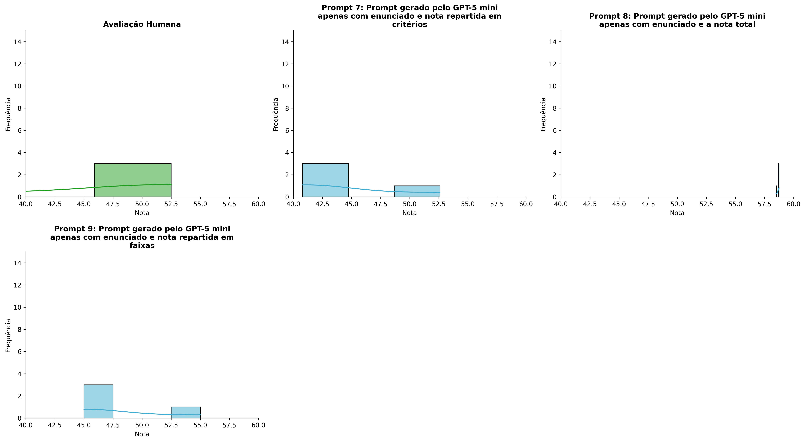
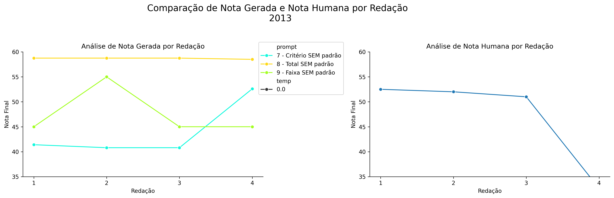
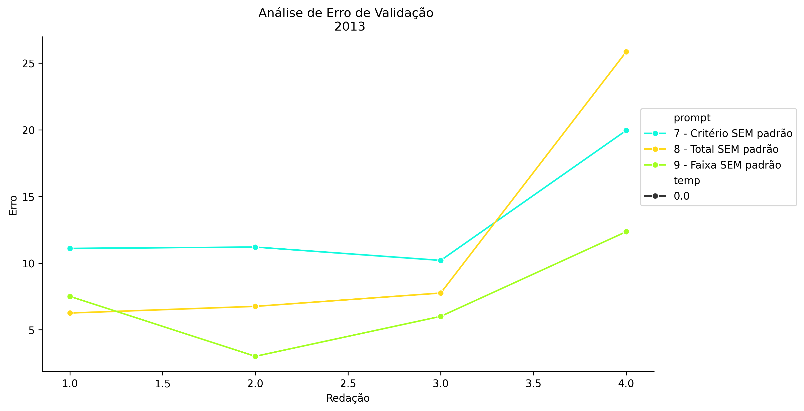
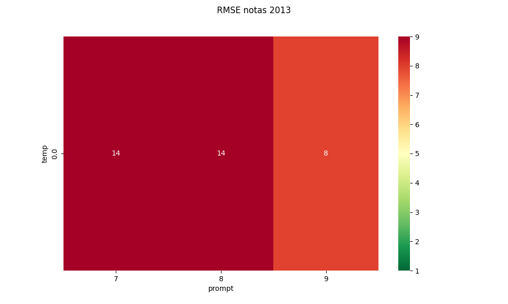
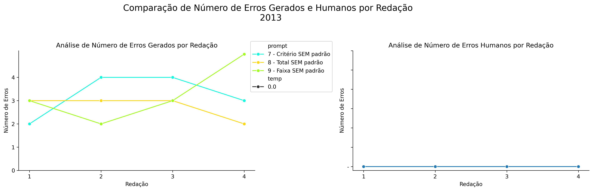
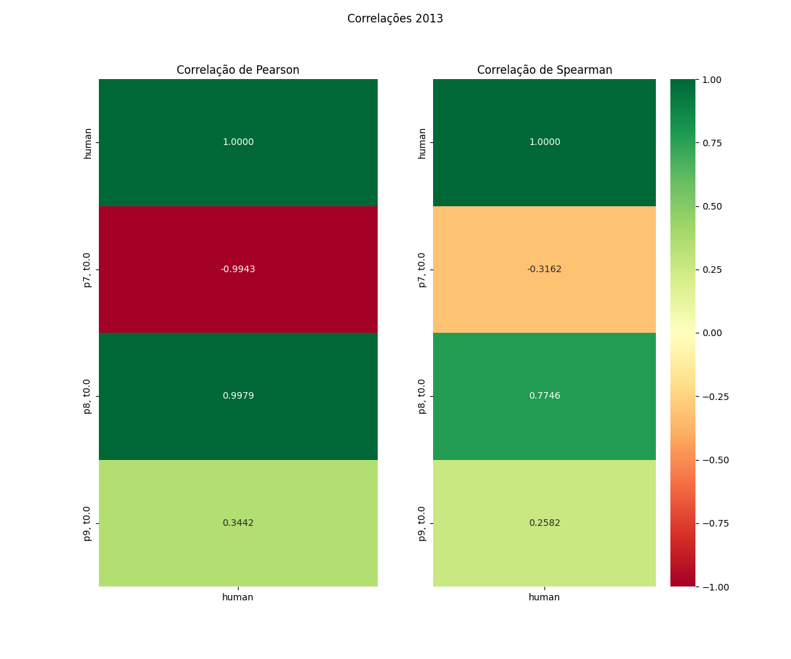

# Relatório de Avaliação: Qwen3.6-35B-A3B - 3 execuções
**Gerado em: 14/05/2026 18:25:04**

## 1. Distribuição de Notas
Nesta seção comparamos as notas atribuídas pelo modelo Qwen3.6-35B-A3B em diferentes prompts/temperaturas versus a correção humana.

## 2. Comparação de Notas Geradas e Humanas
Nesta seção, apresentamos a comparação entre as notas finais geradas pelo modelo e as notas dadas por avaliadores humanos.

## 3. Análise de Erro Absoluto de Validação

<table>
  <tr>
    <td>
      
    </td>
    <td>
      <table border="1" class="dataframe">
  <thead>
    <tr style="text-align: center;">
      <th>prompt</th>
      <th>temp</th>
      <th>area_sob_curva</th>
      <th>mae</th>
      <th>rmse</th>
    </tr>
  </thead>
  <tbody>
    <tr>
      <td>7</td>
      <td>0.0</td>
      <td>36.925</td>
      <td>13.1125</td>
      <td>13.6994</td>
    </tr>
    <tr>
      <td>8</td>
      <td>0.0</td>
      <td>30.550</td>
      <td>11.6500</td>
      <td>14.2558</td>
    </tr>
    <tr>
      <td>9</td>
      <td>0.0</td>
      <td>18.925</td>
      <td>7.2125</td>
      <td>7.9651</td>
    </tr>
  </tbody>
</table>
    </td>
  </tr>
</table>

## 4. Análise de RMSE por Prompt e Temperatura
Nesta seção, apresentamos o heatmap de RMSE calculado por combinação de prompt e temperatura.

## 5. Análise de Erros Gramaticais
Comparação da sensibilidade do modelo na detecção/geração de erros em relação ao padrão humano.

## 6. Correlações

## Estatísticas Descritivas
### Modelo Qwen3.6-35B-A3B
|       |    prompt |   temp |   redacao |   nota_final |   nota_final_std |   1A |    1B |    1C |     CGPL |   num_errors |
|:------|----------:|-------:|----------:|-------------:|-----------------:|-----:|------:|------:|---------:|-------------:|
| count | 12        |     12 |  12       |     12       |               12 |  4   | 4     |  4    |  4       |    12        |
| mean  |  8        |      0 |   2.5     |     50.0292  |                0 |  8.5 | 7.875 | 14.25 | 13.275   |     3.08333  |
| std   |  0.852803 |      0 |   1.16775 |      7.69845 |                0 |  0   | 0.75  |  2.5  |  2.56564 |     0.900337 |
| min   |  7        |      0 |   1       |     40.8     |                0 |  8.5 | 7.5   | 13    | 11.8     |     2        |
| 25%   |  7        |      0 |   1.75    |     44.1     |                0 |  8.5 | 7.5   | 13    | 11.8     |     2.75     |
| 50%   |  8        |      0 |   2.5     |     48.8     |                0 |  8.5 | 7.5   | 13    | 12.1     |     3        |
| 75%   |  9        |      0 |   3.25    |     58.5625  |                0 |  8.5 | 7.875 | 14.25 | 13.575   |     3.25     |
| max   |  9        |      0 |   4       |     58.75    |                0 |  8.5 | 9     | 18    | 17.1     |     5        |

### Humano
|       |   redacao |   nota_final |
|:------|----------:|-------------:|
| count |   4       |      4       |
| mean  |   2.5     |     47.0375  |
| std   |   1.29099 |      9.61192 |
| min   |   1       |     32.65    |
| 25%   |   1.75    |     46.4125  |
| 50%   |   2.5     |     51.5     |
| 75%   |   3.25    |     52.125   |
| max   |   4       |     52.5     |
