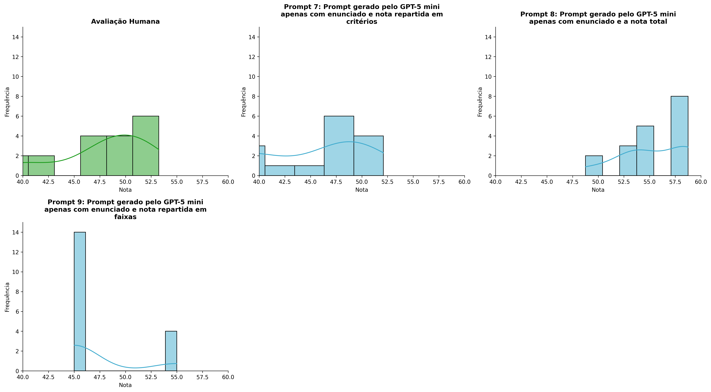
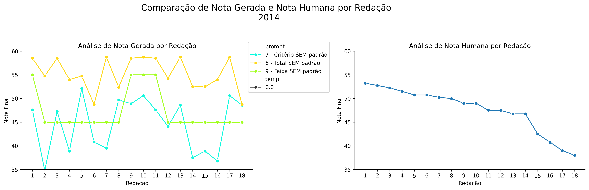
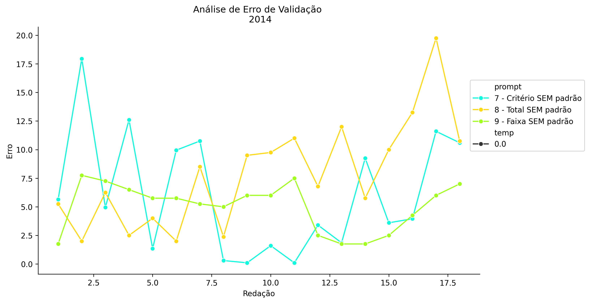
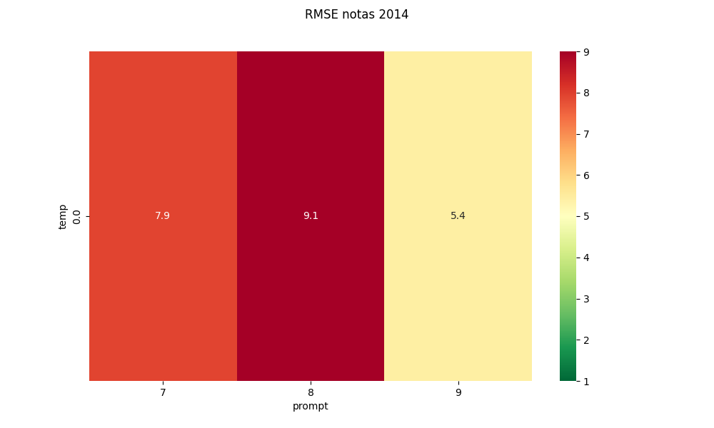
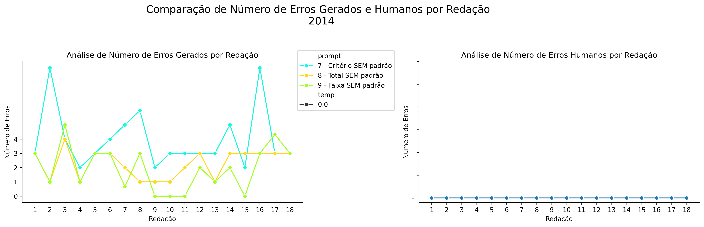
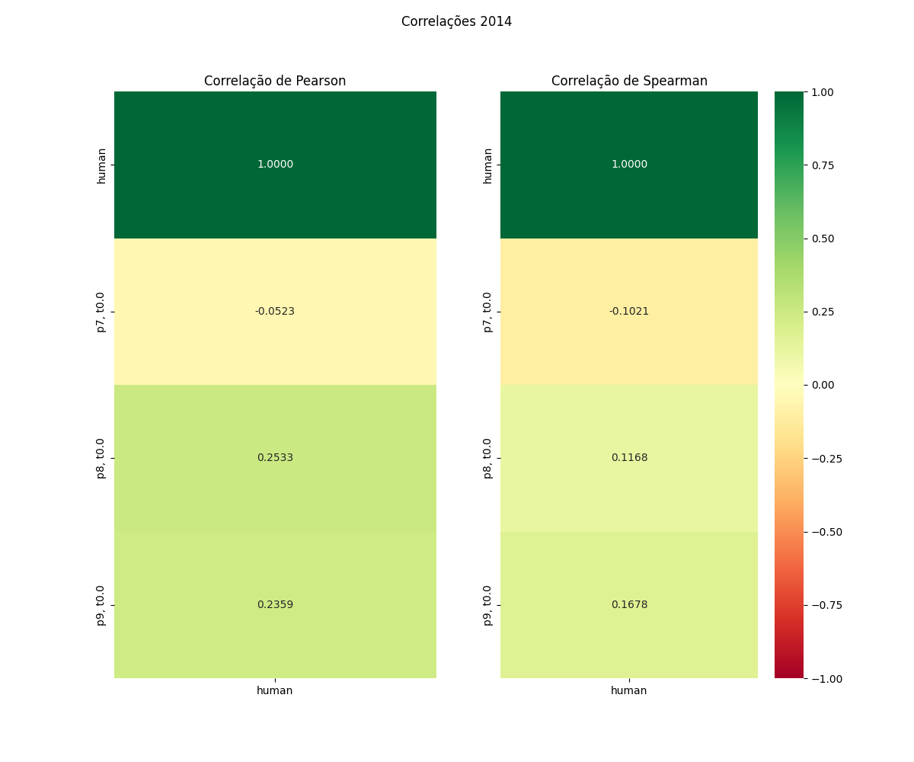

# Relatório de Avaliação: Qwen3.6-35B-A3B - 3 execuções
**Gerado em: 14/05/2026 12:28:39**

## 1. Distribuição de Notas
Nesta seção comparamos as notas atribuídas pelo modelo Qwen3.6-35B-A3B em diferentes prompts/temperaturas versus a correção humana.

## 2. Comparação de Notas Geradas e Humanas
Nesta seção, apresentamos a comparação entre as notas finais geradas pelo modelo e as notas dadas por avaliadores humanos.

## 3. Análise de Erro Absoluto de Validação

<table>
  <tr>
    <td>
      
    </td>
    <td>
      <table border="1" class="dataframe">
  <thead>
    <tr style="text-align: center;">
      <th>prompt</th>
      <th>temp</th>
      <th>area_sob_curva</th>
      <th>mae</th>
      <th>rmse</th>
    </tr>
  </thead>
  <tbody>
    <tr>
      <td>7</td>
      <td>0.0</td>
      <td>101.425</td>
      <td>6.0861</td>
      <td>7.9319</td>
    </tr>
    <tr>
      <td>8</td>
      <td>0.0</td>
      <td>133.410</td>
      <td>7.8561</td>
      <td>9.0839</td>
    </tr>
    <tr>
      <td>9</td>
      <td>0.0</td>
      <td>85.875</td>
      <td>5.0139</td>
      <td>5.4086</td>
    </tr>
  </tbody>
</table>
    </td>
  </tr>
</table>

## 4. Análise de RMSE por Prompt e Temperatura
Nesta seção, apresentamos o heatmap de RMSE calculado por combinação de prompt e temperatura.

## 5. Análise de Erros Gramaticais
Comparação da sensibilidade do modelo na detecção/geração de erros em relação ao padrão humano.

## 6. Correlações

## Estatísticas Descritivas
### Modelo Qwen3.6-35B-A3B
|       |    prompt |   temp |   redacao |   nota_final |   nota_final_std |        1A |       1B |       1C |     CGPL |   num_errors |
|:------|----------:|-------:|----------:|-------------:|-----------------:|----------:|---------:|---------:|---------:|-------------:|
| count | 54        |     54 |  54       |     54       |        54        | 18        | 18       | 18       | 18       |     54       |
| mean  |  8        |      0 |   9.5     |     49.0474  |         0.016037 |  8.18518  |  7.69444 | 14.963   | 13.763   |      2.74074 |
| std   |  0.824163 |      0 |   5.23684 |      6.41312 |         0.117848 |  0.577032 |  1.27347 |  1.82176 |  2.18093 |      1.83567 |
| min   |  7        |      0 |   1       |     34.8     |         0        |  7        |  6       | 12       |  9.3     |      0       |
| 25%   |  7        |      0 |   5       |     45       |         0        |  7.625    |  6.25    | 13       | 11.95    |      1.25    |
| 50%   |  8        |      0 |   9.5     |     48.675   |         0        |  8.5      |  8       | 16       | 14.95    |      3       |
| 75%   |  9        |      0 |  14       |     54.6325  |         0        |  8.5      |  9       | 16       | 15.175   |      3       |
| max   |  9        |      0 |  18       |     58.75    |         0.866    |  9.3333   |  9       | 17.3333  | 16.4333  |      9       |

### Humano
|       |   redacao |   nota_final |
|:------|----------:|-------------:|
| count |  18       |     18       |
| mean  |   9.5     |     47.6806  |
| std   |   5.33854 |      4.67928 |
| min   |   1       |     38       |
| 25%   |   5.25    |     46.75    |
| 50%   |   9.5     |     49       |
| 75%   |  13.75    |     50.75    |
| max   |  18       |     53.25    |
