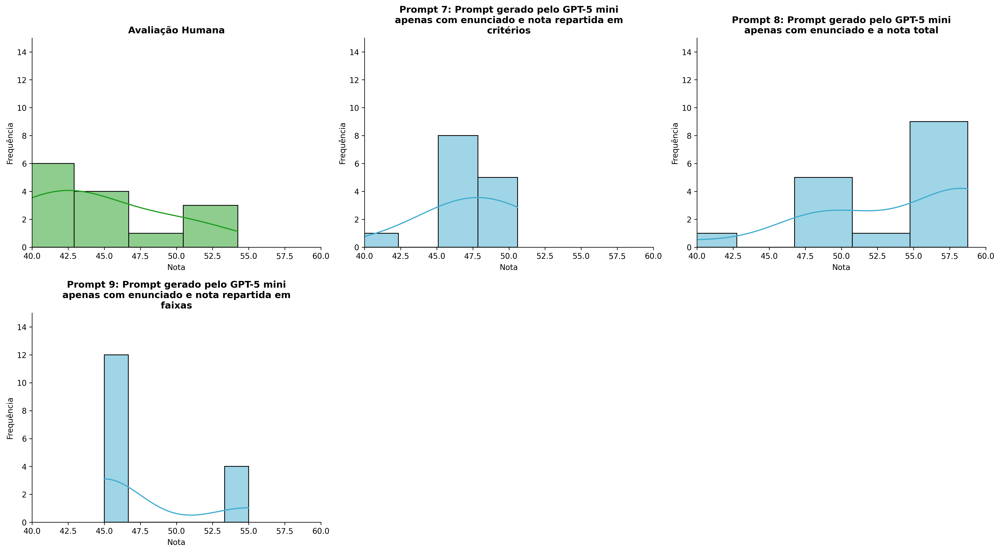
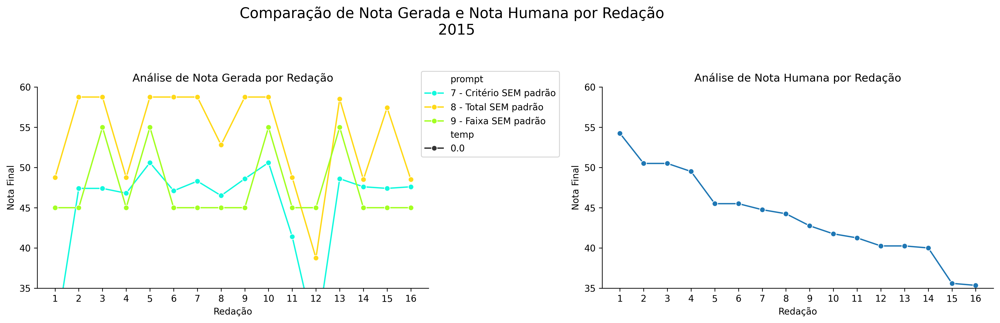
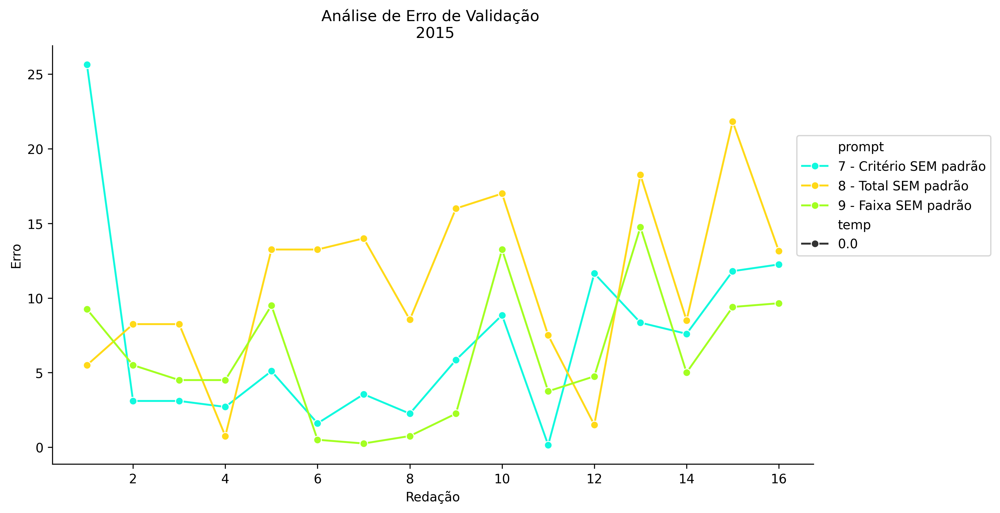
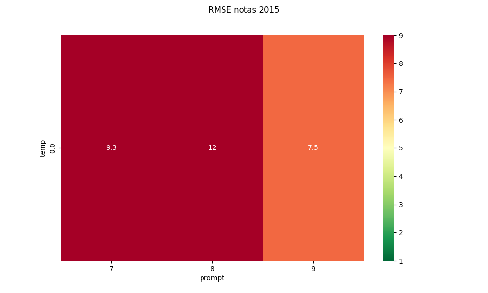
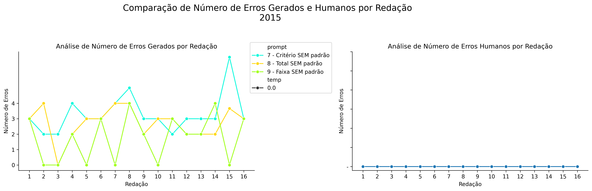
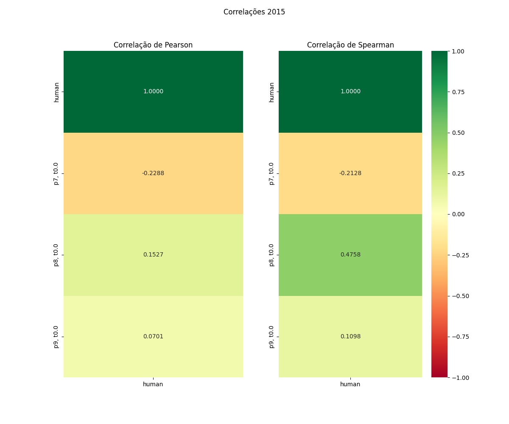

# Relatório de Avaliação: Qwen3.6-35B-A3B - 3 execuções
**Gerado em: 14/05/2026 12:28:43**

## 1. Distribuição de Notas
Nesta seção comparamos as notas atribuídas pelo modelo Qwen3.6-35B-A3B em diferentes prompts/temperaturas versus a correção humana.

## 2. Comparação de Notas Geradas e Humanas
Nesta seção, apresentamos a comparação entre as notas finais geradas pelo modelo e as notas dadas por avaliadores humanos.

## 3. Análise de Erro Absoluto de Validação

<table>
  <tr>
    <td>
      
    </td>
    <td>
      <table border="1" class="dataframe">
  <thead>
    <tr style="text-align: center;">
      <th>prompt</th>
      <th>temp</th>
      <th>area_sob_curva</th>
      <th>mae</th>
      <th>rmse</th>
    </tr>
  </thead>
  <tbody>
    <tr>
      <td>7</td>
      <td>0.0</td>
      <td>94.6000</td>
      <td>7.0969</td>
      <td>9.3399</td>
    </tr>
    <tr>
      <td>8</td>
      <td>0.0</td>
      <td>166.2017</td>
      <td>10.9704</td>
      <td>12.3625</td>
    </tr>
    <tr>
      <td>9</td>
      <td>0.0</td>
      <td>88.1000</td>
      <td>6.0969</td>
      <td>7.4529</td>
    </tr>
  </tbody>
</table>
    </td>
  </tr>
</table>

## 4. Análise de RMSE por Prompt e Temperatura
Nesta seção, apresentamos o heatmap de RMSE calculado por combinação de prompt e temperatura.

## 5. Análise de Erros Gramaticais
Comparação da sensibilidade do modelo na detecção/geração de erros em relação ao padrão humano.

## 6. Correlações

## Estatísticas Descritivas
### Modelo Qwen3.6-35B-A3B
|       |    prompt |   temp |   redacao |   nota_final |   nota_final_std |        1A |       1B |       1C |     CGPL |   num_errors |
|:------|----------:|-------:|----------:|-------------:|-----------------:|----------:|---------:|---------:|---------:|-------------:|
| count | 48        |     48 |  48       |      48      |       48         | 16        | 16       | 16       | 16       |     48       |
| mean  |  8        |      0 |   8.5     |      48.8558 |        0.0477521 |  8.375    |  7.9375  | 14.9375  | 13.9438  |      2.59722 |
| std   |  0.825137 |      0 |   4.65855 |       6.8482 |        0.330836  |  0.341565 |  1.01448 |  2.83945 |  2.80546 |      1.41915 |
| min   |  7        |      0 |   1       |      28.6    |        0         |  7.5      |  6       |  8       |  7.1     |      0       |
| 25%   |  7        |      0 |   4.75    |      45      |        0         |  8.5      |  7.5     | 16       | 14.35    |      2       |
| 50%   |  8        |      0 |   8.5     |      47.95   |        0         |  8.5      |  7.75    | 16       | 15.1     |      3       |
| 75%   |  9        |      0 |  12.25    |      55      |        0         |  8.5      |  9       | 16       | 15.175   |      3       |
| max   |  9        |      0 |  16       |      58.75   |        2.2921    |  8.5      |  9       | 17       | 16.1     |      7       |

### Humano
|       |   redacao |   nota_final |
|:------|----------:|-------------:|
| count |  16       |     16       |
| mean  |   8.5     |     43.8719  |
| std   |   4.76095 |      5.34397 |
| min   |   1       |     35.35    |
| 25%   |   4.75    |     40.25    |
| 50%   |   8.5     |     43.5     |
| 75%   |  12.25    |     46.5     |
| max   |  16       |     54.25    |
