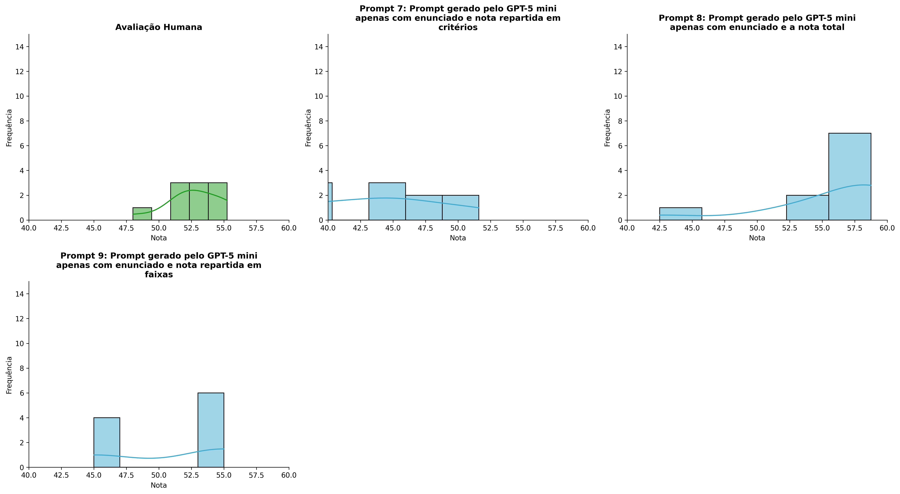
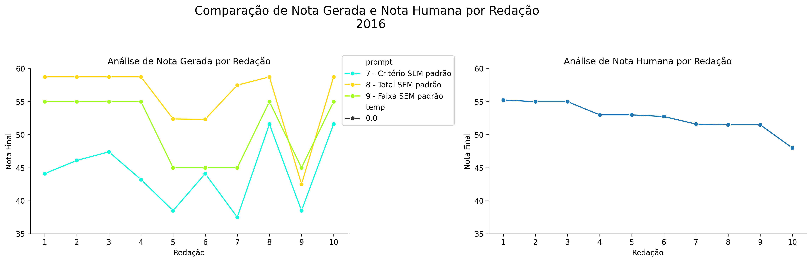
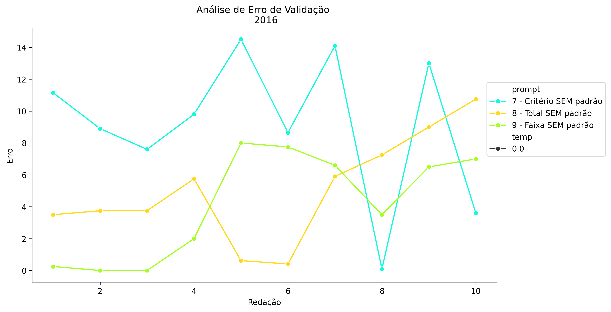
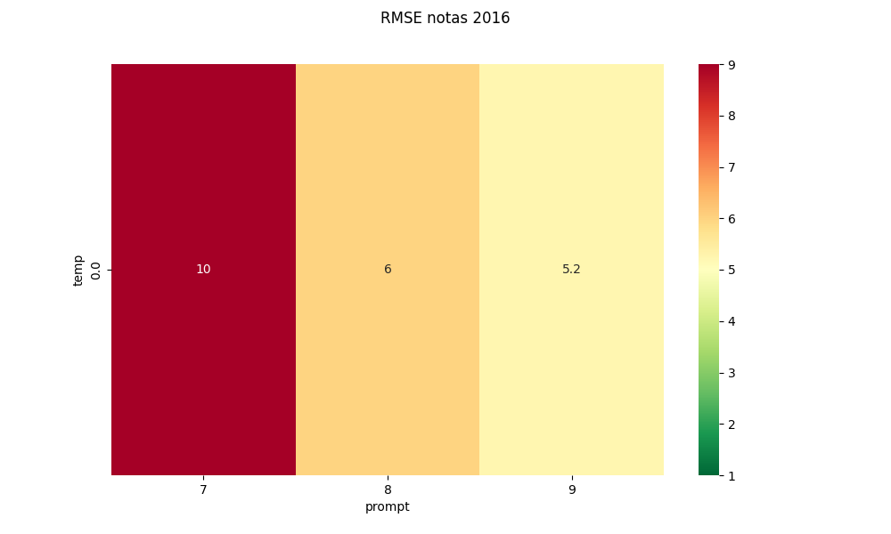
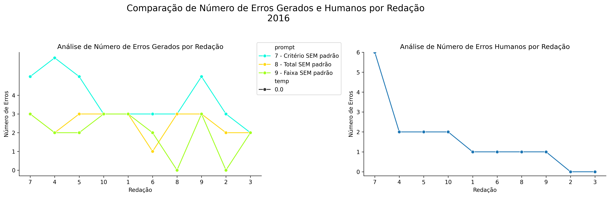
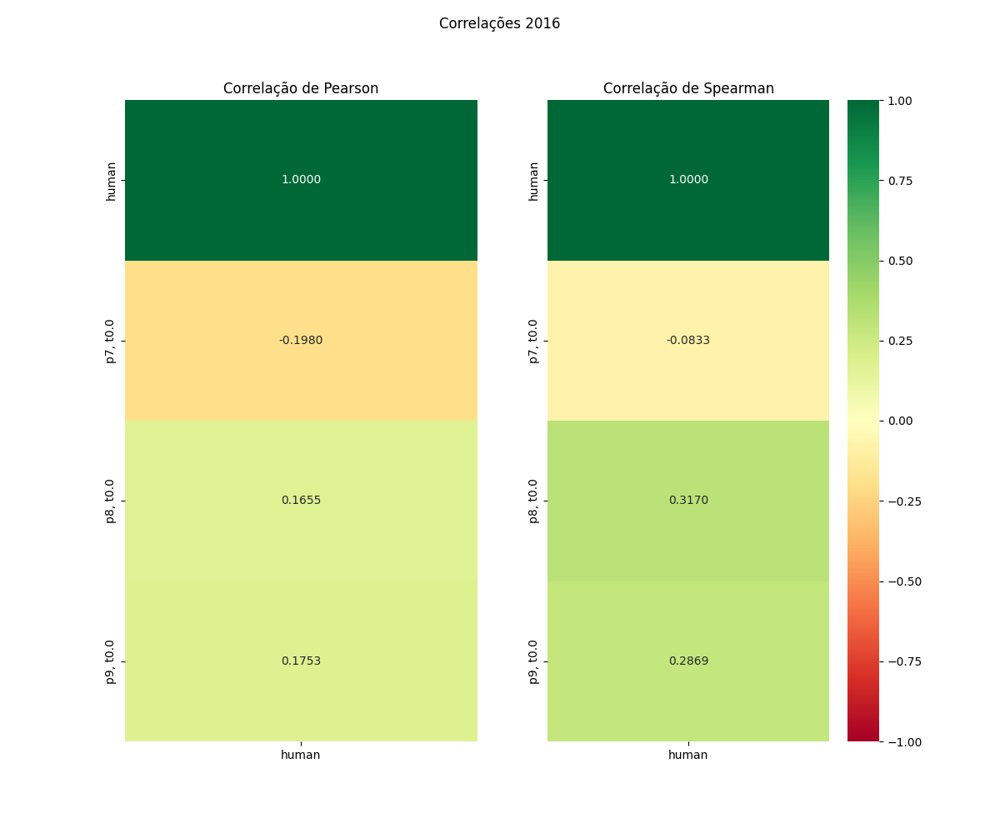

# Relatório de Avaliação: Qwen3.6-35B-A3B - 3 execuções
**Gerado em: 14/05/2026 18:25:34**

## 1. Distribuição de Notas
Nesta seção comparamos as notas atribuídas pelo modelo Qwen3.6-35B-A3B em diferentes prompts/temperaturas versus a correção humana.

## 2. Comparação de Notas Geradas e Humanas
Nesta seção, apresentamos a comparação entre as notas finais geradas pelo modelo e as notas dadas por avaliadores humanos.

## 3. Análise de Erro Absoluto de Validação

<table>
  <tr>
    <td>
      
    </td>
    <td>
      <table border="1" class="dataframe">
  <thead>
    <tr style="text-align: center;">
      <th>prompt</th>
      <th>temp</th>
      <th>area_sob_curva</th>
      <th>mae</th>
      <th>rmse</th>
    </tr>
  </thead>
  <tbody>
    <tr>
      <td>7</td>
      <td>0.0</td>
      <td>84.025</td>
      <td>9.140</td>
      <td>10.1153</td>
    </tr>
    <tr>
      <td>8</td>
      <td>0.0</td>
      <td>43.555</td>
      <td>5.068</td>
      <td>5.9827</td>
    </tr>
    <tr>
      <td>9</td>
      <td>0.0</td>
      <td>37.975</td>
      <td>4.160</td>
      <td>5.2458</td>
    </tr>
  </tbody>
</table>
    </td>
  </tr>
</table>

## 4. Análise de RMSE por Prompt e Temperatura
Nesta seção, apresentamos o heatmap de RMSE calculado por combinação de prompt e temperatura.

## 5. Análise de Erros Gramaticais
Comparação da sensibilidade do modelo na detecção/geração de erros em relação ao padrão humano.

## 6. Correlações

## Estatísticas Descritivas
### Modelo Qwen3.6-35B-A3B
|       |    prompt |   temp |   redacao |   nota_final |   nota_final_std |        1A |       1B |      1C |     CGPL |   num_errors |
|:------|----------:|-------:|----------:|-------------:|-----------------:|----------:|---------:|--------:|---------:|-------------:|
| count | 30        |     30 |  30       |     30       |               30 | 10        | 10       | 10      | 10       |     30       |
| mean  |  8        |      0 |   5.5     |     50.3273  |                0 |  7.95     |  7.25    | 15.1    | 13.96    |      2.76667 |
| std   |  0.830455 |      0 |   2.92138 |      6.93194 |                0 |  0.550252 |  1.03414 |  1.7127 |  2.00233 |      1.30472 |
| min   |  7        |      0 |   1       |     37.5     |                0 |  7        |  6       | 13      | 11.5     |      0       |
| 25%   |  7        |      0 |   3       |     45       |                0 |  8        |  7       | 13.5    | 11.925   |      2       |
| 50%   |  8        |      0 |   5.5     |     51.97    |                0 |  8        |  7       | 15      | 14.1     |      3       |
| 75%   |  9        |      0 |   8       |     55       |                0 |  8.375    |  7.375   | 16      | 15.325   |      3       |
| max   |  9        |      0 |  10       |     58.75    |                0 |  8.5      |  9       | 17.5    | 16.6     |      6       |

### Humano
|       |   redacao |   nota_final |   num_errors |
|:------|----------:|-------------:|-------------:|
| count |  10       |     10       |      10      |
| mean  |   5.5     |     52.66    |       1.6    |
| std   |   3.02765 |      2.19669 |       1.7127 |
| min   |   1       |     48       |       0      |
| 25%   |   3.25    |     51.525   |       1      |
| 50%   |   5.5     |     52.875   |       1      |
| 75%   |   7.75    |     54.5     |       2      |
| max   |  10       |     55.25    |       6      |
