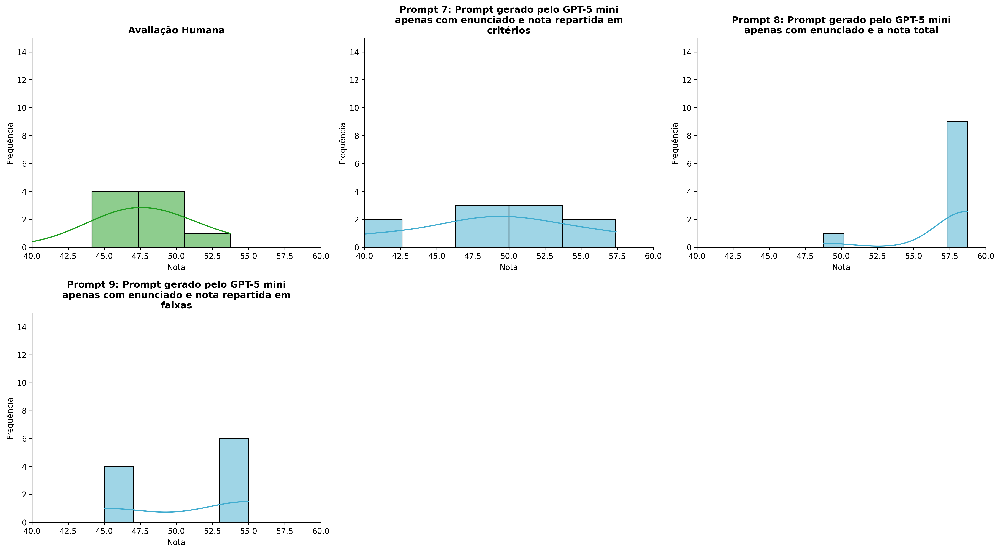
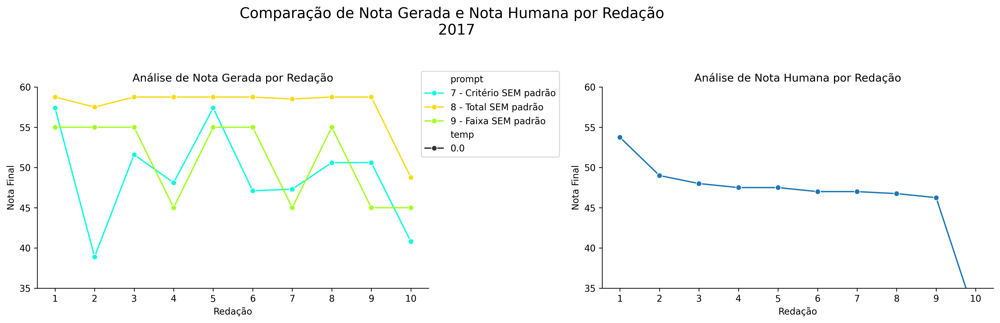
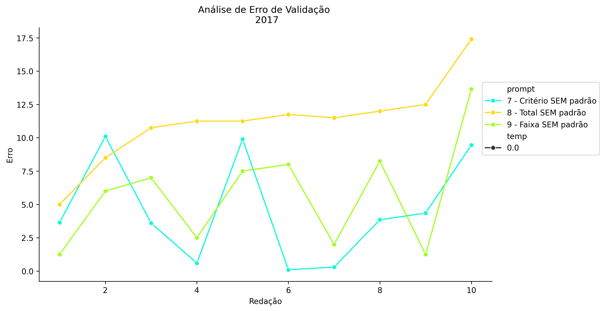
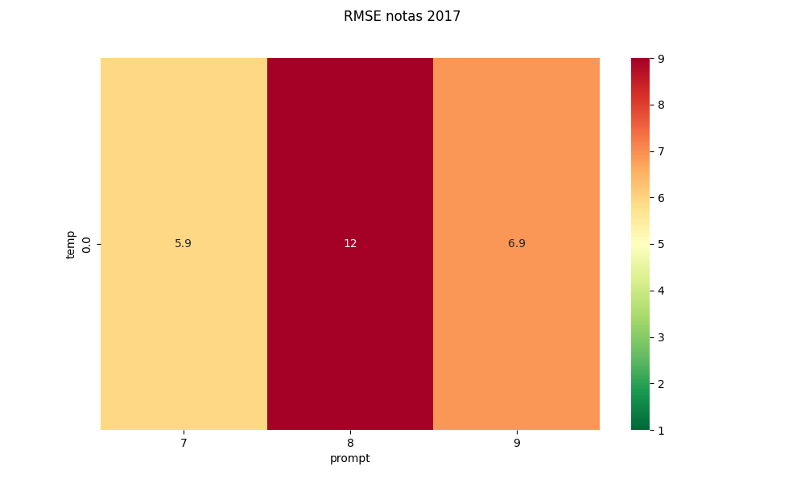
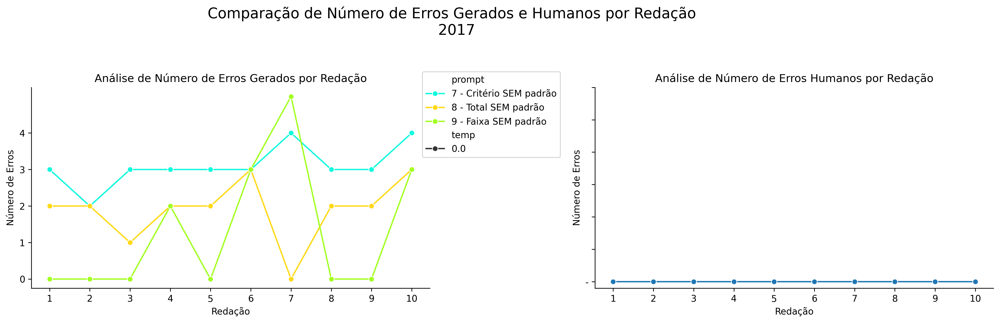
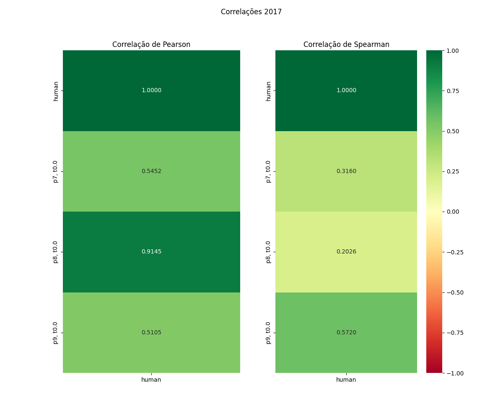

# Relatório de Avaliação: Qwen3.6-35B-A3B - 3 execuções
**Gerado em: 14/05/2026 12:28:50**

## 1. Distribuição de Notas
Nesta seção comparamos as notas atribuídas pelo modelo Qwen3.6-35B-A3B em diferentes prompts/temperaturas versus a correção humana.

## 2. Comparação de Notas Geradas e Humanas
Nesta seção, apresentamos a comparação entre as notas finais geradas pelo modelo e as notas dadas por avaliadores humanos.

## 3. Análise de Erro Absoluto de Validação

<table>
  <tr>
    <td>
      
    </td>
    <td>
      <table border="1" class="dataframe">
  <thead>
    <tr style="text-align: center;">
      <th>prompt</th>
      <th>temp</th>
      <th>area_sob_curva</th>
      <th>mae</th>
      <th>rmse</th>
    </tr>
  </thead>
  <tbody>
    <tr>
      <td>7</td>
      <td>0.0</td>
      <td>39.35</td>
      <td>4.59</td>
      <td>5.9145</td>
    </tr>
    <tr>
      <td>8</td>
      <td>0.0</td>
      <td>100.70</td>
      <td>11.19</td>
      <td>11.5726</td>
    </tr>
    <tr>
      <td>9</td>
      <td>0.0</td>
      <td>49.95</td>
      <td>5.74</td>
      <td>6.8776</td>
    </tr>
  </tbody>
</table>
    </td>
  </tr>
</table>

## 4. Análise de RMSE por Prompt e Temperatura
Nesta seção, apresentamos o heatmap de RMSE calculado por combinação de prompt e temperatura.

## 5. Análise de Erros Gramaticais
Comparação da sensibilidade do modelo na detecção/geração de erros em relação ao padrão humano.

## 6. Correlações

## Estatísticas Descritivas
### Modelo Qwen3.6-35B-A3B
|       |    prompt |   temp |   redacao |   nota_final |   nota_final_std |        1A |       1B |       1C |     CGPL |   num_errors |
|:------|----------:|-------:|----------:|-------------:|-----------------:|----------:|---------:|---------:|---------:|-------------:|
| count | 30        |     30 |  30       |     30       |               30 | 10        | 10       | 10       | 10       |     30       |
| mean  |  8        |      0 |   5.5     |     52.5267  |                0 |  8.55     |  8.46    | 16.45    | 15.52    |      2.1     |
| std   |  0.830455 |      0 |   2.92138 |      6.05845 |                0 |  0.598609 |  1.19555 |  2.22923 |  2.24242 |      1.39827 |
| min   |  7        |      0 |   1       |     38.9     |                0 |  7.5      |  6       | 13       | 11.8     |      0       |
| 25%   |  7        |      0 |   3       |     47.5     |                0 |  8.5      |  7.625   | 16       | 14.875   |      1.25    |
| 50%   |  8        |      0 |   5.5     |     55       |                0 |  8.5      |  9       | 16.5     | 15.6     |      2       |
| 75%   |  9        |      0 |   8       |     58.25    |                0 |  8.5      |  9       | 17.375   | 16.475   |      3       |
| max   |  9        |      0 |  10       |     58.75    |                0 |  9.5      |  9.8     | 19.5     | 18.6     |      5       |

### Humano
|       |   redacao |   nota_final |
|:------|----------:|-------------:|
| count |  10       |      10      |
| mean  |   5.5     |      46.41   |
| std   |   3.02765 |       5.707  |
| min   |   1       |      31.35   |
| 25%   |   3.25    |      46.8125 |
| 50%   |   5.5     |      47.25   |
| 75%   |   7.75    |      47.875  |
| max   |  10       |      53.75   |
