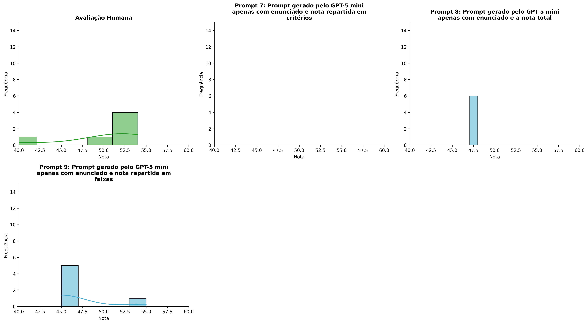
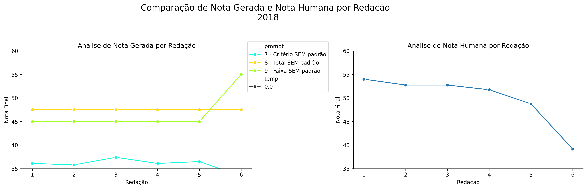
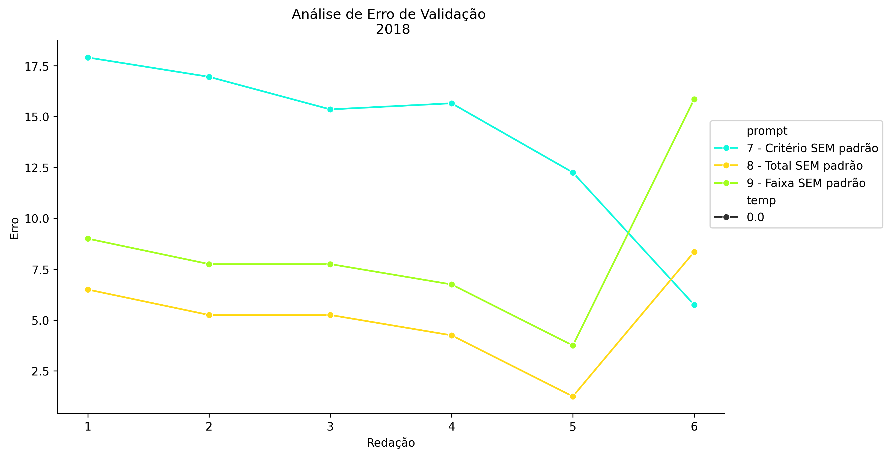
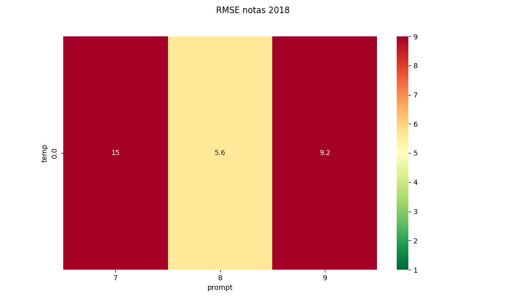
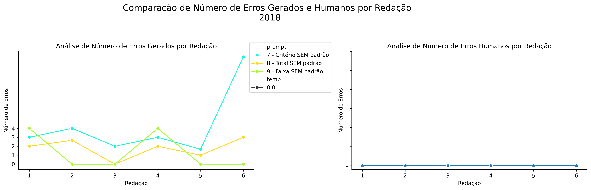
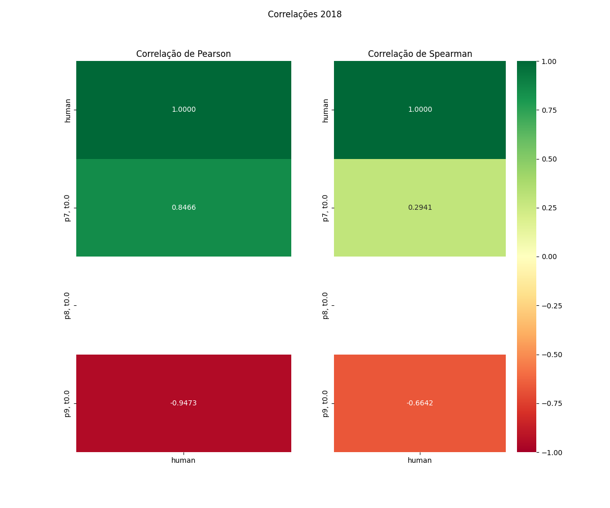

# Relatório de Avaliação: Qwen3.6-35B-A3B - 3 execuções
**Gerado em: 14/05/2026 09:34:43**

## 1. Distribuição de Notas
Nesta seção comparamos as notas atribuídas pelo modelo Qwen3.6-35B-A3B em diferentes prompts/temperaturas versus a correção humana.

## 2. Comparação de Notas Geradas e Humanas
Nesta seção, apresentamos a comparação entre as notas finais geradas pelo modelo e as notas dadas por avaliadores humanos.

## 3. Análise de Erro Absoluto de Validação

<table>
  <tr>
    <td>
      
    </td>
    <td>
      <table border="1" class="dataframe">
  <thead>
    <tr style="text-align: center;">
      <th>prompt</th>
      <th>temp</th>
      <th>area_sob_curva</th>
      <th>mae</th>
      <th>rmse</th>
    </tr>
  </thead>
  <tbody>
    <tr>
      <td>7</td>
      <td>0.0</td>
      <td>72.025</td>
      <td>13.9750</td>
      <td>14.5567</td>
    </tr>
    <tr>
      <td>8</td>
      <td>0.0</td>
      <td>23.425</td>
      <td>5.1417</td>
      <td>5.5786</td>
    </tr>
    <tr>
      <td>9</td>
      <td>0.0</td>
      <td>38.425</td>
      <td>8.4750</td>
      <td>9.2374</td>
    </tr>
  </tbody>
</table>
    </td>
  </tr>
</table>

## 4. Análise de RMSE por Prompt e Temperatura
Nesta seção, apresentamos o heatmap de RMSE calculado por combinação de prompt e temperatura.

## 5. Análise de Erros Gramaticais
Comparação da sensibilidade do modelo na detecção/geração de erros em relação ao padrão humano.

## 6. Correlações

## Estatísticas Descritivas
### Modelo Qwen3.6-35B-A3B
|       |    prompt |   temp |   redacao |   nota_final |   nota_final_std |       1A |       1B |   1C |     CGPL |   num_errors |
|:------|----------:|-------:|----------:|-------------:|-----------------:|---------:|---------:|-----:|---------:|-------------:|
| count | 18        |     18 |  18       |     18       |      18          | 6        | 6        |    6 |  6       |     18       |
| mean  |  8        |      0 |   3.5     |     43.35    |       0.00962222 | 7.08333  | 6.08333  |   12 | 10.7167  |      2.46297 |
| std   |  0.840168 |      0 |   1.75734 |      5.92167 |       0.0408236  | 0.204124 | 0.204124 |    0 |  1.16175 |      2.79387 |
| min   |  7        |      0 |   1       |     33.4     |       0          | 7        | 6        |   12 |  8.4     |      0       |
| 25%   |  7        |      0 |   2       |     36.725   |       0          | 7        | 6        |   12 | 10.875   |      0.25    |
| 50%   |  8        |      0 |   3.5     |     45       |       0          | 7        | 6        |   12 | 11.1     |      2       |
| 75%   |  9        |      0 |   5       |     47.5     |       0          | 7        | 6        |   12 | 11.325   |      3       |
| max   |  9        |      0 |   6       |     55       |       0.1732     | 7.5      | 6.5      |   12 | 11.5     |     12       |

### Humano
|       |   redacao |   nota_final |
|:------|----------:|-------------:|
| count |   6       |      6       |
| mean  |   3.5     |     49.8583  |
| std   |   1.87083 |      5.53809 |
| min   |   1       |     39.15    |
| 25%   |   2.25    |     49.5     |
| 50%   |   3.5     |     52.25    |
| 75%   |   4.75    |     52.75    |
| max   |   6       |     54       |
