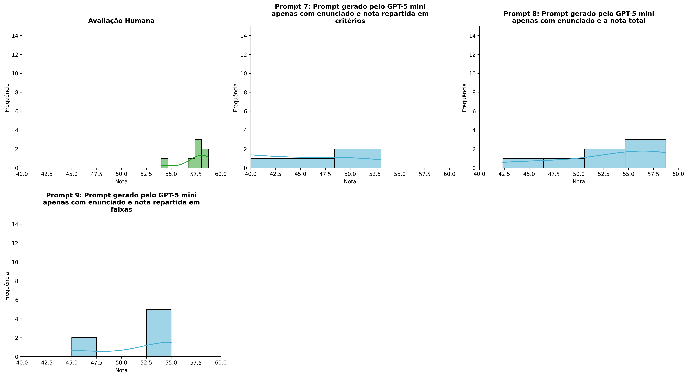
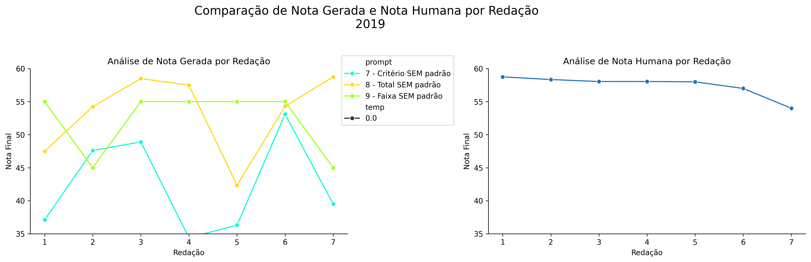
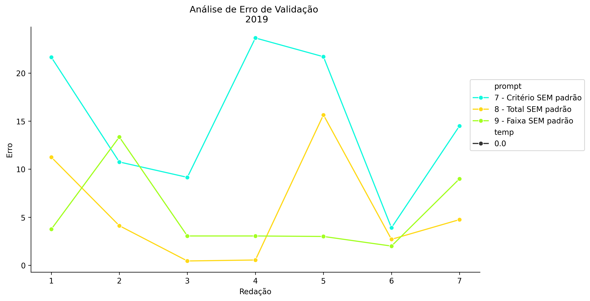
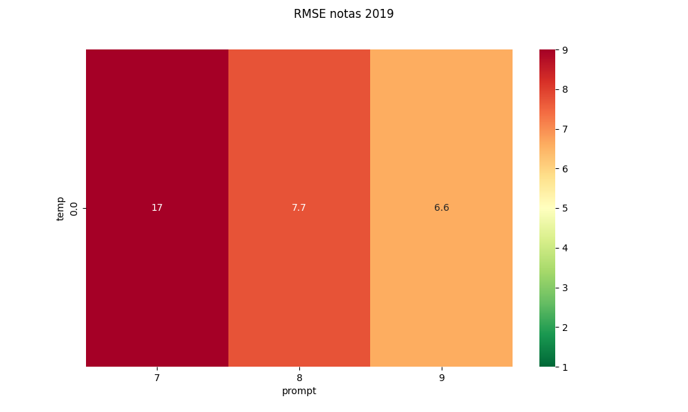
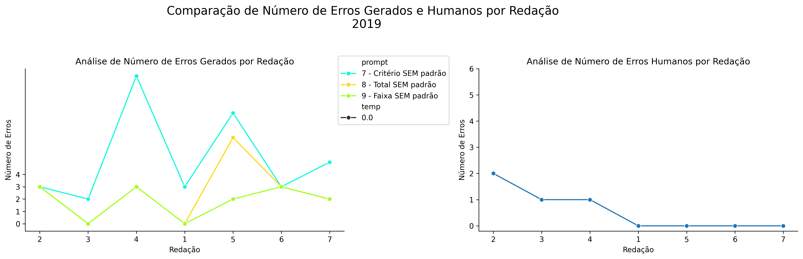
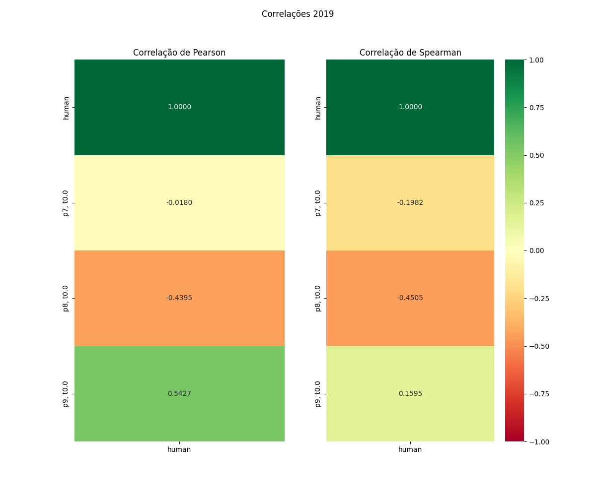

# Relatório de Avaliação: Qwen3.6-35B-A3B - 3 execuções
**Gerado em: 14/05/2026 18:26:02**

## 1. Distribuição de Notas
Nesta seção comparamos as notas atribuídas pelo modelo Qwen3.6-35B-A3B em diferentes prompts/temperaturas versus a correção humana.

## 2. Comparação de Notas Geradas e Humanas
Nesta seção, apresentamos a comparação entre as notas finais geradas pelo modelo e as notas dadas por avaliadores humanos.

## 3. Análise de Erro Absoluto de Validação

<table>
  <tr>
    <td>
      
    </td>
    <td>
      <table border="1" class="dataframe">
  <thead>
    <tr style="text-align: center;">
      <th>prompt</th>
      <th>temp</th>
      <th>area_sob_curva</th>
      <th>mae</th>
      <th>rmse</th>
    </tr>
  </thead>
  <tbody>
    <tr>
      <td>7</td>
      <td>0.0</td>
      <td>87.225</td>
      <td>15.0429</td>
      <td>16.5774</td>
    </tr>
    <tr>
      <td>8</td>
      <td>0.0</td>
      <td>31.470</td>
      <td>5.6386</td>
      <td>7.7350</td>
    </tr>
    <tr>
      <td>9</td>
      <td>0.0</td>
      <td>30.825</td>
      <td>5.3143</td>
      <td>6.5997</td>
    </tr>
  </tbody>
</table>
    </td>
  </tr>
</table>

## 4. Análise de RMSE por Prompt e Temperatura
Nesta seção, apresentamos o heatmap de RMSE calculado por combinação de prompt e temperatura.

## 5. Análise de Erros Gramaticais
Comparação da sensibilidade do modelo na detecção/geração de erros em relação ao padrão humano.

## 6. Correlações

## Estatísticas Descritivas
### Modelo Qwen3.6-35B-A3B
|       |   prompt |   temp |   redacao |   nota_final |   nota_final_std |       1A |      1B |       1C |     CGPL |   num_errors |
|:------|---------:|-------:|----------:|-------------:|-----------------:|---------:|--------:|---------:|---------:|-------------:|
| count | 21       |     21 |  21       |     21       |               21 | 7        | 7       |  7       |  7       |     21       |
| mean  |  8       |      0 |   4       |     49.2871  |                0 | 7.85714  | 7.28571 | 14.4286  | 12.8429  |      3.2381  |
| std   |  0.83666 |      0 |   2.04939 |      7.72928 |                0 | 0.852168 | 1.49603 |  2.22539 |  2.96977 |      2.96487 |
| min   |  7       |      0 |   1       |     34.4     |                0 | 7        | 5       | 12       |  9.4     |      0       |
| 25%   |  7       |      0 |   2       |     45       |                0 | 7        | 6.5     | 13       | 10.7     |      2       |
| 50%   |  8       |      0 |   4       |     53.1     |                0 | 8        | 7       | 13       | 11.5     |      3       |
| 75%   |  9       |      0 |   6       |     55       |                0 | 8.5      | 8.5     | 16       | 15.25    |      3       |
| max   |  9       |      0 |   7       |     58.75    |                0 | 9        | 9       | 18       | 17.1     |     12       |

### Humano
|       |   redacao |   nota_final |   num_errors |
|:------|----------:|-------------:|-------------:|
| count |   7       |      7       |     7        |
| mean  |   4       |     57.4571  |     0.571429 |
| std   |   2.16025 |      1.61385 |     0.786796 |
| min   |   1       |     54       |     0        |
| 25%   |   2.5     |     57.5     |     0        |
| 50%   |   4       |     58.05    |     0        |
| 75%   |   5.5     |     58.2     |     1        |
| max   |   7       |     58.75    |     2        |
