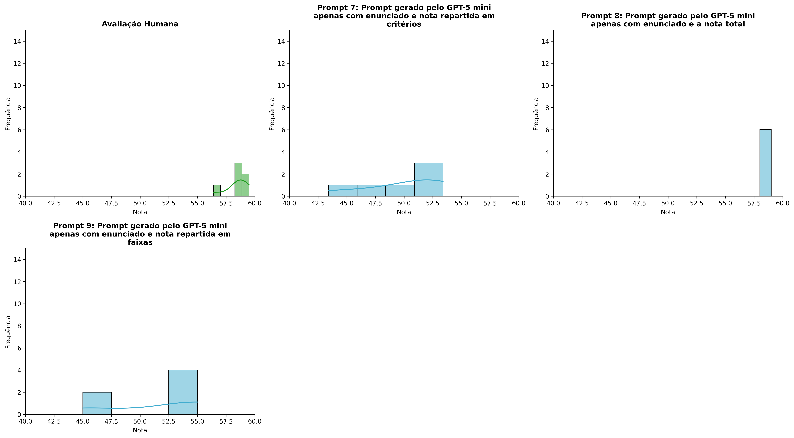
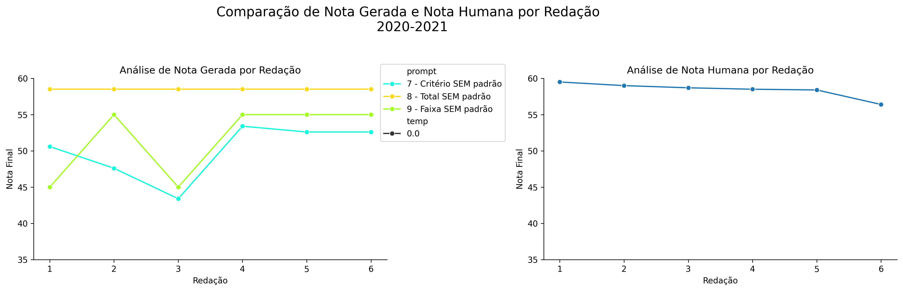
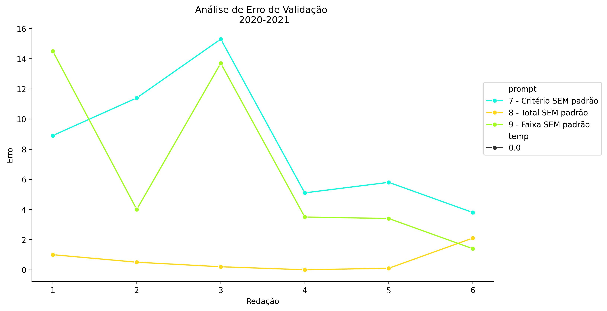
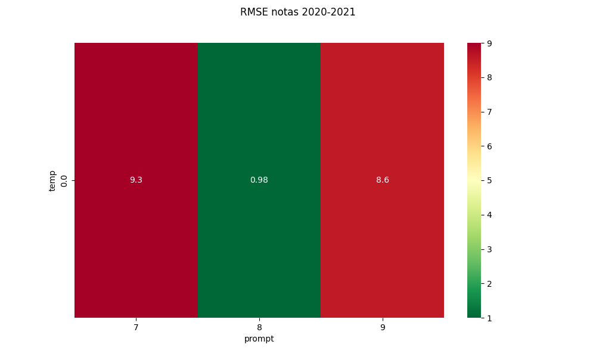
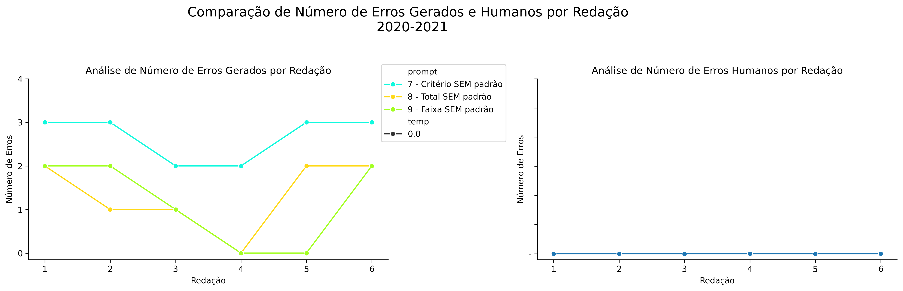
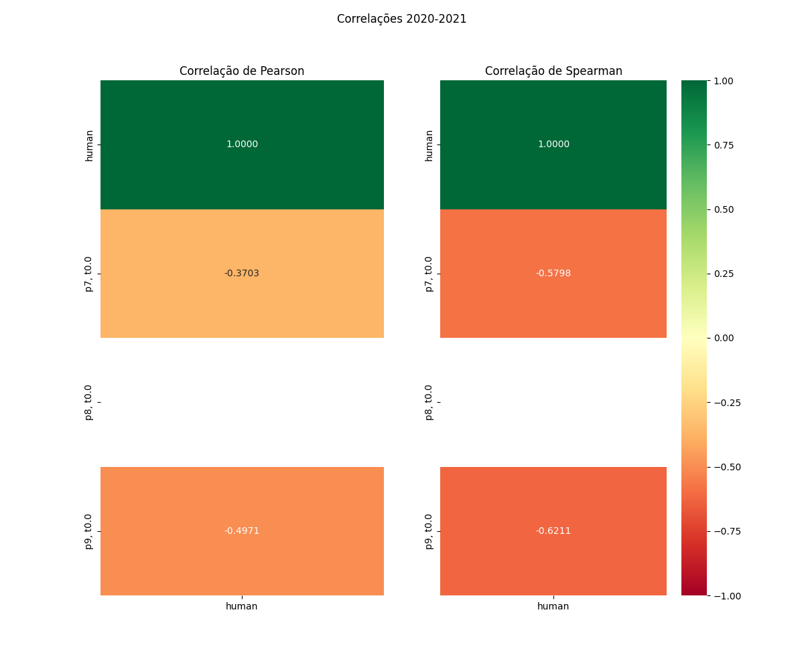

# Relatório de Avaliação: Qwen3.6-35B-A3B - 3 execuções
**Gerado em: 14/05/2026 12:28:57**

## 1. Distribuição de Notas
Nesta seção comparamos as notas atribuídas pelo modelo Qwen3.6-35B-A3B em diferentes prompts/temperaturas versus a correção humana.

## 2. Comparação de Notas Geradas e Humanas
Nesta seção, apresentamos a comparação entre as notas finais geradas pelo modelo e as notas dadas por avaliadores humanos.

## 3. Análise de Erro Absoluto de Validação

<table>
  <tr>
    <td>
      
    </td>
    <td>
      <table border="1" class="dataframe">
  <thead>
    <tr style="text-align: center;">
      <th>prompt</th>
      <th>temp</th>
      <th>area_sob_curva</th>
      <th>mae</th>
      <th>rmse</th>
    </tr>
  </thead>
  <tbody>
    <tr>
      <td>7</td>
      <td>0.0</td>
      <td>43.95</td>
      <td>8.3833</td>
      <td>9.2857</td>
    </tr>
    <tr>
      <td>8</td>
      <td>0.0</td>
      <td>2.35</td>
      <td>0.6500</td>
      <td>0.9755</td>
    </tr>
    <tr>
      <td>9</td>
      <td>0.0</td>
      <td>32.55</td>
      <td>6.7500</td>
      <td>8.5607</td>
    </tr>
  </tbody>
</table>
    </td>
  </tr>
</table>

## 4. Análise de RMSE por Prompt e Temperatura
Nesta seção, apresentamos o heatmap de RMSE calculado por combinação de prompt e temperatura.

## 5. Análise de Erros Gramaticais
Comparação da sensibilidade do modelo na detecção/geração de erros em relação ao padrão humano.

## 6. Correlações

## Estatísticas Descritivas
### Modelo Qwen3.6-35B-A3B
|       |    prompt |   temp |   redacao |   nota_final |   nota_final_std |       1A |       1B |       1C |     CGPL |   num_errors |
|:------|----------:|-------:|----------:|-------------:|-----------------:|---------:|---------:|---------:|---------:|-------------:|
| count | 18        |     18 |  18       |     18       |               18 | 6        | 6        |  6       |  6       |     18       |
| mean  |  8        |      0 |   3.5     |     53.4     |                0 | 8.5      | 8.66667  | 16.8333  | 16.0333  |      1.72222 |
| std   |  0.840168 |      0 |   1.75734 |      5.14599 |                0 | 0.316228 | 0.516398 |  1.60208 |  1.54618 |      1.01782 |
| min   |  7        |      0 |   1       |     43.4     |                0 | 8        | 8        | 14       | 13.4     |      0       |
| 25%   |  7        |      0 |   2       |     51.1     |                0 | 8.5      | 8.25     | 16.25    | 15.35    |      1       |
| 50%   |  8        |      0 |   3.5     |     55       |                0 | 8.5      | 9        | 17.5     | 16.6     |      2       |
| 75%   |  9        |      0 |   5       |     58.5     |                0 | 8.5      | 9        | 18       | 17.1     |      2       |
| max   |  9        |      0 |   6       |     58.5     |                0 | 9        | 9        | 18       | 17.4     |      3       |

### Humano
|       |   redacao |   nota_final |
|:------|----------:|-------------:|
| count |   6       |      6       |
| mean  |   3.5     |     58.4167  |
| std   |   1.87083 |      1.06474 |
| min   |   1       |     56.4     |
| 25%   |   2.25    |     58.425   |
| 50%   |   3.5     |     58.6     |
| 75%   |   4.75    |     58.925   |
| max   |   6       |     59.5     |
