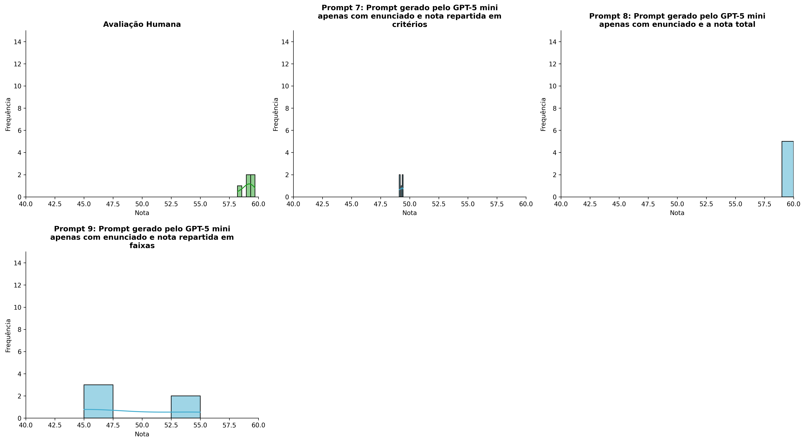
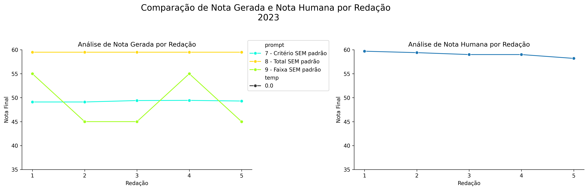
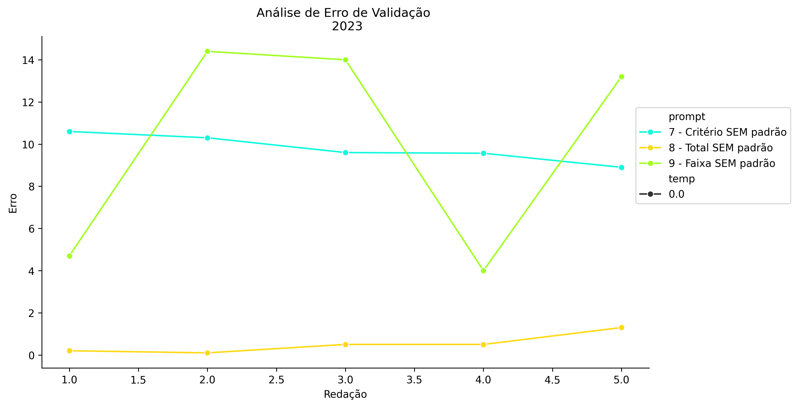
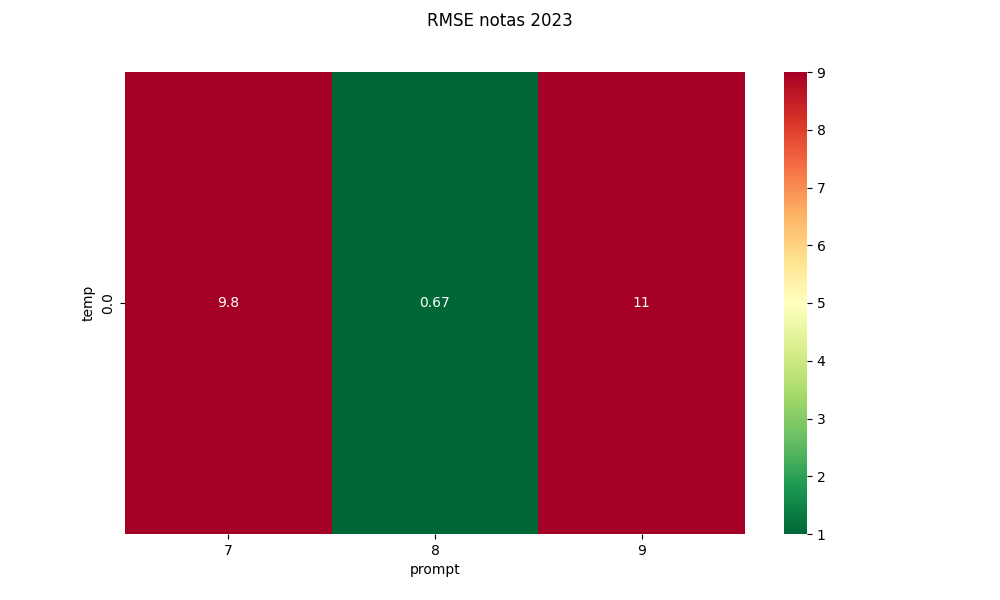
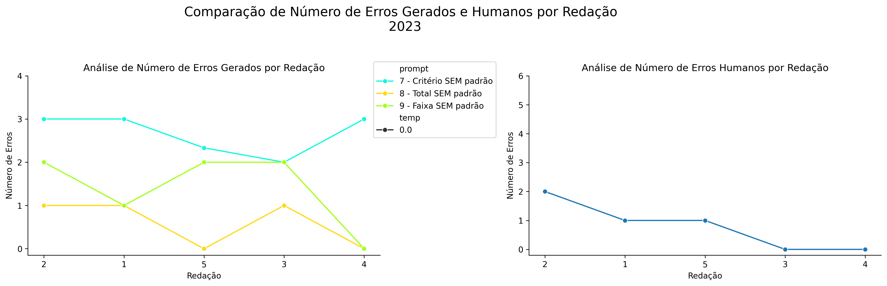
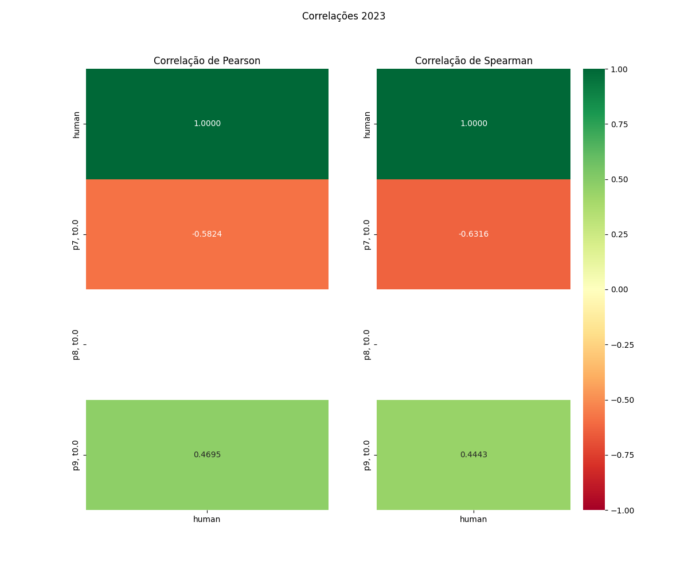

# Relatório de Avaliação: Qwen3.6-35B-A3B - 3 execuções
**Gerado em: 21/05/2026 08:53:30**

## 1. Distribuição de Notas
Nesta seção comparamos as notas atribuídas pelo modelo Qwen3.6-35B-A3B em diferentes prompts/temperaturas versus a correção humana.

## 2. Comparação de Notas Geradas e Humanas
Nesta seção, apresentamos a comparação entre as notas finais geradas pelo modelo e as notas dadas por avaliadores humanos.

## 3. Análise de Erro Absoluto de Validação

<table>
  <tr>
    <td>
      
    </td>
    <td>
      <table border="1" class="dataframe">
  <thead>
    <tr style="text-align: center;">
      <th>prompt</th>
      <th>temp</th>
      <th>area_sob_curva</th>
      <th>mae</th>
      <th>rmse</th>
    </tr>
  </thead>
  <tbody>
    <tr>
      <td>7</td>
      <td>0.0</td>
      <td>39.2167</td>
      <td>9.7933</td>
      <td>9.8116</td>
    </tr>
    <tr>
      <td>8</td>
      <td>0.0</td>
      <td>1.8500</td>
      <td>0.5200</td>
      <td>0.6693</td>
    </tr>
    <tr>
      <td>9</td>
      <td>0.0</td>
      <td>41.3500</td>
      <td>10.0600</td>
      <td>11.0968</td>
    </tr>
  </tbody>
</table>
    </td>
  </tr>
</table>

## 4. Análise de RMSE por Prompt e Temperatura
Nesta seção, apresentamos o heatmap de RMSE calculado por combinação de prompt e temperatura.

## 5. Análise de Erros Gramaticais
Comparação da sensibilidade do modelo na detecção/geração de erros em relação ao padrão humano.

## 6. Correlações

## Estatísticas Descritivas
### Modelo Qwen3.6-35B-A3B
|       |    prompt |   temp |   redacao |   nota_final |   nota_final_std |   1A |       1B |   1C |      CGPL |   num_errors |
|:------|----------:|-------:|----------:|-------------:|-----------------:|-----:|---------:|-----:|----------:|-------------:|
| count | 15        |     15 |  15       |     15       |       15         |    5 | 5        |    5 |  5        |     15       |
| mean  |  8        |      0 |   3       |     52.5889  |        0.0307933 |    9 | 9.06666  |   16 | 15.2      |      1.55555 |
| std   |  0.845154 |      0 |   1.46385 |      5.84628 |        0.0841438 |    0 | 0.149056 |    0 |  0.141421 |      1.07398 |
| min   |  7        |      0 |   1       |     45       |        0         |    9 | 9        |   16 | 15.1      |      0       |
| 25%   |  7        |      0 |   2       |     49.1     |        0         |    9 | 9        |   16 | 15.1      |      1       |
| 50%   |  8        |      0 |   3       |     49.4333  |        0         |    9 | 9        |   16 | 15.1      |      2       |
| 75%   |  9        |      0 |   4       |     59.5     |        0         |    9 | 9        |   16 | 15.3      |      2.16665 |
| max   |  9        |      0 |   5       |     59.5     |        0.2887    |    9 | 9.3333   |   16 | 15.4      |      3       |

### Humano
|       |   redacao |   nota_final |   num_errors |
|:------|----------:|-------------:|-------------:|
| count |   5       |     5        |      5       |
| mean  |   3       |    59.06     |      0.8     |
| std   |   1.58114 |     0.563915 |      0.83666 |
| min   |   1       |    58.2      |      0       |
| 25%   |   2       |    59        |      0       |
| 50%   |   3       |    59        |      1       |
| 75%   |   4       |    59.4      |      1       |
| max   |   5       |    59.7      |      2       |
