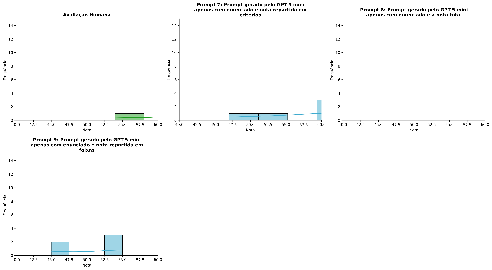
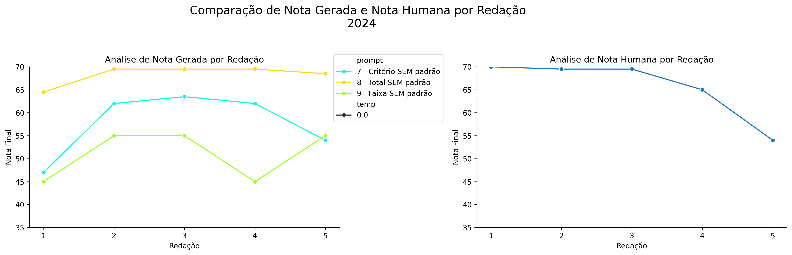
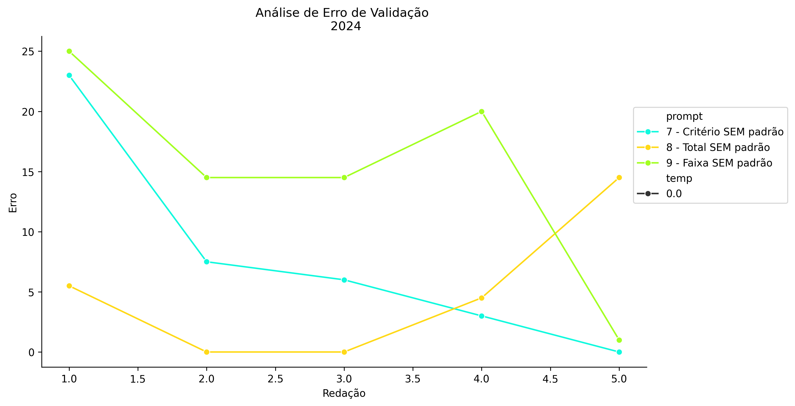
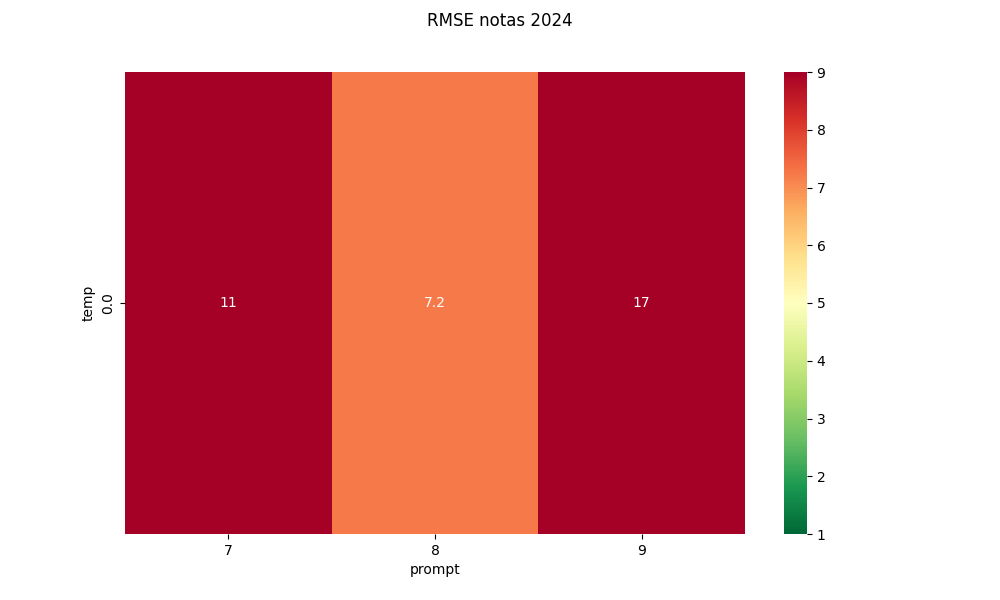
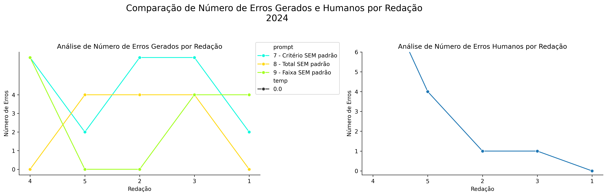
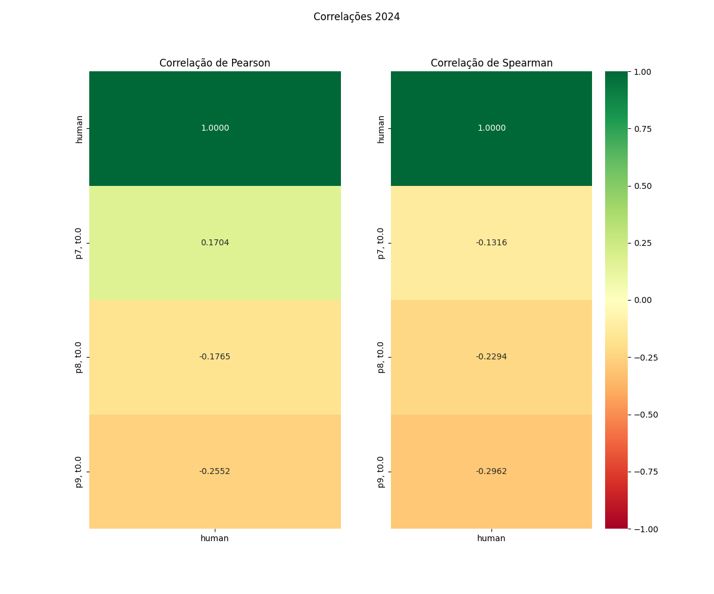

# Relatório de Avaliação: Qwen3.6-35B-A3B - 3 execuções
**Gerado em: 21/05/2026 08:53:37**

## 1. Distribuição de Notas
Nesta seção comparamos as notas atribuídas pelo modelo Qwen3.6-35B-A3B em diferentes prompts/temperaturas versus a correção humana.

## 2. Comparação de Notas Geradas e Humanas
Nesta seção, apresentamos a comparação entre as notas finais geradas pelo modelo e as notas dadas por avaliadores humanos.

## 3. Análise de Erro Absoluto de Validação

<table>
  <tr>
    <td>
      
    </td>
    <td>
      <table border="1" class="dataframe">
  <thead>
    <tr style="text-align: center;">
      <th>prompt</th>
      <th>temp</th>
      <th>area_sob_curva</th>
      <th>mae</th>
      <th>rmse</th>
    </tr>
  </thead>
  <tbody>
    <tr>
      <td>7</td>
      <td>0.0</td>
      <td>28.0</td>
      <td>7.9</td>
      <td>11.2272</td>
    </tr>
    <tr>
      <td>8</td>
      <td>0.0</td>
      <td>14.5</td>
      <td>4.9</td>
      <td>7.2215</td>
    </tr>
    <tr>
      <td>9</td>
      <td>0.0</td>
      <td>62.0</td>
      <td>15.0</td>
      <td>17.0088</td>
    </tr>
  </tbody>
</table>
    </td>
  </tr>
</table>

## 4. Análise de RMSE por Prompt e Temperatura
Nesta seção, apresentamos o heatmap de RMSE calculado por combinação de prompt e temperatura.

## 5. Análise de Erros Gramaticais
Comparação da sensibilidade do modelo na detecção/geração de erros em relação ao padrão humano.

## 6. Correlações

## Estatísticas Descritivas
### Modelo Qwen3.6-35B-A3B
|       |    prompt |   temp |   redacao |   nota_final |   nota_final_std |      1A |      1B |       1C |     CGPL |   num_errors |
|:------|----------:|-------:|----------:|-------------:|-----------------:|--------:|--------:|---------:|---------:|-------------:|
| count | 15        |     15 |  15       |     15       |               15 | 5       | 5       |  5       |  5       |     15       |
| mean  |  8        |      0 |   3       |     59       |                0 | 8.1     | 7.8     | 19       | 22.8     |      3.2     |
| std   |  0.845154 |      0 |   1.46385 |      8.85801 |                0 | 1.34164 | 1.95576 |  4.79583 |  1.09545 |      2.36643 |
| min   |  7        |      0 |   1       |     45       |                0 | 6       | 5       | 12       | 22       |      0       |
| 25%   |  7        |      0 |   2       |     54.5     |                0 | 7.5     | 6.5     | 16       | 22       |      1       |
| 50%   |  8        |      0 |   3       |     62       |                0 | 9       | 9       | 22       | 22       |      4       |
| 75%   |  9        |      0 |   4       |     66.5     |                0 | 9       | 9       | 22       | 24       |      5       |
| max   |  9        |      0 |   5       |     69.5     |                0 | 9       | 9.5     | 23       | 24       |      6       |

### Humano
|       |   redacao |   nota_final |   num_errors |
|:------|----------:|-------------:|-------------:|
| count |   5       |      5       |      5       |
| mean  |   3       |     65.6     |      3.2     |
| std   |   1.58114 |      6.79522 |      4.08656 |
| min   |   1       |     54       |      0       |
| 25%   |   2       |     65       |      1       |
| 50%   |   3       |     69.5     |      1       |
| 75%   |   4       |     69.5     |      4       |
| max   |   5       |     70       |     10       |
