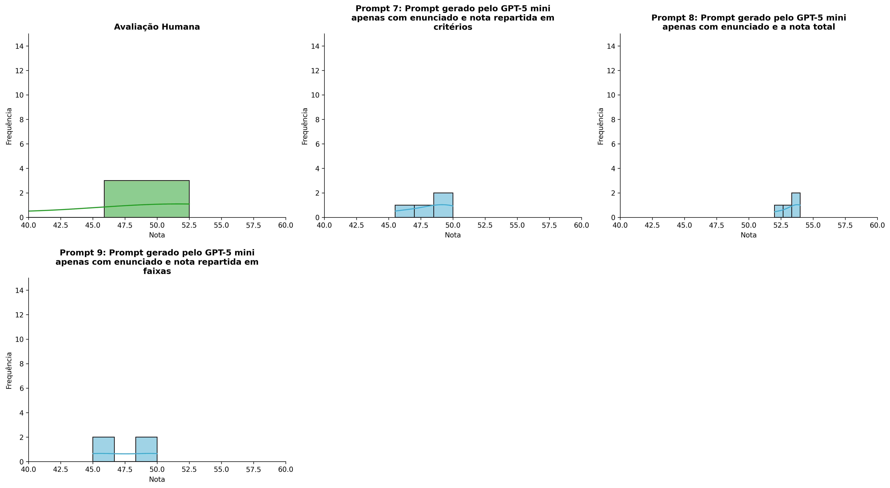
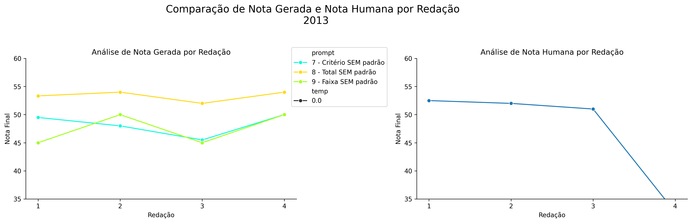
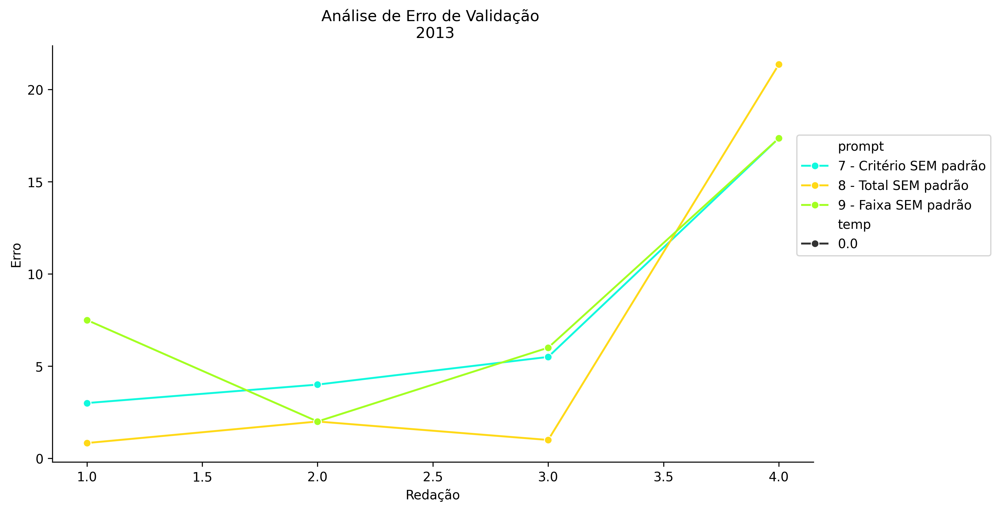
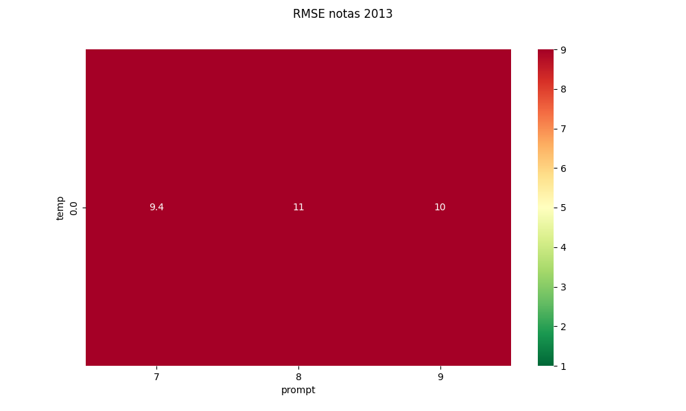
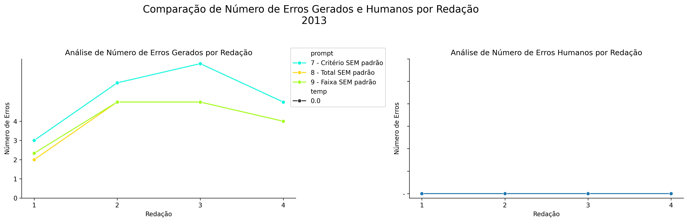
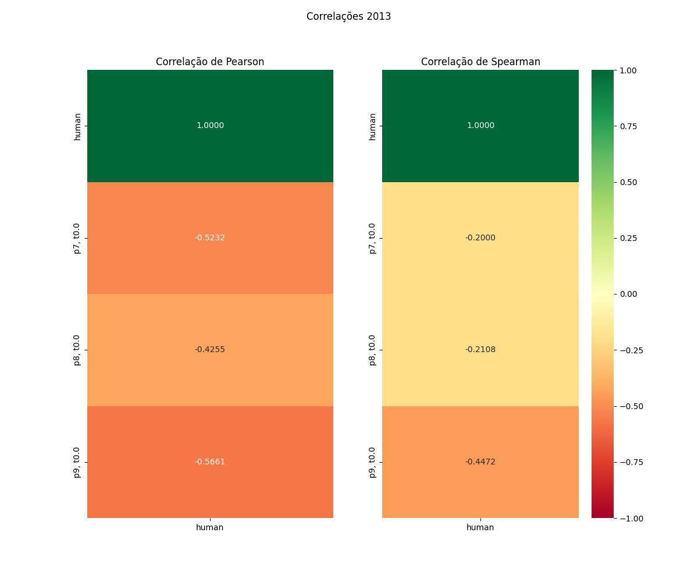

# Relatório de Avaliação: claude-opus-4-6 - 3 execuções
**Gerado em: 02/06/2026 18:11:54**

## 1. Distribuição de Notas
Nesta seção comparamos as notas atribuídas pelo modelo claude-opus-4-6 em diferentes prompts/temperaturas versus a correção humana.

## 2. Comparação de Notas Geradas e Humanas
Nesta seção, apresentamos a comparação entre as notas finais geradas pelo modelo e as notas dadas por avaliadores humanos.

## 3. Análise de Erro Absoluto de Validação

<table>
  <tr>
    <td>
      
    </td>
    <td>
      <table border="1" class="dataframe">
  <thead>
    <tr style="text-align: center;">
      <th>prompt</th>
      <th>temp</th>
      <th>area_sob_curva</th>
      <th>mae</th>
      <th>rmse</th>
    </tr>
  </thead>
  <tbody>
    <tr>
      <td>7</td>
      <td>0.0</td>
      <td>19.6750</td>
      <td>7.4625</td>
      <td>9.4376</td>
    </tr>
    <tr>
      <td>8</td>
      <td>0.0</td>
      <td>14.0916</td>
      <td>6.2958</td>
      <td>10.7415</td>
    </tr>
    <tr>
      <td>9</td>
      <td>0.0</td>
      <td>20.4250</td>
      <td>8.2125</td>
      <td>9.9658</td>
    </tr>
  </tbody>
</table>
    </td>
  </tr>
</table>

## 4. Análise de RMSE por Prompt e Temperatura
Nesta seção, apresentamos o heatmap de RMSE calculado por combinação de prompt e temperatura.

## 5. Análise de Erros Gramaticais
Comparação da sensibilidade do modelo na detecção/geração de erros em relação ao padrão humano.

## 6. Correlações

## Estatísticas Descritivas
### Modelo claude-opus-4-6
|       |    prompt |   temp |   redacao |   nota_final |   nota_final_std |       1A |       1B |       1C |     CGPL |   num_errors |
|:------|----------:|-------:|----------:|-------------:|-----------------:|---------:|---------:|---------:|---------:|-------------:|
| count | 12        |     12 |  12       |     12       |        12        | 4        | 4        | 4        |  4       |     12       |
| mean  |  8        |      0 |   2.5     |     49.6944  |         0.137892 | 8.5      | 7.83333  | 7.16667  | 24.75    |      4.44444 |
| std   |  0.852803 |      0 |   1.16775 |      3.30963 |         0.350994 | 0.408248 | 0.527057 | 0.408235 |  1.70783 |      1.45875 |
| min   |  7        |      0 |   1       |     45       |         0        | 8        | 7.3333   | 6.6667   | 23       |      2       |
| 25%   |  7        |      0 |   1.75    |     47.375   |         0        | 8.375    | 7.45833  | 6.91667  | 23.75    |      3.75    |
| 50%   |  8        |      0 |   2.5     |     50       |         0        | 8.5      | 7.75     | 7.25     | 24.5     |      5       |
| 75%   |  9        |      0 |   3.25    |     52.3333  |         0        | 8.625    | 8.125    | 7.5      | 25.5     |      5       |
| max   |  9        |      0 |   4       |     54       |         1.1547   | 9        | 8.5      | 7.5      | 27       |      7       |

### Humano
|       |   redacao |   nota_final |
|:------|----------:|-------------:|
| count |   4       |      4       |
| mean  |   2.5     |     47.0375  |
| std   |   1.29099 |      9.61192 |
| min   |   1       |     32.65    |
| 25%   |   1.75    |     46.4125  |
| 50%   |   2.5     |     51.5     |
| 75%   |   3.25    |     52.125   |
| max   |   4       |     52.5     |
