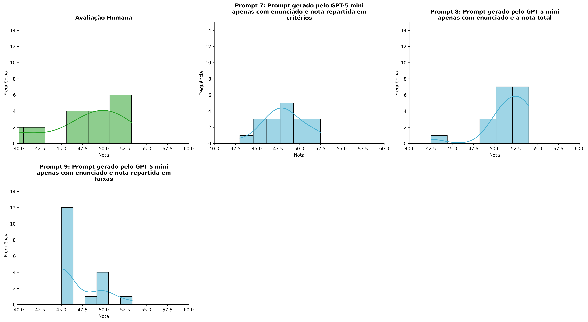
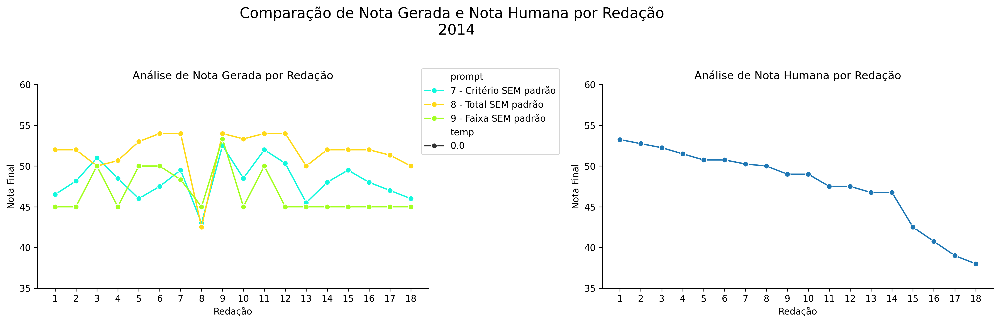
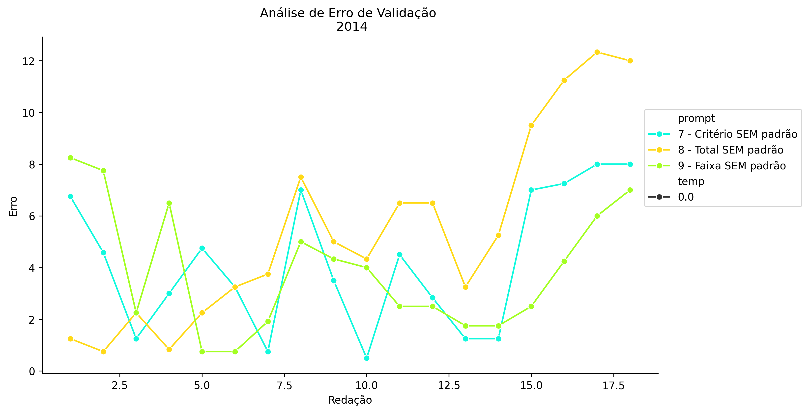
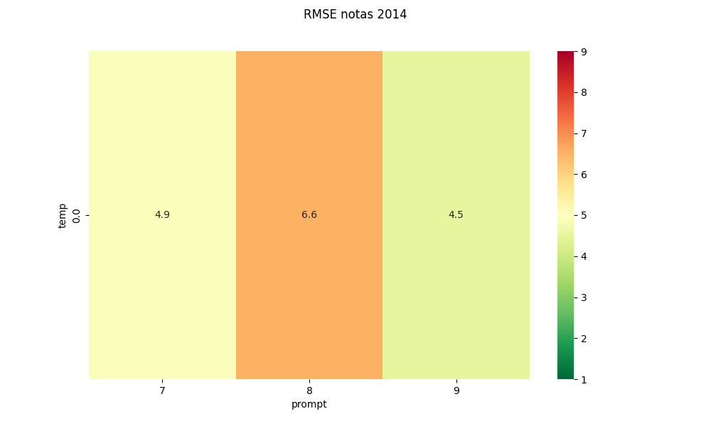
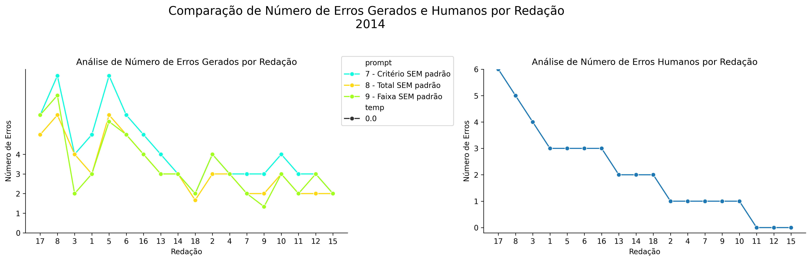
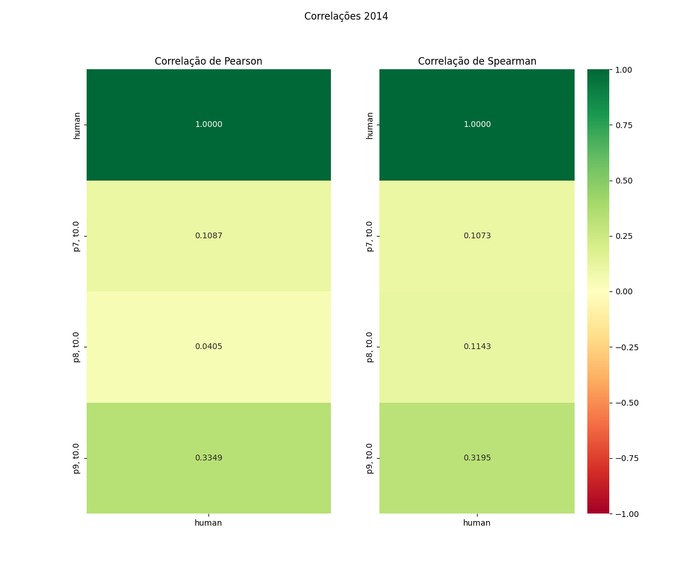

# Relatório de Avaliação: claude-opus-4-6 - 3 execuções
**Gerado em: 03/06/2026 00:08:52**

## 1. Distribuição de Notas
Nesta seção comparamos as notas atribuídas pelo modelo claude-opus-4-6 em diferentes prompts/temperaturas versus a correção humana.

## 2. Comparação de Notas Geradas e Humanas
Nesta seção, apresentamos a comparação entre as notas finais geradas pelo modelo e as notas dadas por avaliadores humanos.

## 3. Análise de Erro Absoluto de Validação

<table>
  <tr>
    <td>
      
    </td>
    <td>
      <table border="1" class="dataframe">
  <thead>
    <tr style="text-align: center;">
      <th>prompt</th>
      <th>temp</th>
      <th>area_sob_curva</th>
      <th>mae</th>
      <th>rmse</th>
    </tr>
  </thead>
  <tbody>
    <tr>
      <td>7</td>
      <td>0.0</td>
      <td>68.0416</td>
      <td>4.1898</td>
      <td>4.9063</td>
    </tr>
    <tr>
      <td>8</td>
      <td>0.0</td>
      <td>91.1249</td>
      <td>5.4306</td>
      <td>6.5538</td>
    </tr>
    <tr>
      <td>9</td>
      <td>0.0</td>
      <td>62.1250</td>
      <td>3.8750</td>
      <td>4.5213</td>
    </tr>
  </tbody>
</table>
    </td>
  </tr>
</table>

## 4. Análise de RMSE por Prompt e Temperatura
Nesta seção, apresentamos o heatmap de RMSE calculado por combinação de prompt e temperatura.

## 5. Análise de Erros Gramaticais
Comparação da sensibilidade do modelo na detecção/geração de erros em relação ao padrão humano.

## 6. Correlações

## Estatísticas Descritivas
### Modelo claude-opus-4-6
|       |    prompt |   temp |   redacao |   nota_final |   nota_final_std |       1A |        1B |        1C |     CGPL |   num_errors |
|:------|----------:|-------:|----------:|-------------:|-----------------:|---------:|----------:|----------:|---------:|-------------:|
| count | 54        |     54 |  54       |     54       |        54        | 18       | 18        | 18        | 18       |     54       |
| mean  |  8        |      0 |   9.5     |     48.8889  |         0.207057 |  8.22222 |  7.41667  |  6.77778  | 25.7778  |      3.64198 |
| std   |  0.824163 |      0 |   5.23684 |      3.31457 |         0.606859 |  0.62361 |  0.649913 |  0.727602 |  1.80051 |      1.62766 |
| min   |  7        |      0 |   1       |     42.5     |         0        |  6.5     |  6        |  5.5      | 22       |      1.3333  |
| 25%   |  7        |      0 |   5       |     45.125   |         0        |  8       |  7        |  6.5      | 25       |      2.25    |
| 50%   |  8        |      0 |   9.5     |     49.5     |         0        |  8.5     |  7.5      |  6.58335  | 26       |      3       |
| 75%   |  9        |      0 |  14       |     52       |         0        |  8.5     |  7.74998  |  7.375    | 27       |      4.75    |
| max   |  9        |      0 |  18       |     54       |         2.8868   |  9       |  8.5      |  8.3333   | 28       |      8       |

### Humano
|       |   redacao |   nota_final |   num_errors |
|:------|----------:|-------------:|-------------:|
| count |  18       |     18       |     18       |
| mean  |   9.5     |     47.6806  |      2.11111 |
| std   |   5.33854 |      4.67928 |      1.71117 |
| min   |   1       |     38       |      0       |
| 25%   |   5.25    |     46.75    |      1       |
| 50%   |   9.5     |     49       |      2       |
| 75%   |  13.75    |     50.75    |      3       |
| max   |  18       |     53.25    |      6       |
