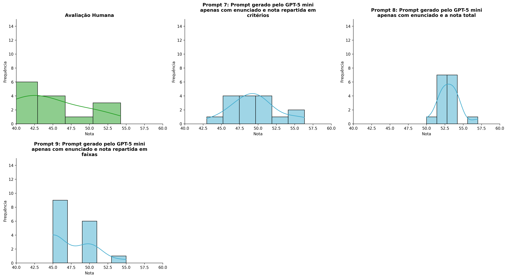
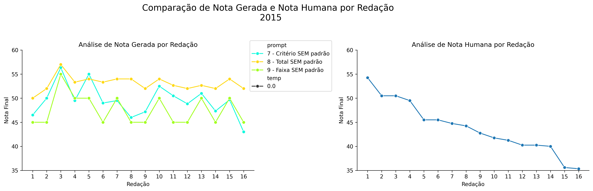
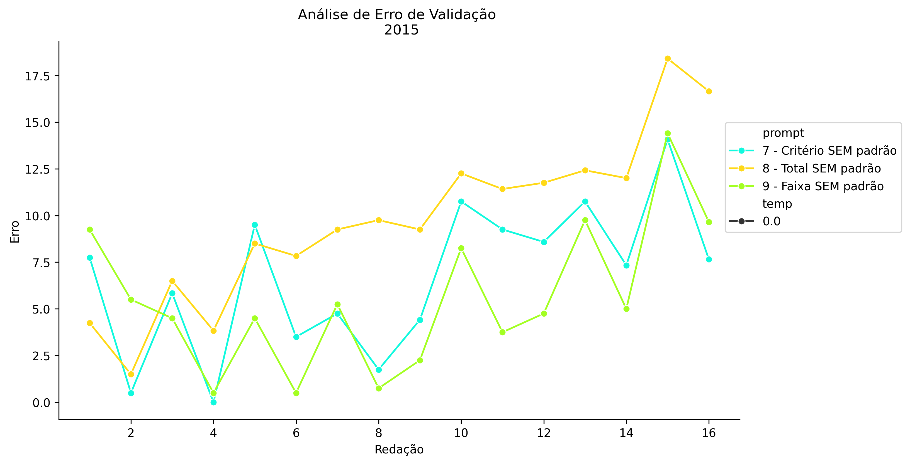
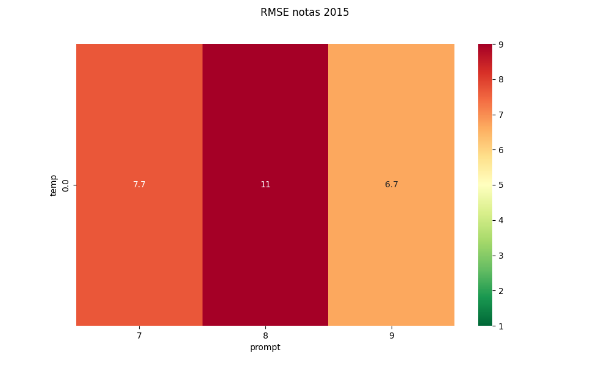
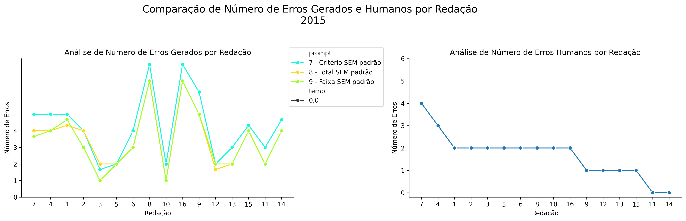
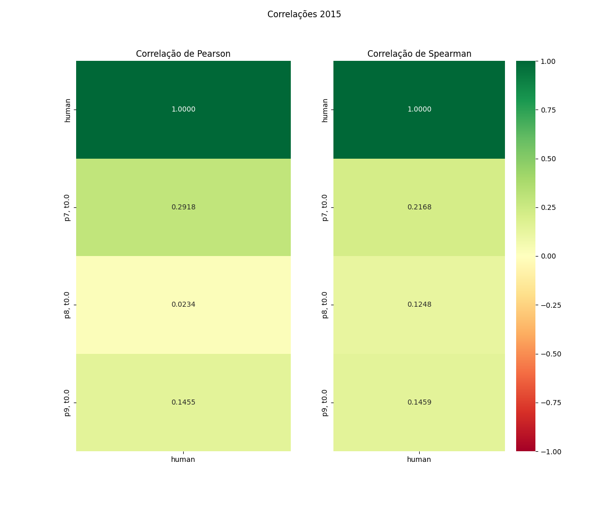

# Relatório de Avaliação: claude-opus-4-6 - 3 execuções
**Gerado em: 03/06/2026 00:09:02**

## 1. Distribuição de Notas
Nesta seção comparamos as notas atribuídas pelo modelo claude-opus-4-6 em diferentes prompts/temperaturas versus a correção humana.

## 2. Comparação de Notas Geradas e Humanas
Nesta seção, apresentamos a comparação entre as notas finais geradas pelo modelo e as notas dadas por avaliadores humanos.

## 3. Análise de Erro Absoluto de Validação

<table>
  <tr>
    <td>
      
    </td>
    <td>
      <table border="1" class="dataframe">
  <thead>
    <tr style="text-align: center;">
      <th>prompt</th>
      <th>temp</th>
      <th>area_sob_curva</th>
      <th>mae</th>
      <th>rmse</th>
    </tr>
  </thead>
  <tbody>
    <tr>
      <td>7</td>
      <td>0.0</td>
      <td>98.6833</td>
      <td>6.6490</td>
      <td>7.6751</td>
    </tr>
    <tr>
      <td>8</td>
      <td>0.0</td>
      <td>145.1000</td>
      <td>9.7219</td>
      <td>10.6345</td>
    </tr>
    <tr>
      <td>9</td>
      <td>0.0</td>
      <td>79.1000</td>
      <td>5.5344</td>
      <td>6.6860</td>
    </tr>
  </tbody>
</table>
    </td>
  </tr>
</table>

## 4. Análise de RMSE por Prompt e Temperatura
Nesta seção, apresentamos o heatmap de RMSE calculado por combinação de prompt e temperatura.

## 5. Análise de Erros Gramaticais
Comparação da sensibilidade do modelo na detecção/geração de erros em relação ao padrão humano.

## 6. Correlações

## Estatísticas Descritivas
### Modelo claude-opus-4-6
|       |    prompt |   temp |   redacao |   nota_final |   nota_final_std |     1A |        1B |        1C |     CGPL |   num_errors |
|:------|----------:|-------:|----------:|-------------:|-----------------:|-------:|----------:|----------:|---------:|-------------:|
| count | 48        |     48 |  48       |     48       |        48        | 16     | 16        | 16        | 16       |     48       |
| mean  |  8        |      0 |   8.5     |     50.0174  |         0.150356 |  8.375 |  7.9375   |  7.42708  | 25.75    |      3.75695 |
| std   |  0.825137 |      0 |   4.65855 |      3.58306 |         0.34718  |  0.5   |  0.680074 |  0.834379 |  1.99071 |      1.86639 |
| min   |  7        |      0 |   1       |     43       |         0        |  7.5   |  7        |  5.8333   | 22       |      1       |
| 25%   |  7        |      0 |   4.75    |     47       |         0        |  8     |  7.5      |  7        | 25       |      2       |
| 50%   |  8        |      0 |   8.5     |     50       |         0        |  8.5   |  8        |  7.5      | 25.8333  |      4       |
| 75%   |  9        |      0 |  12.25    |     52.6667  |         0        |  8.5   |  8        |  7.625    | 27.25    |      4.75002 |
| max   |  9        |      0 |  16       |     57       |         1.1547   |  9.5   |  9.5      |  9        | 28.3333  |      8       |

### Humano
|       |   redacao |   nota_final |   num_errors |
|:------|----------:|-------------:|-------------:|
| count |  16       |     16       |     16       |
| mean  |   8.5     |     43.8719  |      1.6875  |
| std   |   4.76095 |      5.34397 |      1.01448 |
| min   |   1       |     35.35    |      0       |
| 25%   |   4.75    |     40.25    |      1       |
| 50%   |   8.5     |     43.5     |      2       |
| 75%   |  12.25    |     46.5     |      2       |
| max   |  16       |     54.25    |      4       |
