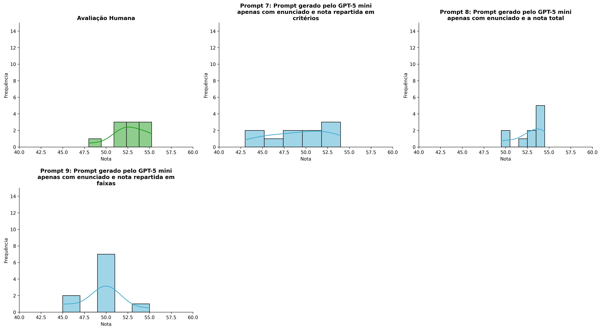
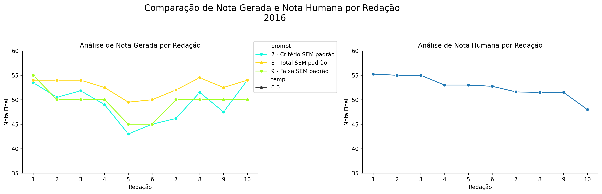
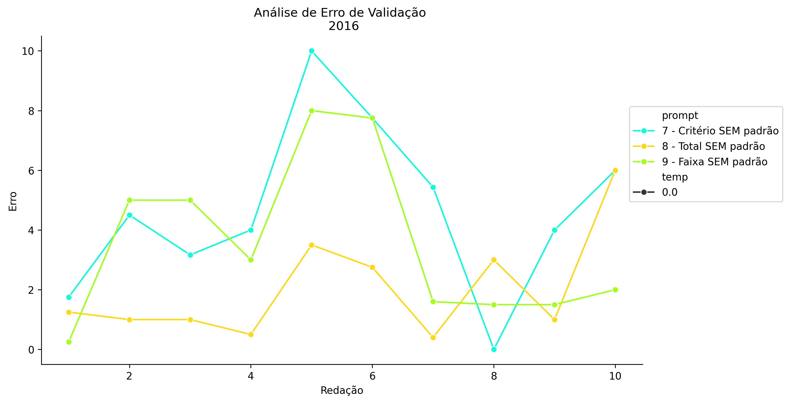
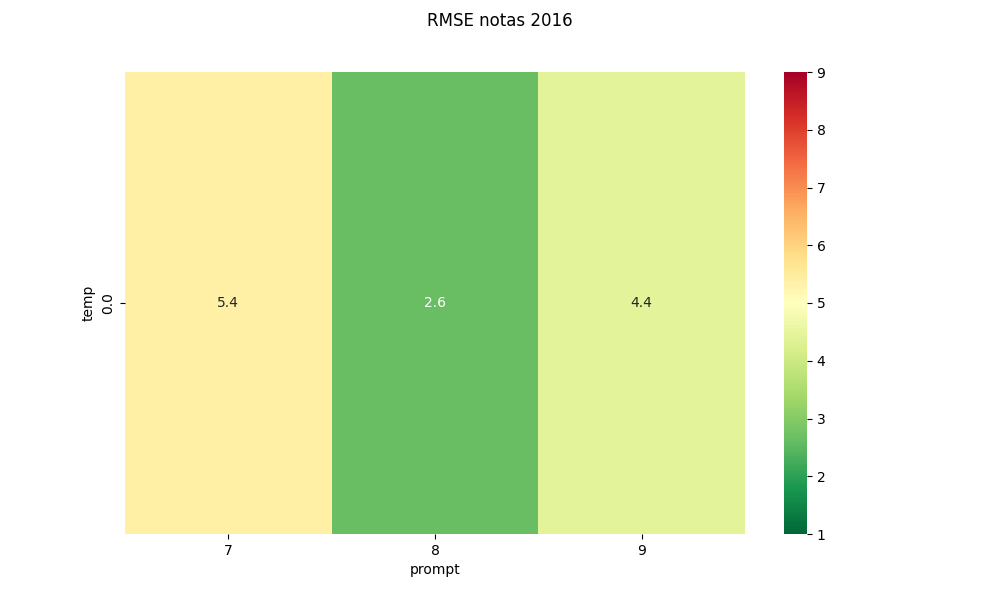
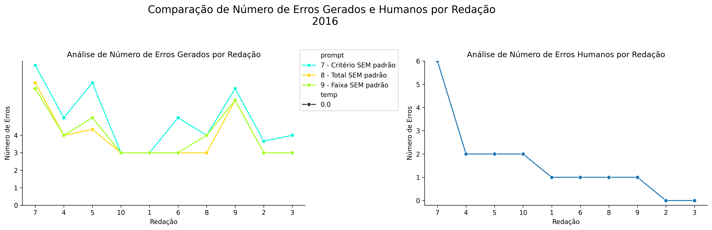
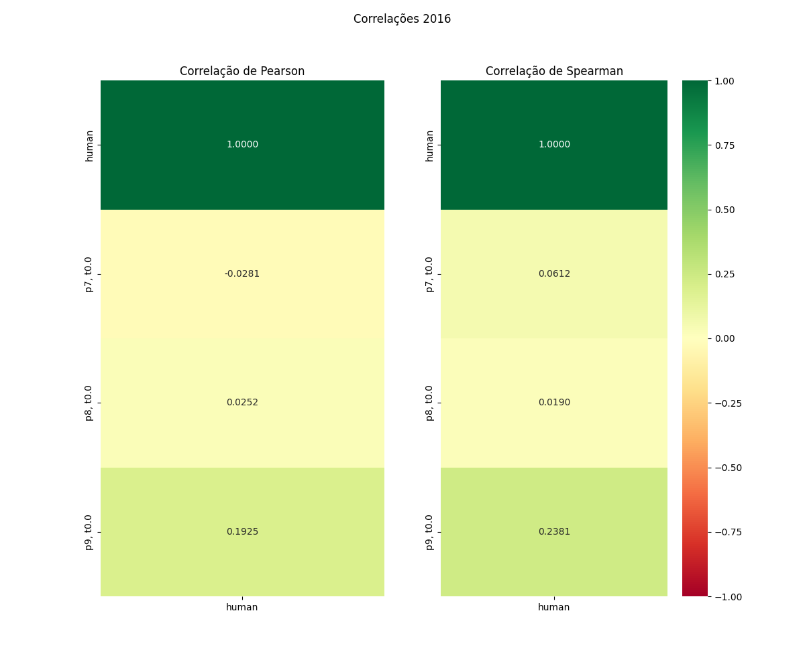

# Relatório de Avaliação: claude-opus-4-6 - 3 execuções
**Gerado em: 03/06/2026 00:09:12**

## 1. Distribuição de Notas
Nesta seção comparamos as notas atribuídas pelo modelo claude-opus-4-6 em diferentes prompts/temperaturas versus a correção humana.

## 2. Comparação de Notas Geradas e Humanas
Nesta seção, apresentamos a comparação entre as notas finais geradas pelo modelo e as notas dadas por avaliadores humanos.

## 3. Análise de Erro Absoluto de Validação

<table>
  <tr>
    <td>
      
    </td>
    <td>
      <table border="1" class="dataframe">
  <thead>
    <tr style="text-align: center;">
      <th>prompt</th>
      <th>temp</th>
      <th>area_sob_curva</th>
      <th>mae</th>
      <th>rmse</th>
    </tr>
  </thead>
  <tbody>
    <tr>
      <td>7</td>
      <td>0.0</td>
      <td>42.725</td>
      <td>4.66</td>
      <td>5.3937</td>
    </tr>
    <tr>
      <td>8</td>
      <td>0.0</td>
      <td>16.775</td>
      <td>2.04</td>
      <td>2.6417</td>
    </tr>
    <tr>
      <td>9</td>
      <td>0.0</td>
      <td>34.475</td>
      <td>3.56</td>
      <td>4.4066</td>
    </tr>
  </tbody>
</table>
    </td>
  </tr>
</table>

## 4. Análise de RMSE por Prompt e Temperatura
Nesta seção, apresentamos o heatmap de RMSE calculado por combinação de prompt e temperatura.

## 5. Análise de Erros Gramaticais
Comparação da sensibilidade do modelo na detecção/geração de erros em relação ao padrão humano.

## 6. Correlações

## Estatísticas Descritivas
### Modelo claude-opus-4-6
|       |    prompt |   temp |   redacao |   nota_final |   nota_final_std |        1A |        1B |        1C |     CGPL |   num_errors |
|:------|----------:|-------:|----------:|-------------:|-----------------:|----------:|----------:|----------:|---------:|-------------:|
| count | 30        |     30 |  30       |     30       |        30        | 10        | 10        | 10        | 10       |     30       |
| mean  |  8        |      0 |   5.5     |     50.4667  |         0.11547  |  8.43333  |  7.95     |  7.75     | 25.0667  |      4.31111 |
| std   |  0.830455 |      0 |   2.92138 |      3.21377 |         0.279569 |  0.685836 |  0.831665 |  0.956618 |  1.74837 |      1.54854 |
| min   |  7        |      0 |   1       |     43       |         0        |  7        |  6.5      |  6        | 22       |      3       |
| 25%   |  7        |      0 |   3       |     49.625   |         0        |  8.37497  |  8        |  7.54167  | 23.75    |      3       |
| 50%   |  8        |      0 |   5.5     |     50       |         0        |  8.5      |  8        |  7.75     | 25.5     |      4       |
| 75%   |  9        |      0 |   8       |     53.25    |         0        |  9        |  8.5      |  8.24997  | 26.25    |      5       |
| max   |  9        |      0 |  10       |     55       |         0.866    |  9        |  9        |  9        | 27       |      8       |

### Humano
|       |   redacao |   nota_final |   num_errors |
|:------|----------:|-------------:|-------------:|
| count |  10       |     10       |      10      |
| mean  |   5.5     |     52.66    |       1.6    |
| std   |   3.02765 |      2.19669 |       1.7127 |
| min   |   1       |     48       |       0      |
| 25%   |   3.25    |     51.525   |       1      |
| 50%   |   5.5     |     52.875   |       1      |
| 75%   |   7.75    |     54.5     |       2      |
| max   |  10       |     55.25    |       6      |
