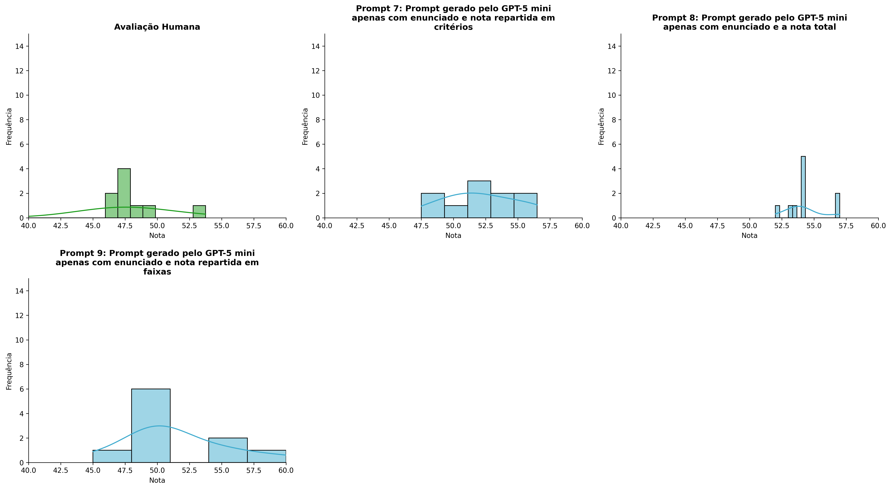
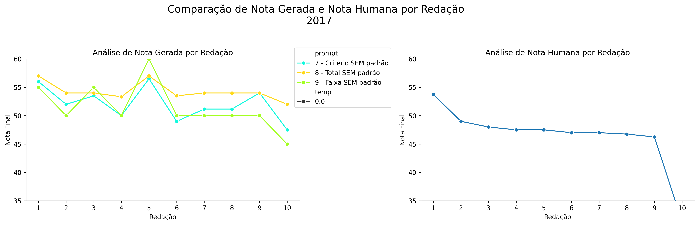
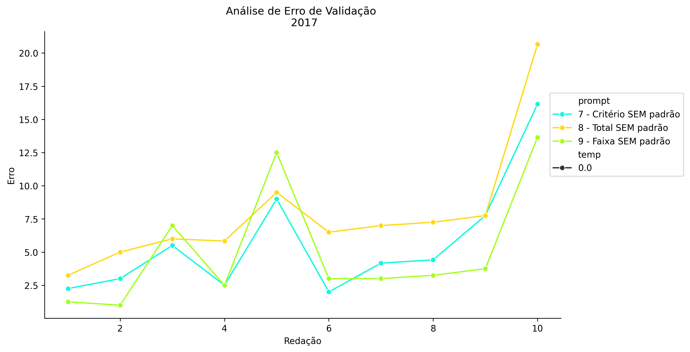
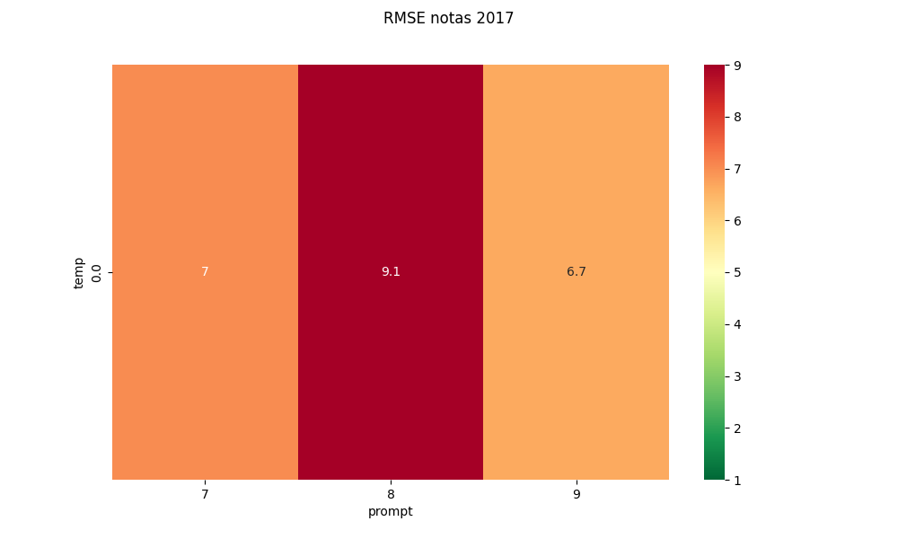
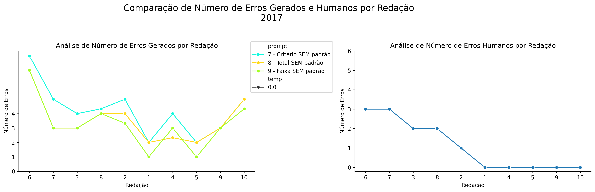
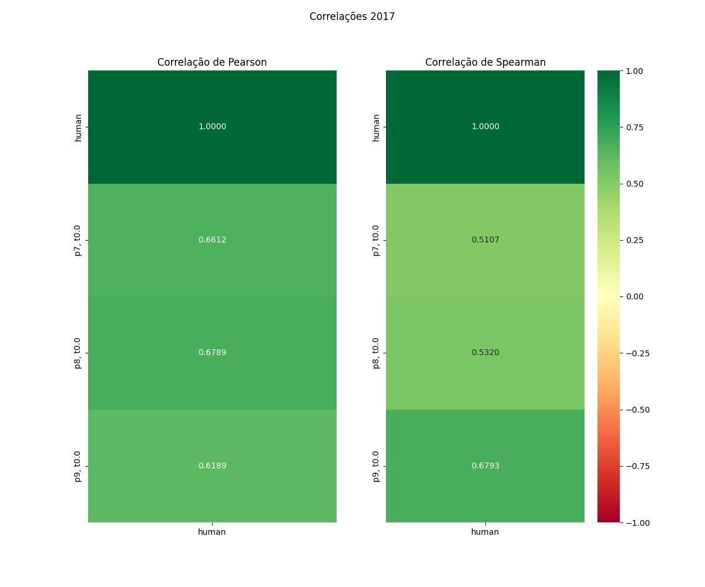

# Relatório de Avaliação: claude-opus-4-6 - 3 execuções
**Gerado em: 03/06/2026 00:09:22**

## 1. Distribuição de Notas
Nesta seção comparamos as notas atribuídas pelo modelo claude-opus-4-6 em diferentes prompts/temperaturas versus a correção humana.

## 2. Comparação de Notas Geradas e Humanas
Nesta seção, apresentamos a comparação entre as notas finais geradas pelo modelo e as notas dadas por avaliadores humanos.

## 3. Análise de Erro Absoluto de Validação

<table>
  <tr>
    <td>
      
    </td>
    <td>
      <table border="1" class="dataframe">
  <thead>
    <tr style="text-align: center;">
      <th>prompt</th>
      <th>temp</th>
      <th>area_sob_curva</th>
      <th>mae</th>
      <th>rmse</th>
    </tr>
  </thead>
  <tbody>
    <tr>
      <td>7</td>
      <td>0.0</td>
      <td>47.5334</td>
      <td>5.6733</td>
      <td>7.0236</td>
    </tr>
    <tr>
      <td>8</td>
      <td>0.0</td>
      <td>66.7833</td>
      <td>7.8733</td>
      <td>9.0892</td>
    </tr>
    <tr>
      <td>9</td>
      <td>0.0</td>
      <td>43.4500</td>
      <td>5.0900</td>
      <td>6.6559</td>
    </tr>
  </tbody>
</table>
    </td>
  </tr>
</table>

## 4. Análise de RMSE por Prompt e Temperatura
Nesta seção, apresentamos o heatmap de RMSE calculado por combinação de prompt e temperatura.

## 5. Análise de Erros Gramaticais
Comparação da sensibilidade do modelo na detecção/geração de erros em relação ao padrão humano.

## 6. Correlações

## Estatísticas Descritivas
### Modelo claude-opus-4-6
|       |    prompt |   temp |   redacao |   nota_final |   nota_final_std |       1A |        1B |        1C |     CGPL |   num_errors |
|:------|----------:|-------:|----------:|-------------:|-----------------:|---------:|----------:|----------:|---------:|-------------:|
| count | 30        |     30 |  30       |      30      |        30        | 10       | 10        | 10        | 10       |     30       |
| mean  |  8        |      0 |   5.5     |      52.6222 |         0.125093 |  8.88333 |  8.73333  |  8.7      | 25.7667  |      3.67777 |
| std   |  0.830455 |      0 |   2.92138 |       3.187  |         0.361061 |  0.45846 |  0.599385 |  0.859947 |  1.75013 |      1.66433 |
| min   |  7        |      0 |   1       |      45      |         0        |  8       |  7.5      |  7        | 22       |      1       |
| 25%   |  7        |      0 |   3       |      50      |         0        |  8.58333 |  8.49997  |  8.41665  | 25       |      3       |
| 50%   |  8        |      0 |   5.5     |      53.4167 |         0        |  9       |  9        |  9        | 25.8333  |      3.16665 |
| 75%   |  9        |      0 |   8       |      54      |         0        |  9       |  9        |  9.375    | 26.75    |      4.3333  |
| max   |  9        |      0 |  10       |      60      |         1.4434   |  9.5     |  9.5      |  9.5      | 28       |      8       |

### Humano
|       |   redacao |   nota_final |   num_errors |
|:------|----------:|-------------:|-------------:|
| count |  10       |      10      |     10       |
| mean  |   5.5     |      46.41   |      1.1     |
| std   |   3.02765 |       5.707  |      1.28668 |
| min   |   1       |      31.35   |      0       |
| 25%   |   3.25    |      46.8125 |      0       |
| 50%   |   5.5     |      47.25   |      0.5     |
| 75%   |   7.75    |      47.875  |      2       |
| max   |  10       |      53.75   |      3       |
