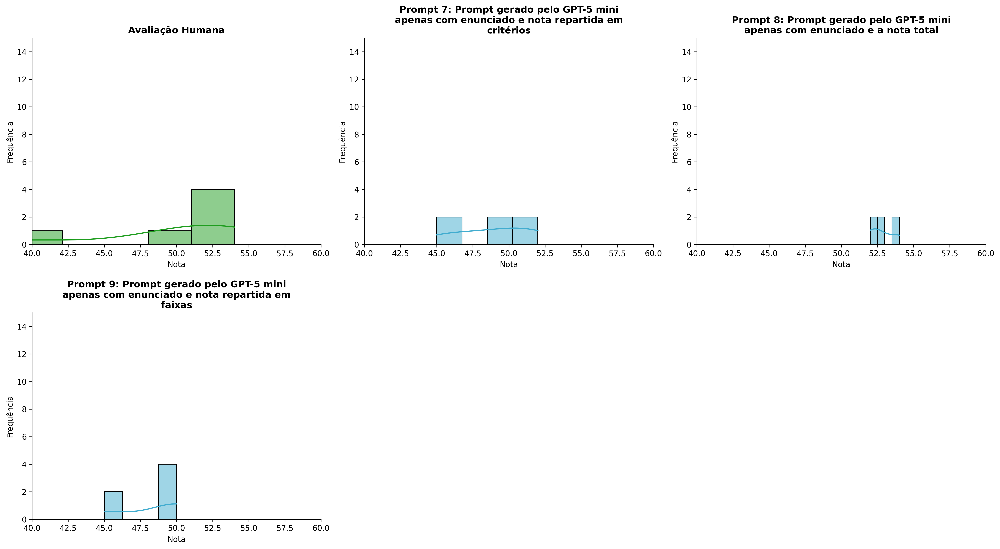
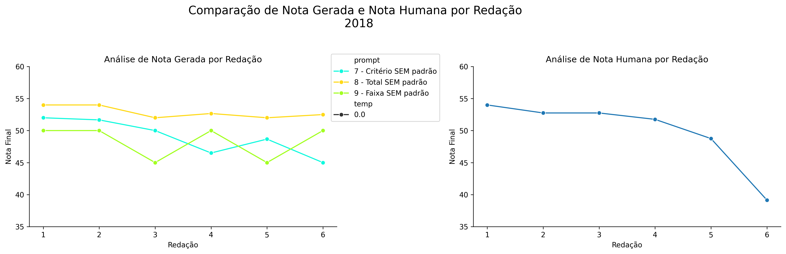
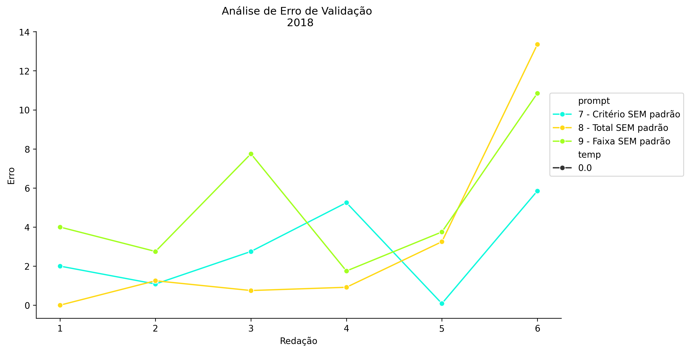
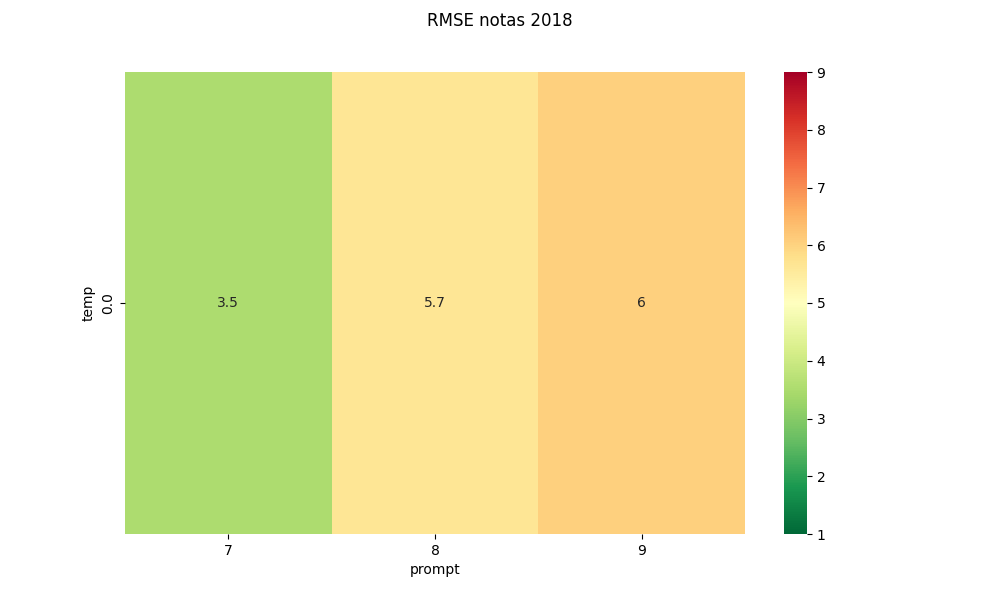
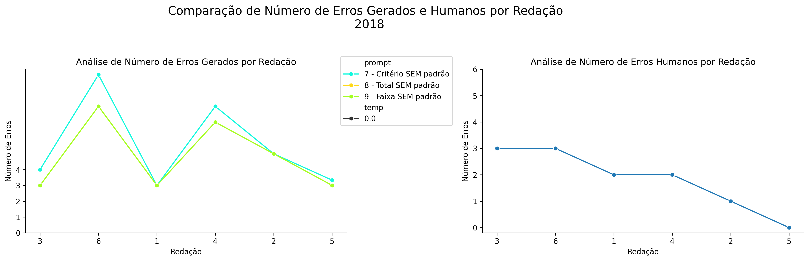
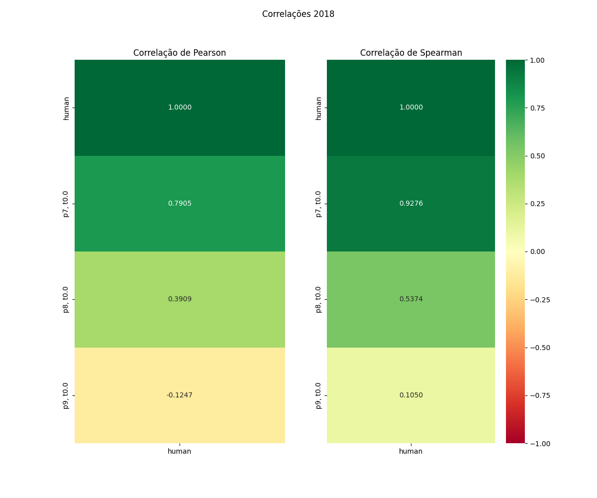

# Relatório de Avaliação: claude-opus-4-6 - 3 execuções
**Gerado em: 03/06/2026 00:09:31**

## 1. Distribuição de Notas
Nesta seção comparamos as notas atribuídas pelo modelo claude-opus-4-6 em diferentes prompts/temperaturas versus a correção humana.

## 2. Comparação de Notas Geradas e Humanas
Nesta seção, apresentamos a comparação entre as notas finais geradas pelo modelo e as notas dadas por avaliadores humanos.

## 3. Análise de Erro Absoluto de Validação

<table>
  <tr>
    <td>
      
    </td>
    <td>
      <table border="1" class="dataframe">
  <thead>
    <tr style="text-align: center;">
      <th>prompt</th>
      <th>temp</th>
      <th>area_sob_curva</th>
      <th>mae</th>
      <th>rmse</th>
    </tr>
  </thead>
  <tbody>
    <tr>
      <td>7</td>
      <td>0.0</td>
      <td>13.0916</td>
      <td>2.8361</td>
      <td>3.5244</td>
    </tr>
    <tr>
      <td>8</td>
      <td>0.0</td>
      <td>12.8417</td>
      <td>3.2528</td>
      <td>5.6532</td>
    </tr>
    <tr>
      <td>9</td>
      <td>0.0</td>
      <td>23.4250</td>
      <td>5.1417</td>
      <td>6.0342</td>
    </tr>
  </tbody>
</table>
    </td>
  </tr>
</table>

## 4. Análise de RMSE por Prompt e Temperatura
Nesta seção, apresentamos o heatmap de RMSE calculado por combinação de prompt e temperatura.

## 5. Análise de Erros Gramaticais
Comparação da sensibilidade do modelo na detecção/geração de erros em relação ao padrão humano.

## 6. Correlações

## Estatísticas Descritivas
### Modelo claude-opus-4-6
|       |    prompt |   temp |   redacao |   nota_final |   nota_final_std |       1A |       1B |      1C |     CGPL |   num_errors |
|:------|----------:|-------:|----------:|-------------:|-----------------:|---------:|---------:|--------:|---------:|-------------:|
| count | 18        |     18 |  18       |     18       |        18        | 6        | 6        | 6       |  6       |     18       |
| mean  |  8        |      0 |   3.5     |     50.0556  |         0.112267 | 8.5      | 8.25     | 7.77778 | 24.4444  |      5.07407 |
| std   |  0.840168 |      0 |   1.75734 |      2.96163 |         0.299333 | 0.447214 | 0.524404 | 0.7935  |  2.82581 |      2.32226 |
| min   |  7        |      0 |   1       |     45       |         0        | 8        | 7.5      | 6.5     | 20       |      3       |
| 25%   |  7        |      0 |   2       |     49       |         0        | 8.125    | 8        | 7.5     | 22.75    |      3       |
| 50%   |  8        |      0 |   3.5     |     50       |         0        | 8.5      | 8.25     | 7.75    | 25.5     |      4.5     |
| 75%   |  9        |      0 |   5       |     52       |         0        | 8.875    | 8.5      | 8.375   | 26.5     |      7       |
| max   |  9        |      0 |   6       |     54       |         1.1547   | 9        | 9        | 8.6667  | 27       |     10       |

### Humano
|       |   redacao |   nota_final |   num_errors |
|:------|----------:|-------------:|-------------:|
| count |   6       |      6       |      6       |
| mean  |   3.5     |     49.8583  |      1.83333 |
| std   |   1.87083 |      5.53809 |      1.16905 |
| min   |   1       |     39.15    |      0       |
| 25%   |   2.25    |     49.5     |      1.25    |
| 50%   |   3.5     |     52.25    |      2       |
| 75%   |   4.75    |     52.75    |      2.75    |
| max   |   6       |     54       |      3       |
