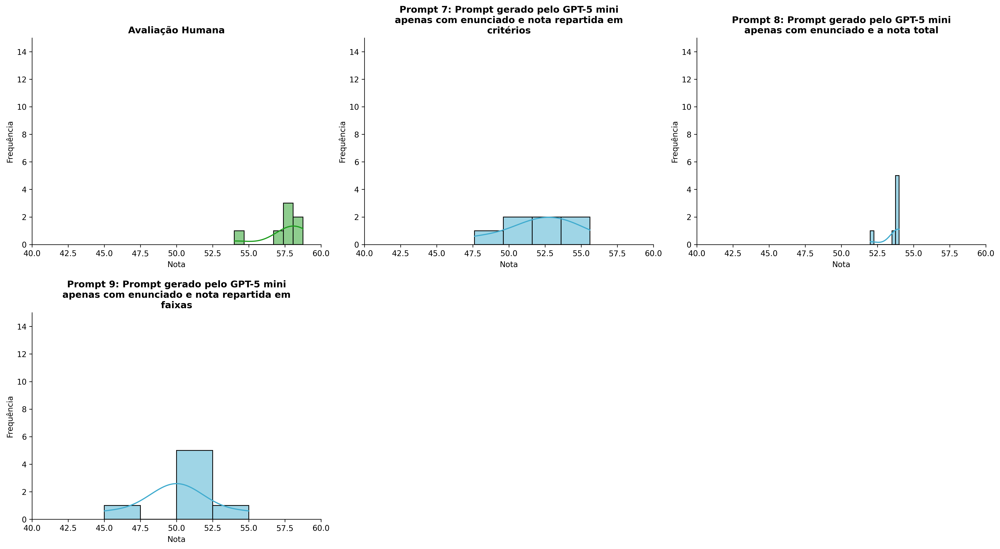
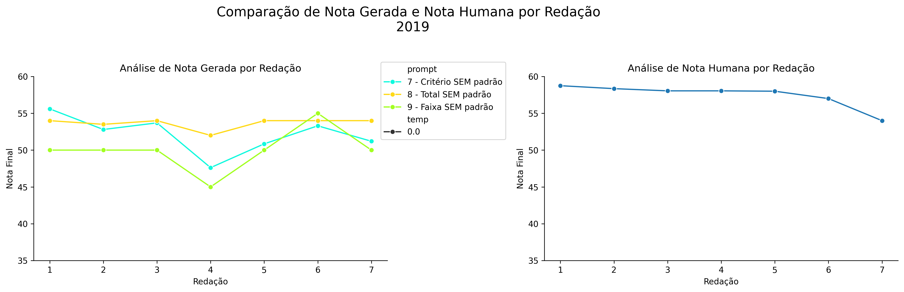
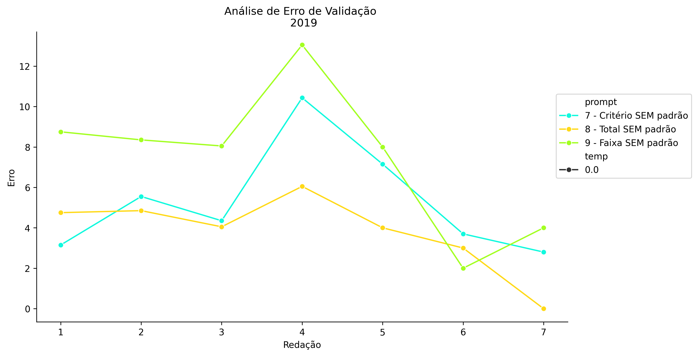
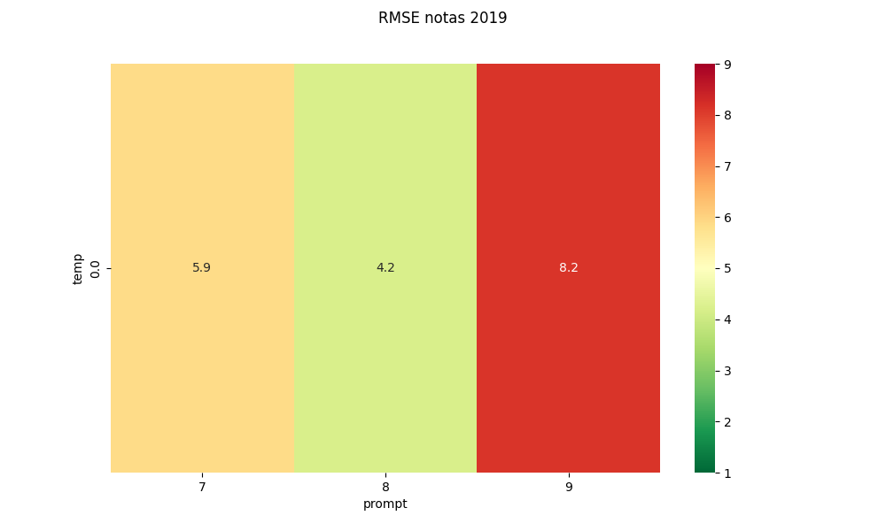
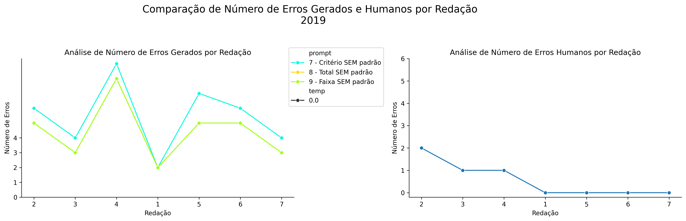
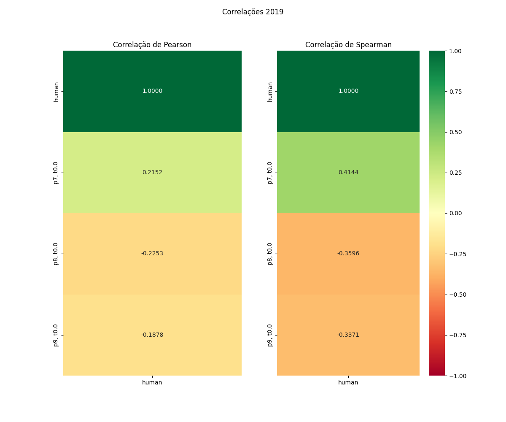

# Relatório de Avaliação: claude-opus-4-6 - 3 execuções
**Gerado em: 03/06/2026 00:09:41**

## 1. Distribuição de Notas
Nesta seção comparamos as notas atribuídas pelo modelo claude-opus-4-6 em diferentes prompts/temperaturas versus a correção humana.

## 2. Comparação de Notas Geradas e Humanas
Nesta seção, apresentamos a comparação entre as notas finais geradas pelo modelo e as notas dadas por avaliadores humanos.

## 3. Análise de Erro Absoluto de Validação

<table>
  <tr>
    <td>
      
    </td>
    <td>
      <table border="1" class="dataframe">
  <thead>
    <tr style="text-align: center;">
      <th>prompt</th>
      <th>temp</th>
      <th>area_sob_curva</th>
      <th>mae</th>
      <th>rmse</th>
    </tr>
  </thead>
  <tbody>
    <tr>
      <td>7</td>
      <td>0.0</td>
      <td>34.1583</td>
      <td>5.3048</td>
      <td>5.8695</td>
    </tr>
    <tr>
      <td>8</td>
      <td>0.0</td>
      <td>24.3250</td>
      <td>3.8143</td>
      <td>4.2104</td>
    </tr>
    <tr>
      <td>9</td>
      <td>0.0</td>
      <td>45.8250</td>
      <td>7.4571</td>
      <td>8.1538</td>
    </tr>
  </tbody>
</table>
    </td>
  </tr>
</table>

## 4. Análise de RMSE por Prompt e Temperatura
Nesta seção, apresentamos o heatmap de RMSE calculado por combinação de prompt e temperatura.

## 5. Análise de Erros Gramaticais
Comparação da sensibilidade do modelo na detecção/geração de erros em relação ao padrão humano.

## 6. Correlações

## Estatísticas Descritivas
### Modelo claude-opus-4-6
|       |   prompt |   temp |   redacao |   nota_final |   nota_final_std |       1A |       1B |       1C |     CGPL |   num_errors |
|:------|---------:|-------:|----------:|-------------:|-----------------:|---------:|---------:|---------:|---------:|-------------:|
| count | 21       |     21 |  21       |      21      |        21        | 7        | 7        | 7        |  7       |     21       |
| mean  |  8       |      0 |   4       |      51.9317 |         0.11651  | 8.57143  | 8.21429  | 7.80953  | 27.5571  |      4.7619  |
| std   |  0.83666 |      0 |   2.04939 |       2.6411 |         0.293738 | 0.607493 | 0.550371 | 0.766359 |  1.03458 |      2.04707 |
| min   |  7       |      0 |   1       |      45      |         0        | 7.5      | 7.5      | 6.5      | 25.95    |      2       |
| 25%   |  7       |      0 |   2       |      50      |         0        | 8.25     | 7.75     | 7.5      | 27.075   |      3       |
| 50%   |  8       |      0 |   4       |      52.8    |         0        | 9        | 8.5      | 8        | 27.3     |      5       |
| 75%   |  9       |      0 |   6       |      54      |         0        | 9        | 8.5      | 8.33335  | 28.2     |      6       |
| max   |  9       |      0 |   7       |      55.6    |         0.866    | 9        | 9        | 8.5      | 29.1     |      9       |

### Humano
|       |   redacao |   nota_final |   num_errors |
|:------|----------:|-------------:|-------------:|
| count |   7       |      7       |     7        |
| mean  |   4       |     57.4571  |     0.571429 |
| std   |   2.16025 |      1.61385 |     0.786796 |
| min   |   1       |     54       |     0        |
| 25%   |   2.5     |     57.5     |     0        |
| 50%   |   4       |     58.05    |     0        |
| 75%   |   5.5     |     58.2     |     1        |
| max   |   7       |     58.75    |     2        |
