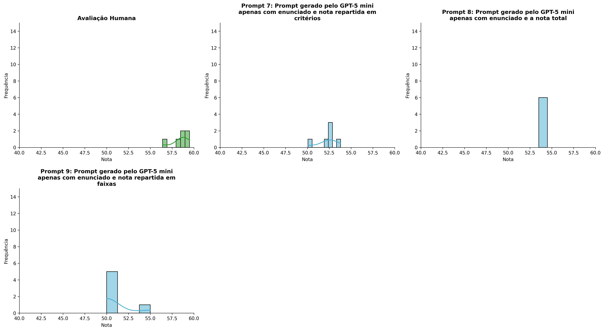
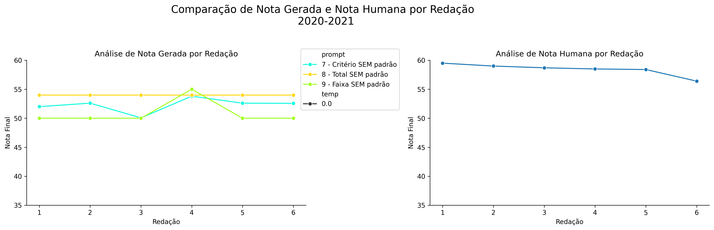
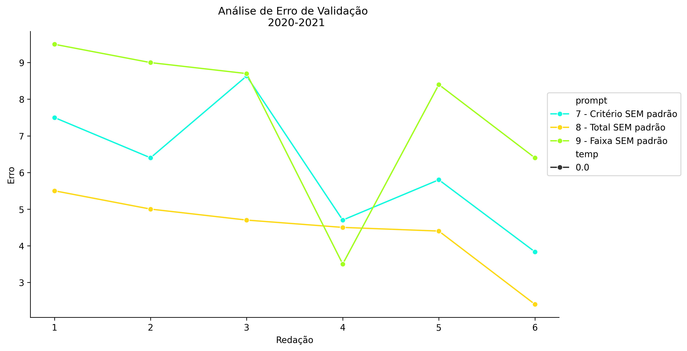
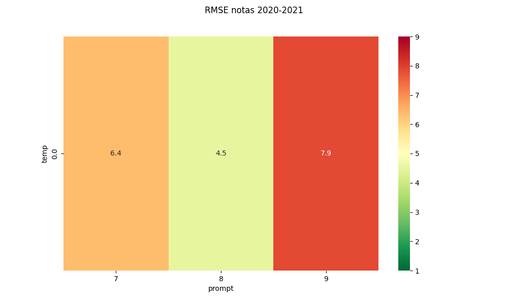
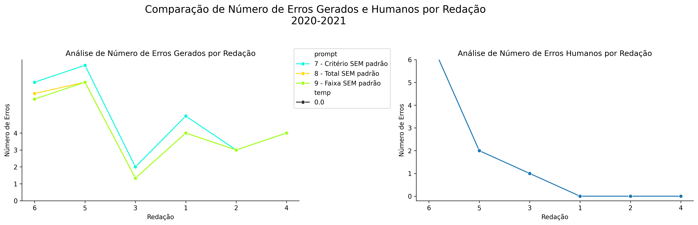
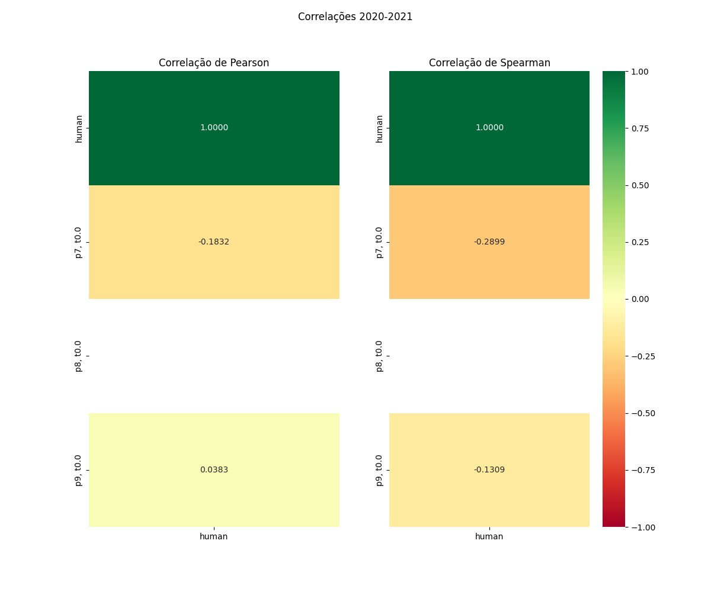

# Relatório de Avaliação: claude-opus-4-6 - 3 execuções
**Gerado em: 03/06/2026 00:09:50**

## 1. Distribuição de Notas
Nesta seção comparamos as notas atribuídas pelo modelo claude-opus-4-6 em diferentes prompts/temperaturas versus a correção humana.

## 2. Comparação de Notas Geradas e Humanas
Nesta seção, apresentamos a comparação entre as notas finais geradas pelo modelo e as notas dadas por avaliadores humanos.

## 3. Análise de Erro Absoluto de Validação

<table>
  <tr>
    <td>
      
    </td>
    <td>
      <table border="1" class="dataframe">
  <thead>
    <tr style="text-align: center;">
      <th>prompt</th>
      <th>temp</th>
      <th>area_sob_curva</th>
      <th>mae</th>
      <th>rmse</th>
    </tr>
  </thead>
  <tbody>
    <tr>
      <td>7</td>
      <td>0.0</td>
      <td>31.20</td>
      <td>6.1444</td>
      <td>6.3531</td>
    </tr>
    <tr>
      <td>8</td>
      <td>0.0</td>
      <td>22.55</td>
      <td>4.4167</td>
      <td>4.5224</td>
    </tr>
    <tr>
      <td>9</td>
      <td>0.0</td>
      <td>37.55</td>
      <td>7.5833</td>
      <td>7.8603</td>
    </tr>
  </tbody>
</table>
    </td>
  </tr>
</table>

## 4. Análise de RMSE por Prompt e Temperatura
Nesta seção, apresentamos o heatmap de RMSE calculado por combinação de prompt e temperatura.

## 5. Análise de Erros Gramaticais
Comparação da sensibilidade do modelo na detecção/geração de erros em relação ao padrão humano.

## 6. Correlações

## Estatísticas Descritivas
### Modelo claude-opus-4-6
|       |    prompt |   temp |   redacao |   nota_final |   nota_final_std |       1A |       1B |       1C |      CGPL |   num_errors |
|:------|----------:|-------:|----------:|-------------:|-----------------:|---------:|---------:|---------:|----------:|-------------:|
| count | 18        |     18 |  18       |     18       |        18        | 6        | 6        |  6       |  6        |     18       |
| mean  |  8        |      0 |   3.5     |     52.3685  |         0.121972 | 8.91667  | 8.58333  | 16.2222  | 18.55     |      4.44444 |
| std   |  0.840168 |      0 |   1.75734 |      1.85622 |         0.355528 | 0.139435 | 0.502755 |  1.04705 |  0.694982 |      2.04524 |
| min   |  7        |      0 |   1       |     50       |         0        | 8.6667   | 7.6667   | 14.3333  | 17.6      |      1.3333  |
| 25%   |  7        |      0 |   2       |     50.0167  |         0        | 8.87497  | 8.5      | 16       | 18.05     |      3       |
| 50%   |  8        |      0 |   3.5     |     52.6     |         0        | 9        | 8.66665  | 16.5     | 18.65     |      4       |
| 75%   |  9        |      0 |   5       |     54       |         0        | 9        | 8.95833  | 17       | 19.025    |      6.24998 |
| max   |  9        |      0 |   6       |     55       |         1.1547   | 9        | 9        | 17       | 19.4      |      8       |

### Humano
|       |   redacao |   nota_final |   num_errors |
|:------|----------:|-------------:|-------------:|
| count |   6       |      6       |      6       |
| mean  |   3.5     |     58.4167  |      1.66667 |
| std   |   1.87083 |      1.06474 |      2.73252 |
| min   |   1       |     56.4     |      0       |
| 25%   |   2.25    |     58.425   |      0       |
| 50%   |   3.5     |     58.6     |      0.5     |
| 75%   |   4.75    |     58.925   |      1.75    |
| max   |   6       |     59.5     |      7       |
