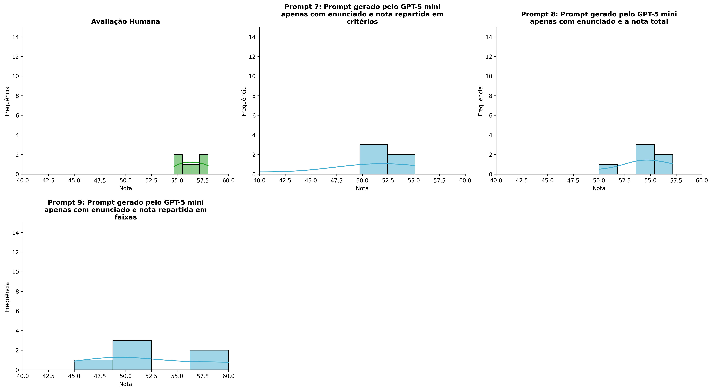
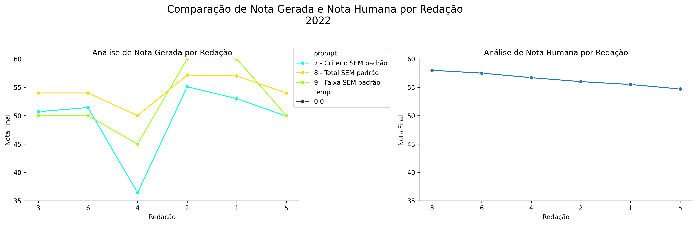
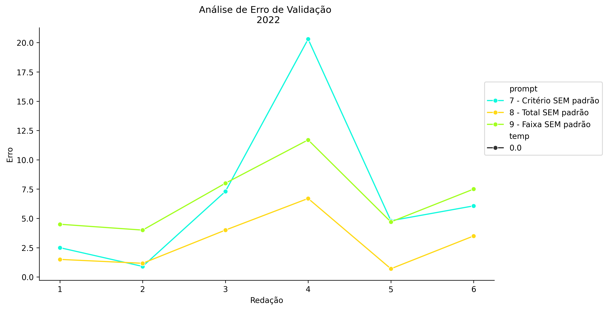
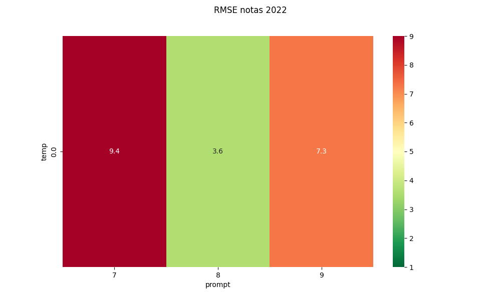
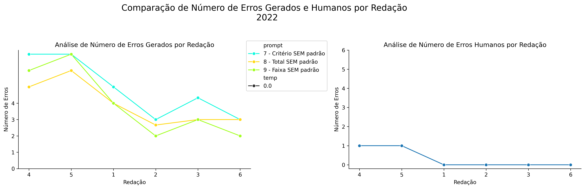
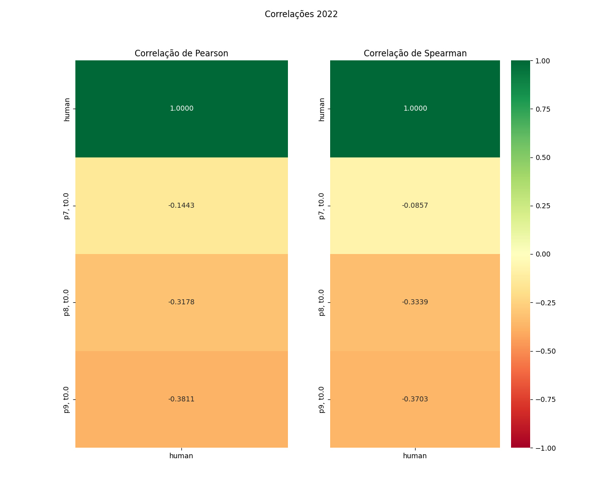

# Relatório de Avaliação: claude-opus-4-6 - 3 execuções
**Gerado em: 03/06/2026 00:10:00**

## 1. Distribuição de Notas
Nesta seção comparamos as notas atribuídas pelo modelo claude-opus-4-6 em diferentes prompts/temperaturas versus a correção humana.

## 2. Comparação de Notas Geradas e Humanas
Nesta seção, apresentamos a comparação entre as notas finais geradas pelo modelo e as notas dadas por avaliadores humanos.

## 3. Análise de Erro Absoluto de Validação

<table>
  <tr>
    <td>
      
    </td>
    <td>
      <table border="1" class="dataframe">
  <thead>
    <tr style="text-align: center;">
      <th>prompt</th>
      <th>temp</th>
      <th>area_sob_curva</th>
      <th>mae</th>
      <th>rmse</th>
    </tr>
  </thead>
  <tbody>
    <tr>
      <td>7</td>
      <td>0.0</td>
      <td>37.5834</td>
      <td>6.9778</td>
      <td>9.4188</td>
    </tr>
    <tr>
      <td>8</td>
      <td>0.0</td>
      <td>15.0667</td>
      <td>2.9278</td>
      <td>3.5880</td>
    </tr>
    <tr>
      <td>9</td>
      <td>0.0</td>
      <td>34.4000</td>
      <td>6.7333</td>
      <td>7.2512</td>
    </tr>
  </tbody>
</table>
    </td>
  </tr>
</table>

## 4. Análise de RMSE por Prompt e Temperatura
Nesta seção, apresentamos o heatmap de RMSE calculado por combinação de prompt e temperatura.

## 5. Análise de Erros Gramaticais
Comparação da sensibilidade do modelo na detecção/geração de erros em relação ao padrão humano.

## 6. Correlações

## Estatísticas Descritivas
### Modelo claude-opus-4-6
|       |    prompt |   temp |   redacao |   nota_final |   nota_final_std |       1A |      1B |       1C |     CGPL |   num_errors |
|:------|----------:|-------:|----------:|-------------:|-----------------:|---------:|--------:|---------:|---------:|-------------:|
| count | 18        |     18 |  18       |     18       |       18         | 6        | 6       |  6       |  6       |     18       |
| mean  |  8        |      0 |   3.5     |     52.0944  |        0.0577389 | 8.91667  | 8.75    | 16.6111  | 15.1445  |      4.27778 |
| std   |  0.840168 |      0 |   1.75734 |      5.51429 |        0.150827  | 0.491596 | 1.12916 |  2.33968 |  2.72027 |      1.72354 |
| min   |  7        |      0 |   1       |     36.4     |        0         | 8        | 6.5     | 12       |  9.9     |      2       |
| 25%   |  7        |      0 |   2       |     50       |        0         | 9        | 9       | 17       | 15.1     |      3       |
| 50%   |  8        |      0 |   3.5     |     52.2167  |        0         | 9        | 9       | 17.0833  | 15.9833  |      4       |
| 75%   |  9        |      0 |   5       |     54.825   |        0         | 9        | 9.375   | 17.7917  | 16.4417  |      5.75    |
| max   |  9        |      0 |   6       |     60       |        0.5774    | 9.5      | 9.5     | 18.5     | 17.6     |      7       |

### Humano
|       |   redacao |   nota_final |        1A |        1B |        1C |      CGPL |   num_errors |
|:------|----------:|-------------:|----------:|----------:|----------:|----------:|-------------:|
| count |   6       |      6       |  6        |  6        |  6        |  6        |     6        |
| mean  |   3.5     |     56.4     |  9.75     |  9.75     | 18.5      | 18.4      |     0.333333 |
| std   |   1.87083 |      1.24258 |  0.273861 |  0.273861 |  0.447214 |  0.532917 |     0.516398 |
| min   |   1       |     54.7     |  9.5      |  9.5      | 18        | 17.7      |     0        |
| 25%   |   2.25    |     55.625   |  9.5      |  9.5      | 18.125    | 18.05     |     0        |
| 50%   |   3.5     |     56.35    |  9.75     |  9.75     | 18.5      | 18.35     |     0        |
| 75%   |   4.75    |     57.3     | 10        | 10        | 18.875    | 18.875    |     0.75     |
| max   |   6       |     58       | 10        | 10        | 19        | 19        |     1        |
