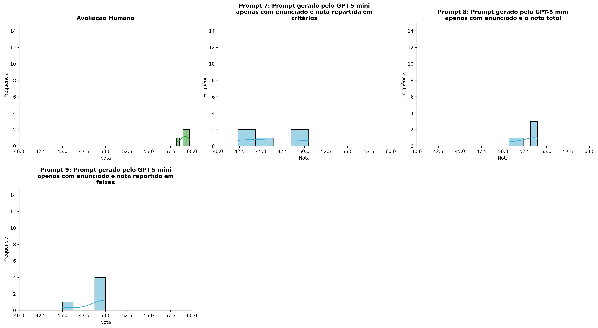
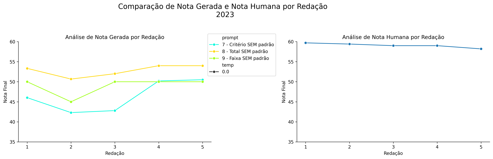
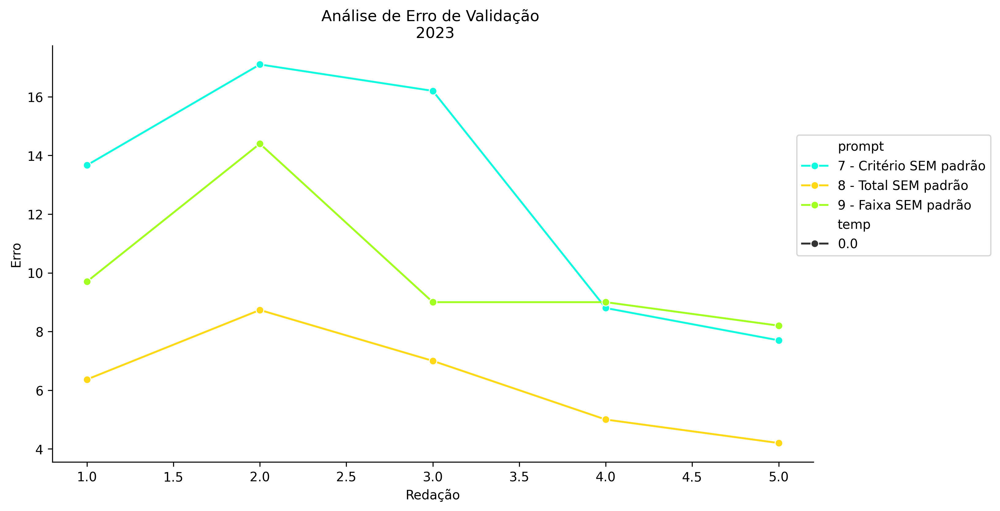
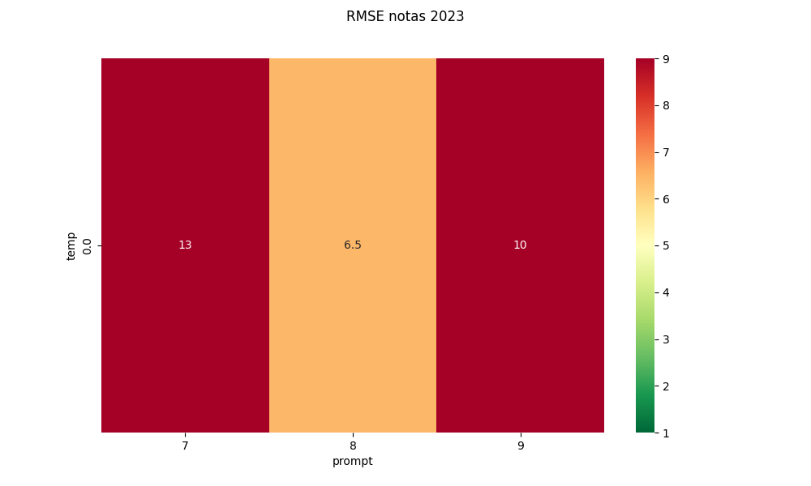
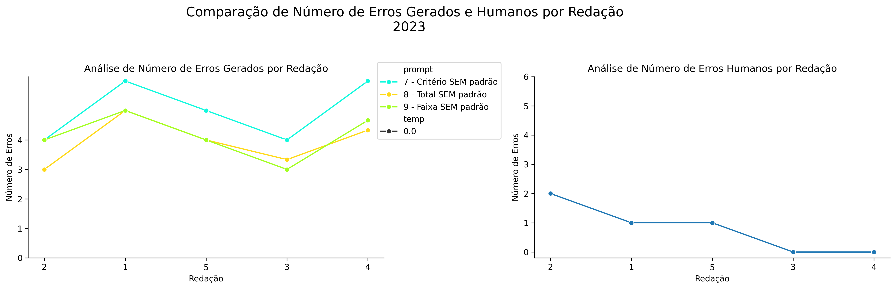
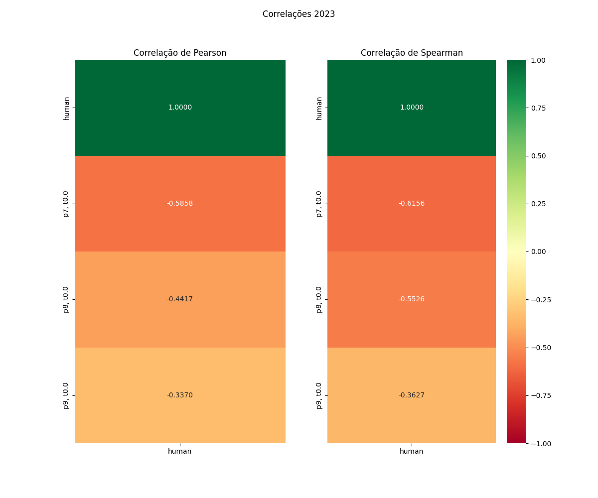

# Relatório de Avaliação: claude-opus-4-6 - 3 execuções
**Gerado em: 03/06/2026 00:10:09**

## 1. Distribuição de Notas
Nesta seção comparamos as notas atribuídas pelo modelo claude-opus-4-6 em diferentes prompts/temperaturas versus a correção humana.

## 2. Comparação de Notas Geradas e Humanas
Nesta seção, apresentamos a comparação entre as notas finais geradas pelo modelo e as notas dadas por avaliadores humanos.

## 3. Análise de Erro Absoluto de Validação

<table>
  <tr>
    <td>
      
    </td>
    <td>
      <table border="1" class="dataframe">
  <thead>
    <tr style="text-align: center;">
      <th>prompt</th>
      <th>temp</th>
      <th>area_sob_curva</th>
      <th>mae</th>
      <th>rmse</th>
    </tr>
  </thead>
  <tbody>
    <tr>
      <td>7</td>
      <td>0.0</td>
      <td>52.7834</td>
      <td>12.6933</td>
      <td>13.2541</td>
    </tr>
    <tr>
      <td>8</td>
      <td>0.0</td>
      <td>26.0167</td>
      <td>6.2600</td>
      <td>6.4567</td>
    </tr>
    <tr>
      <td>9</td>
      <td>0.0</td>
      <td>41.3500</td>
      <td>10.0600</td>
      <td>10.3023</td>
    </tr>
  </tbody>
</table>
    </td>
  </tr>
</table>

## 4. Análise de RMSE por Prompt e Temperatura
Nesta seção, apresentamos o heatmap de RMSE calculado por combinação de prompt e temperatura.

## 5. Análise de Erros Gramaticais
Comparação da sensibilidade do modelo na detecção/geração de erros em relação ao padrão humano.

## 6. Correlações

## Estatísticas Descritivas
### Modelo claude-opus-4-6
|       |    prompt |   temp |   redacao |   nota_final |   nota_final_std |      1A |       1B |       1C |     CGPL |   num_errors |
|:------|----------:|-------:|----------:|-------------:|-----------------:|--------:|---------:|---------:|---------:|-------------:|
| count | 15        |     15 |  15       |     15       |        15        | 5       | 5        |  5       |  5       |    15        |
| mean  |  8        |      0 |   3       |     49.3889  |         0.23094  | 8.6     | 8.2      | 15.5333  | 14.0333  |     4.35555  |
| std   |  0.845154 |      0 |   1.46385 |      3.72356 |         0.478091 | 0.41833 | 0.758288 |  1.50185 |  1.28279 |     0.929815 |
| min   |  7        |      0 |   1       |     42.3     |         0        | 8       | 7.5      | 14       | 12.8     |     3        |
| 25%   |  7        |      0 |   2       |     48.0166  |         0        | 8.5     | 7.5      | 14       | 12.8     |     4        |
| 50%   |  8        |      0 |   3       |     50       |         0        | 8.5     | 8        | 15.6667  | 13.8667  |     4        |
| 75%   |  9        |      0 |   4       |     51.3333  |         0        | 9       | 9        | 17       | 15.2     |     5        |
| max   |  9        |      0 |   5       |     54       |         1.1547   | 9       | 9        | 17       | 15.5     |     6        |

### Humano
|       |   redacao |   nota_final |   num_errors |
|:------|----------:|-------------:|-------------:|
| count |   5       |     5        |      5       |
| mean  |   3       |    59.06     |      0.8     |
| std   |   1.58114 |     0.563915 |      0.83666 |
| min   |   1       |    58.2      |      0       |
| 25%   |   2       |    59        |      0       |
| 50%   |   3       |    59        |      1       |
| 75%   |   4       |    59.4      |      1       |
| max   |   5       |    59.7      |      2       |
