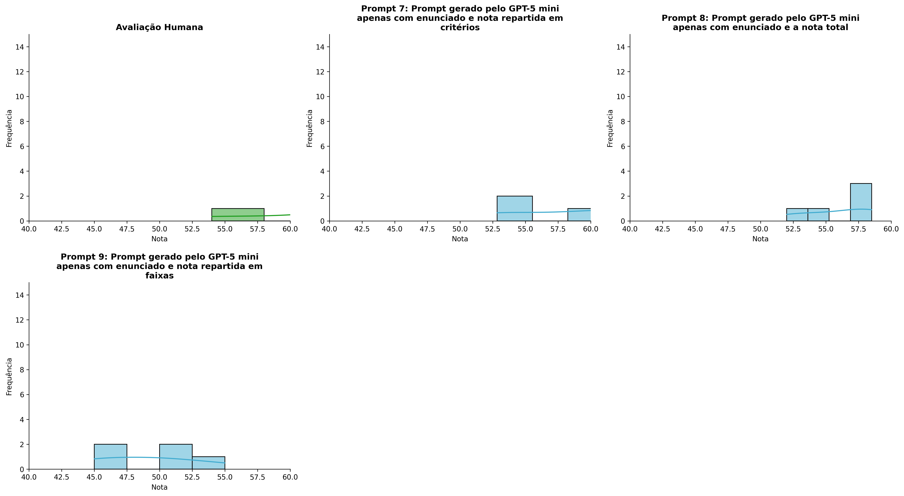
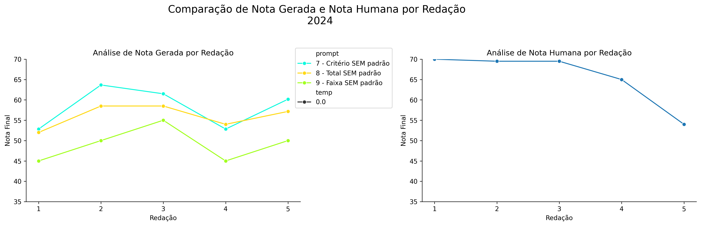
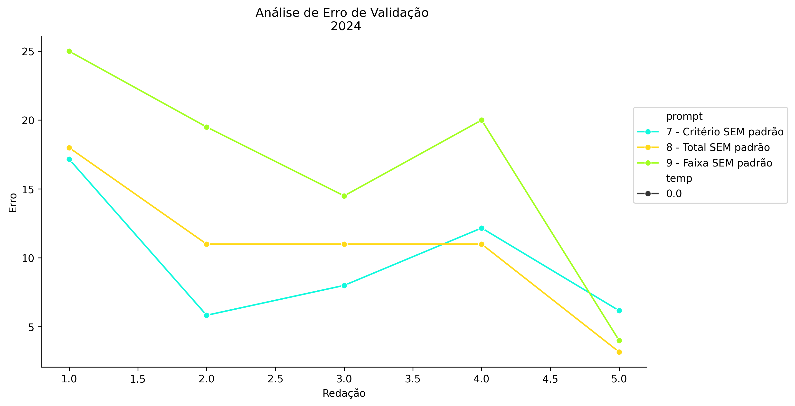
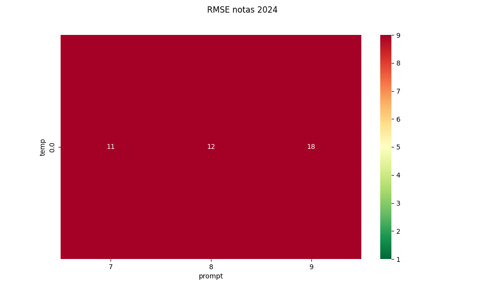
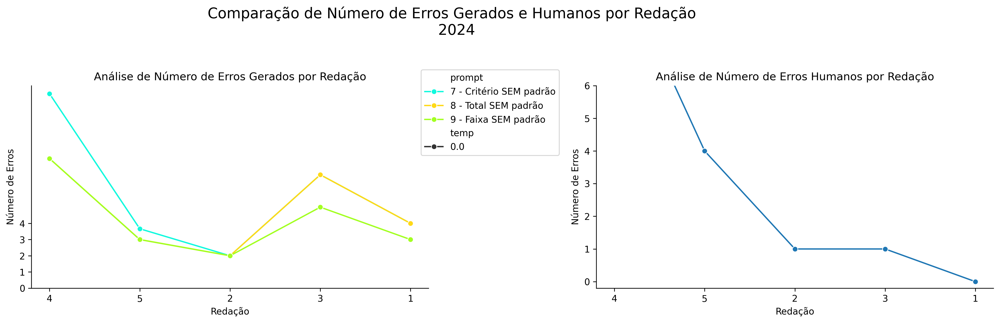
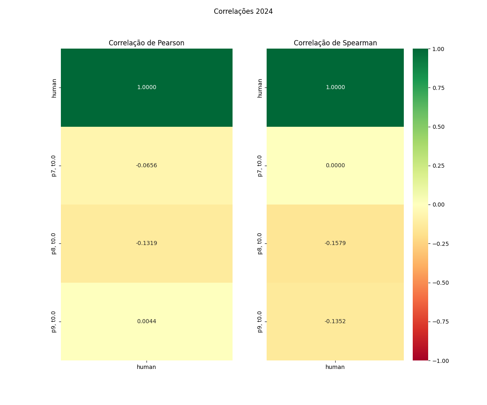

# Relatório de Avaliação: claude-opus-4-6 - 3 execuções
**Gerado em: 03/06/2026 00:10:18**

## 1. Distribuição de Notas
Nesta seção comparamos as notas atribuídas pelo modelo claude-opus-4-6 em diferentes prompts/temperaturas versus a correção humana.

## 2. Comparação de Notas Geradas e Humanas
Nesta seção, apresentamos a comparação entre as notas finais geradas pelo modelo e as notas dadas por avaliadores humanos.

## 3. Análise de Erro Absoluto de Validação

<table>
  <tr>
    <td>
      
    </td>
    <td>
      <table border="1" class="dataframe">
  <thead>
    <tr style="text-align: center;">
      <th>prompt</th>
      <th>temp</th>
      <th>area_sob_curva</th>
      <th>mae</th>
      <th>rmse</th>
    </tr>
  </thead>
  <tbody>
    <tr>
      <td>7</td>
      <td>0.0</td>
      <td>37.6667</td>
      <td>9.8667</td>
      <td>10.7590</td>
    </tr>
    <tr>
      <td>8</td>
      <td>0.0</td>
      <td>43.5833</td>
      <td>10.8333</td>
      <td>11.8070</td>
    </tr>
    <tr>
      <td>9</td>
      <td>0.0</td>
      <td>68.5000</td>
      <td>16.6000</td>
      <td>18.0638</td>
    </tr>
  </tbody>
</table>
    </td>
  </tr>
</table>

## 4. Análise de RMSE por Prompt e Temperatura
Nesta seção, apresentamos o heatmap de RMSE calculado por combinação de prompt e temperatura.

## 5. Análise de Erros Gramaticais
Comparação da sensibilidade do modelo na detecção/geração de erros em relação ao padrão humano.

## 6. Correlações

## Estatísticas Descritivas
### Modelo claude-opus-4-6
|       |    prompt |   temp |   redacao |   nota_final |   nota_final_std |       1A |      1B |       1C |     CGPL |   num_errors |
|:------|----------:|-------:|----------:|-------------:|-----------------:|---------:|--------:|---------:|---------:|-------------:|
| count | 15        |     15 |  15       |     15       |        15        | 5        | 5       |  5       |  5       |     15       |
| mean  |  8        |      0 |   3       |     54.4111  |         0.230947 | 8.36666  | 8.23332 | 19.4667  | 22.1333  |      4.91111 |
| std   |  0.845154 |      0 |   1.46385 |      5.58978 |         0.411157 | 0.711036 | 0.91744 |  2.65204 |  1.96992 |      2.899   |
| min   |  7        |      0 |   1       |     45       |         0        | 7.3333   | 6.8333  | 15.6667  | 19       |      2       |
| 25%   |  7        |      0 |   2       |     51       |         0        | 8        | 7.8333  | 18       | 21.5     |      3       |
| 50%   |  8        |      0 |   3       |     54       |         0        | 8.5      | 8.5     | 20       | 23       |      4       |
| 75%   |  9        |      0 |   4       |     58.5     |         0.2887   | 9        | 9       | 21.6667  | 23.1667  |      7       |
| max   |  9        |      0 |   5       |     63.6667  |         1.1547   | 9        | 9       | 22       | 24       |     12       |

### Humano
|       |   redacao |   nota_final |   num_errors |
|:------|----------:|-------------:|-------------:|
| count |   5       |      5       |      5       |
| mean  |   3       |     65.6     |      3.2     |
| std   |   1.58114 |      6.79522 |      4.08656 |
| min   |   1       |     54       |      0       |
| 25%   |   2       |     65       |      1       |
| 50%   |   3       |     69.5     |      1       |
| 75%   |   4       |     69.5     |      4       |
| max   |   5       |     70       |     10       |
