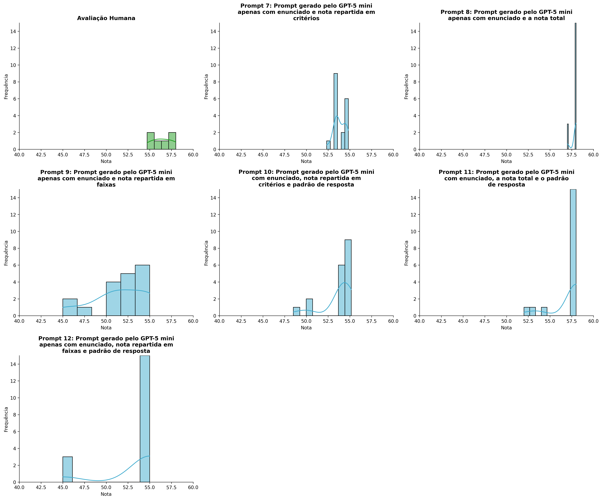
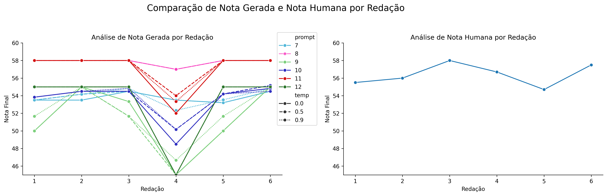
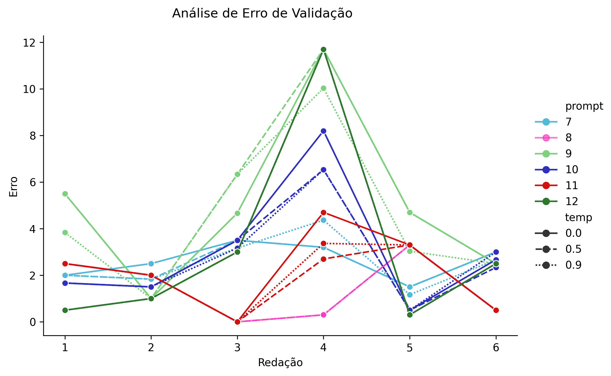
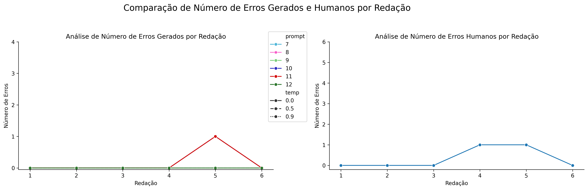

# Relatório de Avaliação: command-a-03-2025 - 3 execuções
**Gerado em: 26/01/2026 17:26:38**

## 1. Distribuição de Notas
Nesta seção comparamos as notas atribuídas pelo modelo command-a em diferentes prompts/temperaturas versus a correção humana.

## 2. Comparação de Notas Geradas e Humanas
Nesta seção, apresentamos a comparação entre as notas finais geradas pelo modelo e as notas dadas por avaliadores humanos.

## 3. Análise de Erro Absoluto de Validação

<table>
  <tr>
    <td>
      
    </td>
    <td>
      <table border="1" class="dataframe">
  <thead>
    <tr style="text-align: center;">
      <th>prompt</th>
      <th>temp</th>
      <th>area_sob_curva</th>
      <th>mae</th>
      <th>rmse</th>
    </tr>
  </thead>
  <tbody>
    <tr>
      <td>7</td>
      <td>0.0</td>
      <td>13.2000</td>
      <td>2.6167</td>
      <td>2.7077</td>
    </tr>
    <tr>
      <td>7</td>
      <td>0.5</td>
      <td>12.5333</td>
      <td>2.5056</td>
      <td>2.6173</td>
    </tr>
    <tr>
      <td>7</td>
      <td>0.9</td>
      <td>12.8668</td>
      <td>2.5334</td>
      <td>2.7365</td>
    </tr>
    <tr>
      <td>8</td>
      <td>0.0</td>
      <td>7.1000</td>
      <td>1.4333</td>
      <td>1.8921</td>
    </tr>
    <tr>
      <td>8</td>
      <td>0.5</td>
      <td>7.1000</td>
      <td>1.4333</td>
      <td>1.8921</td>
    </tr>
    <tr>
      <td>8</td>
      <td>0.9</td>
      <td>7.1000</td>
      <td>1.4333</td>
      <td>1.8921</td>
    </tr>
    <tr>
      <td>9</td>
      <td>0.0</td>
      <td>26.0667</td>
      <td>5.0111</td>
      <td>6.0313</td>
    </tr>
    <tr>
      <td>9</td>
      <td>0.5</td>
      <td>27.7333</td>
      <td>5.2889</td>
      <td>6.2795</td>
    </tr>
    <tr>
      <td>9</td>
      <td>0.9</td>
      <td>23.5666</td>
      <td>4.4555</td>
      <td>5.3529</td>
    </tr>
    <tr>
      <td>10</td>
      <td>0.0</td>
      <td>15.8667</td>
      <td>3.0056</td>
      <td>3.9132</td>
    </tr>
    <tr>
      <td>10</td>
      <td>0.5</td>
      <td>14.0333</td>
      <td>2.6722</td>
      <td>3.3080</td>
    </tr>
    <tr>
      <td>10</td>
      <td>0.9</td>
      <td>14.0334</td>
      <td>2.7278</td>
      <td>3.3414</td>
    </tr>
    <tr>
      <td>11</td>
      <td>0.0</td>
      <td>11.5000</td>
      <td>2.1667</td>
      <td>2.6920</td>
    </tr>
    <tr>
      <td>11</td>
      <td>0.5</td>
      <td>9.5000</td>
      <td>1.8333</td>
      <td>2.1863</td>
    </tr>
    <tr>
      <td>11</td>
      <td>0.9</td>
      <td>10.1667</td>
      <td>1.9444</td>
      <td>2.3354</td>
    </tr>
    <tr>
      <td>12</td>
      <td>0.0</td>
      <td>17.5000</td>
      <td>3.1667</td>
      <td>5.0577</td>
    </tr>
    <tr>
      <td>12</td>
      <td>0.5</td>
      <td>17.5000</td>
      <td>3.1667</td>
      <td>5.0577</td>
    </tr>
    <tr>
      <td>12</td>
      <td>0.9</td>
      <td>17.5000</td>
      <td>3.1667</td>
      <td>5.0577</td>
    </tr>
  </tbody>
</table>
    </td>
  </tr>
</table>

## 4. Análise de Erros Gramaticais
Comparação da sensibilidade do modelo na detecção/geração de erros em relação ao padrão humano.

## 5. Correlação de Pearson
|           |      human |   p7, t0.0 |   p7, t0.5 |   p7, t0.9 |   p8, t0.0 |   p8, t0.5 |   p8, t0.9 |   p9, t0.0 |   p9, t0.5 |   p9, t0.9 |   p10, t0.0 |   p10, t0.5 |   p10, t0.9 |   p11, t0.0 |   p11, t0.5 |   p11, t0.9 |   p12, t0.0 |   p12, t0.5 |   p12, t0.9 |
|:----------|-----------:|-----------:|-----------:|-----------:|-----------:|-----------:|-----------:|-----------:|-----------:|-----------:|------------:|------------:|------------:|------------:|------------:|------------:|------------:|------------:|------------:|
| human     |  1         |   0.910979 |   0.837222 |   0.493497 |  -0.118278 |  -0.118278 |  -0.118278 |   0.305706 |   0.20022  |  0.0438597 |  -0.0214946 |   0.0486238 |   0.0315776 |   -0.118278 |   -0.118278 |   -0.118278 |   -0.118278 |   -0.118278 |   -0.118278 |
| p7, t0.0  |  0.910979  |   1        |   0.884585 |   0.751178 |   0.244737 |   0.244737 |   0.244737 |   0.545457 |   0.449102 |  0.329923  |   0.335382  |   0.405696  |   0.368873  |    0.244737 |    0.244737 |    0.244737 |    0.244737 |    0.244737 |    0.244737 |
| p7, t0.5  |  0.837222  |   0.884585 |   1        |   0.826984 |   0.341503 |   0.341503 |   0.341503 |   0.767108 |   0.694408 |  0.566133  |   0.443753  |   0.507792  |   0.481191  |    0.341503 |    0.341503 |    0.341503 |    0.341503 |    0.341503 |    0.341503 |
| p7, t0.9  |  0.493497  |   0.751178 |   0.826984 |   1        |   0.786974 |   0.786974 |   0.786974 |   0.934622 |   0.871916 |  0.814598  |   0.853847  |   0.889151  |   0.875386  |    0.786974 |    0.786974 |    0.786974 |    0.786974 |    0.786974 |    0.786974 |
| p8, t0.0  | -0.118278  |   0.244737 |   0.341503 |   0.786974 |   1        |   1        |   1        |   0.810643 |   0.798024 |  0.845491  |   0.99031   |   0.969846  |   0.981365  |    1        |    1        |    1        |    1        |    1        |    1        |
| p8, t0.5  | -0.118278  |   0.244737 |   0.341503 |   0.786974 |   1        |   1        |   1        |   0.810643 |   0.798024 |  0.845491  |   0.99031   |   0.969846  |   0.981365  |    1        |    1        |    1        |    1        |    1        |    1        |
| p8, t0.9  | -0.118278  |   0.244737 |   0.341503 |   0.786974 |   1        |   1        |   1        |   0.810643 |   0.798024 |  0.845491  |   0.99031   |   0.969846  |   0.981365  |    1        |    1        |    1        |    1        |    1        |    1        |
| p9, t0.0  |  0.305706  |   0.545457 |   0.767108 |   0.934622 |   0.810643 |   0.810643 |   0.810643 |   1        |   0.984434 |  0.948882  |   0.874577  |   0.905231  |   0.878421  |    0.810643 |    0.810643 |    0.810643 |    0.810643 |    0.810643 |    0.810643 |
| p9, t0.5  |  0.20022   |   0.449102 |   0.694408 |   0.871916 |   0.798024 |   0.798024 |   0.798024 |   0.984434 |   1        |  0.984639  |   0.859526  |   0.893502  |   0.845101  |    0.798024 |    0.798024 |    0.798024 |    0.798024 |    0.798024 |    0.798024 |
| p9, t0.9  |  0.0438597 |   0.329923 |   0.566133 |   0.814598 |   0.845491 |   0.845491 |   0.845491 |   0.948882 |   0.984639 |  1         |   0.890119  |   0.915338  |   0.861298  |    0.845491 |    0.845491 |    0.845491 |    0.845491 |    0.845491 |    0.845491 |
| p10, t0.0 | -0.0214946 |   0.335382 |   0.443753 |   0.853847 |   0.99031  |   0.99031  |   0.99031  |   0.874577 |   0.859526 |  0.890119  |   1         |   0.993451  |   0.993297  |    0.99031  |    0.99031  |    0.99031  |    0.99031  |    0.99031  |    0.99031  |
| p10, t0.5 |  0.0486238 |   0.405696 |   0.507792 |   0.889151 |   0.969846 |   0.969846 |   0.969846 |   0.905231 |   0.893502 |  0.915338  |   0.993451  |   1         |   0.983318  |    0.969846 |    0.969846 |    0.969846 |    0.969846 |    0.969846 |    0.969846 |
| p10, t0.9 |  0.0315776 |   0.368873 |   0.481191 |   0.875386 |   0.981365 |   0.981365 |   0.981365 |   0.878421 |   0.845101 |  0.861298  |   0.993297  |   0.983318  |   1         |    0.981365 |    0.981365 |    0.981365 |    0.981365 |    0.981365 |    0.981365 |
| p11, t0.0 | -0.118278  |   0.244737 |   0.341503 |   0.786974 |   1        |   1        |   1        |   0.810643 |   0.798024 |  0.845491  |   0.99031   |   0.969846  |   0.981365  |    1        |    1        |    1        |    1        |    1        |    1        |
| p11, t0.5 | -0.118278  |   0.244737 |   0.341503 |   0.786974 |   1        |   1        |   1        |   0.810643 |   0.798024 |  0.845491  |   0.99031   |   0.969846  |   0.981365  |    1        |    1        |    1        |    1        |    1        |    1        |
| p11, t0.9 | -0.118278  |   0.244737 |   0.341503 |   0.786974 |   1        |   1        |   1        |   0.810643 |   0.798024 |  0.845491  |   0.99031   |   0.969846  |   0.981365  |    1        |    1        |    1        |    1        |    1        |    1        |
| p12, t0.0 | -0.118278  |   0.244737 |   0.341503 |   0.786974 |   1        |   1        |   1        |   0.810643 |   0.798024 |  0.845491  |   0.99031   |   0.969846  |   0.981365  |    1        |    1        |    1        |    1        |    1        |    1        |
| p12, t0.5 | -0.118278  |   0.244737 |   0.341503 |   0.786974 |   1        |   1        |   1        |   0.810643 |   0.798024 |  0.845491  |   0.99031   |   0.969846  |   0.981365  |    1        |    1        |    1        |    1        |    1        |    1        |
| p12, t0.9 | -0.118278  |   0.244737 |   0.341503 |   0.786974 |   1        |   1        |   1        |   0.810643 |   0.798024 |  0.845491  |   0.99031   |   0.969846  |   0.981365  |    1        |    1        |    1        |    1        |    1        |    1        |

## 6. Correlação de Spearman
|           |     human |   p7, t0.0 |   p7, t0.5 |   p7, t0.9 |   p8, t0.0 |   p8, t0.5 |   p8, t0.9 |   p9, t0.0 |   p9, t0.5 |   p9, t0.9 |   p10, t0.0 |   p10, t0.5 |   p10, t0.9 |   p11, t0.0 |   p11, t0.5 |   p11, t0.9 |   p12, t0.0 |   p12, t0.5 |   p12, t0.9 |
|:----------|----------:|-----------:|-----------:|-----------:|-----------:|-----------:|-----------:|-----------:|-----------:|-----------:|------------:|------------:|------------:|------------:|------------:|------------:|------------:|------------:|------------:|
| human     |  1        |   0.92582  |   0.882735 |   0.579771 |  -0.130931 |  -0.130931 |  -0.130931 |   0.353094 |   0.353094 |   0.092582 |    0.463817 |    0.463817 |    0.550782 |   -0.130931 |   -0.130931 |   -0.130931 |   -0.130931 |   -0.130931 |   -0.130931 |
| p7, t0.0  |  0.92582  |   1        |   0.953463 |   0.688847 |   0.141421 |   0.141421 |   0.141421 |   0.524404 |   0.524404 |   0.316667 |    0.610569 |    0.610569 |    0.610569 |    0.141421 |    0.141421 |    0.141421 |    0.141421 |    0.141421 |    0.141421 |
| p7, t0.5  |  0.882735 |   0.953463 |   1        |   0.80606  |   0.26968  |   0.26968  |   0.26968  |   0.727273 |   0.727273 |   0.524404 |    0.761279 |    0.761279 |    0.761279 |    0.26968  |    0.26968  |    0.26968  |    0.26968  |    0.26968  |    0.26968  |
| p7, t0.9  |  0.579771 |   0.688847 |   0.80606  |   1        |   0.664211 |   0.664211 |   0.664211 |   0.850841 |   0.850841 |   0.704502 |    0.955882 |    0.955882 |    0.955882 |    0.664211 |    0.664211 |    0.664211 |    0.664211 |    0.664211 |    0.664211 |
| p8, t0.0  | -0.130931 |   0.141421 |   0.26968  |   0.664211 |   1        |   1        |   1        |   0.6742   |   0.6742   |   0.707107 |    0.664211 |    0.664211 |    0.664211 |    1        |    1        |    1        |    1        |    1        |    1        |
| p8, t0.5  | -0.130931 |   0.141421 |   0.26968  |   0.664211 |   1        |   1        |   1        |   0.6742   |   0.6742   |   0.707107 |    0.664211 |    0.664211 |    0.664211 |    1        |    1        |    1        |    1        |    1        |    1        |
| p8, t0.9  | -0.130931 |   0.141421 |   0.26968  |   0.664211 |   1        |   1        |   1        |   0.6742   |   0.6742   |   0.707107 |    0.664211 |    0.664211 |    0.664211 |    1        |    1        |    1        |    1        |    1        |    1        |
| p9, t0.0  |  0.353094 |   0.524404 |   0.727273 |   0.850841 |   0.6742   |   0.6742   |   0.6742   |   1        |   1        |   0.953463 |    0.940403 |    0.940403 |    0.80606  |    0.6742   |    0.6742   |    0.6742   |    0.6742   |    0.6742   |    0.6742   |
| p9, t0.5  |  0.353094 |   0.524404 |   0.727273 |   0.850841 |   0.6742   |   0.6742   |   0.6742   |   1        |   1        |   0.953463 |    0.940403 |    0.940403 |    0.80606  |    0.6742   |    0.6742   |    0.6742   |    0.6742   |    0.6742   |    0.6742   |
| p9, t0.9  |  0.092582 |   0.316667 |   0.524404 |   0.704502 |   0.707107 |   0.707107 |   0.707107 |   0.953463 |   0.953463 |   1        |    0.861058 |    0.861058 |    0.626224 |    0.707107 |    0.707107 |    0.707107 |    0.707107 |    0.707107 |    0.707107 |
| p10, t0.0 |  0.463817 |   0.610569 |   0.761279 |   0.955882 |   0.664211 |   0.664211 |   0.664211 |   0.940403 |   0.940403 |   0.861058 |    1        |    1        |    0.867647 |    0.664211 |    0.664211 |    0.664211 |    0.664211 |    0.664211 |    0.664211 |
| p10, t0.5 |  0.463817 |   0.610569 |   0.761279 |   0.955882 |   0.664211 |   0.664211 |   0.664211 |   0.940403 |   0.940403 |   0.861058 |    1        |    1        |    0.867647 |    0.664211 |    0.664211 |    0.664211 |    0.664211 |    0.664211 |    0.664211 |
| p10, t0.9 |  0.550782 |   0.610569 |   0.761279 |   0.955882 |   0.664211 |   0.664211 |   0.664211 |   0.80606  |   0.80606  |   0.626224 |    0.867647 |    0.867647 |    1        |    0.664211 |    0.664211 |    0.664211 |    0.664211 |    0.664211 |    0.664211 |
| p11, t0.0 | -0.130931 |   0.141421 |   0.26968  |   0.664211 |   1        |   1        |   1        |   0.6742   |   0.6742   |   0.707107 |    0.664211 |    0.664211 |    0.664211 |    1        |    1        |    1        |    1        |    1        |    1        |
| p11, t0.5 | -0.130931 |   0.141421 |   0.26968  |   0.664211 |   1        |   1        |   1        |   0.6742   |   0.6742   |   0.707107 |    0.664211 |    0.664211 |    0.664211 |    1        |    1        |    1        |    1        |    1        |    1        |
| p11, t0.9 | -0.130931 |   0.141421 |   0.26968  |   0.664211 |   1        |   1        |   1        |   0.6742   |   0.6742   |   0.707107 |    0.664211 |    0.664211 |    0.664211 |    1        |    1        |    1        |    1        |    1        |    1        |
| p12, t0.0 | -0.130931 |   0.141421 |   0.26968  |   0.664211 |   1        |   1        |   1        |   0.6742   |   0.6742   |   0.707107 |    0.664211 |    0.664211 |    0.664211 |    1        |    1        |    1        |    1        |    1        |    1        |
| p12, t0.5 | -0.130931 |   0.141421 |   0.26968  |   0.664211 |   1        |   1        |   1        |   0.6742   |   0.6742   |   0.707107 |    0.664211 |    0.664211 |    0.664211 |    1        |    1        |    1        |    1        |    1        |    1        |
| p12, t0.9 | -0.130931 |   0.141421 |   0.26968  |   0.664211 |   1        |   1        |   1        |   0.6742   |   0.6742   |   0.707107 |    0.664211 |    0.664211 |    0.664211 |    1        |    1        |    1        |    1        |    1        |    1        |

## Estatísticas Descritivas
### Modelo command-a-03-2025
|       |    prompt |       temp |   redacao |   nota_final |        1A |       1B |        1C |      CGPL |   num_errors |
|:------|----------:|-----------:|----------:|-------------:|----------:|---------:|----------:|----------:|-------------:|
| count | 108       | 108        | 108       |    108       | 36        | 36       | 36        | 36        |   108        |
| mean  |   9.5     |   0.466667 |   3.5     |     54.5466  |  9.25926  |  8.75463 | 17.8796   | 17.8296   |     0.138889 |
| std   |   1.71579 |   0.369895 |   1.71579 |      3.23169 |  0.288516 |  0.29943 |  0.469058 |  0.469566 |     0.347443 |
| min   |   7       |   0        |   1       |     45       |  8.5      |  8       | 16        | 16        |     0        |
| 25%   |   8       |   0        |   2       |     53.5     |  9        |  8.5     | 18        | 17.7      |     0        |
| 50%   |   9.5     |   0.5      |   3.5     |     55       |  9.41665  |  9       | 18        | 18        |     0        |
| 75%   |  11       |   0.9      |   5       |     58       |  9.5      |  9       | 18        | 18        |     0        |
| max   |  12       |   0.9      |   6       |     58       |  9.5      |  9       | 18.3333   | 18.3333   |     1        |

### Humano
|       |   redacao |   nota_final |        1A |        1B |        1C |      CGPL |   num_errors |
|:------|----------:|-------------:|----------:|----------:|----------:|----------:|-------------:|
| count |   6       |      6       |  6        |  6        |  6        |  6        |     6        |
| mean  |   3.5     |     56.4     |  9.75     |  9.75     | 18.5      | 18.4      |     0.333333 |
| std   |   1.87083 |      1.24258 |  0.273861 |  0.273861 |  0.447214 |  0.532917 |     0.516398 |
| min   |   1       |     54.7     |  9.5      |  9.5      | 18        | 17.7      |     0        |
| 25%   |   2.25    |     55.625   |  9.5      |  9.5      | 18.125    | 18.05     |     0        |
| 50%   |   3.5     |     56.35    |  9.75     |  9.75     | 18.5      | 18.35     |     0        |
| 75%   |   4.75    |     57.3     | 10        | 10        | 18.875    | 18.875    |     0.75     |
| max   |   6       |     58       | 10        | 10        | 19        | 19        |     1        |
