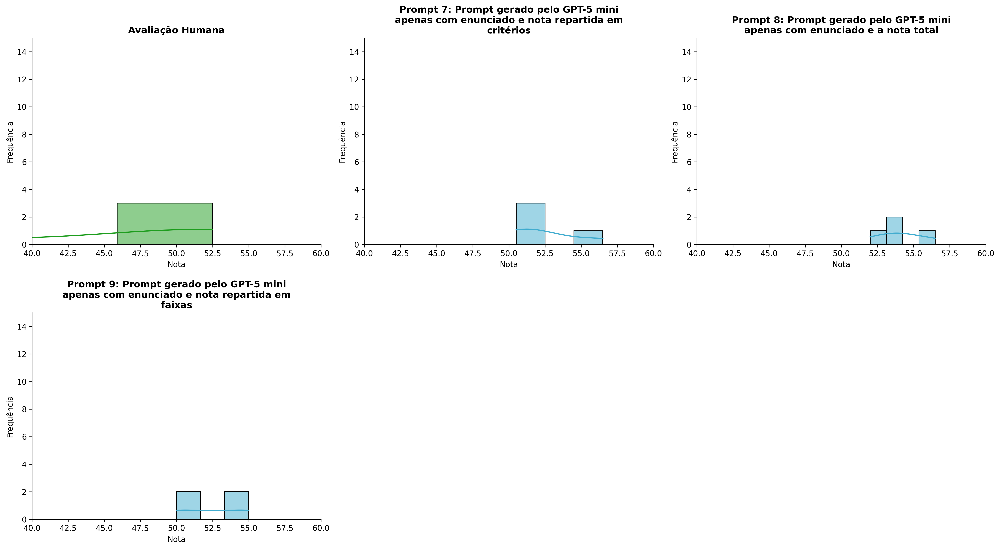
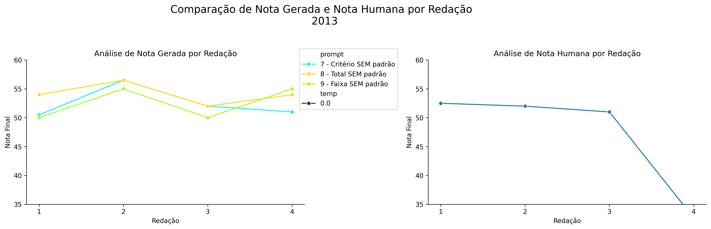
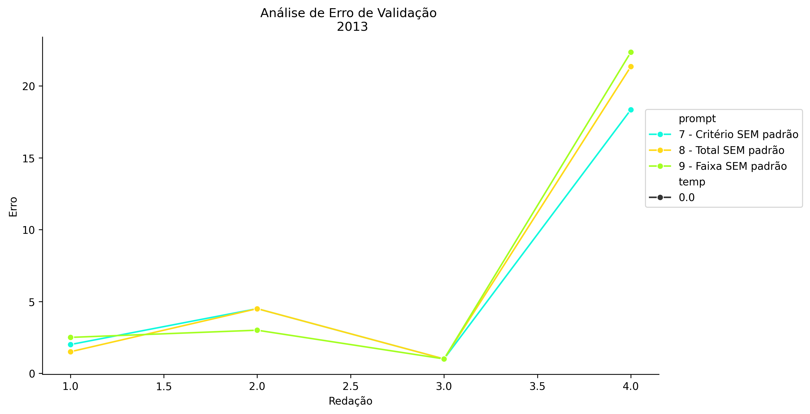
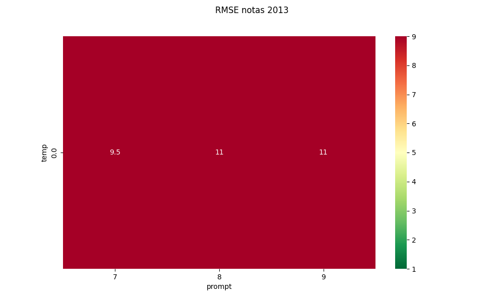
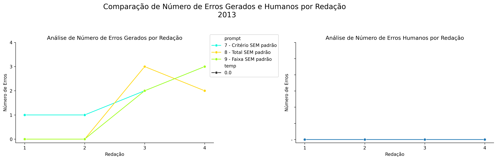
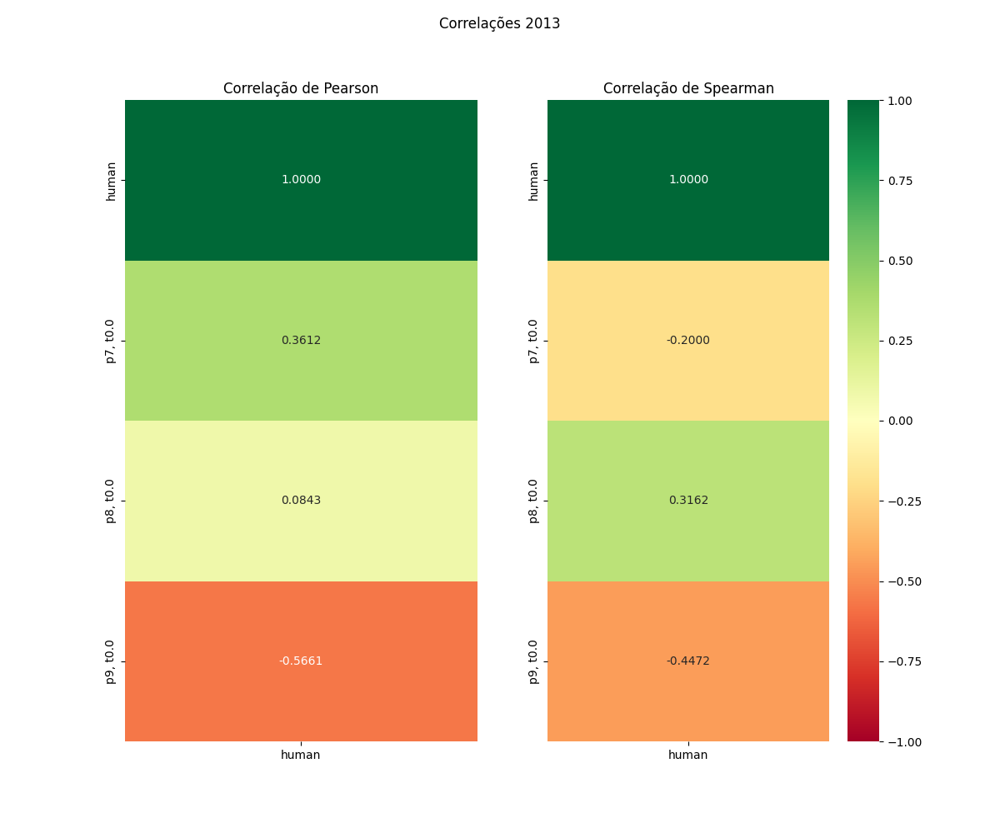

# Relatório de Avaliação: gemma-4-31B-it - 3 execuções
**Gerado em: 21/05/2026 08:50:22**

## 1. Distribuição de Notas
Nesta seção comparamos as notas atribuídas pelo modelo gemma-4-31B-it em diferentes prompts/temperaturas versus a correção humana.

## 2. Comparação de Notas Geradas e Humanas
Nesta seção, apresentamos a comparação entre as notas finais geradas pelo modelo e as notas dadas por avaliadores humanos.

## 3. Análise de Erro Absoluto de Validação

<table>
  <tr>
    <td>
      
    </td>
    <td>
      <table border="1" class="dataframe">
  <thead>
    <tr style="text-align: center;">
      <th>prompt</th>
      <th>temp</th>
      <th>area_sob_curva</th>
      <th>mae</th>
      <th>rmse</th>
    </tr>
  </thead>
  <tbody>
    <tr>
      <td>7</td>
      <td>0.0</td>
      <td>15.675</td>
      <td>6.4625</td>
      <td>9.5128</td>
    </tr>
    <tr>
      <td>8</td>
      <td>0.0</td>
      <td>16.925</td>
      <td>7.0875</td>
      <td>10.9467</td>
    </tr>
    <tr>
      <td>9</td>
      <td>0.0</td>
      <td>16.425</td>
      <td>7.2125</td>
      <td>11.3553</td>
    </tr>
  </tbody>
</table>
    </td>
  </tr>
</table>

## 4. Análise de RMSE por Prompt e Temperatura
Nesta seção, apresentamos o heatmap de RMSE calculado por combinação de prompt e temperatura.

## 5. Análise de Erros Gramaticais
Comparação da sensibilidade do modelo na detecção/geração de erros em relação ao padrão humano.

## 6. Correlações

## Estatísticas Descritivas
### Modelo gemma-4-31B-it
|       |    prompt |   temp |   redacao |   nota_final |   nota_final_std |   1A |       1B |      1C |      CGPL |   num_errors |
|:------|----------:|-------:|----------:|-------------:|-----------------:|-----:|---------:|--------:|----------:|-------------:|
| count | 12        |     12 |  12       |     12       |               12 | 4    | 4        | 4       |  4        |     12       |
| mean  |  8        |      0 |   2.5     |     53.0417  |                0 | 8.75 | 8        | 7.5     | 28.25     |      1.41667 |
| std   |  0.852803 |      0 |   1.16775 |      2.42579 |                0 | 0.5  | 0.816497 | 1.22474 |  0.957427 |      1.24011 |
| min   |  7        |      0 |   1       |     50       |                0 | 8.5  | 7        | 6       | 27        |      0       |
| 25%   |  7        |      0 |   1.75    |     50.875   |                0 | 8.5  | 7.75     | 7.125   | 27.75     |      0       |
| 50%   |  8        |      0 |   2.5     |     53       |                0 | 8.5  | 8        | 7.5     | 28.5      |      1.5     |
| 75%   |  9        |      0 |   3.25    |     55       |                0 | 8.75 | 8.25     | 7.875   | 29        |      2.25    |
| max   |  9        |      0 |   4       |     56.5     |                0 | 9.5  | 9        | 9       | 29        |      3       |

### Humano
|       |   redacao |   nota_final |
|:------|----------:|-------------:|
| count |   4       |      4       |
| mean  |   2.5     |     47.0375  |
| std   |   1.29099 |      9.61192 |
| min   |   1       |     32.65    |
| 25%   |   1.75    |     46.4125  |
| 50%   |   2.5     |     51.5     |
| 75%   |   3.25    |     52.125   |
| max   |   4       |     52.5     |
