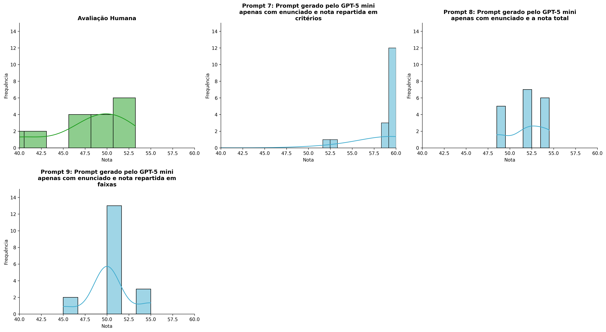
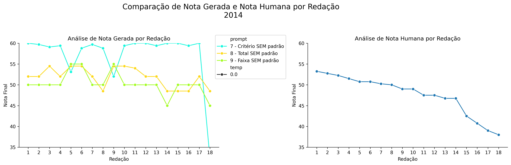
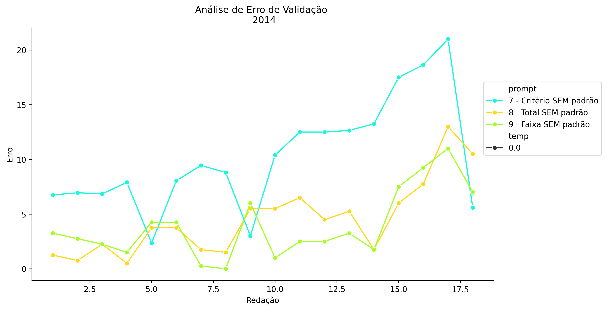
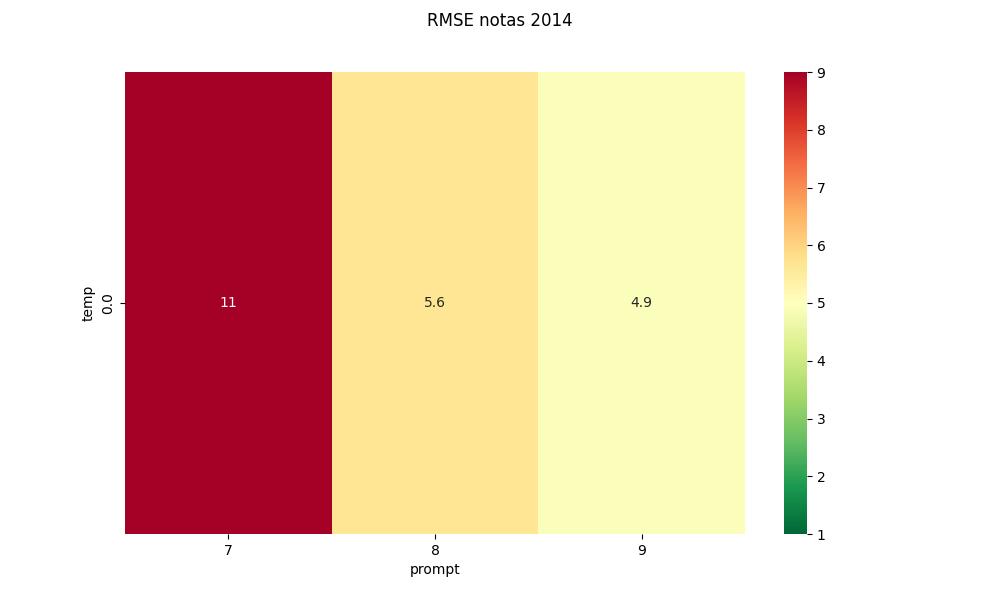
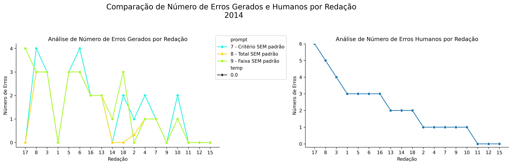
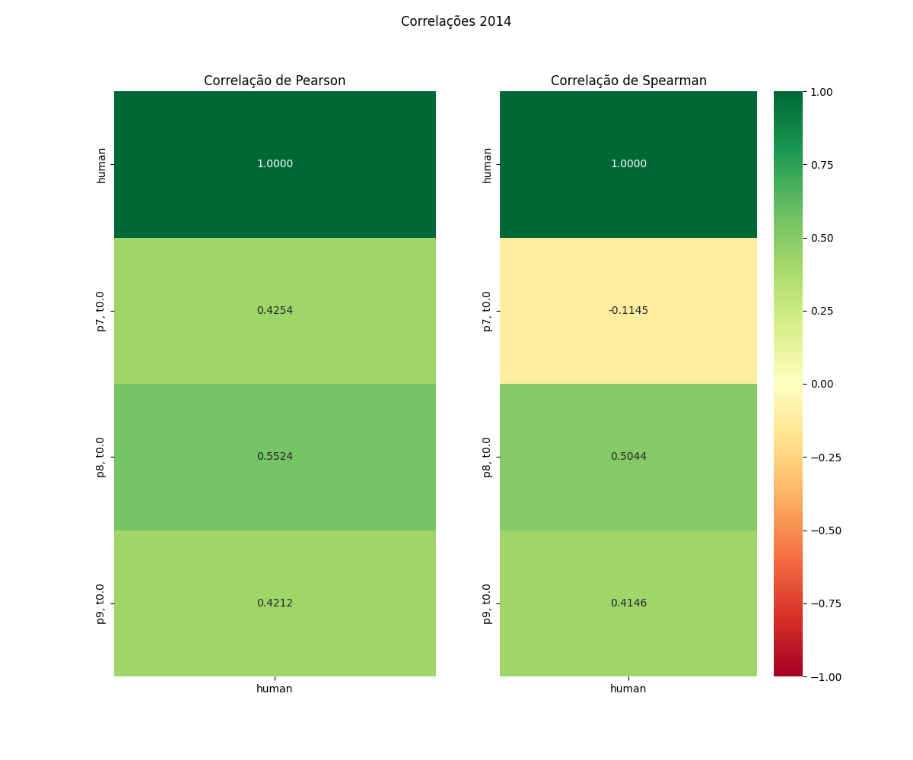

# Relatório de Avaliação: gemma-4-31B-it - 3 execuções
**Gerado em: 14/05/2026 18:23:42**

## 1. Distribuição de Notas
Nesta seção comparamos as notas atribuídas pelo modelo gemma-4-31B-it em diferentes prompts/temperaturas versus a correção humana.

## 2. Comparação de Notas Geradas e Humanas
Nesta seção, apresentamos a comparação entre as notas finais geradas pelo modelo e as notas dadas por avaliadores humanos.

## 3. Análise de Erro Absoluto de Validação

<table>
  <tr>
    <td>
      
    </td>
    <td>
      <table border="1" class="dataframe">
  <thead>
    <tr style="text-align: center;">
      <th>prompt</th>
      <th>temp</th>
      <th>area_sob_curva</th>
      <th>mae</th>
      <th>rmse</th>
    </tr>
  </thead>
  <tbody>
    <tr>
      <td>7</td>
      <td>0.0</td>
      <td>177.975</td>
      <td>10.2306</td>
      <td>11.3821</td>
    </tr>
    <tr>
      <td>8</td>
      <td>0.0</td>
      <td>75.875</td>
      <td>4.5417</td>
      <td>5.6264</td>
    </tr>
    <tr>
      <td>9</td>
      <td>0.0</td>
      <td>65.125</td>
      <td>3.9028</td>
      <td>4.9248</td>
    </tr>
  </tbody>
</table>
    </td>
  </tr>
</table>

## 4. Análise de RMSE por Prompt e Temperatura
Nesta seção, apresentamos o heatmap de RMSE calculado por combinação de prompt e temperatura.

## 5. Análise de Erros Gramaticais
Comparação da sensibilidade do modelo na detecção/geração de erros em relação ao padrão humano.

## 6. Correlações

## Estatísticas Descritivas
### Modelo gemma-4-31B-it
|       |    prompt |   temp |   redacao |   nota_final |   nota_final_std |        1A |        1B |       1C |     CGPL |   num_errors |
|:------|----------:|-------:|----------:|-------------:|-----------------:|----------:|----------:|---------:|---------:|-------------:|
| count | 54        |     54 |  54       |     54       |               54 | 18        | 18        | 18       | 18       |     54       |
| mean  |  8        |      0 |   9.5     |     53.1333  |                0 |  9.72222  |  9.66667  | 19.1667  | 18.7333  |      1.33951 |
| std   |  0.824163 |      0 |   5.23684 |      5.23778 |                0 |  0.751904 |  0.970143 |  2.43141 |  2.49941 |      1.34038 |
| min   |  7        |      0 |   1       |     32.4     |                0 |  7        |  6        | 10       |  9.4     |      0       |
| 25%   |  7        |      0 |   5       |     50       |                0 | 10        | 10        | 20       | 18.875   |      0       |
| 50%   |  8        |      0 |   9.5     |     52       |                0 | 10        | 10        | 20       | 19.4     |      1       |
| 75%   |  9        |      0 |  14       |     58.8     |                0 | 10        | 10        | 20       | 20       |      2.75    |
| max   |  9        |      0 |  18       |     60       |                0 | 10        | 10        | 20       | 20       |      4       |

### Humano
|       |   redacao |   nota_final |   num_errors |
|:------|----------:|-------------:|-------------:|
| count |  18       |     18       |     18       |
| mean  |   9.5     |     47.6806  |      2.11111 |
| std   |   5.33854 |      4.67928 |      1.71117 |
| min   |   1       |     38       |      0       |
| 25%   |   5.25    |     46.75    |      1       |
| 50%   |   9.5     |     49       |      2       |
| 75%   |  13.75    |     50.75    |      3       |
| max   |  18       |     53.25    |      6       |
