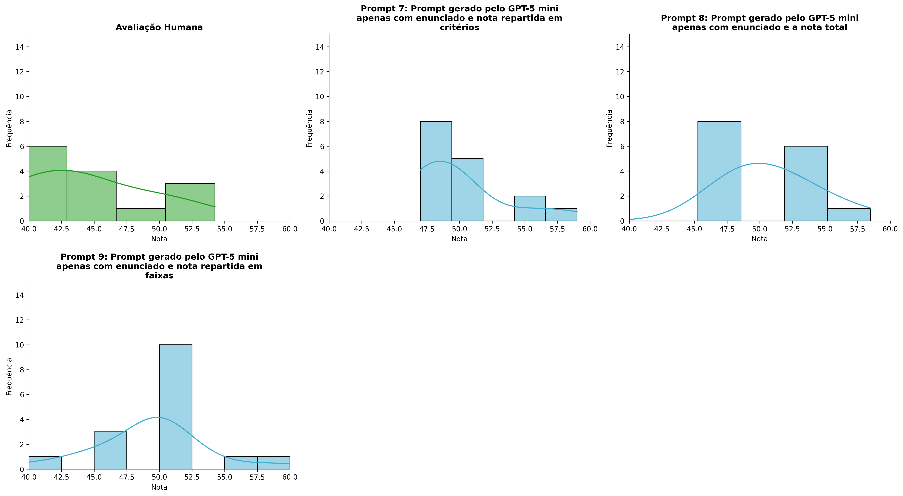
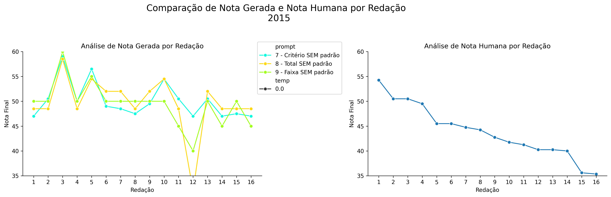
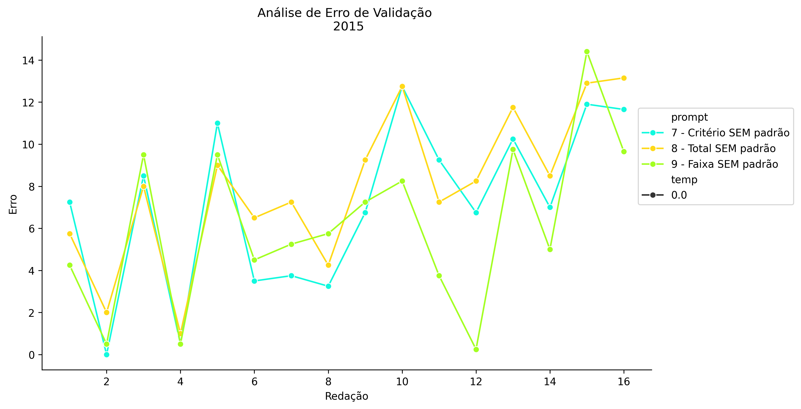
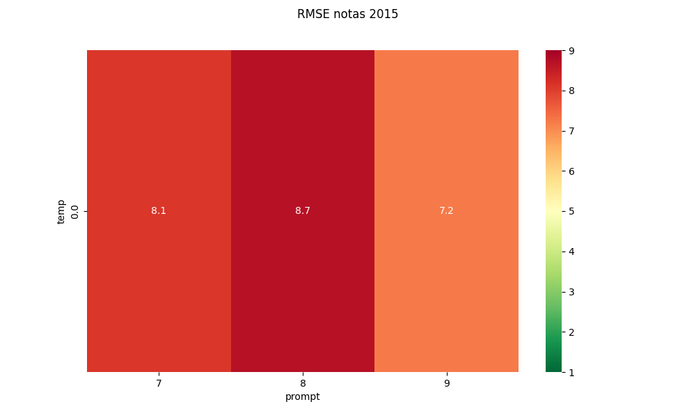
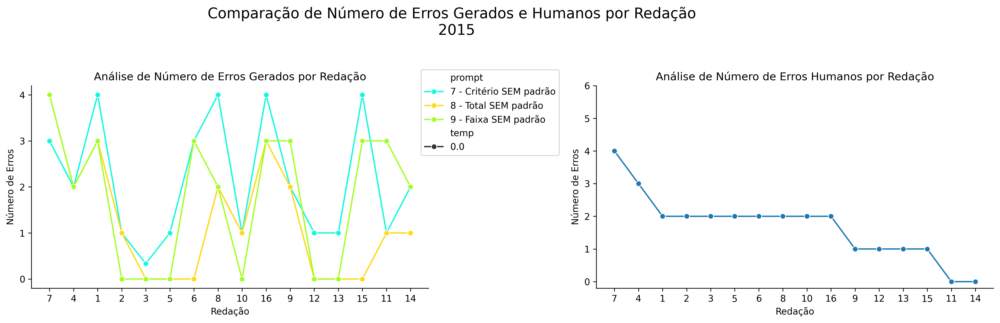
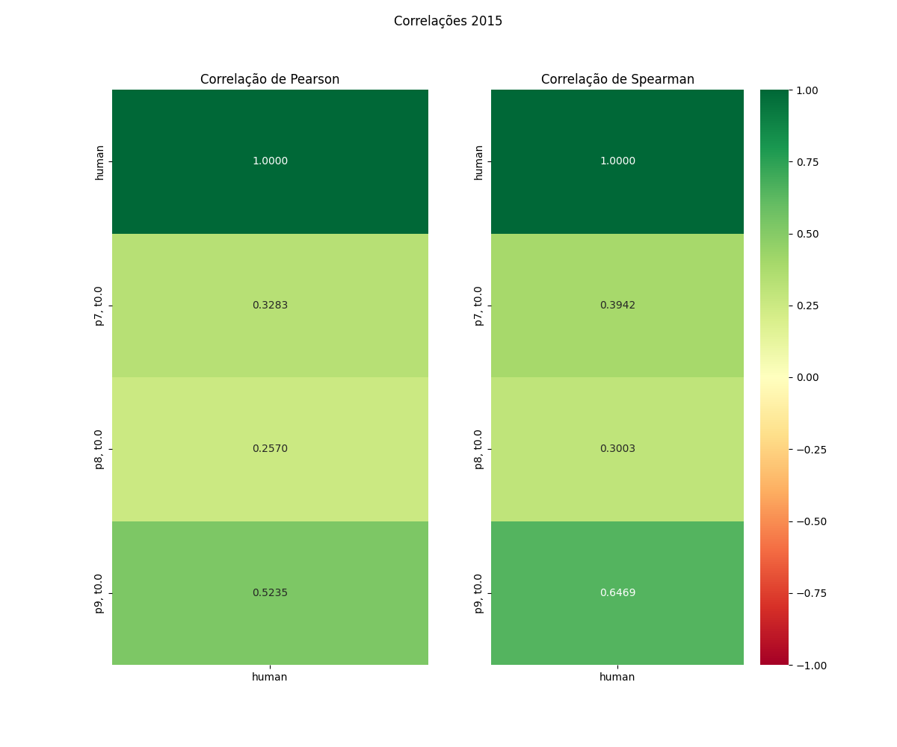

# Relatório de Avaliação: gemma-4-31B-it - 3 execuções
**Gerado em: 21/05/2026 08:50:35**

## 1. Distribuição de Notas
Nesta seção comparamos as notas atribuídas pelo modelo gemma-4-31B-it em diferentes prompts/temperaturas versus a correção humana.

## 2. Comparação de Notas Geradas e Humanas
Nesta seção, apresentamos a comparação entre as notas finais geradas pelo modelo e as notas dadas por avaliadores humanos.

## 3. Análise de Erro Absoluto de Validação

<table>
  <tr>
    <td>
      
    </td>
    <td>
      <table border="1" class="dataframe">
  <thead>
    <tr style="text-align: center;">
      <th>prompt</th>
      <th>temp</th>
      <th>area_sob_curva</th>
      <th>mae</th>
      <th>rmse</th>
    </tr>
  </thead>
  <tbody>
    <tr>
      <td>7</td>
      <td>0.0</td>
      <td>104.6</td>
      <td>7.1281</td>
      <td>8.1147</td>
    </tr>
    <tr>
      <td>8</td>
      <td>0.0</td>
      <td>118.1</td>
      <td>7.9719</td>
      <td>8.7118</td>
    </tr>
    <tr>
      <td>9</td>
      <td>0.0</td>
      <td>91.1</td>
      <td>6.1281</td>
      <td>7.2251</td>
    </tr>
  </tbody>
</table>
    </td>
  </tr>
</table>

## 4. Análise de RMSE por Prompt e Temperatura
Nesta seção, apresentamos o heatmap de RMSE calculado por combinação de prompt e temperatura.

## 5. Análise de Erros Gramaticais
Comparação da sensibilidade do modelo na detecção/geração de erros em relação ao padrão humano.

## 6. Correlações

## Estatísticas Descritivas
### Modelo gemma-4-31B-it
|       |    prompt |   temp |   redacao |   nota_final |   nota_final_std |       1A |       1B |       1C |     CGPL |   num_errors |
|:------|----------:|-------:|----------:|-------------:|-----------------:|---------:|---------:|---------:|---------:|-------------:|
| count | 48        |     48 |  48       |     48       |       48         | 16       | 16       | 16       | 16       |    48        |
| mean  |  8        |      0 |   8.5     |     49.7292  |        0.0180417 |  8.4375  |  7.3125  |  6.48958 | 27.8542  |     1.71528  |
| std   |  0.825137 |      0 |   4.65855 |      4.52764 |        0.124996  |  0.57373 |  1.07819 |  1.32562 |  1.32759 |     1.3906   |
| min   |  7        |      0 |   1       |     32       |        0         |  7       |  6       |  5       | 26       |     0        |
| 25%   |  7        |      0 |   4.75    |     48.5     |        0         |  8.375   |  7       |  6       | 26.75    |     0.249975 |
| 50%   |  8        |      0 |   8.5     |     50       |        0         |  8.5     |  7       |  6       | 28       |     2        |
| 75%   |  9        |      0 |  12.25    |     50.875   |        0         |  8.5     |  7       |  6.5     | 29       |     3        |
| max   |  9        |      0 |  16       |     60       |        0.866     |  9.5     | 10       |  9.8333  | 29.6667  |     4        |

### Humano
|       |   redacao |   nota_final |   num_errors |
|:------|----------:|-------------:|-------------:|
| count |  16       |     16       |     16       |
| mean  |   8.5     |     43.8719  |      1.6875  |
| std   |   4.76095 |      5.34397 |      1.01448 |
| min   |   1       |     35.35    |      0       |
| 25%   |   4.75    |     40.25    |      1       |
| 50%   |   8.5     |     43.5     |      2       |
| 75%   |  12.25    |     46.5     |      2       |
| max   |  16       |     54.25    |      4       |
