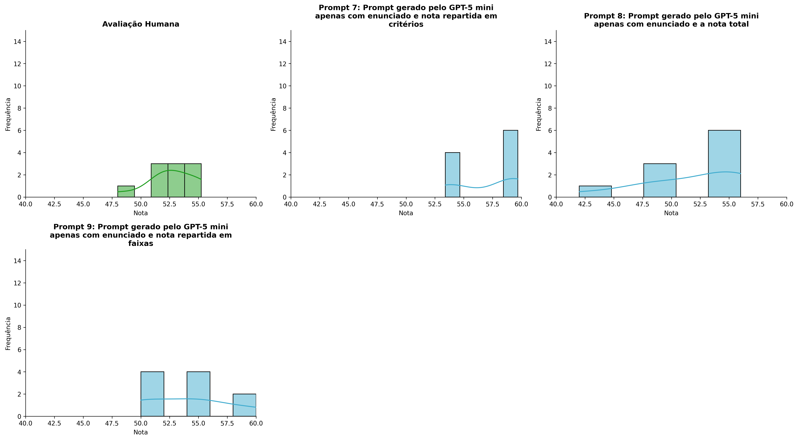
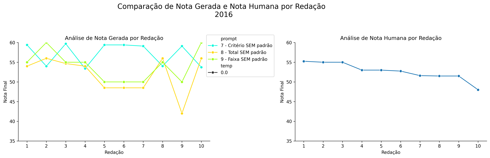
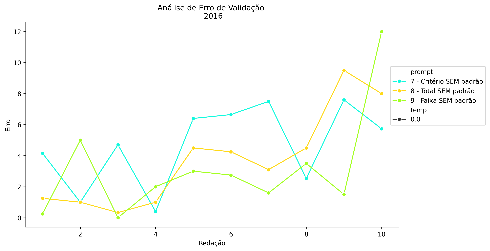
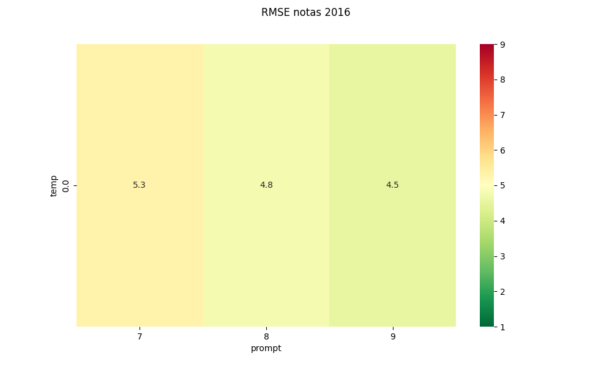
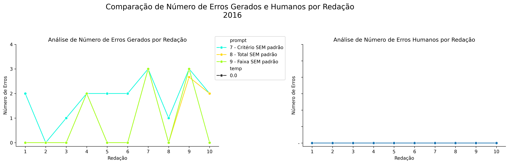
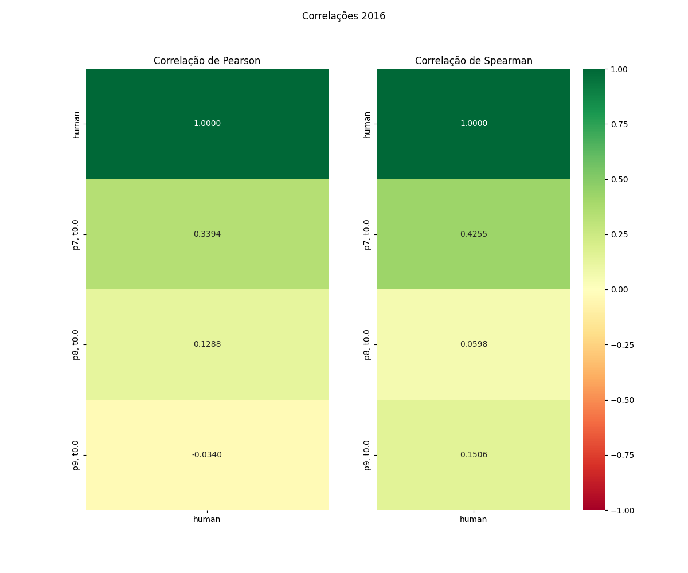

# Relatório de Avaliação: gemma-4-31B-it - 3 execuções
**Gerado em: 14/05/2026 12:28:18**

## 1. Distribuição de Notas
Nesta seção comparamos as notas atribuídas pelo modelo gemma-4-31B-it em diferentes prompts/temperaturas versus a correção humana.

## 2. Comparação de Notas Geradas e Humanas
Nesta seção, apresentamos a comparação entre as notas finais geradas pelo modelo e as notas dadas por avaliadores humanos.

## 3. Análise de Erro Absoluto de Validação

<table>
  <tr>
    <td>
      
    </td>
    <td>
      <table border="1" class="dataframe">
  <thead>
    <tr style="text-align: center;">
      <th>prompt</th>
      <th>temp</th>
      <th>area_sob_curva</th>
      <th>mae</th>
      <th>rmse</th>
    </tr>
  </thead>
  <tbody>
    <tr>
      <td>7</td>
      <td>0.0</td>
      <td>41.7249</td>
      <td>4.6667</td>
      <td>5.2816</td>
    </tr>
    <tr>
      <td>8</td>
      <td>0.0</td>
      <td>32.8083</td>
      <td>3.7433</td>
      <td>4.7550</td>
    </tr>
    <tr>
      <td>9</td>
      <td>0.0</td>
      <td>25.4750</td>
      <td>3.1600</td>
      <td>4.5463</td>
    </tr>
  </tbody>
</table>
    </td>
  </tr>
</table>

## 4. Análise de RMSE por Prompt e Temperatura
Nesta seção, apresentamos o heatmap de RMSE calculado por combinação de prompt e temperatura.

## 5. Análise de Erros Gramaticais
Comparação da sensibilidade do modelo na detecção/geração de erros em relação ao padrão humano.

## 6. Correlações

## Estatísticas Descritivas
### Modelo gemma-4-31B-it
|       |    prompt |   temp |   redacao |   nota_final |   nota_final_std |        1A |       1B |      1C |      CGPL |   num_errors |
|:------|----------:|-------:|----------:|-------------:|-----------------:|----------:|---------:|--------:|----------:|-------------:|
| count | 30        |     30 |  30       |     30       |       30         | 10        | 10       | 10      | 10        |     30       |
| mean  |  8        |      0 |   5.5     |     54.3144  |        0.0769833 |  9.6      |  9.66666 | 19.2    | 18.66     |      1.18889 |
| std   |  0.830455 |      0 |   2.92138 |      4.38119 |        0.250676  |  0.516398 |  0.44445 |  1.0328 |  0.921593 |      1.22766 |
| min   |  7        |      0 |   1       |     42       |        0         |  9        |  9       | 18      | 17.4      |      0       |
| 25%   |  7        |      0 |   3       |     50.85    |        0         |  9        |  9.3333  | 18      | 17.775    |      0       |
| 50%   |  8        |      0 |   5.5     |     54.8333  |        0         | 10        | 10       | 20      | 19.1      |      1       |
| 75%   |  9        |      0 |   8       |     58.325   |        0         | 10        | 10       | 20      | 19.4      |      2       |
| max   |  9        |      0 |  10       |     60       |        1.1547    | 10        | 10       | 20      | 19.7      |      3       |

### Humano
|       |   redacao |   nota_final |
|:------|----------:|-------------:|
| count |  10       |     10       |
| mean  |   5.5     |     52.66    |
| std   |   3.02765 |      2.19669 |
| min   |   1       |     48       |
| 25%   |   3.25    |     51.525   |
| 50%   |   5.5     |     52.875   |
| 75%   |   7.75    |     54.5     |
| max   |  10       |     55.25    |
