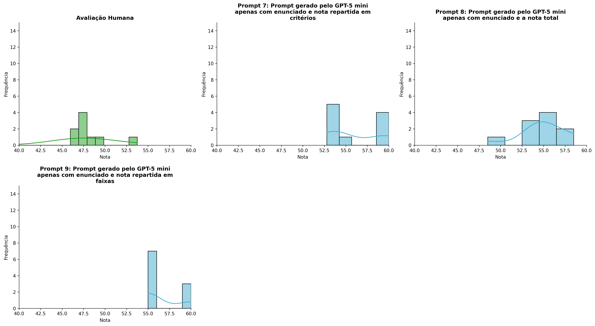
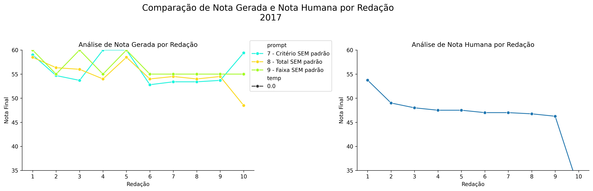
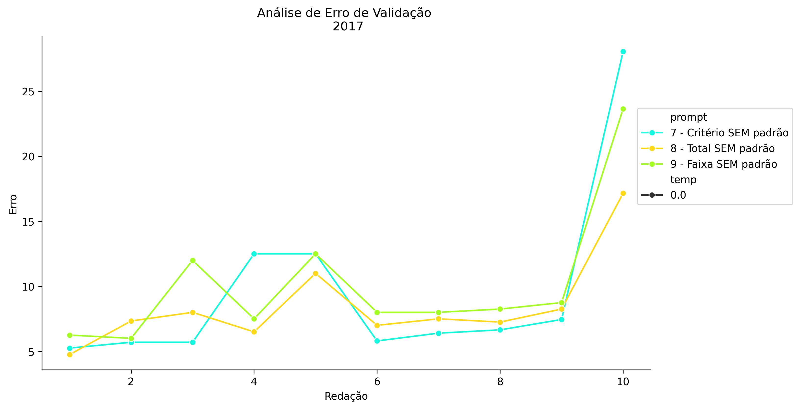
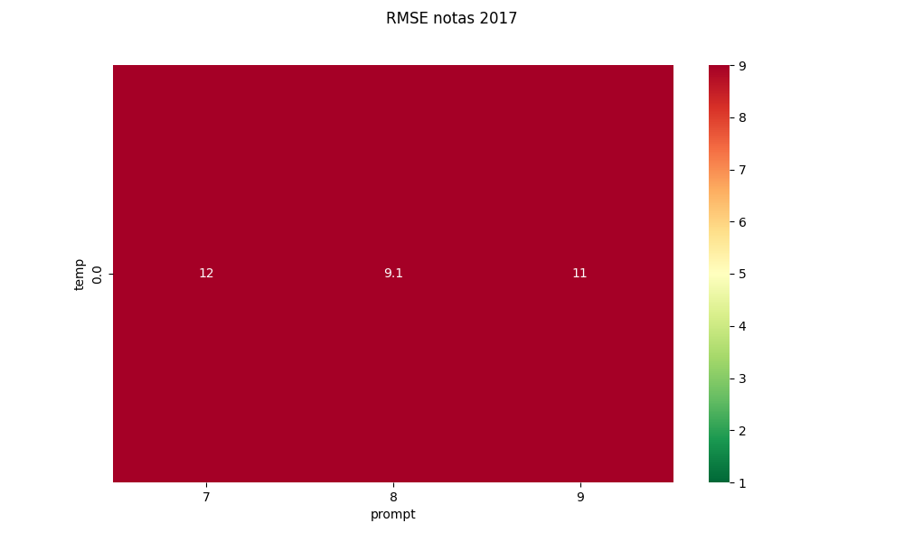
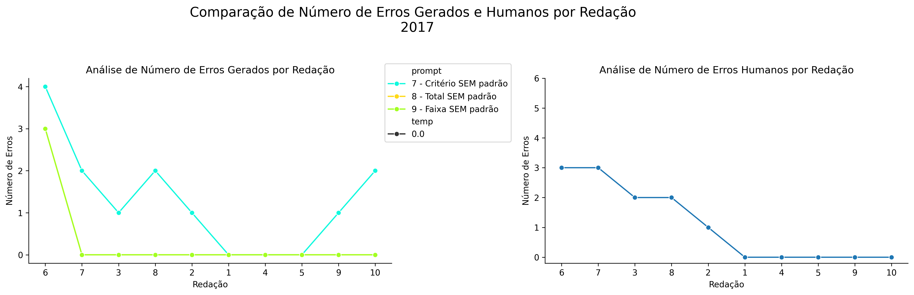
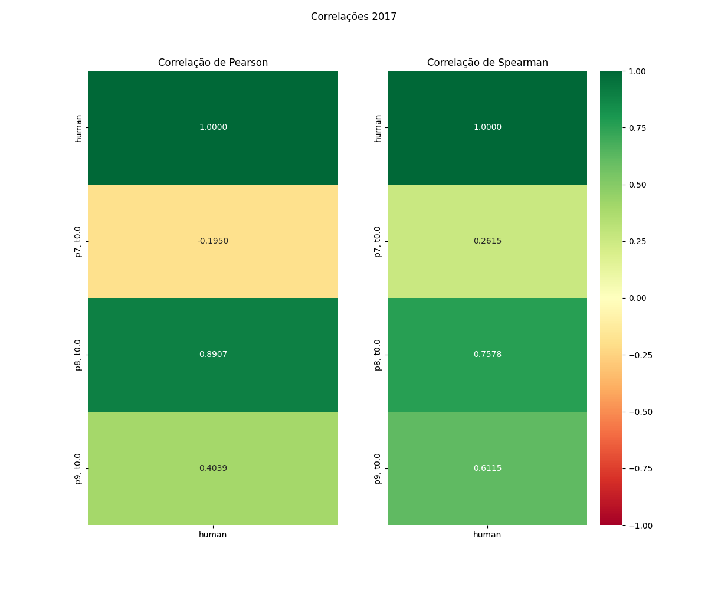

# Relatório de Avaliação: gemma-4-31B-it - 3 execuções
**Gerado em: 14/05/2026 18:24:11**

## 1. Distribuição de Notas
Nesta seção comparamos as notas atribuídas pelo modelo gemma-4-31B-it em diferentes prompts/temperaturas versus a correção humana.

## 2. Comparação de Notas Geradas e Humanas
Nesta seção, apresentamos a comparação entre as notas finais geradas pelo modelo e as notas dadas por avaliadores humanos.

## 3. Análise de Erro Absoluto de Validação

<table>
  <tr>
    <td>
      
    </td>
    <td>
      <table border="1" class="dataframe">
  <thead>
    <tr style="text-align: center;">
      <th>prompt</th>
      <th>temp</th>
      <th>area_sob_curva</th>
      <th>mae</th>
      <th>rmse</th>
    </tr>
  </thead>
  <tbody>
    <tr>
      <td>7</td>
      <td>0.0</td>
      <td>79.3500</td>
      <td>9.6000</td>
      <td>11.6883</td>
    </tr>
    <tr>
      <td>8</td>
      <td>0.0</td>
      <td>73.7833</td>
      <td>8.4733</td>
      <td>9.0752</td>
    </tr>
    <tr>
      <td>9</td>
      <td>0.0</td>
      <td>85.9500</td>
      <td>10.0900</td>
      <td>11.2406</td>
    </tr>
  </tbody>
</table>
    </td>
  </tr>
</table>

## 4. Análise de RMSE por Prompt e Temperatura
Nesta seção, apresentamos o heatmap de RMSE calculado por combinação de prompt e temperatura.

## 5. Análise de Erros Gramaticais
Comparação da sensibilidade do modelo na detecção/geração de erros em relação ao padrão humano.

## 6. Correlações

## Estatísticas Descritivas
### Modelo gemma-4-31B-it
|       |    prompt |   temp |   redacao |   nota_final |   nota_final_std |        1A |        1B |      1C |     CGPL |   num_errors |
|:------|----------:|-------:|----------:|-------------:|-----------------:|----------:|----------:|--------:|---------:|-------------:|
| count | 30        |     30 |  30       |     30       |      30          | 10        | 10        | 10      | 10       |    30        |
| mean  |  8        |      0 |   5.5     |     55.7978  |       0.00962333 |  9.3      |  9.5      | 18.8    | 18.41    |     0.633333 |
| std   |  0.830455 |      0 |   2.92138 |      2.80224 |       0.0527092  |  0.483046 |  0.527046 |  1.0328 |  1.27841 |     1.12903  |
| min   |  7        |      0 |   1       |     48.5     |       0          |  9        |  9        | 18      | 16.8     |     0        |
| 25%   |  7        |      0 |   3       |     54       |       0          |  9        |  9        | 18      | 17.475   |     0        |
| 50%   |  8        |      0 |   5.5     |     55       |       0          |  9        |  9.5      | 18      | 17.7     |     0        |
| 75%   |  9        |      0 |   8       |     58.5     |       0          |  9.75     | 10        | 20      | 19.85    |     1        |
| max   |  9        |      0 |  10       |     60       |       0.2887     | 10        | 10        | 20      | 20       |     4        |

### Humano
|       |   redacao |   nota_final |   num_errors |
|:------|----------:|-------------:|-------------:|
| count |  10       |      10      |     10       |
| mean  |   5.5     |      46.41   |      1.1     |
| std   |   3.02765 |       5.707  |      1.28668 |
| min   |   1       |      31.35   |      0       |
| 25%   |   3.25    |      46.8125 |      0       |
| 50%   |   5.5     |      47.25   |      0.5     |
| 75%   |   7.75    |      47.875  |      2       |
| max   |  10       |      53.75   |      3       |
