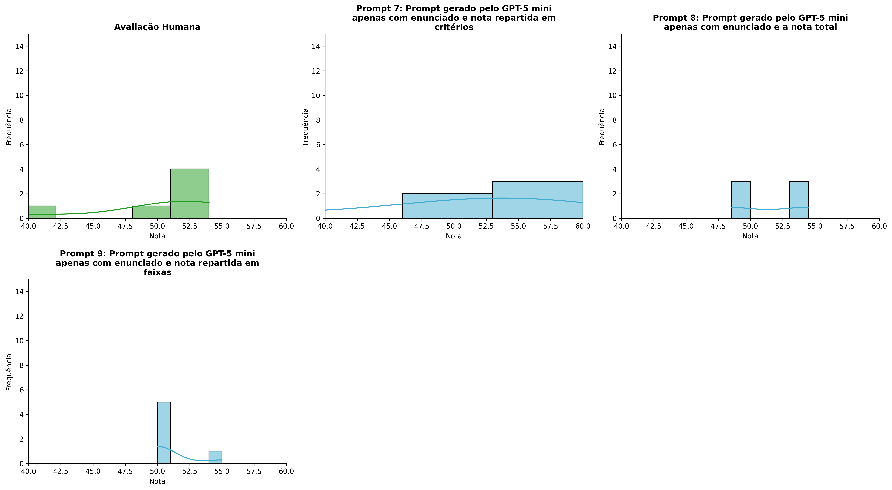
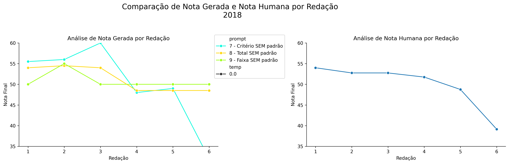
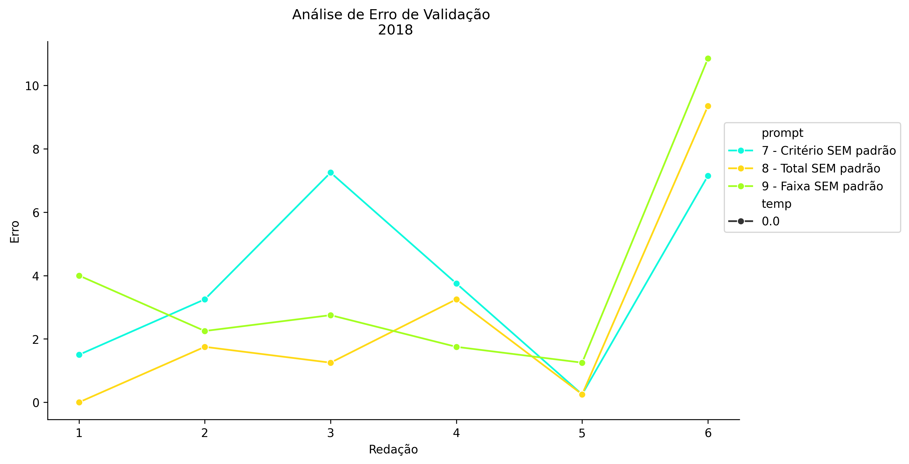
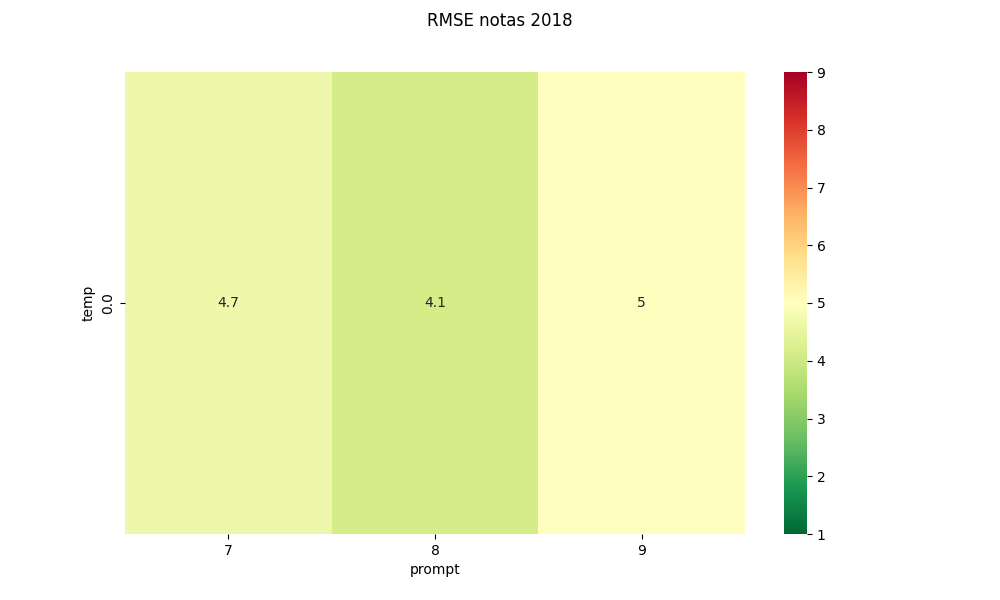
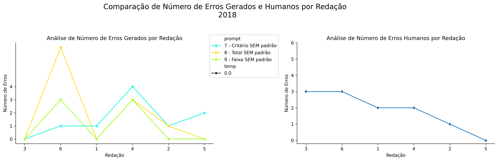
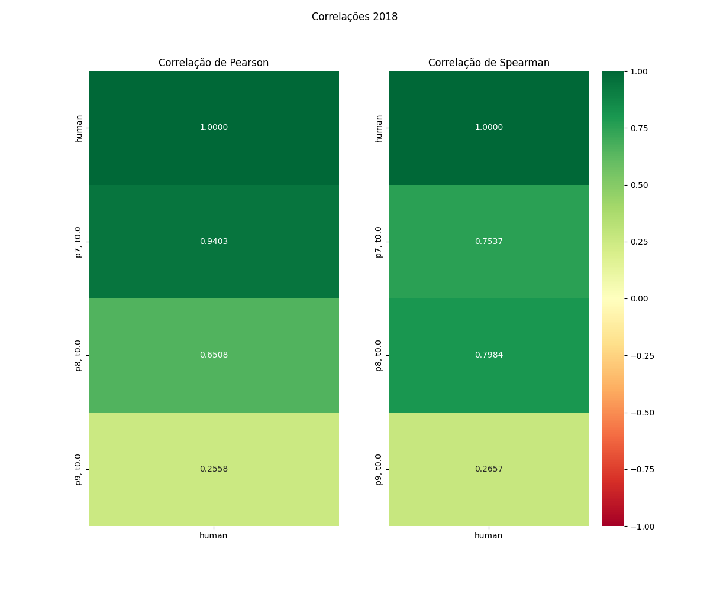

# Relatório de Avaliação: gemma-4-31B-it - 3 execuções
**Gerado em: 21/05/2026 08:50:53**

## 1. Distribuição de Notas
Nesta seção comparamos as notas atribuídas pelo modelo gemma-4-31B-it em diferentes prompts/temperaturas versus a correção humana.

## 2. Comparação de Notas Geradas e Humanas
Nesta seção, apresentamos a comparação entre as notas finais geradas pelo modelo e as notas dadas por avaliadores humanos.

## 3. Análise de Erro Absoluto de Validação

<table>
  <tr>
    <td>
      
    </td>
    <td>
      <table border="1" class="dataframe">
  <thead>
    <tr style="text-align: center;">
      <th>prompt</th>
      <th>temp</th>
      <th>area_sob_curva</th>
      <th>mae</th>
      <th>rmse</th>
    </tr>
  </thead>
  <tbody>
    <tr>
      <td>7</td>
      <td>0.0</td>
      <td>18.825</td>
      <td>3.8583</td>
      <td>4.6659</td>
    </tr>
    <tr>
      <td>8</td>
      <td>0.0</td>
      <td>11.175</td>
      <td>2.6417</td>
      <td>4.1367</td>
    </tr>
    <tr>
      <td>9</td>
      <td>0.0</td>
      <td>15.425</td>
      <td>3.8083</td>
      <td>5.0162</td>
    </tr>
  </tbody>
</table>
    </td>
  </tr>
</table>

## 4. Análise de RMSE por Prompt e Temperatura
Nesta seção, apresentamos o heatmap de RMSE calculado por combinação de prompt e temperatura.

## 5. Análise de Erros Gramaticais
Comparação da sensibilidade do modelo na detecção/geração de erros em relação ao padrão humano.

## 6. Correlações

## Estatísticas Descritivas
### Modelo gemma-4-31B-it
|       |    prompt |   temp |   redacao |   nota_final |   nota_final_std |       1A |       1B |       1C |    CGPL |   num_errors |
|:------|----------:|-------:|----------:|-------------:|-----------------:|---------:|---------:|---------:|--------:|-------------:|
| count | 18        |     18 |  18       |     18       |               18 |  6       |  6       |  6       |  6      |     18       |
| mean  |  8        |      0 |   3.5     |     50.75    |                0 |  7.25    |  7.33333 |  7       | 28.5    |      1.44444 |
| std   |  0.840168 |      0 |   1.75734 |      5.78601 |                0 |  3.25192 |  3.26599 |  3.20936 |  1.3784 |      1.91656 |
| min   |  7        |      0 |   1       |     32       |                0 |  1       |  1       |  1       | 26      |      0       |
| 25%   |  7        |      0 |   2       |     48.625   |                0 |  7.125   |  7.25    |  6.625   | 28.25   |      0       |
| 50%   |  8        |      0 |   3.5     |     50       |                0 |  8.25    |  8.5     |  7.75    | 29      |      1       |
| 75%   |  9        |      0 |   5       |     54.375   |                0 |  9       |  9       |  8.875   | 29      |      2.75    |
| max   |  9        |      0 |   6       |     60       |                0 | 10       | 10       | 10       | 30      |      7       |

### Humano
|       |   redacao |   nota_final |   num_errors |
|:------|----------:|-------------:|-------------:|
| count |   6       |      6       |      6       |
| mean  |   3.5     |     49.8583  |      1.83333 |
| std   |   1.87083 |      5.53809 |      1.16905 |
| min   |   1       |     39.15    |      0       |
| 25%   |   2.25    |     49.5     |      1.25    |
| 50%   |   3.5     |     52.25    |      2       |
| 75%   |   4.75    |     52.75    |      2.75    |
| max   |   6       |     54       |      3       |
