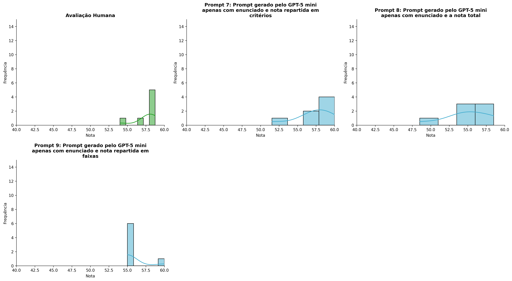
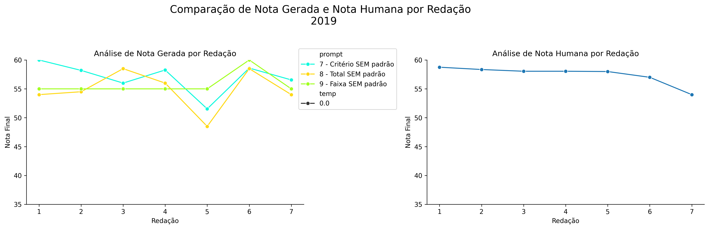
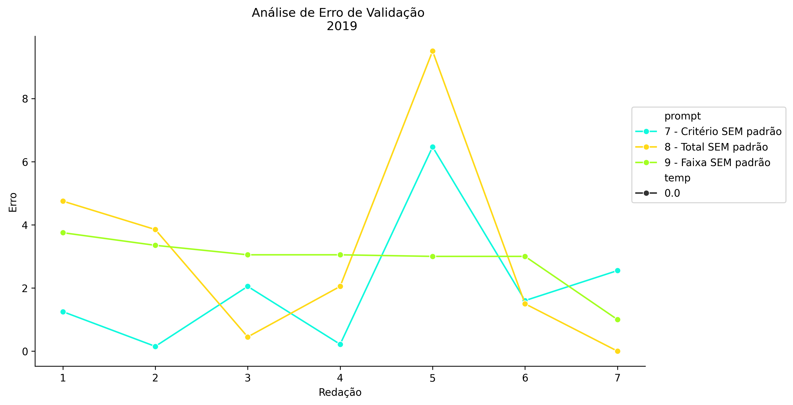
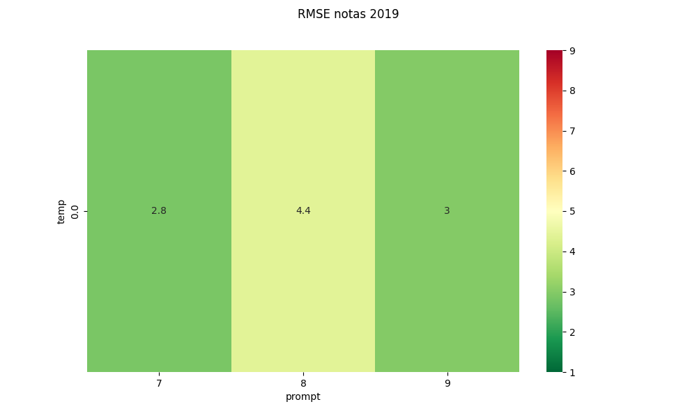
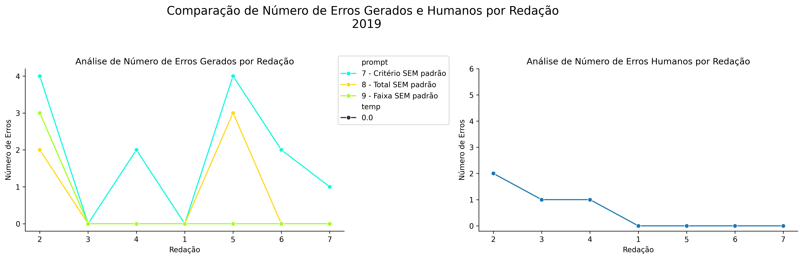
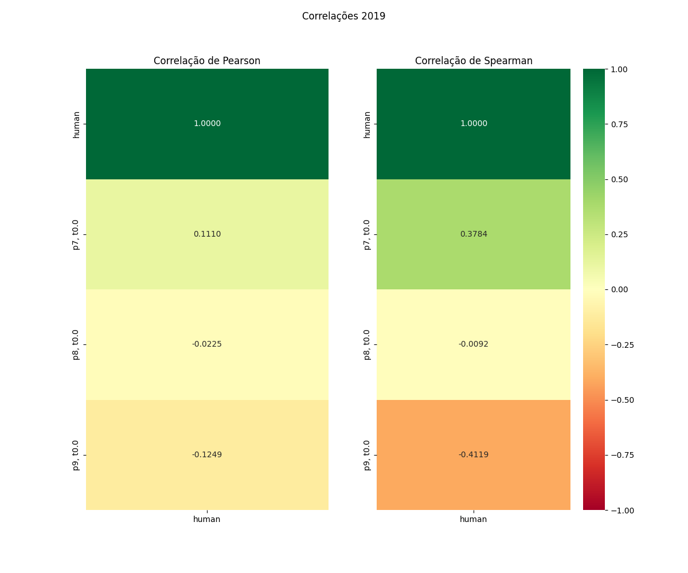

# Relatório de Avaliação: gemma-4-31B-it - 3 execuções
**Gerado em: 21/05/2026 08:50:59**

## 1. Distribuição de Notas
Nesta seção comparamos as notas atribuídas pelo modelo gemma-4-31B-it em diferentes prompts/temperaturas versus a correção humana.

## 2. Comparação de Notas Geradas e Humanas
Nesta seção, apresentamos a comparação entre as notas finais geradas pelo modelo e as notas dadas por avaliadores humanos.

## 3. Análise de Erro Absoluto de Validação

<table>
  <tr>
    <td>
      
    </td>
    <td>
      <table border="1" class="dataframe">
  <thead>
    <tr style="text-align: center;">
      <th>prompt</th>
      <th>temp</th>
      <th>area_sob_curva</th>
      <th>mae</th>
      <th>rmse</th>
    </tr>
  </thead>
  <tbody>
    <tr>
      <td>7</td>
      <td>0.0</td>
      <td>12.3834</td>
      <td>2.0405</td>
      <td>2.8464</td>
    </tr>
    <tr>
      <td>8</td>
      <td>0.0</td>
      <td>19.7250</td>
      <td>3.1571</td>
      <td>4.3800</td>
    </tr>
    <tr>
      <td>9</td>
      <td>0.0</td>
      <td>17.8250</td>
      <td>2.8857</td>
      <td>2.9974</td>
    </tr>
  </tbody>
</table>
    </td>
  </tr>
</table>

## 4. Análise de RMSE por Prompt e Temperatura
Nesta seção, apresentamos o heatmap de RMSE calculado por combinação de prompt e temperatura.

## 5. Análise de Erros Gramaticais
Comparação da sensibilidade do modelo na detecção/geração de erros em relação ao padrão humano.

## 6. Correlações

## Estatísticas Descritivas
### Modelo gemma-4-31B-it
|       |   prompt |   temp |   redacao |   nota_final |   nota_final_std |       1A |        1B |       1C |      CGPL |   num_errors |
|:------|---------:|-------:|----------:|-------------:|-----------------:|---------:|----------:|---------:|----------:|-------------:|
| count | 21       |     21 |  21       |     21       |        21        |  7       |  7        |  7       |  7        |     21       |
| mean  |  8       |      0 |   4       |     55.8643  |         0.247438 |  9.45237 |  9.33334  |  9.07143 | 29.1643   |      1       |
| std   |  0.83666 |      0 |   2.04939 |      2.77133 |         0.862588 |  0.60641 |  0.860654 |  1.1133  |  0.754274 |      1.44914 |
| min   |  7       |      0 |   1       |     48.5     |         0        |  8.3333  |  7.6667   |  7.3333  | 28.2      |      0       |
| 25%   |  7       |      0 |   2       |     55       |         0        |  9.25    |  9        |  8.25    | 28.65     |      0       |
| 50%   |  8       |      0 |   4       |     55       |         0        |  9.5     |  9.6667   |  9.6667  | 29.1      |      0       |
| 75%   |  9       |      0 |   6       |     58.2667  |         0        |  9.91665 | 10        | 10       | 29.775    |      2       |
| max   |  9       |      0 |   7       |     60       |         3.7528   | 10       | 10        | 10       | 30        |      4       |

### Humano
|       |   redacao |   nota_final |   num_errors |
|:------|----------:|-------------:|-------------:|
| count |   7       |      7       |     7        |
| mean  |   4       |     57.4571  |     0.571429 |
| std   |   2.16025 |      1.61385 |     0.786796 |
| min   |   1       |     54       |     0        |
| 25%   |   2.5     |     57.5     |     0        |
| 50%   |   4       |     58.05    |     0        |
| 75%   |   5.5     |     58.2     |     1        |
| max   |   7       |     58.75    |     2        |
