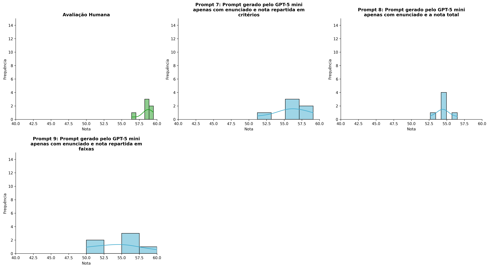
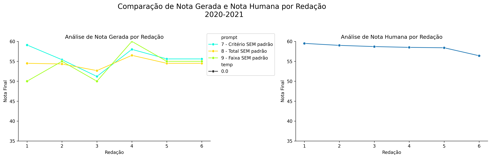
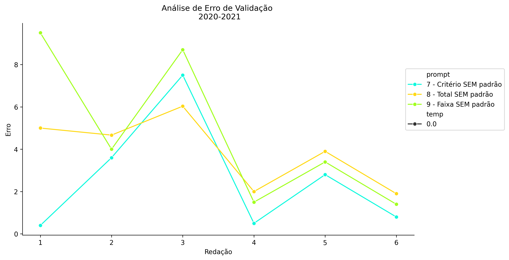
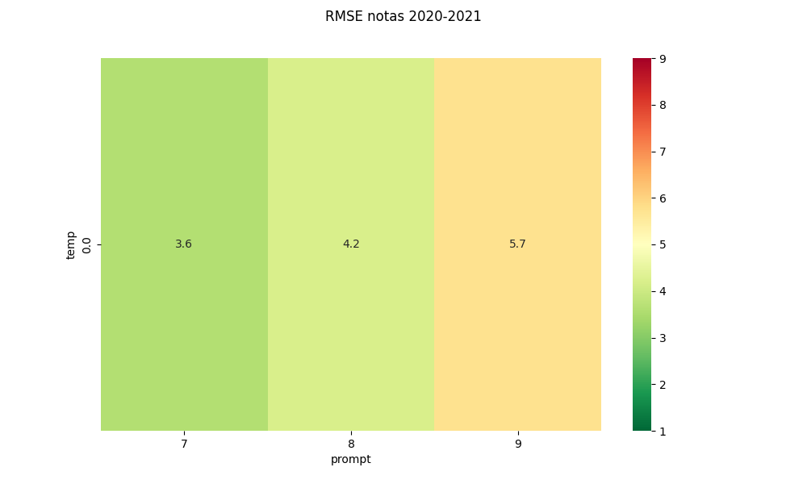
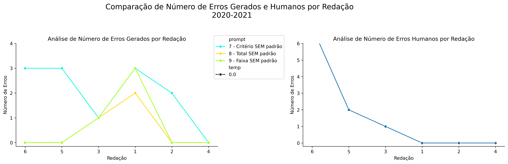
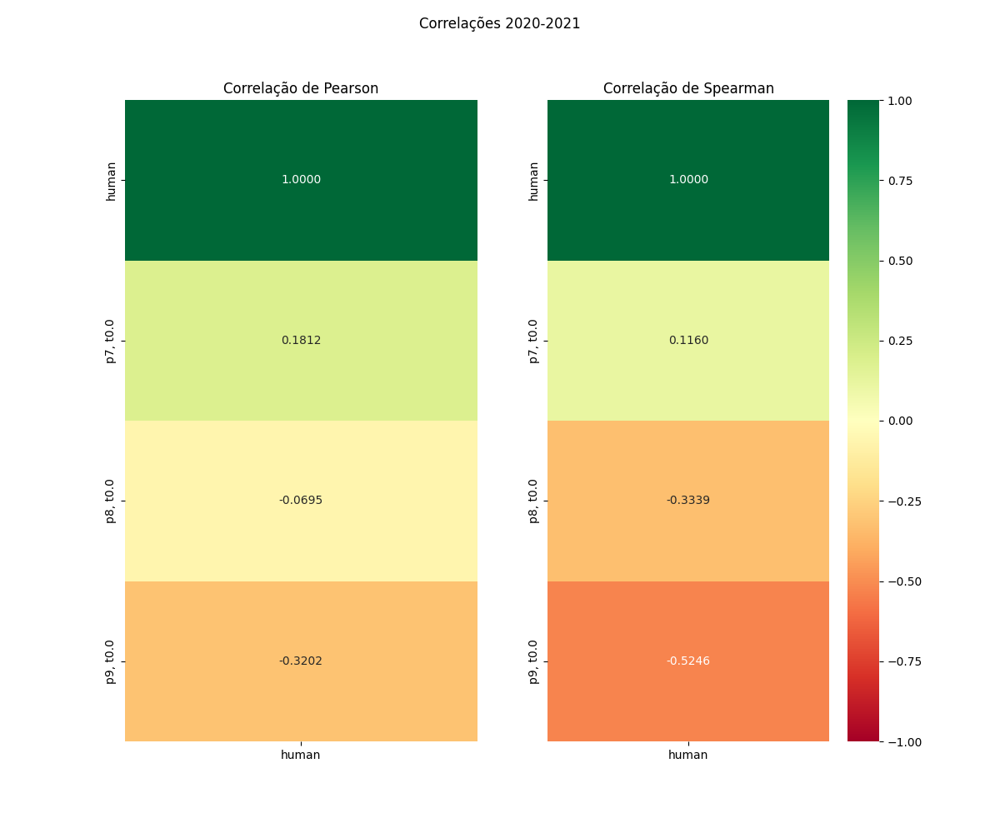

# Relatório de Avaliação: gemma-4-31B-it - 3 execuções
**Gerado em: 21/05/2026 08:51:05**

## 1. Distribuição de Notas
Nesta seção comparamos as notas atribuídas pelo modelo gemma-4-31B-it em diferentes prompts/temperaturas versus a correção humana.

## 2. Comparação de Notas Geradas e Humanas
Nesta seção, apresentamos a comparação entre as notas finais geradas pelo modelo e as notas dadas por avaliadores humanos.

## 3. Análise de Erro Absoluto de Validação

<table>
  <tr>
    <td>
      
    </td>
    <td>
      <table border="1" class="dataframe">
  <thead>
    <tr style="text-align: center;">
      <th>prompt</th>
      <th>temp</th>
      <th>area_sob_curva</th>
      <th>mae</th>
      <th>rmse</th>
    </tr>
  </thead>
  <tbody>
    <tr>
      <td>7</td>
      <td>0.0</td>
      <td>15.00</td>
      <td>2.6000</td>
      <td>3.6079</td>
    </tr>
    <tr>
      <td>8</td>
      <td>0.0</td>
      <td>20.05</td>
      <td>3.9167</td>
      <td>4.2031</td>
    </tr>
    <tr>
      <td>9</td>
      <td>0.0</td>
      <td>23.05</td>
      <td>4.7500</td>
      <td>5.7404</td>
    </tr>
  </tbody>
</table>
    </td>
  </tr>
</table>

## 4. Análise de RMSE por Prompt e Temperatura
Nesta seção, apresentamos o heatmap de RMSE calculado por combinação de prompt e temperatura.

## 5. Análise de Erros Gramaticais
Comparação da sensibilidade do modelo na detecção/geração de erros em relação ao padrão humano.

## 6. Correlações

## Estatísticas Descritivas
### Modelo gemma-4-31B-it
|       |    prompt |   temp |   redacao |   nota_final |   nota_final_std |        1A |        1B |       1C |      CGPL |   num_errors |
|:------|----------:|-------:|----------:|-------------:|-----------------:|----------:|----------:|---------:|----------:|-------------:|
| count | 18        |     18 |  18       |     18       |       18         |  6        |  6        |  6       |  6        |     18       |
| mean  |  8        |      0 |   3.5     |     54.8278  |        0.0801889 |  9.08333  |  9.33333  | 18       | 19.4      |      1.05556 |
| std   |  0.840168 |      0 |   1.75734 |      2.70604 |        0.276633  |  0.491596 |  0.752773 |  1.67332 |  0.379473 |      1.25895 |
| min   |  7        |      0 |   1       |     50       |        0         |  8.5      |  8        | 15       | 19.1      |      0       |
| 25%   |  7        |      0 |   2       |     54.375   |        0         |  9        |  9.125    | 18       | 19.1      |      0       |
| 50%   |  8        |      0 |   3.5     |     55       |        0         |  9        |  9.5      | 18       | 19.25     |      0.5     |
| 75%   |  9        |      0 |   5       |     55.6     |        0         |  9        |  9.875    | 18.75    | 19.625    |      2       |
| max   |  9        |      0 |   6       |     60       |        1.1547    | 10        | 10        | 20       | 20        |      3       |

### Humano
|       |   redacao |   nota_final |   num_errors |
|:------|----------:|-------------:|-------------:|
| count |   6       |      6       |      6       |
| mean  |   3.5     |     58.4167  |      1.66667 |
| std   |   1.87083 |      1.06474 |      2.73252 |
| min   |   1       |     56.4     |      0       |
| 25%   |   2.25    |     58.425   |      0       |
| 50%   |   3.5     |     58.6     |      0.5     |
| 75%   |   4.75    |     58.925   |      1.75    |
| max   |   6       |     59.5     |      7       |
