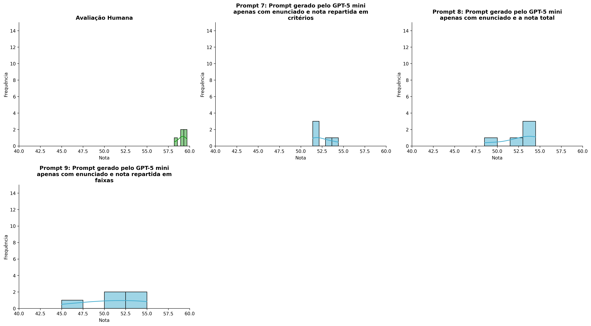
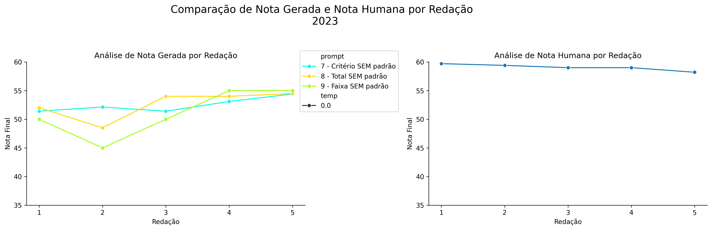
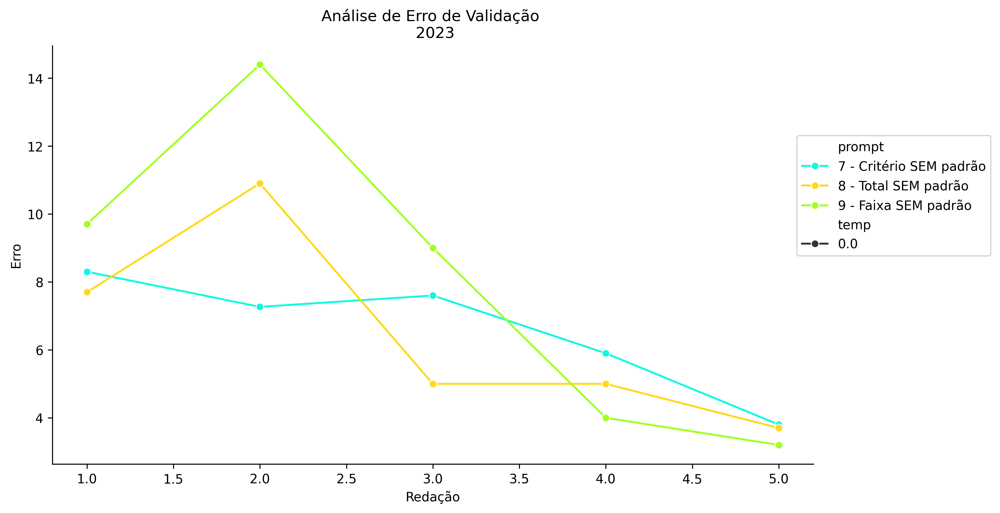
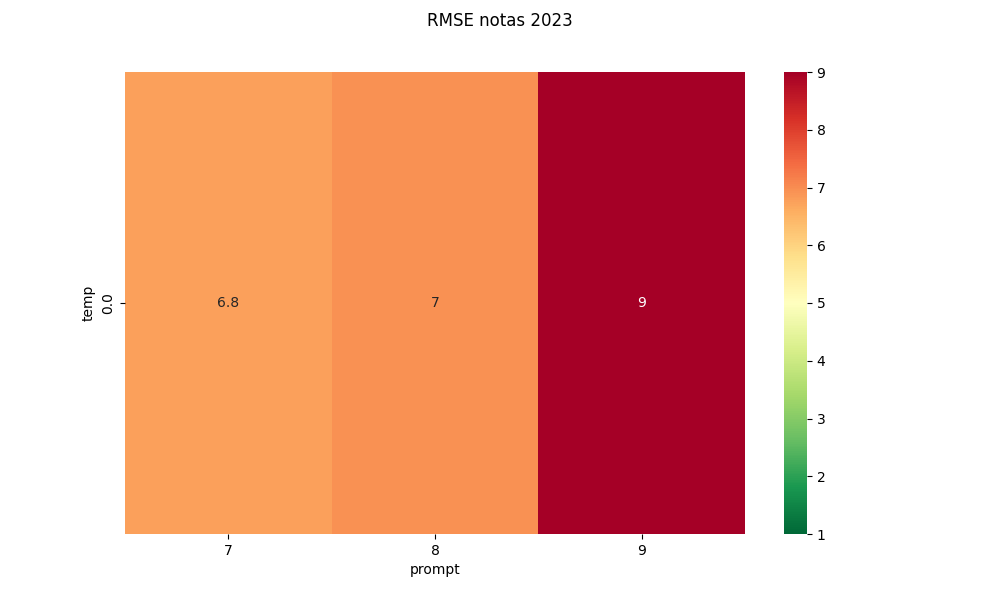
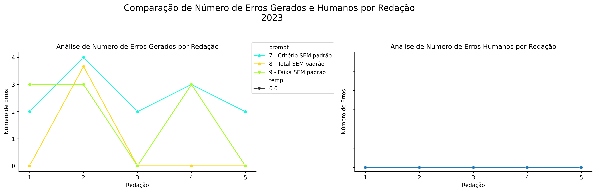
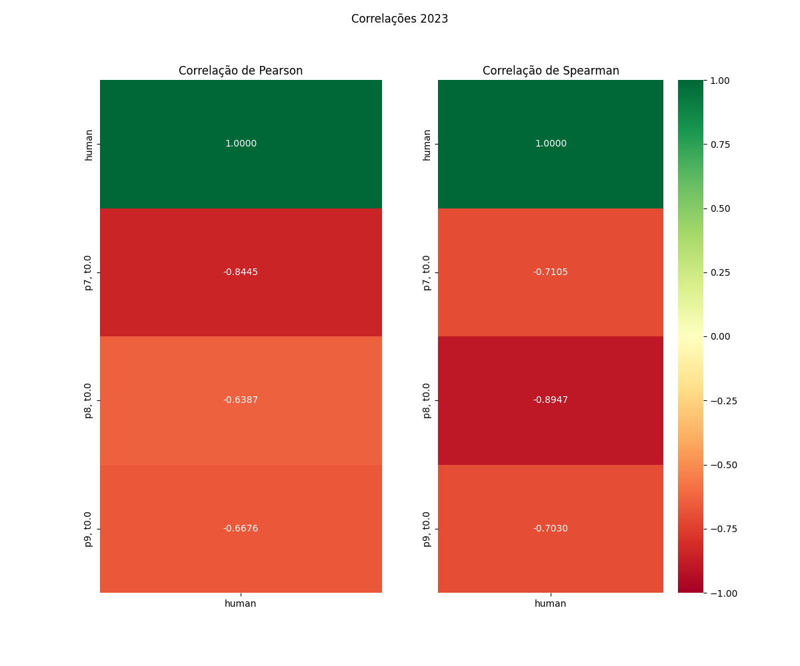

# Relatório de Avaliação: gemma-4-31B-it - 3 execuções
**Gerado em: 14/05/2026 12:28:32**

## 1. Distribuição de Notas
Nesta seção comparamos as notas atribuídas pelo modelo gemma-4-31B-it em diferentes prompts/temperaturas versus a correção humana.

## 2. Comparação de Notas Geradas e Humanas
Nesta seção, apresentamos a comparação entre as notas finais geradas pelo modelo e as notas dadas por avaliadores humanos.

## 3. Análise de Erro Absoluto de Validação

<table>
  <tr>
    <td>
      
    </td>
    <td>
      <table border="1" class="dataframe">
  <thead>
    <tr style="text-align: center;">
      <th>prompt</th>
      <th>temp</th>
      <th>area_sob_curva</th>
      <th>mae</th>
      <th>rmse</th>
    </tr>
  </thead>
  <tbody>
    <tr>
      <td>7</td>
      <td>0.0</td>
      <td>26.8167</td>
      <td>6.5733</td>
      <td>6.7632</td>
    </tr>
    <tr>
      <td>8</td>
      <td>0.0</td>
      <td>26.6000</td>
      <td>6.4600</td>
      <td>6.9540</td>
    </tr>
    <tr>
      <td>9</td>
      <td>0.0</td>
      <td>33.8500</td>
      <td>8.0600</td>
      <td>9.0409</td>
    </tr>
  </tbody>
</table>
    </td>
  </tr>
</table>

## 4. Análise de RMSE por Prompt e Temperatura
Nesta seção, apresentamos o heatmap de RMSE calculado por combinação de prompt e temperatura.

## 5. Análise de Erros Gramaticais
Comparação da sensibilidade do modelo na detecção/geração de erros em relação ao padrão humano.

## 6. Correlações

## Estatísticas Descritivas
### Modelo gemma-4-31B-it
|       |    prompt |   temp |   redacao |   nota_final |   nota_final_std |       1A |        1B |        1C |      CGPL |   num_errors |
|:------|----------:|-------:|----------:|-------------:|-----------------:|---------:|----------:|----------:|----------:|-------------:|
| count | 15        |     15 |  15       |     15       |         15       | 5        |  5        |  5        |  5        |     15       |
| mean  |  8        |      0 |   3       |     52.0289  |          0.7698  | 9.06666  |  9.26666  | 17.4667   | 16.6867   |      1.71111 |
| std   |  0.845154 |      0 |   1.46385 |      2.79279 |          2.98142 | 0.149056 |  0.434612 |  0.505527 |  0.536251 |      1.54749 |
| min   |  7        |      0 |   1       |     45       |          0       | 9        |  9        | 17        | 16.1333   |      0       |
| 25%   |  7        |      0 |   2       |     50.7     |          0       | 9        |  9        | 17        | 16.4      |      0       |
| 50%   |  8        |      0 |   3       |     52.1333  |          0       | 9        |  9        | 17.3333   | 16.4      |      2       |
| 75%   |  9        |      0 |   4       |     54.2     |          0       | 9        |  9.3333   | 18        | 17.1      |      3       |
| max   |  9        |      0 |   5       |     55       |         11.547   | 9.3333   | 10        | 18        | 17.4      |      4       |

### Humano
|       |   redacao |   nota_final |
|:------|----------:|-------------:|
| count |   5       |     5        |
| mean  |   3       |    59.06     |
| std   |   1.58114 |     0.563915 |
| min   |   1       |    58.2      |
| 25%   |   2       |    59        |
| 50%   |   3       |    59        |
| 75%   |   4       |    59.4      |
| max   |   5       |    59.7      |
