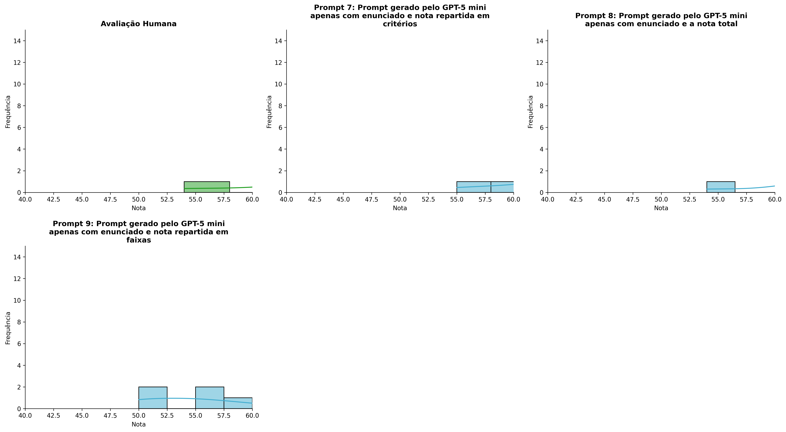
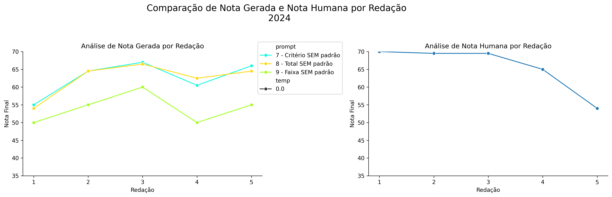
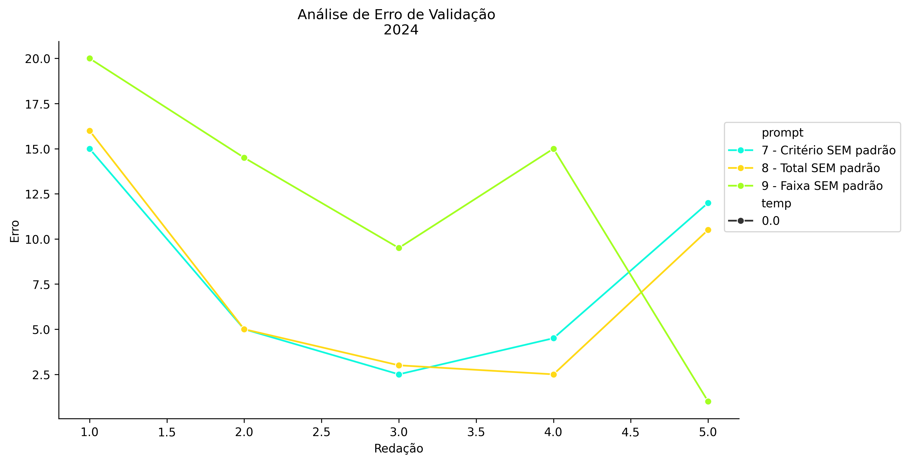
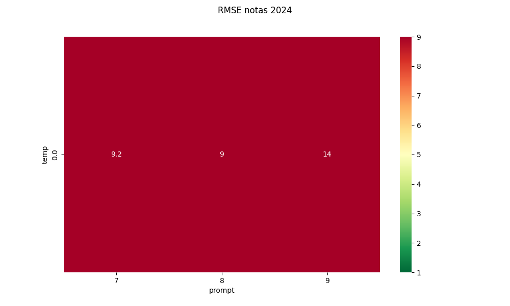
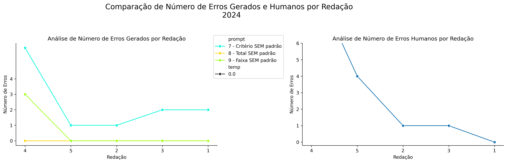
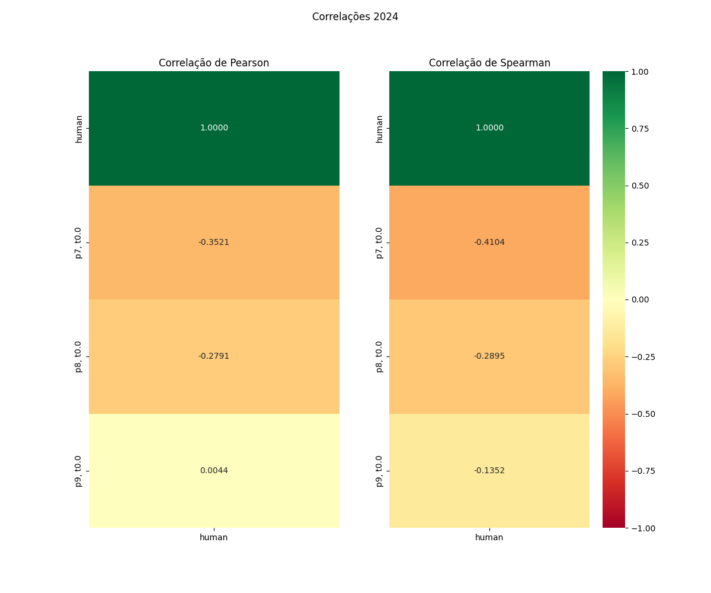

# Relatório de Avaliação: gemma-4-31B-it - 3 execuções
**Gerado em: 21/05/2026 08:51:23**

## 1. Distribuição de Notas
Nesta seção comparamos as notas atribuídas pelo modelo gemma-4-31B-it em diferentes prompts/temperaturas versus a correção humana.

## 2. Comparação de Notas Geradas e Humanas
Nesta seção, apresentamos a comparação entre as notas finais geradas pelo modelo e as notas dadas por avaliadores humanos.

## 3. Análise de Erro Absoluto de Validação

<table>
  <tr>
    <td>
      
    </td>
    <td>
      <table border="1" class="dataframe">
  <thead>
    <tr style="text-align: center;">
      <th>prompt</th>
      <th>temp</th>
      <th>area_sob_curva</th>
      <th>mae</th>
      <th>rmse</th>
    </tr>
  </thead>
  <tbody>
    <tr>
      <td>7</td>
      <td>0.0</td>
      <td>25.50</td>
      <td>7.8</td>
      <td>9.1706</td>
    </tr>
    <tr>
      <td>8</td>
      <td>0.0</td>
      <td>23.75</td>
      <td>7.4</td>
      <td>9.0167</td>
    </tr>
    <tr>
      <td>9</td>
      <td>0.0</td>
      <td>49.50</td>
      <td>12.0</td>
      <td>13.6125</td>
    </tr>
  </tbody>
</table>
    </td>
  </tr>
</table>

## 4. Análise de RMSE por Prompt e Temperatura
Nesta seção, apresentamos o heatmap de RMSE calculado por combinação de prompt e temperatura.

## 5. Análise de Erros Gramaticais
Comparação da sensibilidade do modelo na detecção/geração de erros em relação ao padrão humano.

## 6. Correlações

## Estatísticas Descritivas
### Modelo gemma-4-31B-it
|       |    prompt |   temp |   redacao |   nota_final |   nota_final_std |       1A |      1B |       1C |     CGPL |   num_errors |
|:------|----------:|-------:|----------:|-------------:|-----------------:|---------:|--------:|---------:|---------:|-------------:|
| count | 15        |     15 |  15       |     15       |               15 | 5        | 5       |  5       |  5       |     15       |
| mean  |  8        |      0 |   3       |     59.6667  |                0 | 8.9      | 8.7     | 21.2     | 23.8     |      1       |
| std   |  0.845154 |      0 |   1.46385 |      5.99901 |                0 | 0.547723 | 1.03682 |  3.11448 |  1.03682 |      1.69031 |
| min   |  7        |      0 |   1       |     50       |                0 | 8        | 7       | 16       | 22       |      0       |
| 25%   |  7        |      0 |   2       |     55       |                0 | 9        | 8.5     | 21       | 24       |      0       |
| 50%   |  8        |      0 |   3       |     60.5     |                0 | 9        | 9       | 22       | 24       |      0       |
| 75%   |  9        |      0 |   4       |     64.5     |                0 | 9        | 9.5     | 23       | 24.5     |      1.5     |
| max   |  9        |      0 |   5       |     67       |                0 | 9.5      | 9.5     | 24       | 24.5     |      6       |

### Humano
|       |   redacao |   nota_final |   num_errors |
|:------|----------:|-------------:|-------------:|
| count |   5       |      5       |      5       |
| mean  |   3       |     65.6     |      3.2     |
| std   |   1.58114 |      6.79522 |      4.08656 |
| min   |   1       |     54       |      0       |
| 25%   |   2       |     65       |      1       |
| 50%   |   3       |     69.5     |      1       |
| 75%   |   4       |     69.5     |      4       |
| max   |   5       |     70       |     10       |
