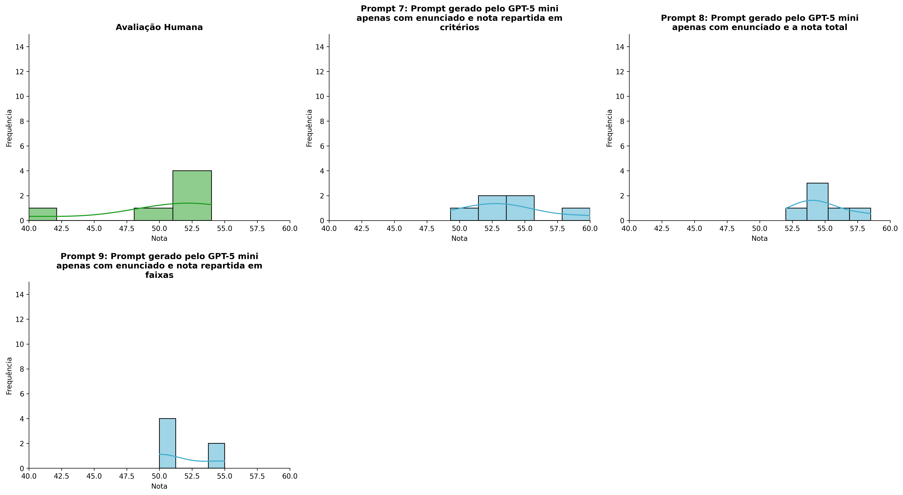
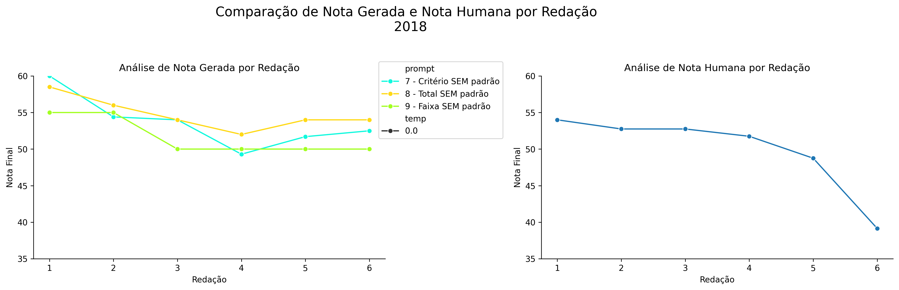
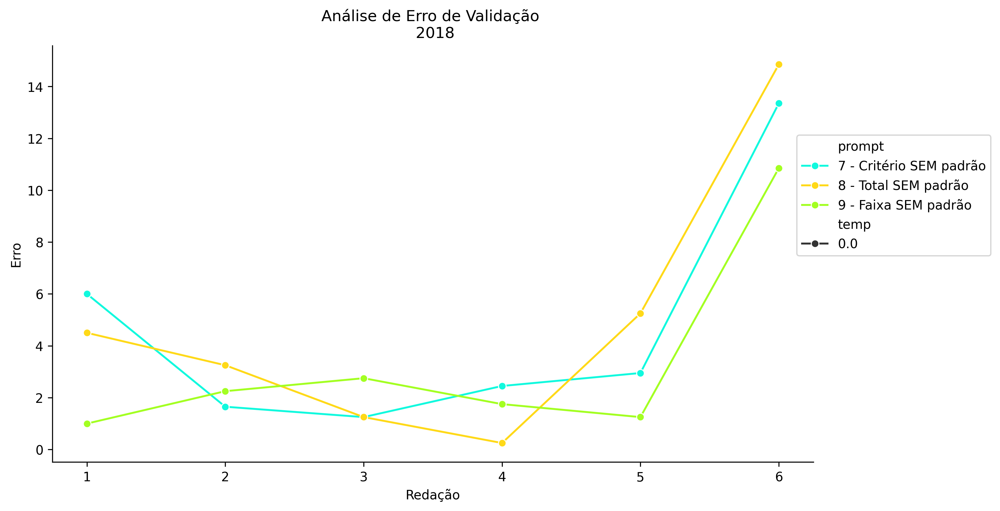
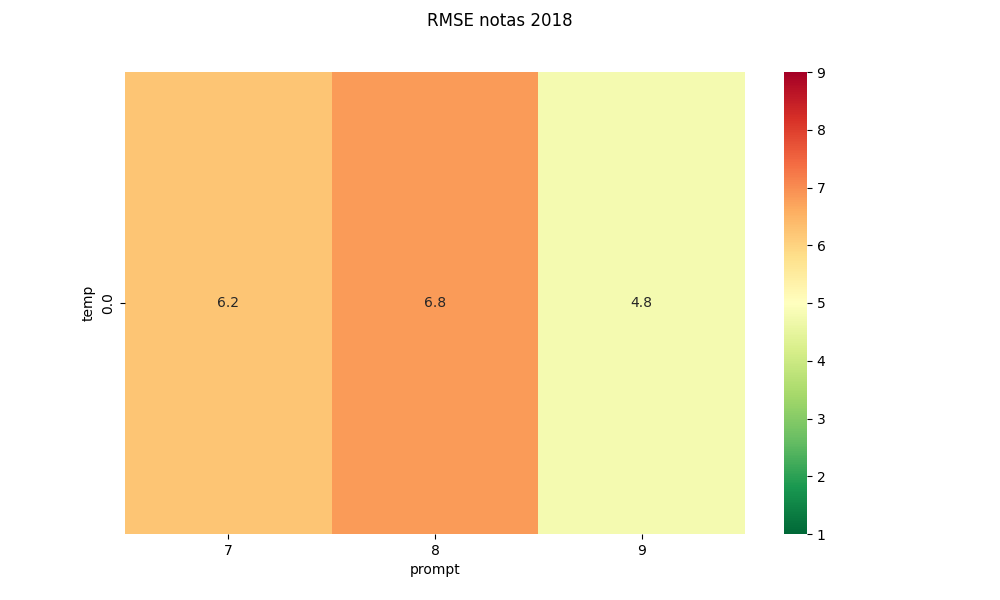
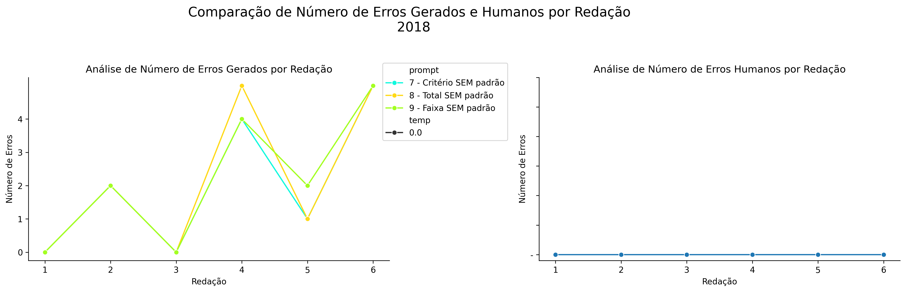
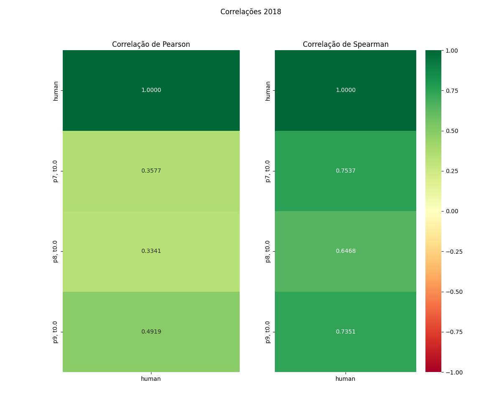

# Relatório de Avaliação: gemma-4-31b-it - 3 execuções
**Gerado em: 30/04/2026 16:37:02**

## 1. Distribuição de Notas
Nesta seção comparamos as notas atribuídas pelo modelo gemma em diferentes prompts/temperaturas versus a correção humana.

## 2. Comparação de Notas Geradas e Humanas
Nesta seção, apresentamos a comparação entre as notas finais geradas pelo modelo e as notas dadas por avaliadores humanos.

## 3. Análise de Erro Absoluto de Validação

<table>
  <tr>
    <td>
      
    </td>
    <td>
      <table border="1" class="dataframe">
  <thead>
    <tr style="text-align: center;">
      <th>prompt</th>
      <th>temp</th>
      <th>area_sob_curva</th>
      <th>mae</th>
      <th>rmse</th>
    </tr>
  </thead>
  <tbody>
    <tr>
      <td>7</td>
      <td>0.0</td>
      <td>17.975</td>
      <td>4.6083</td>
      <td>6.2345</td>
    </tr>
    <tr>
      <td>8</td>
      <td>0.0</td>
      <td>19.675</td>
      <td>4.8917</td>
      <td>6.8377</td>
    </tr>
    <tr>
      <td>9</td>
      <td>0.0</td>
      <td>13.925</td>
      <td>3.3083</td>
      <td>4.7605</td>
    </tr>
  </tbody>
</table>
    </td>
  </tr>
</table>

## 4. Análise de RMSE por Prompt e Temperatura
Nesta seção, apresentamos o heatmap de RMSE calculado por combinação de prompt e temperatura.

## 5. Análise de Erros Gramaticais
Comparação da sensibilidade do modelo na detecção/geração de erros em relação ao padrão humano.

## 6. Correlações

## Estatísticas Descritivas
### Modelo gemma-4-31b-it
|       |    prompt |   temp |   redacao |   nota_final |   nota_final_std |        1A |        1B |       1C |     CGPL |   num_errors |
|:------|----------:|-------:|----------:|-------------:|-----------------:|----------:|----------:|---------:|---------:|-------------:|
| count | 18        |     18 |  18       |     18       |               18 |  6        |  6        |  6       |  6       |     18       |
| mean  |  8        |      0 |   3.5     |     53.3556  |                0 |  9.08333  |  9.16667  | 18       | 17.4     |      2.11111 |
| std   |  0.840168 |      0 |   1.75734 |      2.99573 |                0 |  0.491596 |  0.752773 |  1.09545 |  1.48189 |      2.02598 |
| min   |  7        |      0 |   1       |     49.3     |                0 |  8.5      |  8        | 17       | 15.8     |      0       |
| 25%   |  7        |      0 |   2       |     50.425   |                0 |  9        |  9        | 17.25    | 16.55    |      0       |
| 50%   |  8        |      0 |   3.5     |     54       |                0 |  9        |  9        | 18       | 17.05    |      2       |
| 75%   |  9        |      0 |   5       |     54.85    |                0 |  9        |  9.75     | 18       | 17.85    |      4       |
| max   |  9        |      0 |   6       |     60       |                0 | 10        | 10        | 20       | 20       |      5       |

### Humano
|       |   redacao |   nota_final |
|:------|----------:|-------------:|
| count |   6       |      6       |
| mean  |   3.5     |     49.8583  |
| std   |   1.87083 |      5.53809 |
| min   |   1       |     39.15    |
| 25%   |   2.25    |     49.5     |
| 50%   |   3.5     |     52.25    |
| 75%   |   4.75    |     52.75    |
| max   |   6       |     54       |
