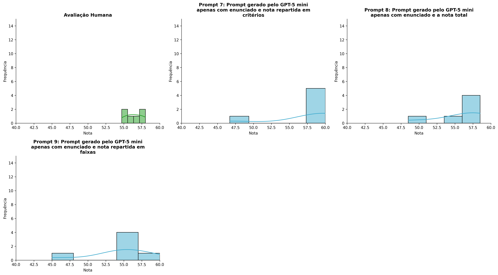
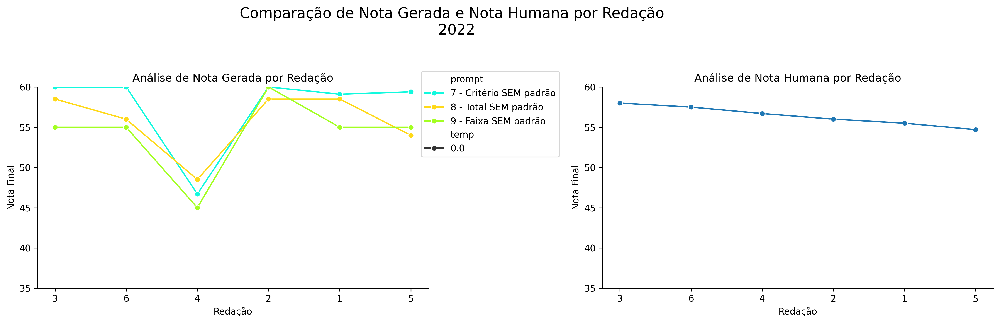
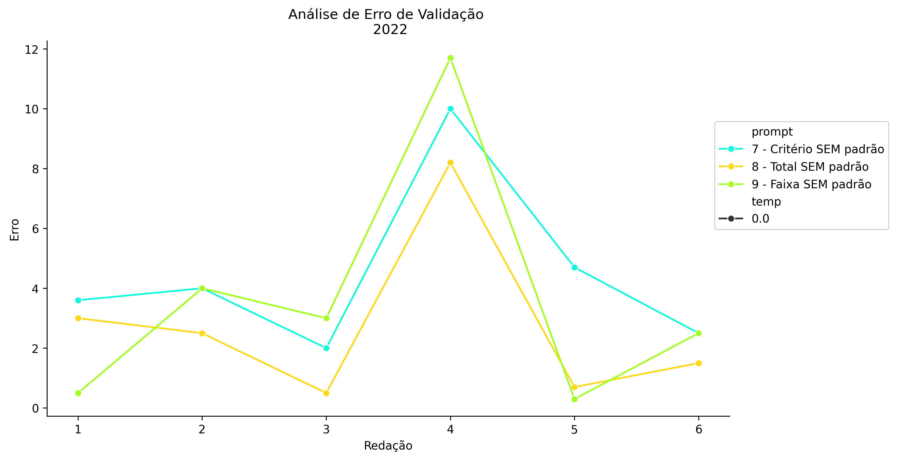
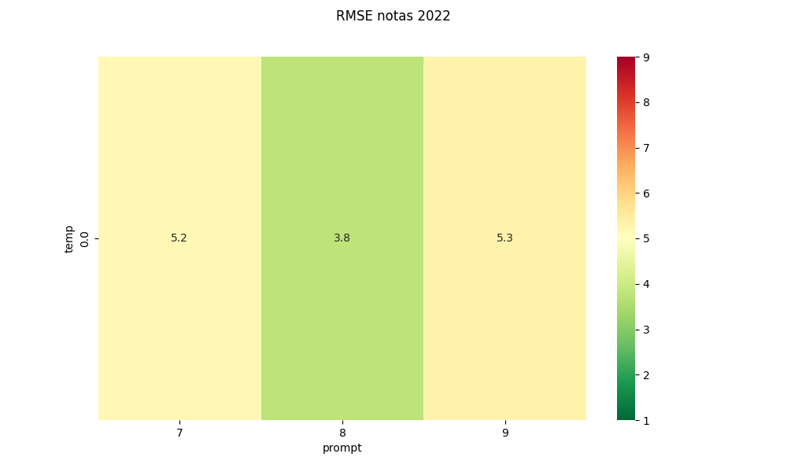
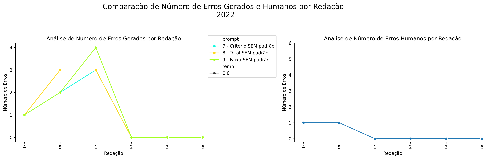
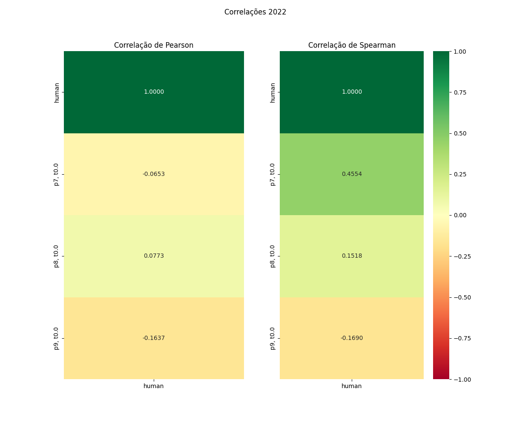

# Relatório de Avaliação: gemma-4-31b-it - 3 execuções
**Gerado em: 30/04/2026 15:23:43**

## 1. Distribuição de Notas
Nesta seção comparamos as notas atribuídas pelo modelo gemma em diferentes prompts/temperaturas versus a correção humana.

## 2. Comparação de Notas Geradas e Humanas
Nesta seção, apresentamos a comparação entre as notas finais geradas pelo modelo e as notas dadas por avaliadores humanos.

## 3. Análise de Erro Absoluto de Validação

<table>
  <tr>
    <td>
      
    </td>
    <td>
      <table border="1" class="dataframe">
  <thead>
    <tr style="text-align: center;">
      <th>prompt</th>
      <th>temp</th>
      <th>area_sob_curva</th>
      <th>mae</th>
      <th>rmse</th>
    </tr>
  </thead>
  <tbody>
    <tr>
      <td>7</td>
      <td>0.0</td>
      <td>23.75</td>
      <td>4.4667</td>
      <td>5.1849</td>
    </tr>
    <tr>
      <td>8</td>
      <td>0.0</td>
      <td>14.15</td>
      <td>2.7333</td>
      <td>3.7745</td>
    </tr>
    <tr>
      <td>9</td>
      <td>0.0</td>
      <td>20.50</td>
      <td>3.6667</td>
      <td>5.2991</td>
    </tr>
  </tbody>
</table>
    </td>
  </tr>
</table>

## 4. Análise de RMSE por Prompt e Temperatura
Nesta seção, apresentamos o heatmap de RMSE calculado por combinação de prompt e temperatura.

## 5. Análise de Erros Gramaticais
Comparação da sensibilidade do modelo na detecção/geração de erros em relação ao padrão humano.

## 6. Correlações

## Estatísticas Descritivas
### Modelo gemma-4-31b-it
|       |    prompt |   temp |   redacao |   nota_final |   nota_final_std |        1A |        1B |       1C |     CGPL |   num_errors |
|:------|----------:|-------:|----------:|-------------:|-----------------:|----------:|----------:|---------:|---------:|-------------:|
| count | 18        |     18 |  18       |     18       |               18 |  6        |  6        |  6       |  6       |     18       |
| mean  |  8        |      0 |   3.5     |     55.7889  |                0 |  9.83333  |  9.66667  | 19.1667  | 18.8667  |      1.11111 |
| std   |  0.840168 |      0 |   1.75734 |      4.69579 |                0 |  0.408248 |  0.816497 |  2.04124 |  2.07621 |      1.36722 |
| min   |  7        |      0 |   1       |     45       |                0 |  9        |  8        | 15       | 14.7     |      0       |
| 25%   |  7        |      0 |   2       |     55       |                0 | 10        | 10        | 20       | 19.175   |      0       |
| 50%   |  8        |      0 |   3.5     |     57.25    |                0 | 10        | 10        | 20       | 19.7     |      0.5     |
| 75%   |  9        |      0 |   5       |     59.325   |                0 | 10        | 10        | 20       | 20       |      2       |
| max   |  9        |      0 |   6       |     60       |                0 | 10        | 10        | 20       | 20       |      4       |

### Humano
|       |   redacao |   nota_final |        1A |        1B |        1C |      CGPL |   num_errors |
|:------|----------:|-------------:|----------:|----------:|----------:|----------:|-------------:|
| count |   6       |      6       |  6        |  6        |  6        |  6        |     6        |
| mean  |   3.5     |     56.4     |  9.75     |  9.75     | 18.5      | 18.4      |     0.333333 |
| std   |   1.87083 |      1.24258 |  0.273861 |  0.273861 |  0.447214 |  0.532917 |     0.516398 |
| min   |   1       |     54.7     |  9.5      |  9.5      | 18        | 17.7      |     0        |
| 25%   |   2.25    |     55.625   |  9.5      |  9.5      | 18.125    | 18.05     |     0        |
| 50%   |   3.5     |     56.35    |  9.75     |  9.75     | 18.5      | 18.35     |     0        |
| 75%   |   4.75    |     57.3     | 10        | 10        | 18.875    | 18.875    |     0.75     |
| max   |   6       |     58       | 10        | 10        | 19        | 19        |     1        |
