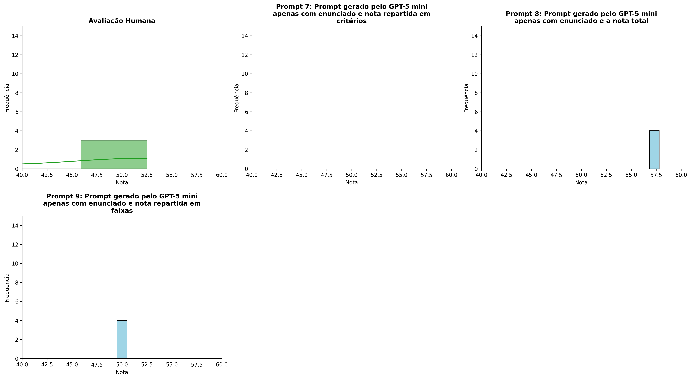
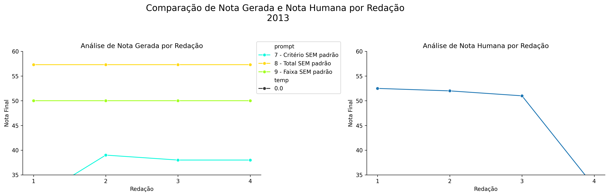
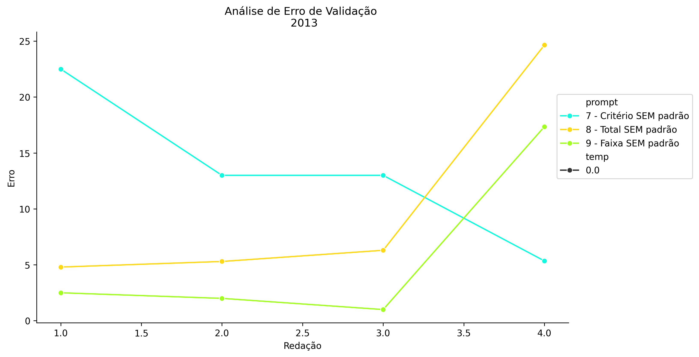
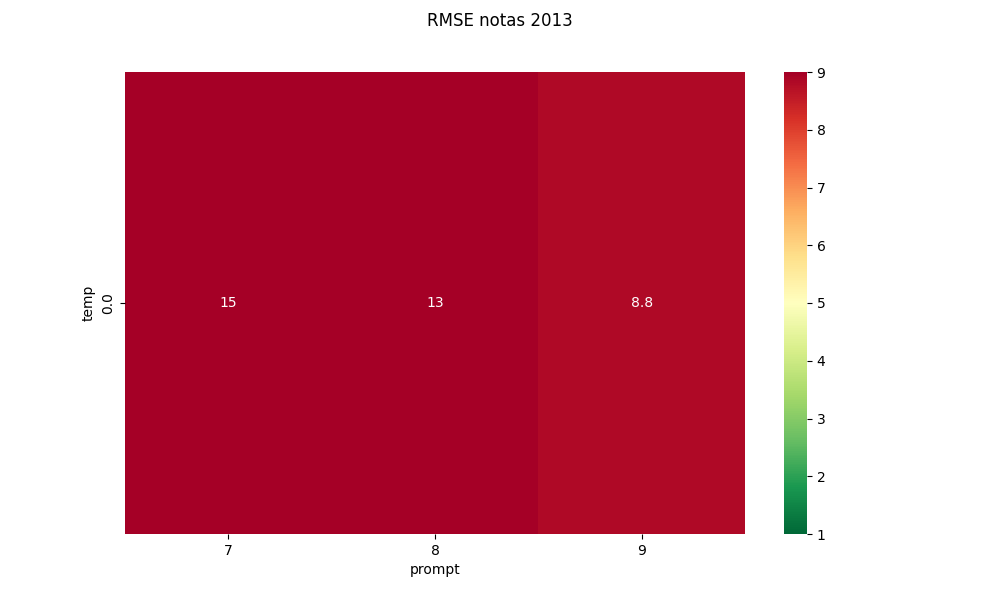
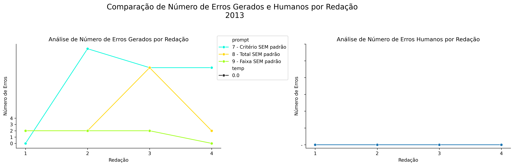
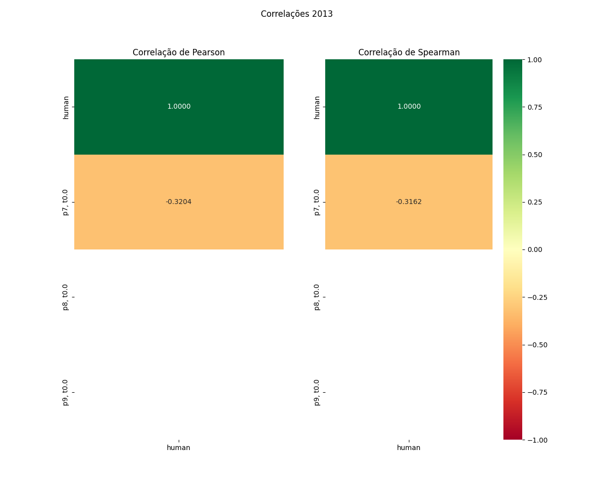

# Relatório de Avaliação: gpt-oss-120b - 3 execuções
**Gerado em: 21/05/2026 08:51:29**

## 1. Distribuição de Notas
Nesta seção comparamos as notas atribuídas pelo modelo gpt-oss-120b em diferentes prompts/temperaturas versus a correção humana.

## 2. Comparação de Notas Geradas e Humanas
Nesta seção, apresentamos a comparação entre as notas finais geradas pelo modelo e as notas dadas por avaliadores humanos.

## 3. Análise de Erro Absoluto de Validação

<table>
  <tr>
    <td>
      
    </td>
    <td>
      <table border="1" class="dataframe">
  <thead>
    <tr style="text-align: center;">
      <th>prompt</th>
      <th>temp</th>
      <th>area_sob_curva</th>
      <th>mae</th>
      <th>rmse</th>
    </tr>
  </thead>
  <tbody>
    <tr>
      <td>7</td>
      <td>0.0</td>
      <td>39.925</td>
      <td>13.4625</td>
      <td>14.7722</td>
    </tr>
    <tr>
      <td>8</td>
      <td>0.0</td>
      <td>26.325</td>
      <td>10.2625</td>
      <td>13.2140</td>
    </tr>
    <tr>
      <td>9</td>
      <td>0.0</td>
      <td>12.925</td>
      <td>5.7125</td>
      <td>8.8356</td>
    </tr>
  </tbody>
</table>
    </td>
  </tr>
</table>

## 4. Análise de RMSE por Prompt e Temperatura
Nesta seção, apresentamos o heatmap de RMSE calculado por combinação de prompt e temperatura.

## 5. Análise de Erros Gramaticais
Comparação da sensibilidade do modelo na detecção/geração de erros em relação ao padrão humano.

## 6. Correlações

## Estatísticas Descritivas
### Modelo gpt-oss-120b
|       |    prompt |   temp |   redacao |   nota_final |   nota_final_std |   1A |      1B |      1C |     CGPL |   num_errors |
|:------|----------:|-------:|----------:|-------------:|-----------------:|-----:|--------:|--------:|---------:|-------------:|
| count | 12        |     12 |  12       |     12       |               12 |    4 | 4       | 4       |  4       |     12       |
| mean  |  8        |      0 |   2.5     |     47.85    |                0 |    6 | 5.75    | 4.25    | 20.25    |      5.25    |
| std   |  0.852803 |      0 |   1.16775 |      9.37448 |                0 |    4 | 3.94757 | 2.98608 |  6.65207 |      5.64277 |
| min   |  7        |      0 |   1       |     30       |                0 |    0 | 0       | 0       | 15       |      0       |
| 25%   |  7        |      0 |   1.75    |     38.75    |                0 |    6 | 5.25    | 3.75    | 17.25    |      2       |
| 50%   |  8        |      0 |   2.5     |     50       |                0 |    8 | 7       | 5       | 18       |      2       |
| 75%   |  9        |      0 |   3.25    |     57.3     |                0 |    8 | 7.5     | 5.5     | 21       |     12       |
| max   |  9        |      0 |   4       |     57.3     |                0 |    8 | 9       | 7       | 30       |     15       |

### Humano
|       |   redacao |   nota_final |
|:------|----------:|-------------:|
| count |   4       |      4       |
| mean  |   2.5     |     47.0375  |
| std   |   1.29099 |      9.61192 |
| min   |   1       |     32.65    |
| 25%   |   1.75    |     46.4125  |
| 50%   |   2.5     |     51.5     |
| 75%   |   3.25    |     52.125   |
| max   |   4       |     52.5     |
