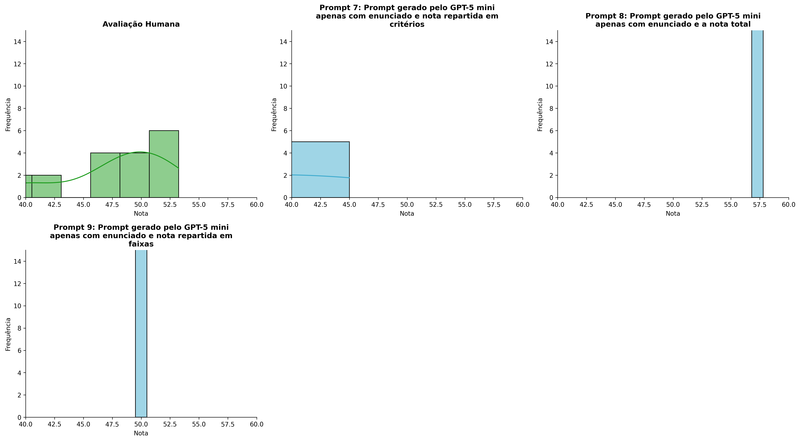
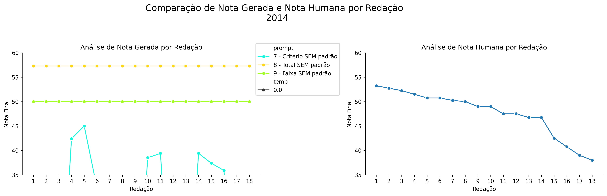
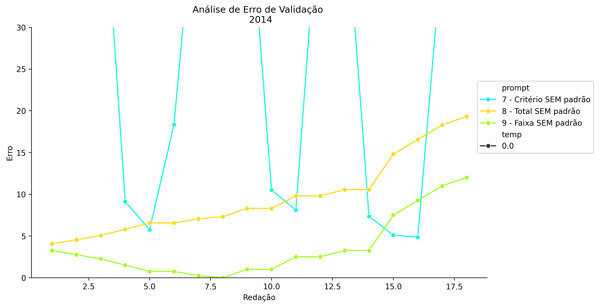
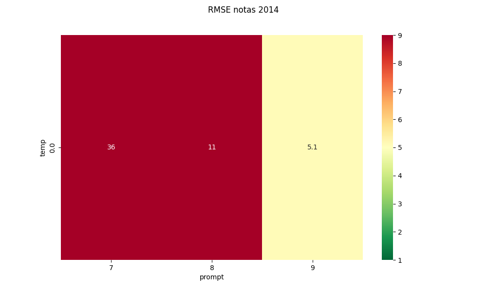
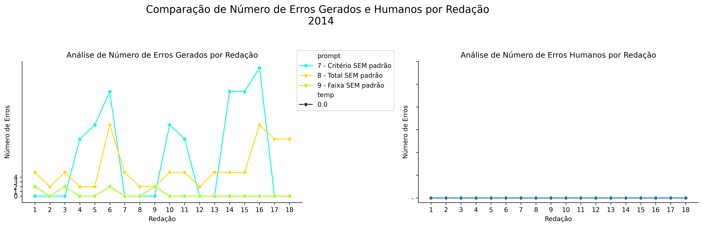
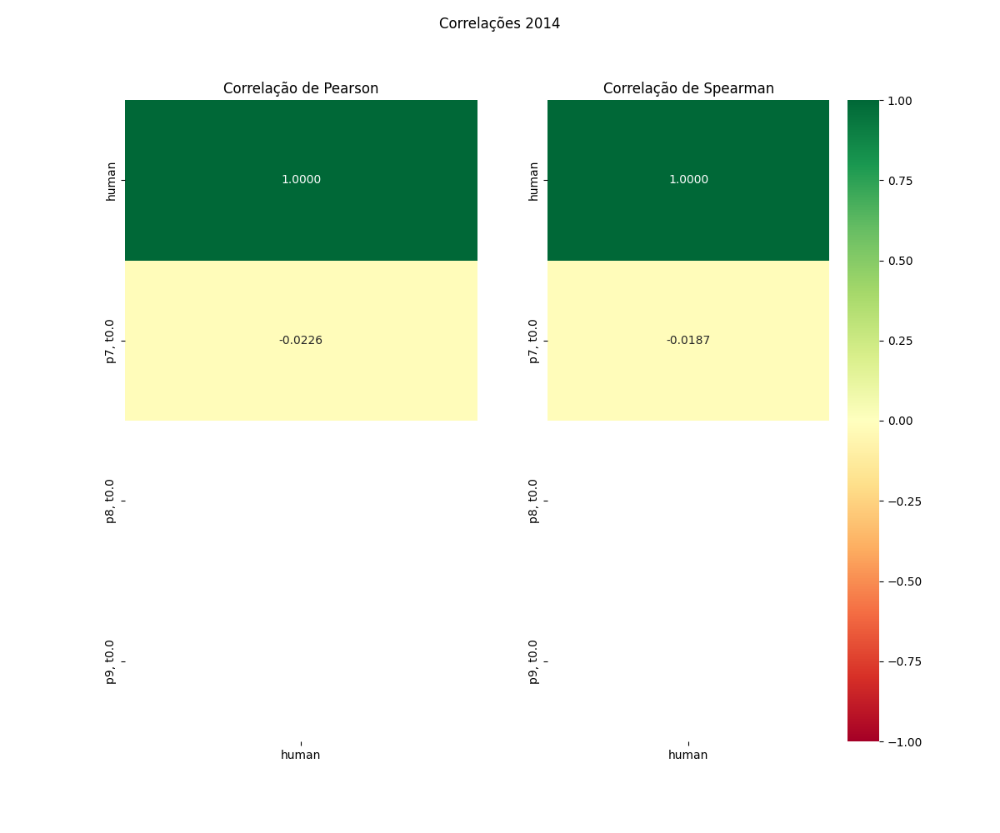

# Relatório de Avaliação: gpt-oss-120b - 3 execuções
**Gerado em: 14/05/2026 12:29:08**

## 1. Distribuição de Notas
Nesta seção comparamos as notas atribuídas pelo modelo gpt-oss-120b em diferentes prompts/temperaturas versus a correção humana.

## 2. Comparação de Notas Geradas e Humanas
Nesta seção, apresentamos a comparação entre as notas finais geradas pelo modelo e as notas dadas por avaliadores humanos.

## 3. Análise de Erro Absoluto de Validação

<table>
  <tr>
    <td>
      
    </td>
    <td>
      <table border="1" class="dataframe">
  <thead>
    <tr style="text-align: center;">
      <th>prompt</th>
      <th>temp</th>
      <th>area_sob_curva</th>
      <th>mae</th>
      <th>rmse</th>
    </tr>
  </thead>
  <tbody>
    <tr>
      <td>7</td>
      <td>0.0</td>
      <td>502.225</td>
      <td>30.4361</td>
      <td>36.4486</td>
    </tr>
    <tr>
      <td>8</td>
      <td>0.0</td>
      <td>161.475</td>
      <td>9.6194</td>
      <td>10.6402</td>
    </tr>
    <tr>
      <td>9</td>
      <td>0.0</td>
      <td>57.125</td>
      <td>3.5972</td>
      <td>5.1048</td>
    </tr>
  </tbody>
</table>
    </td>
  </tr>
</table>

## 4. Análise de RMSE por Prompt e Temperatura
Nesta seção, apresentamos o heatmap de RMSE calculado por combinação de prompt e temperatura.

## 5. Análise de Erros Gramaticais
Comparação da sensibilidade do modelo na detecção/geração de erros em relação ao padrão humano.

## 6. Correlações

## Estatísticas Descritivas
### Modelo gpt-oss-120b
|       |    prompt |   temp |   redacao |   nota_final |   nota_final_std |       1A |       1B |       1C |     CGPL |   num_errors |
|:------|----------:|-------:|----------:|-------------:|-----------------:|---------:|---------:|---------:|---------:|-------------:|
| count | 54        |     54 |  54       |      54      |               54 | 18       | 18       | 18       | 18       |     54       |
| mean  |  8        |      0 |   9.5     |      41.5148 |                0 |  3.19444 |  3.77778 |  6.36111 |  3.91111 |      4.83333 |
| std   |  0.824163 |      0 |   5.23684 |      20.9124 |                0 |  3.68279 |  4.37312 |  7.36407 |  4.76703 |      7.0517  |
| min   |  7        |      0 |   1       |       0      |                0 |  0       |  0       |  0       |  0       |      0       |
| 25%   |  7        |      0 |   5       |      38.725  |                0 |  0       |  0       |  0       |  0       |      0       |
| 50%   |  8        |      0 |   9.5     |      50      |                0 |  0       |  0       |  0       |  0       |      2       |
| 75%   |  9        |      0 |  14       |      57.3    |                0 |  7       |  8.75    | 14       |  8.15    |      5       |
| max   |  9        |      0 |  18       |      57.3    |                0 |  8       |  9       | 16.5     | 12       |     27       |

### Humano
|       |   redacao |   nota_final |
|:------|----------:|-------------:|
| count |  18       |     18       |
| mean  |   9.5     |     47.6806  |
| std   |   5.33854 |      4.67928 |
| min   |   1       |     38       |
| 25%   |   5.25    |     46.75    |
| 50%   |   9.5     |     49       |
| 75%   |  13.75    |     50.75    |
| max   |  18       |     53.25    |
