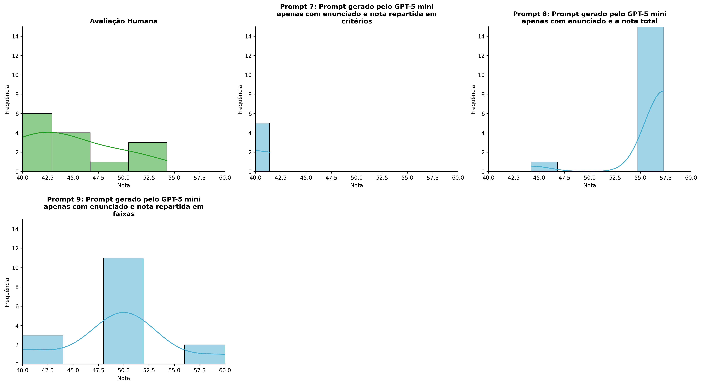
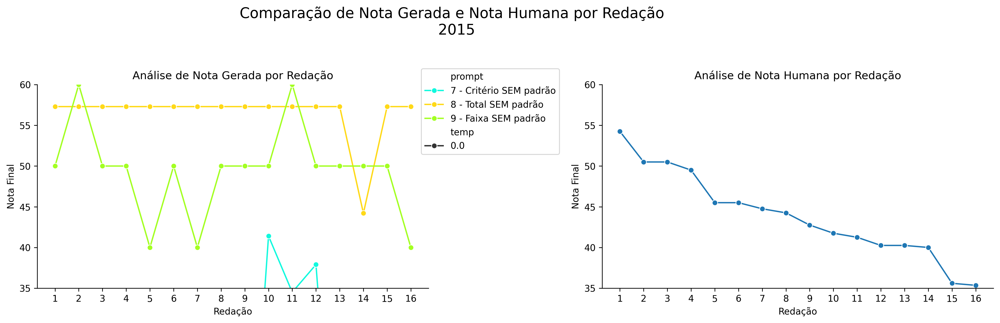
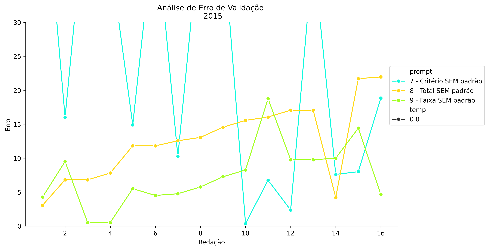
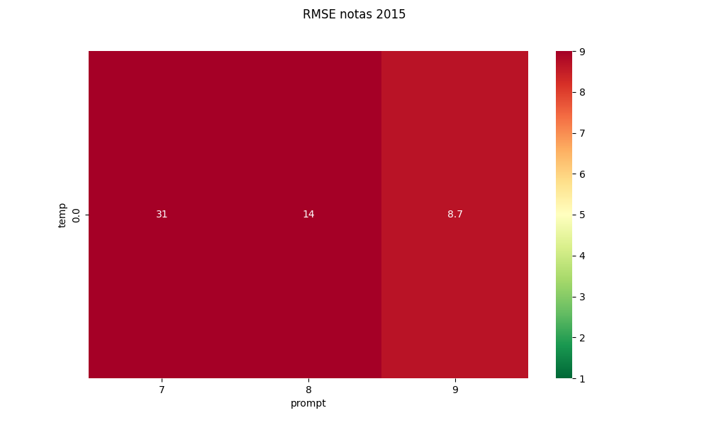
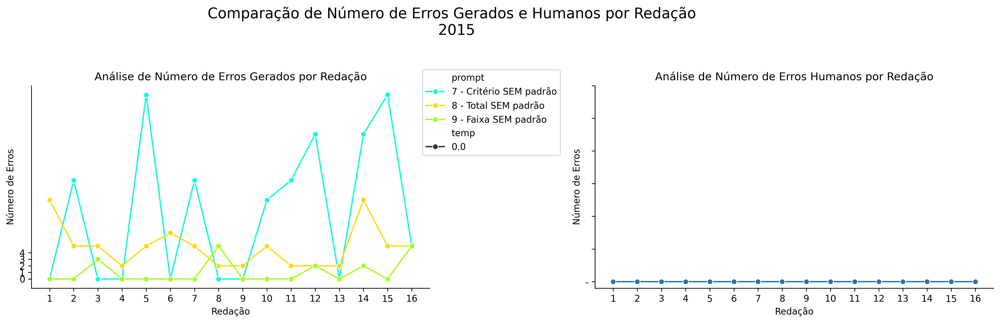
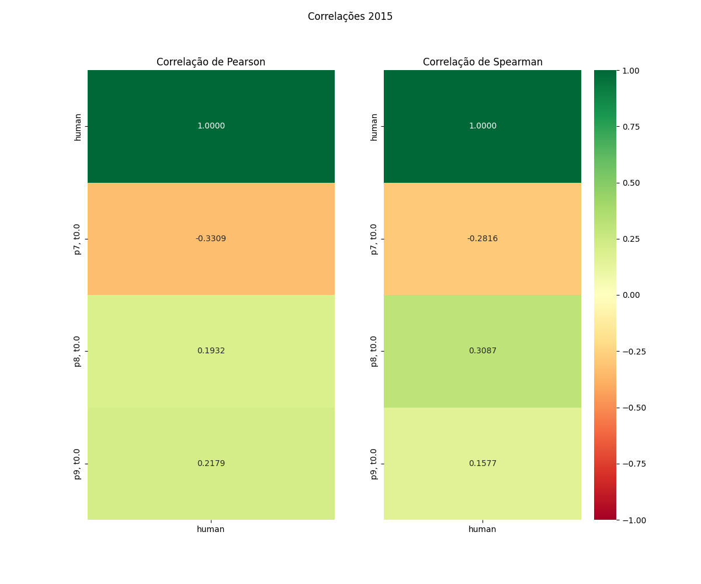

# Relatório de Avaliação: gpt-oss-120b - 3 execuções
**Gerado em: 14/05/2026 17:47:31**

## 1. Distribuição de Notas
Nesta seção comparamos as notas atribuídas pelo modelo gpt-oss-120b em diferentes prompts/temperaturas versus a correção humana.

## 2. Comparação de Notas Geradas e Humanas
Nesta seção, apresentamos a comparação entre as notas finais geradas pelo modelo e as notas dadas por avaliadores humanos.

## 3. Análise de Erro Absoluto de Validação

<table>
  <tr>
    <td>
      
    </td>
    <td>
      <table border="1" class="dataframe">
  <thead>
    <tr style="text-align: center;">
      <th>prompt</th>
      <th>temp</th>
      <th>area_sob_curva</th>
      <th>mae</th>
      <th>rmse</th>
    </tr>
  </thead>
  <tbody>
    <tr>
      <td>7</td>
      <td>0.0</td>
      <td>365.50</td>
      <td>25.1281</td>
      <td>31.2659</td>
    </tr>
    <tr>
      <td>8</td>
      <td>0.0</td>
      <td>189.25</td>
      <td>12.6094</td>
      <td>13.7653</td>
    </tr>
    <tr>
      <td>9</td>
      <td>0.0</td>
      <td>113.60</td>
      <td>7.3781</td>
      <td>8.6827</td>
    </tr>
  </tbody>
</table>
    </td>
  </tr>
</table>

## 4. Análise de RMSE por Prompt e Temperatura
Nesta seção, apresentamos o heatmap de RMSE calculado por combinação de prompt e temperatura.

## 5. Análise de Erros Gramaticais
Comparação da sensibilidade do modelo na detecção/geração de erros em relação ao padrão humano.

## 6. Correlações

## Estatísticas Descritivas
### Modelo gpt-oss-120b
|       |    prompt |   temp |   redacao |   nota_final |   nota_final_std |       1A |       1B |       1C |     CGPL |   num_errors |
|:------|----------:|-------:|----------:|-------------:|-----------------:|---------:|---------:|---------:|---------:|-------------:|
| count | 48        |     48 |  48       |      48      |               48 | 16       | 16       | 16       | 16       |     48       |
| mean  |  8        |      0 |   8.5     |      41.5333 |                0 |  3.84375 |  4.25    |  6.84375 |  3.80625 |      5.35417 |
| std   |  0.825137 |      0 |   4.65855 |      19.4298 |                0 |  3.53892 |  3.94124 |  6.23891 |  3.75632 |      7.44766 |
| min   |  7        |      0 |   1       |       0      |                0 |  0       |  0       |  0       |  0       |      0       |
| 25%   |  7        |      0 |   4.75    |      34.5    |                0 |  0       |  0       |  0       |  0       |      0       |
| 50%   |  8        |      0 |   8.5     |      50      |                0 |  6       |  6       |  8.5     |  3.6     |      2       |
| 75%   |  9        |      0 |  12.25    |      57.3    |                0 |  7       |  8       | 12       |  7.5     |      5       |
| max   |  9        |      0 |  16       |      60      |                0 |  7.5     |  8       | 15       | 11.4     |     28       |

### Humano
|       |   redacao |   nota_final |
|:------|----------:|-------------:|
| count |  16       |     16       |
| mean  |   8.5     |     43.8719  |
| std   |   4.76095 |      5.34397 |
| min   |   1       |     35.35    |
| 25%   |   4.75    |     40.25    |
| 50%   |   8.5     |     43.5     |
| 75%   |  12.25    |     46.5     |
| max   |  16       |     54.25    |
