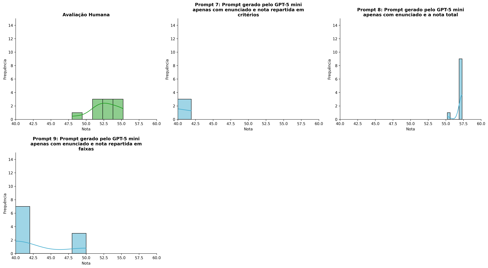
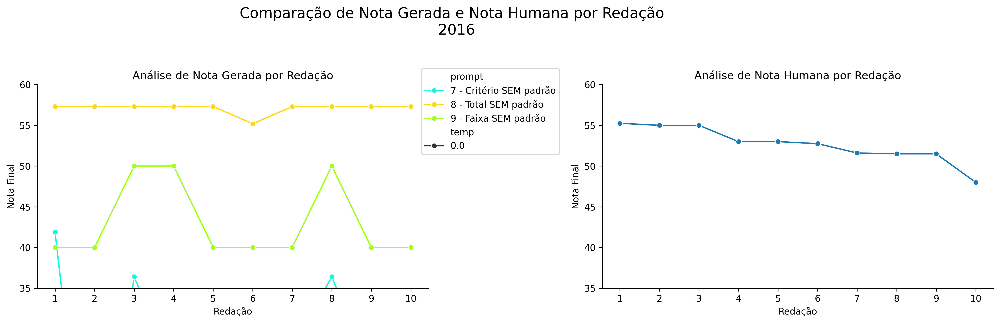
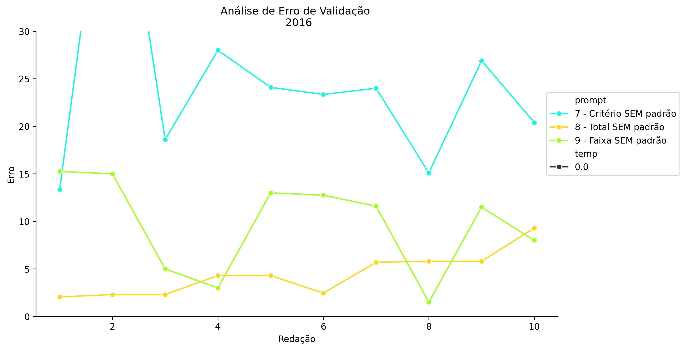
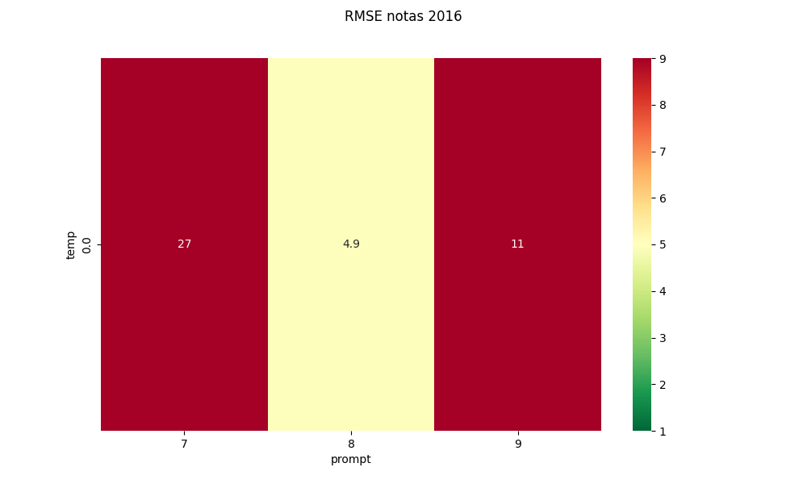
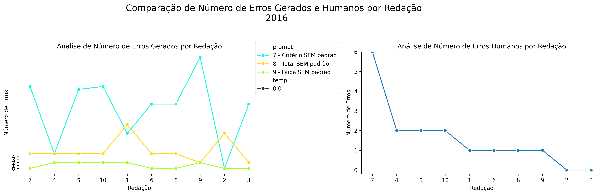
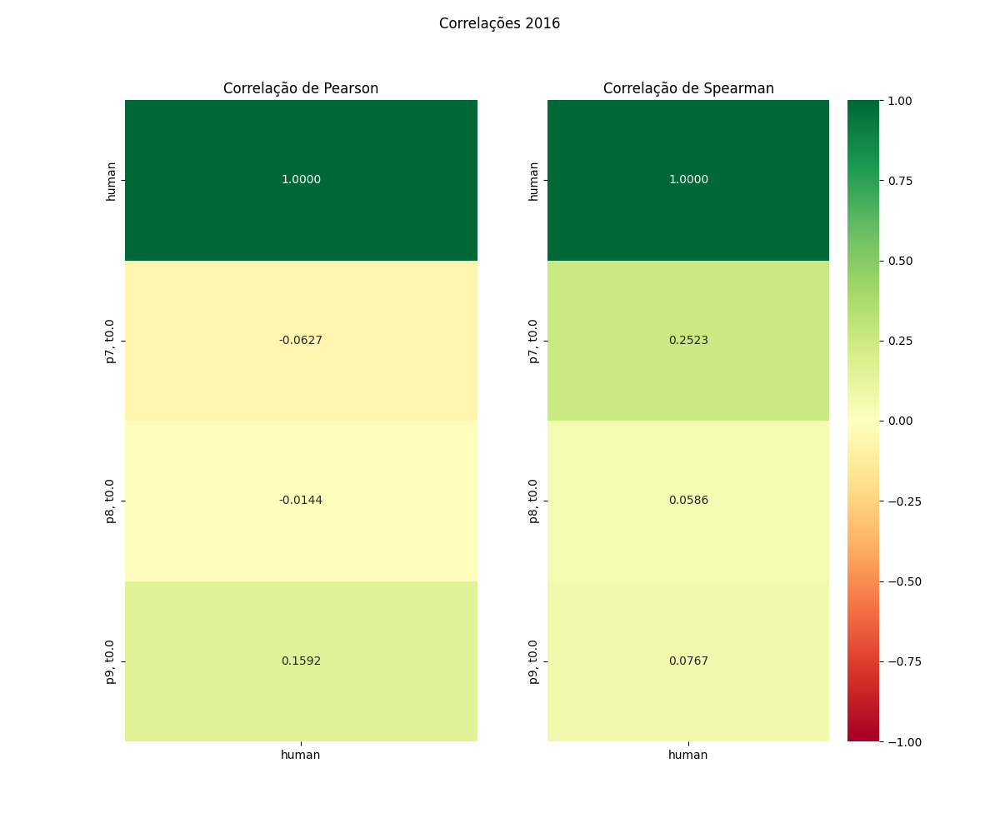

# Relatório de Avaliação: gpt-oss-120b - 3 execuções
**Gerado em: 14/05/2026 18:27:08**

## 1. Distribuição de Notas
Nesta seção comparamos as notas atribuídas pelo modelo gpt-oss-120b em diferentes prompts/temperaturas versus a correção humana.

## 2. Comparação de Notas Geradas e Humanas
Nesta seção, apresentamos a comparação entre as notas finais geradas pelo modelo e as notas dadas por avaliadores humanos.

## 3. Análise de Erro Absoluto de Validação

<table>
  <tr>
    <td>
      
    </td>
    <td>
      <table border="1" class="dataframe">
  <thead>
    <tr style="text-align: center;">
      <th>prompt</th>
      <th>temp</th>
      <th>area_sob_curva</th>
      <th>mae</th>
      <th>rmse</th>
    </tr>
  </thead>
  <tbody>
    <tr>
      <td>7</td>
      <td>0.0</td>
      <td>231.925</td>
      <td>24.88</td>
      <td>27.2084</td>
    </tr>
    <tr>
      <td>8</td>
      <td>0.0</td>
      <td>38.625</td>
      <td>4.43</td>
      <td>4.9399</td>
    </tr>
    <tr>
      <td>9</td>
      <td>0.0</td>
      <td>84.975</td>
      <td>9.66</td>
      <td>10.7526</td>
    </tr>
  </tbody>
</table>
    </td>
  </tr>
</table>

## 4. Análise de RMSE por Prompt e Temperatura
Nesta seção, apresentamos o heatmap de RMSE calculado por combinação de prompt e temperatura.

## 5. Análise de Erros Gramaticais
Comparação da sensibilidade do modelo na detecção/geração de erros em relação ao padrão humano.

## 6. Correlações

## Estatísticas Descritivas
### Modelo gpt-oss-120b
|       |    prompt |   temp |   redacao |   nota_final |   nota_final_std |       1A |       1B |       1C |     CGPL |   num_errors |
|:------|----------:|-------:|----------:|-------------:|-----------------:|---------:|---------:|---------:|---------:|-------------:|
| count | 30        |     30 |  30       |      30      |               30 | 10       | 10       | 10       | 10       |     30       |
| mean  |  8        |      0 |   5.5     |      42.6233 |                0 |  5.7     |  6       | 11.1     |  4.98    |      9.16667 |
| std   |  0.830455 |      0 |   2.92138 |      13.9617 |                0 |  2.34758 |  2.62467 |  4.33205 |  3.40549 |     10.8089  |
| min   |  7        |      0 |   1       |       0      |                0 |  0       |  0       |  0       |  0       |      0       |
| 25%   |  7        |      0 |   3       |      36.4    |                0 |  5       |  5.5     | 12       |  3.6     |      2       |
| 50%   |  8        |      0 |   5.5     |      40      |                0 |  6       |  7       | 12       |  4.65    |      5       |
| 75%   |  9        |      0 |   8       |      57.3    |                0 |  7.375   |  7.75    | 13.5     |  7.175   |     14.25    |
| max   |  9        |      0 |  10       |      57.3    |                0 |  8       |  8       | 15       | 11.4     |     38       |

### Humano
|       |   redacao |   nota_final |   num_errors |
|:------|----------:|-------------:|-------------:|
| count |  10       |     10       |      10      |
| mean  |   5.5     |     52.66    |       1.6    |
| std   |   3.02765 |      2.19669 |       1.7127 |
| min   |   1       |     48       |       0      |
| 25%   |   3.25    |     51.525   |       1      |
| 50%   |   5.5     |     52.875   |       1      |
| 75%   |   7.75    |     54.5     |       2      |
| max   |  10       |     55.25    |       6      |
