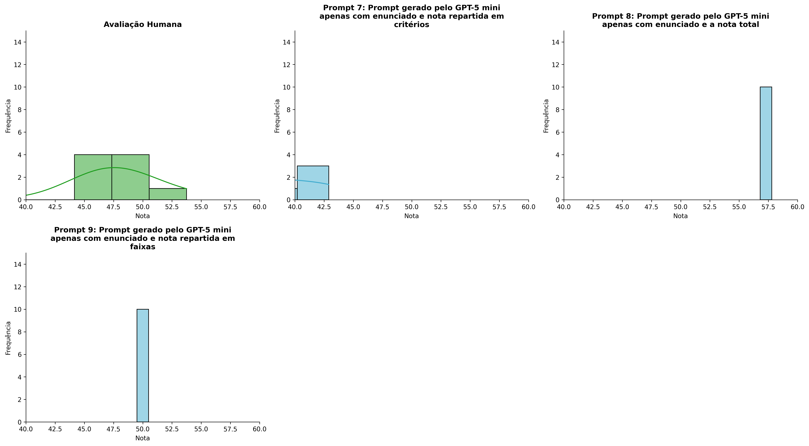
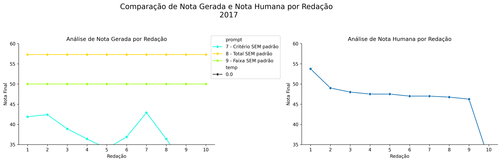
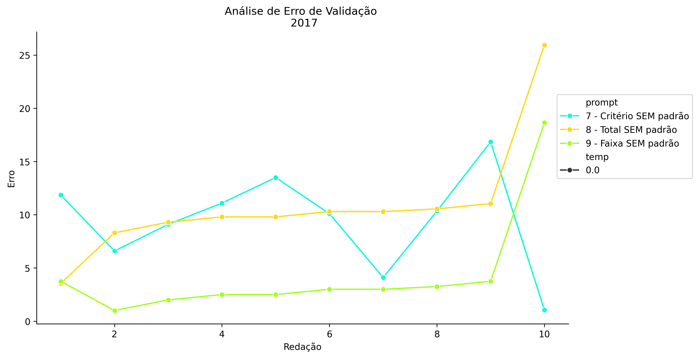
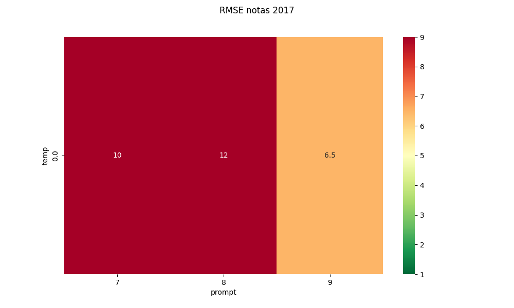
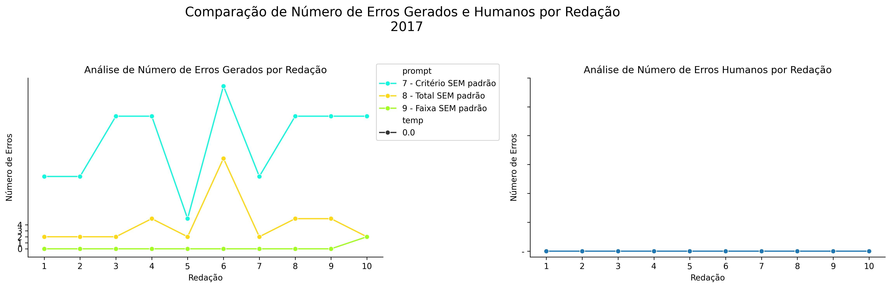
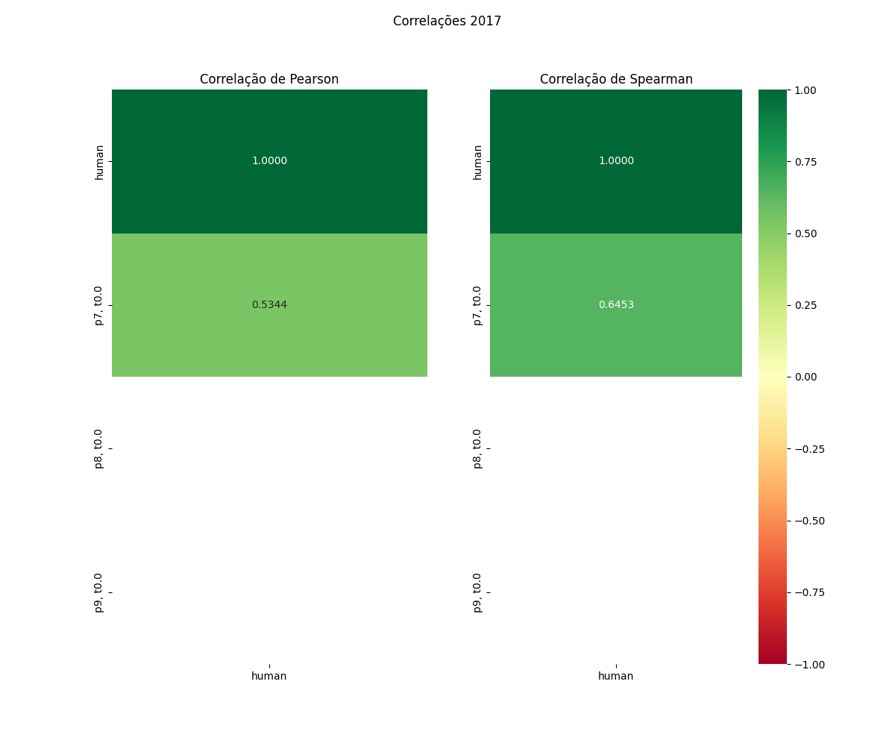

# Relatório de Avaliação: gpt-oss-120b - 3 execuções
**Gerado em: 14/05/2026 12:29:16**

## 1. Distribuição de Notas
Nesta seção comparamos as notas atribuídas pelo modelo gpt-oss-120b em diferentes prompts/temperaturas versus a correção humana.

## 2. Comparação de Notas Geradas e Humanas
Nesta seção, apresentamos a comparação entre as notas finais geradas pelo modelo e as notas dadas por avaliadores humanos.

## 3. Análise de Erro Absoluto de Validação

<table>
  <tr>
    <td>
      
    </td>
    <td>
      <table border="1" class="dataframe">
  <thead>
    <tr style="text-align: center;">
      <th>prompt</th>
      <th>temp</th>
      <th>area_sob_curva</th>
      <th>mae</th>
      <th>rmse</th>
    </tr>
  </thead>
  <tbody>
    <tr>
      <td>7</td>
      <td>0.0</td>
      <td>88.15</td>
      <td>9.46</td>
      <td>10.4078</td>
    </tr>
    <tr>
      <td>8</td>
      <td>0.0</td>
      <td>94.15</td>
      <td>10.89</td>
      <td>12.1616</td>
    </tr>
    <tr>
      <td>9</td>
      <td>0.0</td>
      <td>32.20</td>
      <td>4.34</td>
      <td>6.4962</td>
    </tr>
  </tbody>
</table>
    </td>
  </tr>
</table>

## 4. Análise de RMSE por Prompt e Temperatura
Nesta seção, apresentamos o heatmap de RMSE calculado por combinação de prompt e temperatura.

## 5. Análise de Erros Gramaticais
Comparação da sensibilidade do modelo na detecção/geração de erros em relação ao padrão humano.

## 6. Correlações

## Estatísticas Descritivas
### Modelo gpt-oss-120b
|       |    prompt |   temp |   redacao |   nota_final |   nota_final_std |        1A |      1B |       1C |     CGPL |   num_errors |
|:------|----------:|-------:|----------:|-------------:|-----------------:|----------:|--------:|---------:|---------:|-------------:|
| count | 30        |     30 |  30       |     30       |               30 | 10        | 10      | 10       | 10       |     30       |
| mean  |  8        |      0 |   5.5     |     48.1533  |                0 |  7.1      |  7.6    | 13.9     |  8.56    |      7.4     |
| std   |  0.830455 |      0 |   2.92138 |      8.82636 |                0 |  0.875595 |  1.7127 |  1.37032 |  2.43593 |      8.88858 |
| min   |  7        |      0 |   1       |     29.4     |                0 |  5        |  3      | 12       |  5.4     |      0       |
| 25%   |  7        |      0 |   3       |     42.025   |                0 |  7        |  8      | 12.5     |  7.025   |      0       |
| 50%   |  8        |      0 |   5.5     |     50       |                0 |  7        |  8      | 14.5     |  7.9     |      2       |
| 75%   |  9        |      0 |   8       |     57.3     |                0 |  7.5      |  8      | 15       | 11.175   |     12       |
| max   |  9        |      0 |  10       |     57.3     |                0 |  8.5      |  9      | 15       | 11.4     |     27       |

### Humano
|       |   redacao |   nota_final |
|:------|----------:|-------------:|
| count |  10       |      10      |
| mean  |   5.5     |      46.41   |
| std   |   3.02765 |       5.707  |
| min   |   1       |      31.35   |
| 25%   |   3.25    |      46.8125 |
| 50%   |   5.5     |      47.25   |
| 75%   |   7.75    |      47.875  |
| max   |  10       |      53.75   |
