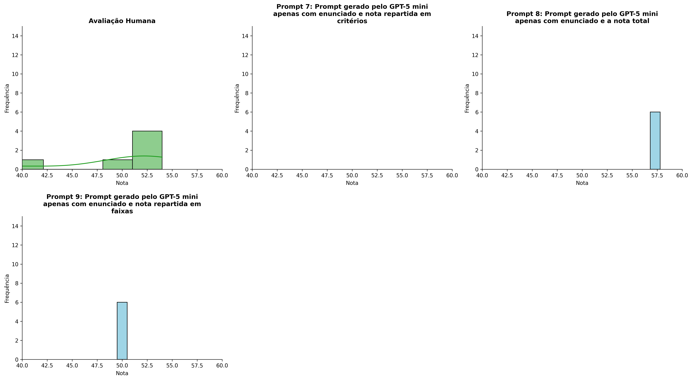
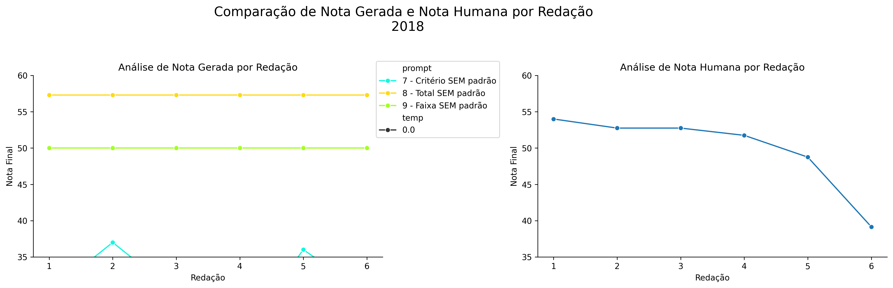
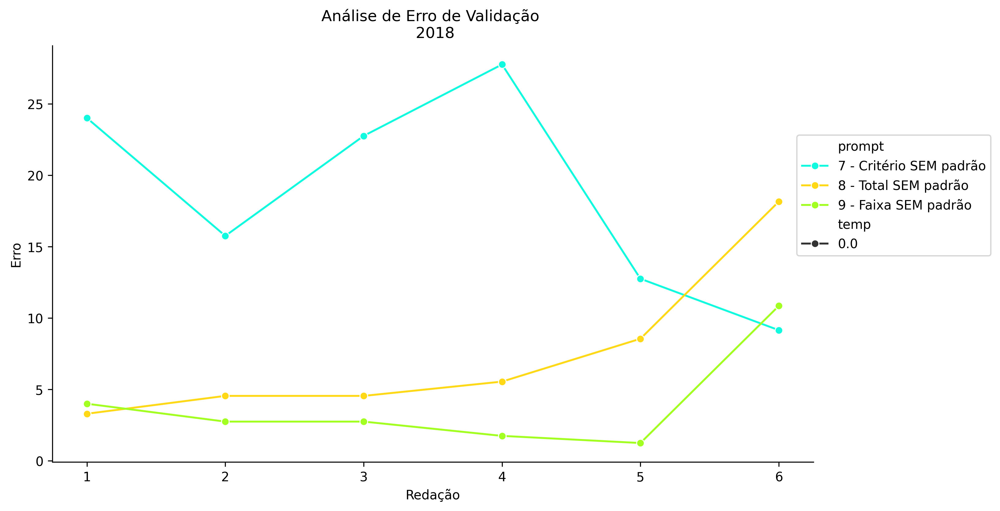
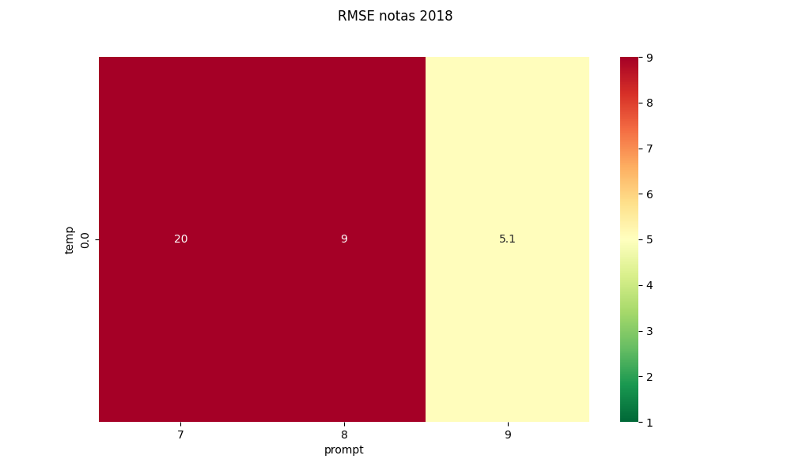
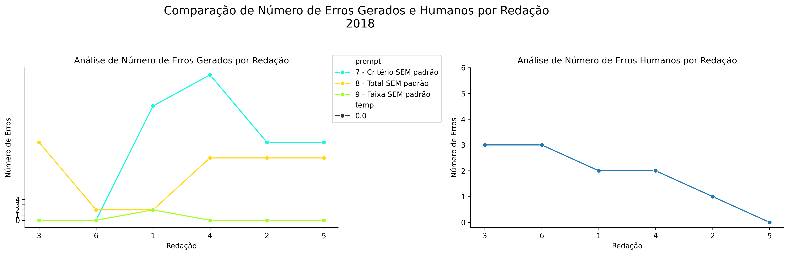
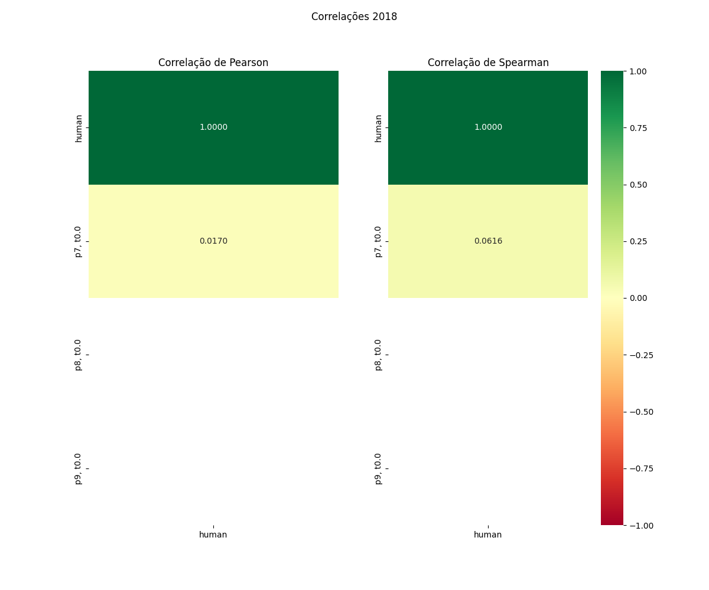

# Relatório de Avaliação: gpt-oss-120b - 3 execuções
**Gerado em: 21/05/2026 08:52:00**

## 1. Distribuição de Notas
Nesta seção comparamos as notas atribuídas pelo modelo gpt-oss-120b em diferentes prompts/temperaturas versus a correção humana.

## 2. Comparação de Notas Geradas e Humanas
Nesta seção, apresentamos a comparação entre as notas finais geradas pelo modelo e as notas dadas por avaliadores humanos.

## 3. Análise de Erro Absoluto de Validação

<table>
  <tr>
    <td>
      
    </td>
    <td>
      <table border="1" class="dataframe">
  <thead>
    <tr style="text-align: center;">
      <th>prompt</th>
      <th>temp</th>
      <th>area_sob_curva</th>
      <th>mae</th>
      <th>rmse</th>
    </tr>
  </thead>
  <tbody>
    <tr>
      <td>7</td>
      <td>0.0</td>
      <td>95.575</td>
      <td>18.6917</td>
      <td>19.8241</td>
    </tr>
    <tr>
      <td>8</td>
      <td>0.0</td>
      <td>33.925</td>
      <td>7.4417</td>
      <td>8.9965</td>
    </tr>
    <tr>
      <td>9</td>
      <td>0.0</td>
      <td>15.925</td>
      <td>3.8917</td>
      <td>5.0575</td>
    </tr>
  </tbody>
</table>
    </td>
  </tr>
</table>

## 4. Análise de RMSE por Prompt e Temperatura
Nesta seção, apresentamos o heatmap de RMSE calculado por combinação de prompt e temperatura.

## 5. Análise de Erros Gramaticais
Comparação da sensibilidade do modelo na detecção/geração de erros em relação ao padrão humano.

## 6. Correlações

## Estatísticas Descritivas
### Modelo gpt-oss-120b
|       |    prompt |   temp |   redacao |   nota_final |   nota_final_std |      1A |      1B |      1C |    CGPL |   num_errors |
|:------|----------:|-------:|----------:|-------------:|-----------------:|--------:|--------:|--------:|--------:|-------------:|
| count | 18        |     18 |  18       |      18      |               18 | 6       | 6       | 6       |  6      |     18       |
| mean  |  8        |      0 |   3.5     |      46.1556 |                0 | 4.66667 | 5.33333 | 4.5     | 16.6667 |      7.61111 |
| std   |  0.840168 |      0 |   1.75734 |      11.6182 |                0 | 3.61478 | 4.13118 | 3.50714 | 11.4134 |      8.89242 |
| min   |  7        |      0 |   1       |      24      |                0 | 0       | 0       | 0       |  2      |      0       |
| 25%   |  7        |      0 |   2       |      36.25   |                0 | 1.75    | 2       | 1.5     |  9.75   |      0       |
| 50%   |  8        |      0 |   3.5     |      50      |                0 | 7       | 8       | 6.5     | 15      |      2       |
| 75%   |  9        |      0 |   5       |      57.3    |                0 | 7       | 8       | 7       | 26.25   |     14.25    |
| max   |  9        |      0 |   6       |      57.3    |                0 | 7       | 8       | 7       | 30      |     28       |

### Humano
|       |   redacao |   nota_final |   num_errors |
|:------|----------:|-------------:|-------------:|
| count |   6       |      6       |      6       |
| mean  |   3.5     |     49.8583  |      1.83333 |
| std   |   1.87083 |      5.53809 |      1.16905 |
| min   |   1       |     39.15    |      0       |
| 25%   |   2.25    |     49.5     |      1.25    |
| 50%   |   3.5     |     52.25    |      2       |
| 75%   |   4.75    |     52.75    |      2.75    |
| max   |   6       |     54       |      3       |
