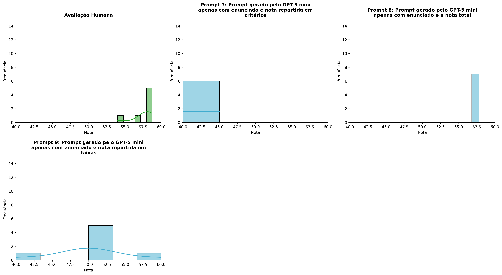
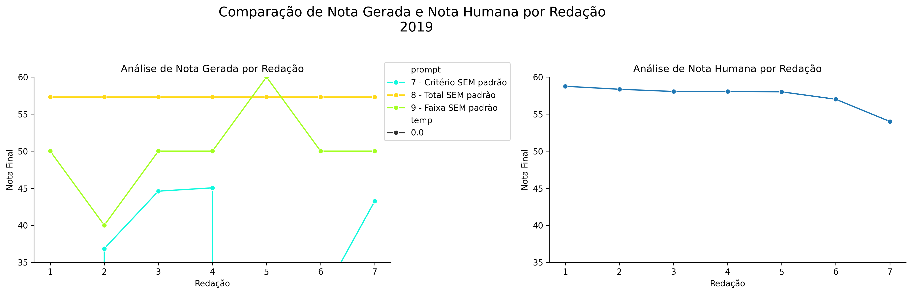
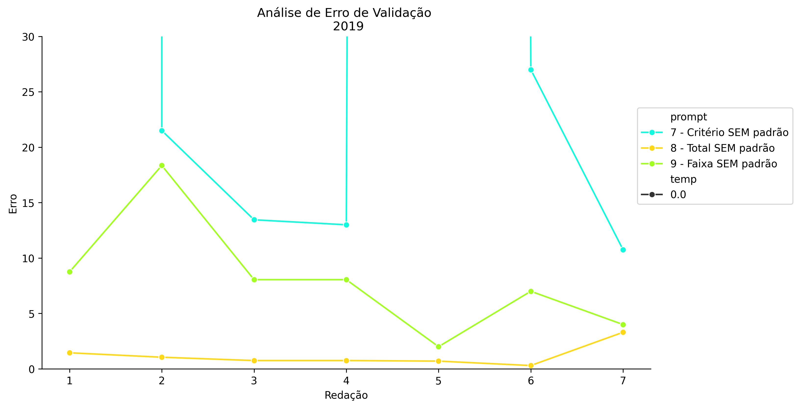
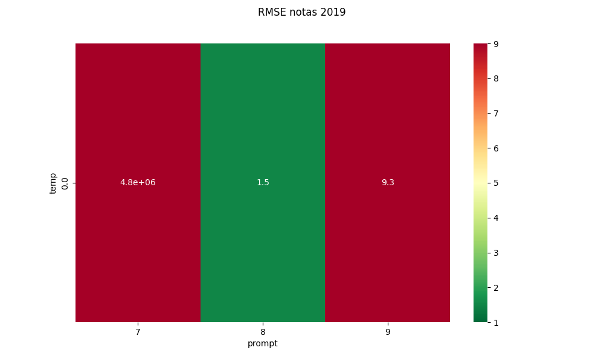
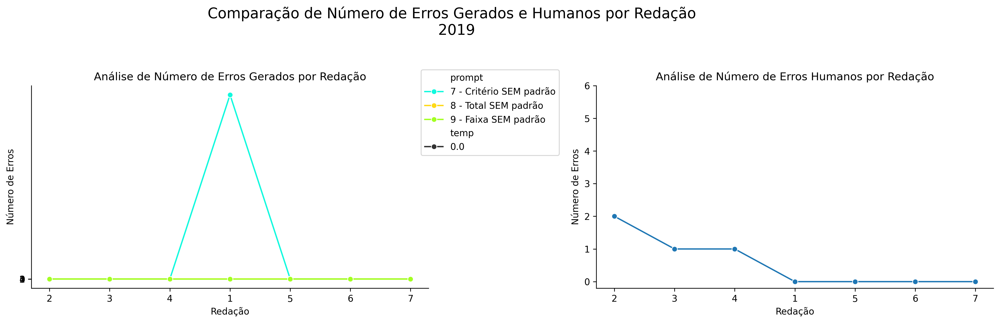
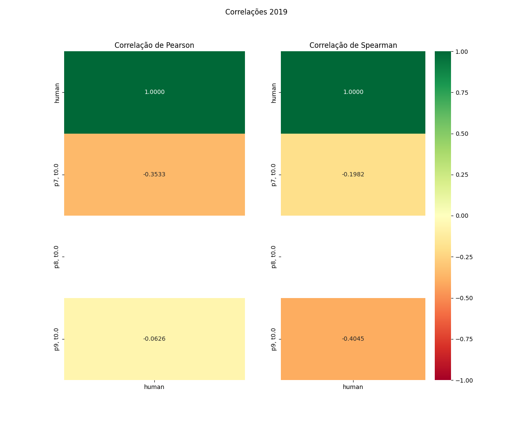

# Relatório de Avaliação: gpt-oss-120b - 3 execuções
**Gerado em: 21/05/2026 08:52:06**

## 1. Distribuição de Notas
Nesta seção comparamos as notas atribuídas pelo modelo gpt-oss-120b em diferentes prompts/temperaturas versus a correção humana.

## 2. Comparação de Notas Geradas e Humanas
Nesta seção, apresentamos a comparação entre as notas finais geradas pelo modelo e as notas dadas por avaliadores humanos.

## 3. Análise de Erro Absoluto de Validação

<table>
  <tr>
    <td>
      
    </td>
    <td>
      <table border="1" class="dataframe">
  <thead>
    <tr style="text-align: center;">
      <th>prompt</th>
      <th>temp</th>
      <th>area_sob_curva</th>
      <th>mae</th>
      <th>rmse</th>
    </tr>
  </thead>
  <tbody>
    <tr>
      <td>7</td>
      <td>0.0</td>
      <td>6365769.700</td>
      <td>1818487.7000</td>
      <td>4810458.8523</td>
    </tr>
    <tr>
      <td>8</td>
      <td>0.0</td>
      <td>5.925</td>
      <td>1.1857</td>
      <td>1.5024</td>
    </tr>
    <tr>
      <td>9</td>
      <td>0.0</td>
      <td>49.825</td>
      <td>8.0286</td>
      <td>9.3495</td>
    </tr>
  </tbody>
</table>
    </td>
  </tr>
</table>

## 4. Análise de RMSE por Prompt e Temperatura
Nesta seção, apresentamos o heatmap de RMSE calculado por combinação de prompt e temperatura.

## 5. Análise de Erros Gramaticais
Comparação da sensibilidade do modelo na detecção/geração de erros em relação ao padrão humano.

## 6. Correlações

## Estatísticas Descritivas
### Modelo gpt-oss-120b
|       |   prompt |   temp |   redacao |        nota_final |   nota_final_std |      1A |      1B |      1C |           CGPL |   num_errors |
|:------|---------:|-------:|----------:|------------------:|-----------------:|--------:|--------:|--------:|---------------:|-------------:|
| count | 21       |     21 |  21       |      21           |               21 | 7       | 7       | 7       |    7           | 21           |
| mean  |  8       |      0 |   4       | -606108           |                0 | 6.07143 | 6.04286 | 4.77143 |   -1.81845e+06 |  1.34702e+06 |
| std   |  0.83666 |      0 |   2.04939 |       2.7773e+06  |                0 | 2.84939 | 3.24749 | 2.21714 |    4.81033e+06 |  6.17177e+06 |
| min   |  7       |      0 |   1       |      -1.27272e+07 |                0 | 0       | 0       | 0       |   -1.27272e+07 |  0           |
| 25%   |  7       |      0 |   2       |      43.25        |                0 | 6       | 5       | 5       | -998.7         |  2           |
| 50%   |  8       |      0 |   4       |      50           |                0 | 7.5     | 8       | 5       |   23.25        |  2           |
| 75%   |  9       |      0 |   6       |      57.3         |                0 | 7.5     | 8       | 5.75    |   27.075       | 15           |
| max   |  9       |      0 |   7       |      60           |                0 | 8       | 8.3     | 6.9     |   30           |  2.82828e+07 |

### Humano
|       |   redacao |   nota_final |   num_errors |
|:------|----------:|-------------:|-------------:|
| count |   7       |      7       |     7        |
| mean  |   4       |     57.4571  |     0.571429 |
| std   |   2.16025 |      1.61385 |     0.786796 |
| min   |   1       |     54       |     0        |
| 25%   |   2.5     |     57.5     |     0        |
| 50%   |   4       |     58.05    |     0        |
| 75%   |   5.5     |     58.2     |     1        |
| max   |   7       |     58.75    |     2        |
