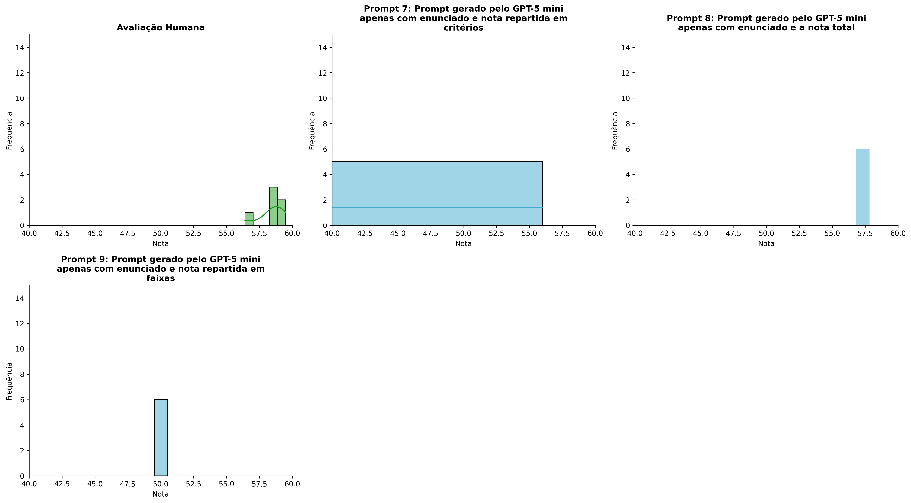
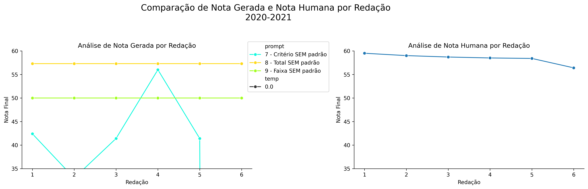
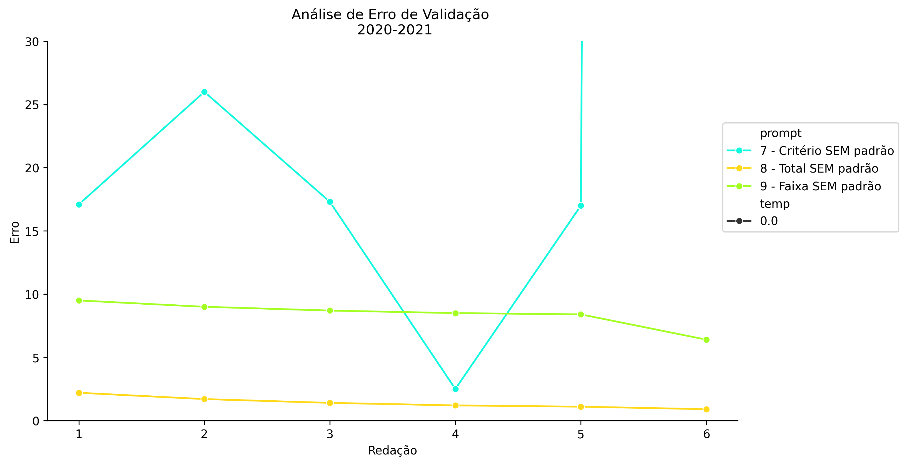
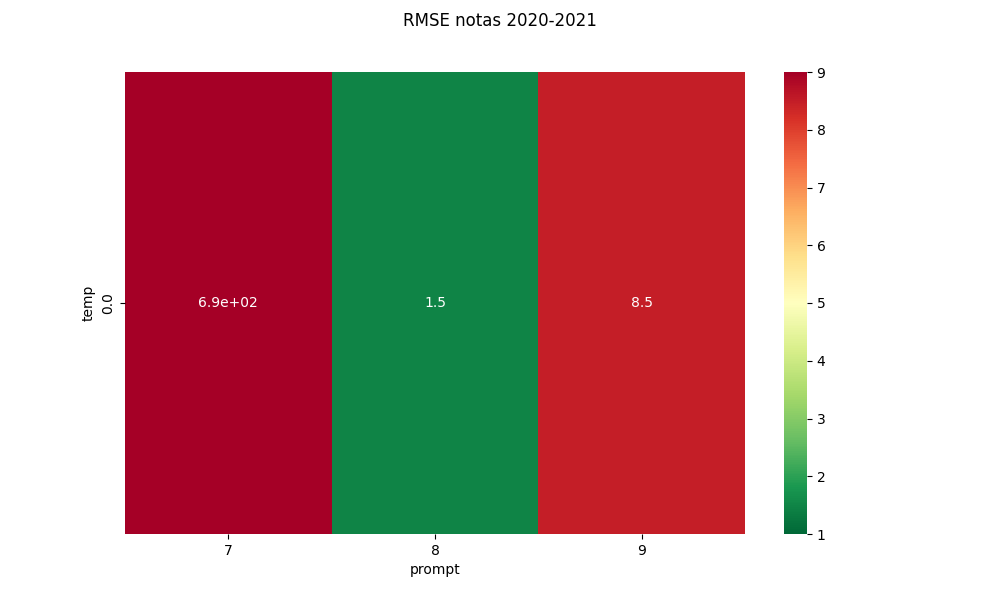
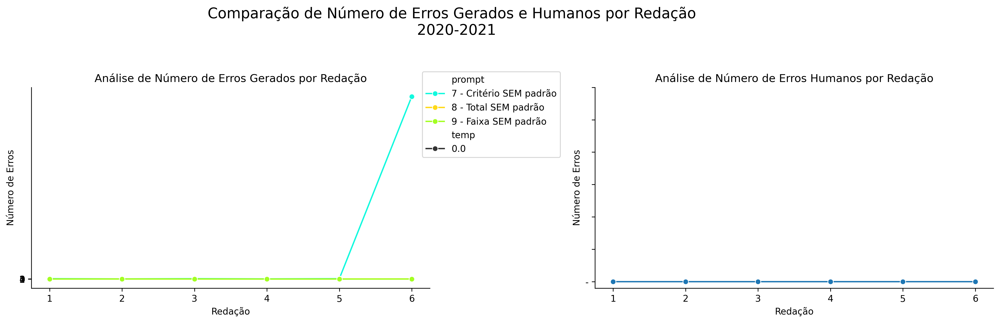
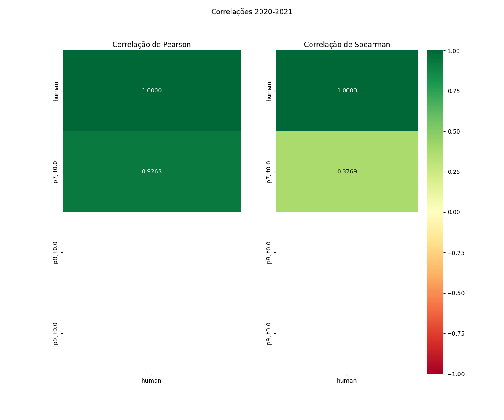

# Relatório de Avaliação: gpt-oss-120b - 3 execuções
**Gerado em: 14/05/2026 12:29:23**

## 1. Distribuição de Notas
Nesta seção comparamos as notas atribuídas pelo modelo gpt-oss-120b em diferentes prompts/temperaturas versus a correção humana.

## 2. Comparação de Notas Geradas e Humanas
Nesta seção, apresentamos a comparação entre as notas finais geradas pelo modelo e as notas dadas por avaliadores humanos.

## 3. Análise de Erro Absoluto de Validação

<table>
  <tr>
    <td>
      
    </td>
    <td>
      <table border="1" class="dataframe">
  <thead>
    <tr style="text-align: center;">
      <th>prompt</th>
      <th>temp</th>
      <th>area_sob_curva</th>
      <th>mae</th>
      <th>rmse</th>
    </tr>
  </thead>
  <tbody>
    <tr>
      <td>7</td>
      <td>0.0</td>
      <td>911.40</td>
      <td>293.3333</td>
      <td>686.0878</td>
    </tr>
    <tr>
      <td>8</td>
      <td>0.0</td>
      <td>6.95</td>
      <td>1.4167</td>
      <td>1.4804</td>
    </tr>
    <tr>
      <td>9</td>
      <td>0.0</td>
      <td>42.55</td>
      <td>8.4167</td>
      <td>8.4726</td>
    </tr>
  </tbody>
</table>
    </td>
  </tr>
</table>

## 4. Análise de RMSE por Prompt e Temperatura
Nesta seção, apresentamos o heatmap de RMSE calculado por combinação de prompt e temperatura.

## 5. Análise de Erros Gramaticais
Comparação da sensibilidade do modelo na detecção/geração de erros em relação ao padrão humano.

## 6. Correlações

## Estatísticas Descritivas
### Modelo gpt-oss-120b
|       |    prompt |   temp |   redacao |   nota_final |   nota_final_std |       1A |       1B |       1C |      CGPL |   num_errors |
|:------|----------:|-------:|----------:|-------------:|-----------------:|---------:|---------:|---------:|----------:|-------------:|
| count | 18        |     18 |  18       |      18      |               18 | 6        |  6       |  6       |     6     |       18     |
| mean  |  8        |      0 |   3.5     |     -42.5389 |                0 | 7.91667  |  8.05    | 14.5833  |  -265.467 |      312.111 |
| std   |  0.840168 |      0 |   1.75734 |     394.669  |                0 | 0.970395 |  2.98915 |  2.15445 |   680.243 |     1308.46  |
| min   |  7        |      0 |   1       |   -1623.7    |                0 | 7        |  3       | 12       | -1654     |        0     |
| 25%   |  7        |      0 |   2       |      44.3    |                0 | 7.125    |  7.25    | 13.125   |    10.725 |        2     |
| 50%   |  8        |      0 |   3.5     |      50      |                0 | 7.75     |  8.5     | 15       |    11.4   |        2     |
| 75%   |  9        |      0 |   5       |      57.3    |                0 | 8.375    |  9.225   | 15       |    11.4   |        5     |
| max   |  9        |      0 |   6       |      57.3    |                0 | 9.5      | 12       | 18       |    16.5   |     5555     |

### Humano
|       |   redacao |   nota_final |
|:------|----------:|-------------:|
| count |   6       |      6       |
| mean  |   3.5     |     58.4167  |
| std   |   1.87083 |      1.06474 |
| min   |   1       |     56.4     |
| 25%   |   2.25    |     58.425   |
| 50%   |   3.5     |     58.6     |
| 75%   |   4.75    |     58.925   |
| max   |   6       |     59.5     |
