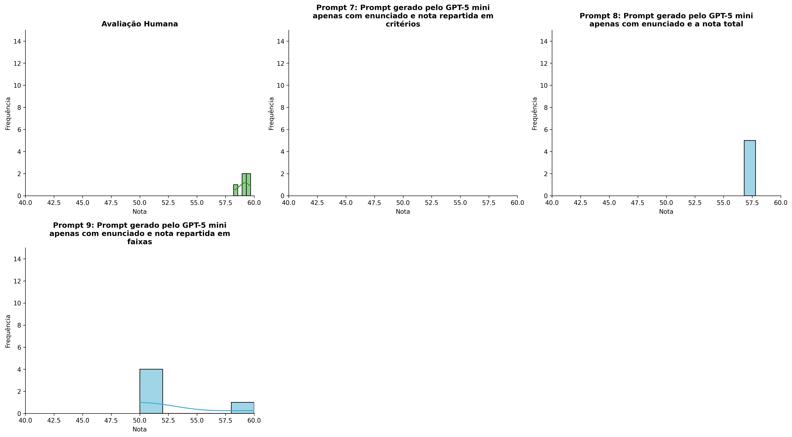
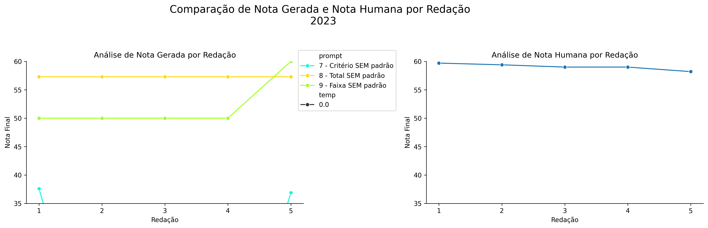
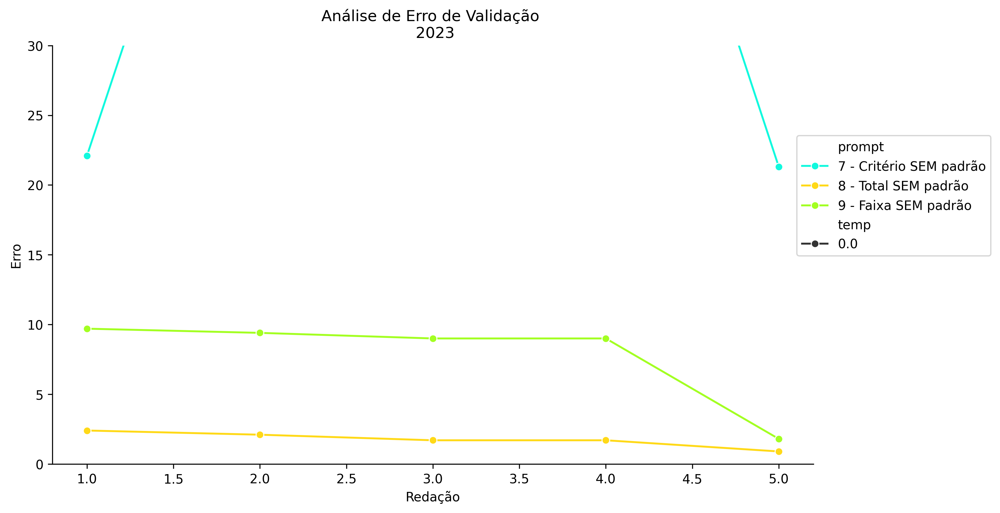
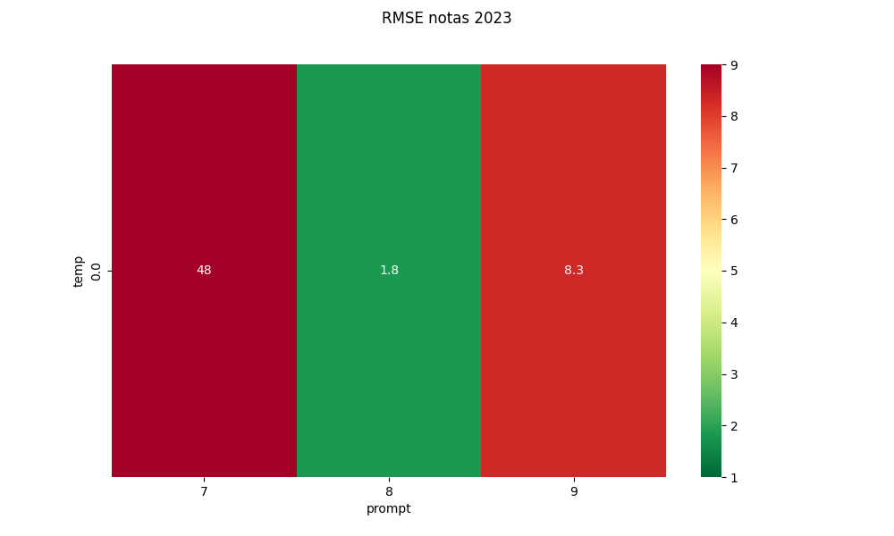
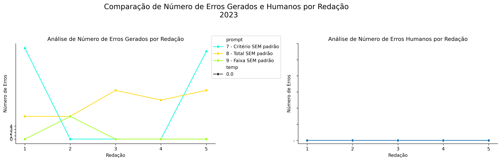
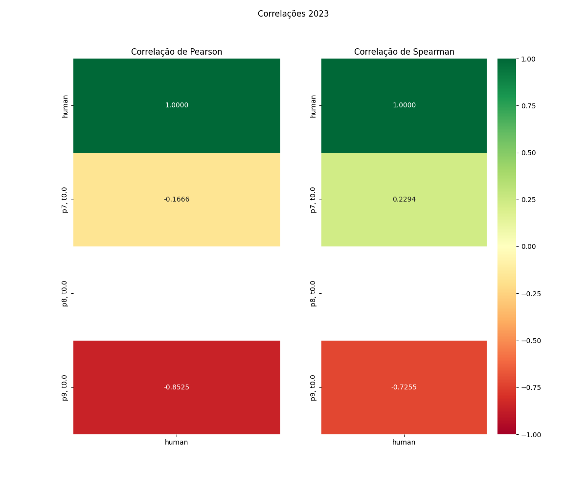

# Relatório de Avaliação: gpt-oss-120b - 3 execuções
**Gerado em: 14/05/2026 12:29:26**

## 1. Distribuição de Notas
Nesta seção comparamos as notas atribuídas pelo modelo gpt-oss-120b em diferentes prompts/temperaturas versus a correção humana.

## 2. Comparação de Notas Geradas e Humanas
Nesta seção, apresentamos a comparação entre as notas finais geradas pelo modelo e as notas dadas por avaliadores humanos.

## 3. Análise de Erro Absoluto de Validação

<table>
  <tr>
    <td>
      
    </td>
    <td>
      <table border="1" class="dataframe">
  <thead>
    <tr style="text-align: center;">
      <th>prompt</th>
      <th>temp</th>
      <th>area_sob_curva</th>
      <th>mae</th>
      <th>rmse</th>
    </tr>
  </thead>
  <tbody>
    <tr>
      <td>7</td>
      <td>0.0</td>
      <td>199.10</td>
      <td>44.16</td>
      <td>47.8173</td>
    </tr>
    <tr>
      <td>8</td>
      <td>0.0</td>
      <td>7.15</td>
      <td>1.76</td>
      <td>1.8308</td>
    </tr>
    <tr>
      <td>9</td>
      <td>0.0</td>
      <td>33.15</td>
      <td>7.78</td>
      <td>8.3389</td>
    </tr>
  </tbody>
</table>
    </td>
  </tr>
</table>

## 4. Análise de RMSE por Prompt e Temperatura
Nesta seção, apresentamos o heatmap de RMSE calculado por combinação de prompt e temperatura.

## 5. Análise de Erros Gramaticais
Comparação da sensibilidade do modelo na detecção/geração de erros em relação ao padrão humano.

## 6. Correlações

## Estatísticas Descritivas
### Modelo gpt-oss-120b
|       |    prompt |   temp |   redacao |   nota_final |   nota_final_std |      1A |      1B |       1C |    CGPL |   num_errors |
|:------|----------:|-------:|----------:|-------------:|-----------------:|--------:|--------:|---------:|--------:|-------------:|
| count | 15        |     15 |  15       |      15      |               15 | 5       | 5       |  5       | 5       |     15       |
| mean  |  8        |      0 |   3       |      41.4    |                0 | 3       | 3.2     |  6       | 2.7     |      7.86667 |
| std   |  0.845154 |      0 |   1.46385 |      22.4919 |                0 | 4.12311 | 4.43847 |  8.21584 | 3.69865 |      9.73115 |
| min   |  7        |      0 |   1       |       0      |                0 | 0       | 0       |  0       | 0       |      0       |
| 25%   |  7        |      0 |   2       |      37.25   |                0 | 0       | 0       |  0       | 0       |      0       |
| 50%   |  8        |      0 |   3       |      50      |                0 | 0       | 0       |  0       | 0       |      7       |
| 75%   |  9        |      0 |   4       |      57.3    |                0 | 7       | 7       | 15       | 6.6     |     13.5     |
| max   |  9        |      0 |   5       |      60      |                0 | 8       | 9       | 15       | 6.9     |     28       |

### Humano
|       |   redacao |   nota_final |
|:------|----------:|-------------:|
| count |   5       |     5        |
| mean  |   3       |    59.06     |
| std   |   1.58114 |     0.563915 |
| min   |   1       |    58.2      |
| 25%   |   2       |    59        |
| 50%   |   3       |    59        |
| 75%   |   4       |    59.4      |
| max   |   5       |    59.7      |
