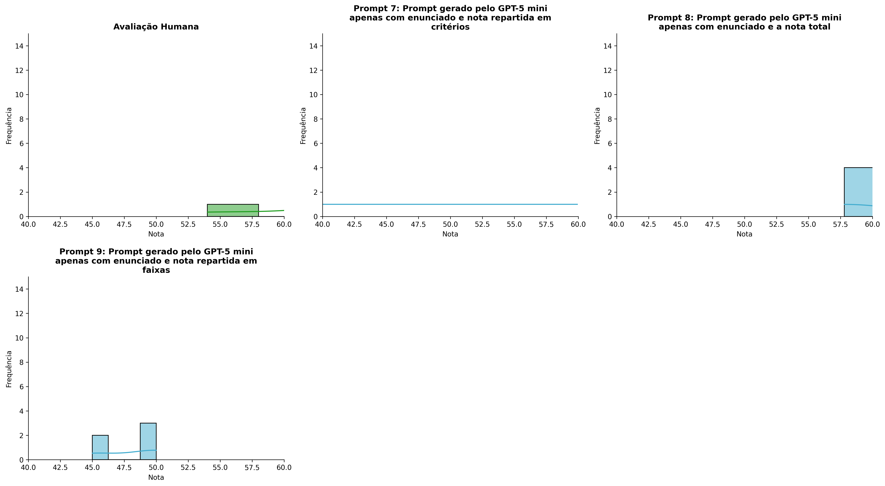
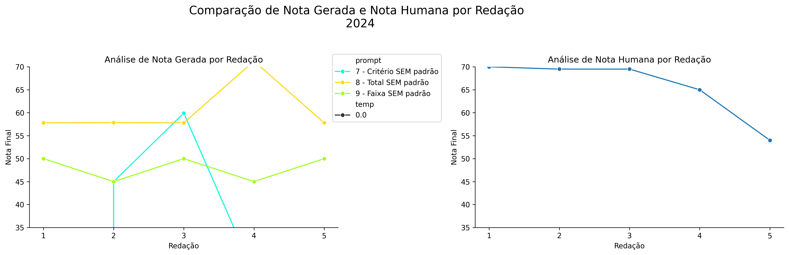
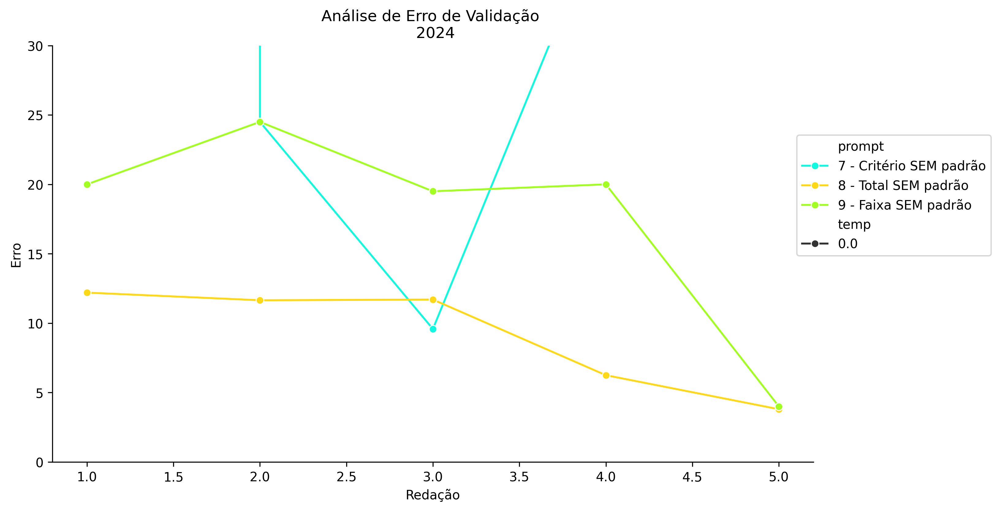
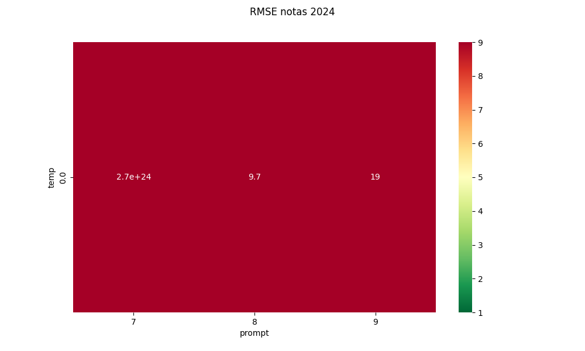
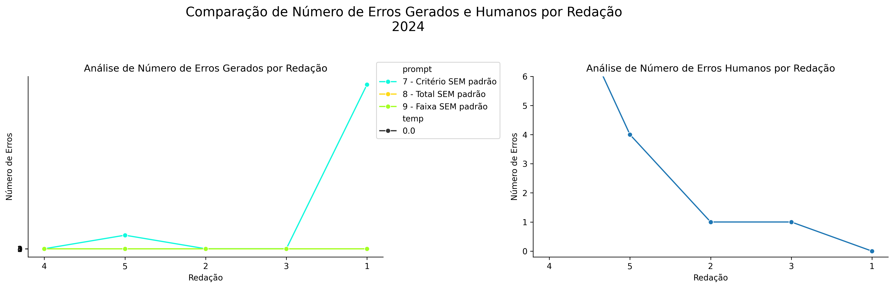
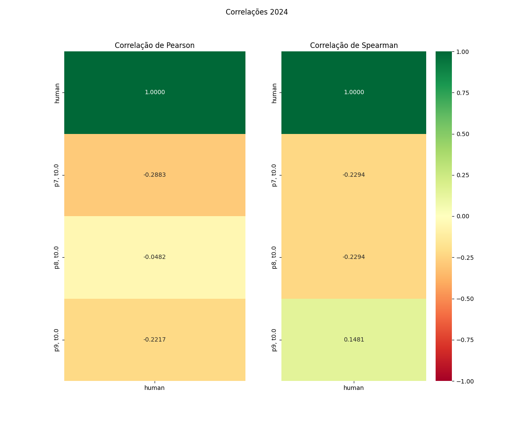

# Relatório de Avaliação: gpt-oss-120b - 3 execuções
**Gerado em: 21/05/2026 08:52:29**

## 1. Distribuição de Notas
Nesta seção comparamos as notas atribuídas pelo modelo gpt-oss-120b em diferentes prompts/temperaturas versus a correção humana.

## 2. Comparação de Notas Geradas e Humanas
Nesta seção, apresentamos a comparação entre as notas finais geradas pelo modelo e as notas dadas por avaliadores humanos.

## 3. Análise de Erro Absoluto de Validação

<table>
  <tr>
    <td>
      
    </td>
    <td>
      <table border="1" class="dataframe">
  <thead>
    <tr style="text-align: center;">
      <th>prompt</th>
      <th>temp</th>
      <th>area_sob_curva</th>
      <th>mae</th>
      <th>rmse</th>
    </tr>
  </thead>
  <tbody>
    <tr>
      <td>7</td>
      <td>0.0</td>
      <td>3.280303e+24</td>
      <td>1.312121e+24</td>
      <td>2.719594e+24</td>
    </tr>
    <tr>
      <td>8</td>
      <td>0.0</td>
      <td>3.760000e+01</td>
      <td>9.120000e+00</td>
      <td>9.746300e+00</td>
    </tr>
    <tr>
      <td>9</td>
      <td>0.0</td>
      <td>7.600000e+01</td>
      <td>1.760000e+01</td>
      <td>1.895520e+01</td>
    </tr>
  </tbody>
</table>
    </td>
  </tr>
</table>

## 4. Análise de RMSE por Prompt e Temperatura
Nesta seção, apresentamos o heatmap de RMSE calculado por combinação de prompt e temperatura.

## 5. Análise de Erros Gramaticais
Comparação da sensibilidade do modelo na detecção/geração de erros em relação ao padrão humano.

## 6. Correlações

## Estatísticas Descritivas
### Modelo gpt-oss-120b
|       |    prompt |   temp |   redacao |   nota_final |   nota_final_std |     1A |      1B |       1C |         CGPL |   num_errors |
|:------|----------:|-------:|----------:|-------------:|-----------------:|-------:|--------:|---------:|-------------:|-------------:|
| count | 15        |     15 |  15       | 15           |               15 | 5      | 5       |  5       |  5           | 15           |
| mean  |  8        |      0 |   3       | -4.37374e+23 |                0 | 6      | 3.66    | 10.224   | -1.31212e+24 |  8.74747e+23 |
| std   |  0.845154 |      0 |   1.46385 |  1.56094e+24 |                0 | 3.3541 | 3.40999 |  6.60839 |  2.6633e+24  |  3.12188e+24 |
| min   |  7        |      0 |   1       | -6.06061e+24 |                0 | 0      | 0       |  0       | -6.06061e+24 |  0           |
| 25%   |  7        |      0 |   2       | 45           |                0 | 7.5    | 3       |  9       | -5e+23       |  0           |
| 50%   |  8        |      0 |   3       | 50           |                0 | 7.5    | 3       | 12       | 22.5         |  0           |
| 75%   |  9        |      0 |   4       | 57.8         |                0 | 7.5    | 3       | 12       | 25           |  4           |
| max   |  9        |      0 |   5       | 71.25        |                0 | 7.5    | 9.3     | 18.12    | 25           |  1.21212e+25 |

### Humano
|       |   redacao |   nota_final |   num_errors |
|:------|----------:|-------------:|-------------:|
| count |   5       |      5       |      5       |
| mean  |   3       |     65.6     |      3.2     |
| std   |   1.58114 |      6.79522 |      4.08656 |
| min   |   1       |     54       |      0       |
| 25%   |   2       |     65       |      1       |
| 50%   |   3       |     69.5     |      1       |
| 75%   |   4       |     69.5     |      4       |
| max   |   5       |     70       |     10       |
