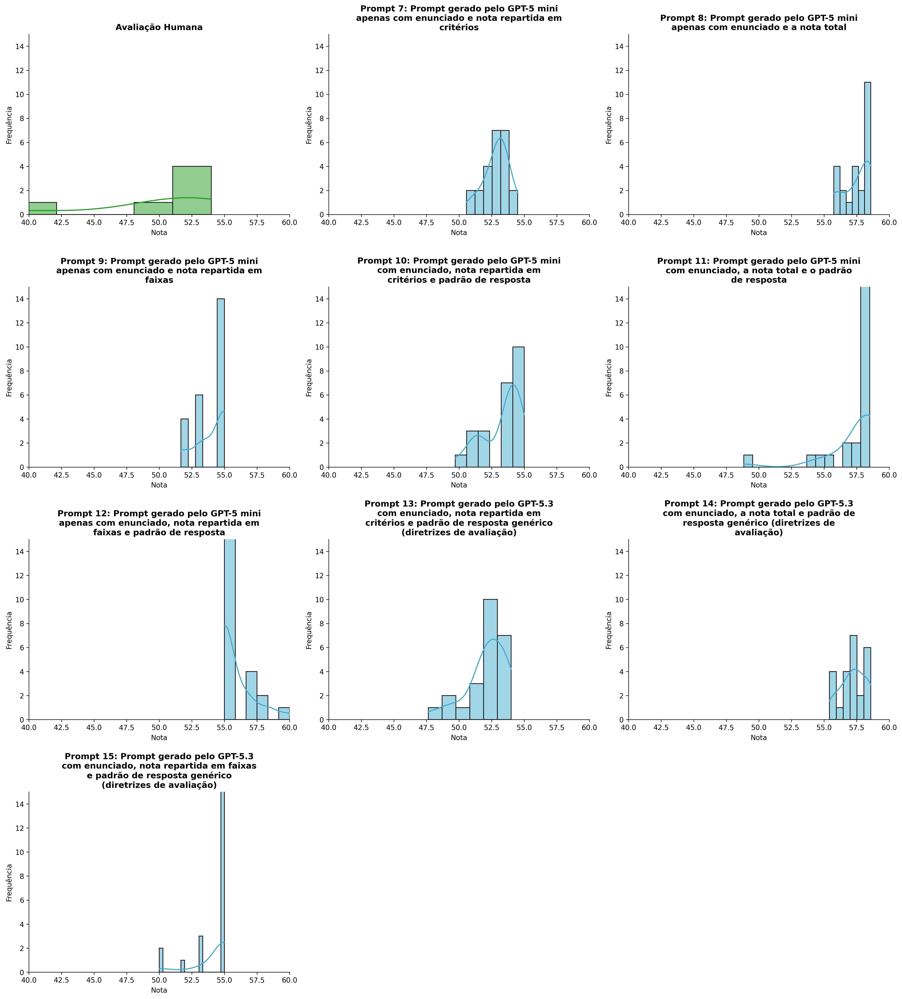
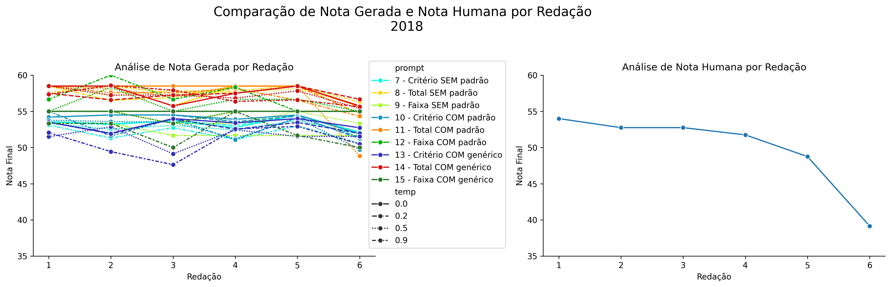
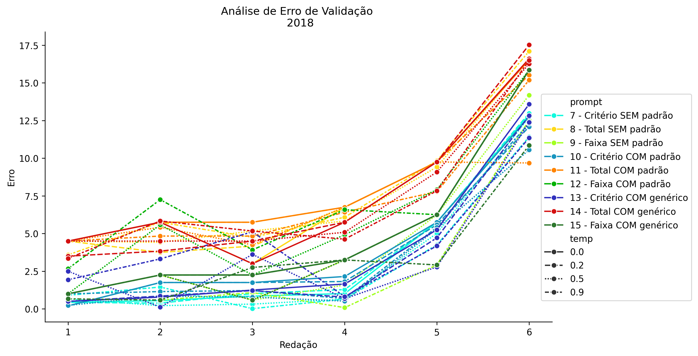
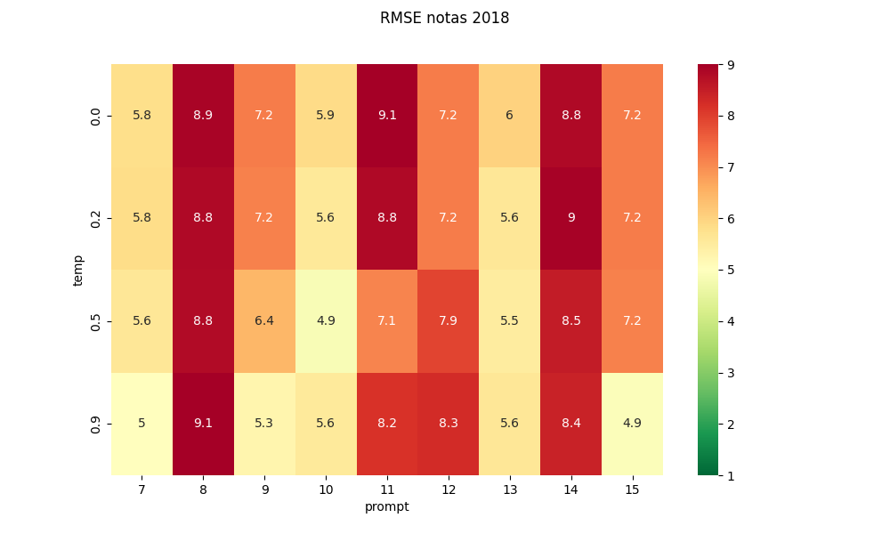
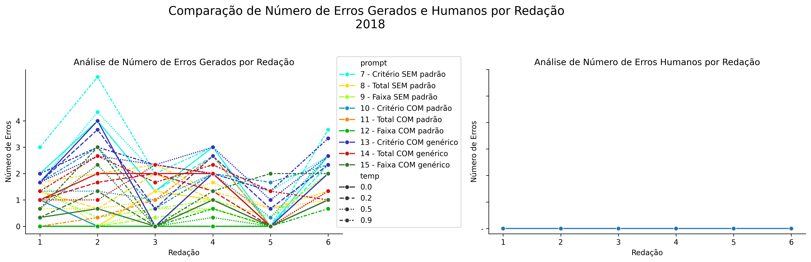
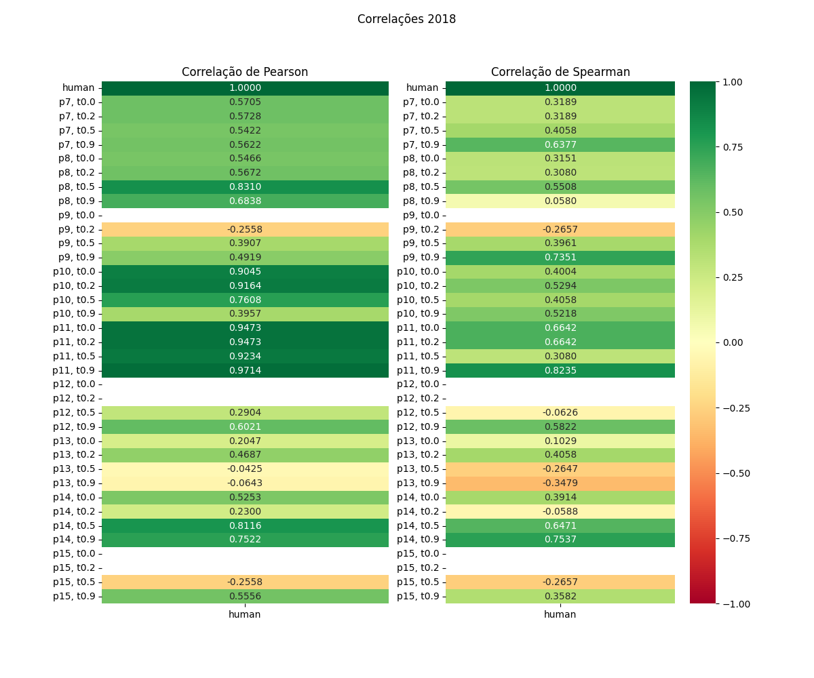

# Relatório de Avaliação: sabia-3.1 - 3 execuções
**Gerado em: 09/04/2026 17:39:52**

## 1. Distribuição de Notas
Nesta seção comparamos as notas atribuídas pelo modelo sabia em diferentes prompts/temperaturas versus a correção humana.

## 2. Comparação de Notas Geradas e Humanas
Nesta seção, apresentamos a comparação entre as notas finais geradas pelo modelo e as notas dadas por avaliadores humanos.

## 3. Análise de Erro Absoluto de Validação

<table>
  <tr>
    <td>
      
    </td>
    <td>
      <table border="1" class="dataframe">
  <thead>
    <tr style="text-align: center;">
      <th>prompt</th>
      <th>temp</th>
      <th>area_sob_curva</th>
      <th>mae</th>
      <th>rmse</th>
    </tr>
  </thead>
  <tbody>
    <tr>
      <td>7</td>
      <td>0.0</td>
      <td>14.8250</td>
      <td>3.5806</td>
      <td>5.7921</td>
    </tr>
    <tr>
      <td>7</td>
      <td>0.2</td>
      <td>15.1416</td>
      <td>3.6416</td>
      <td>5.8401</td>
    </tr>
    <tr>
      <td>7</td>
      <td>0.5</td>
      <td>12.8918</td>
      <td>3.2639</td>
      <td>5.5961</td>
    </tr>
    <tr>
      <td>7</td>
      <td>0.9</td>
      <td>12.5250</td>
      <td>3.1139</td>
      <td>5.0289</td>
    </tr>
    <tr>
      <td>8</td>
      <td>0.0</td>
      <td>35.8000</td>
      <td>7.7250</td>
      <td>8.9303</td>
    </tr>
    <tr>
      <td>8</td>
      <td>0.2</td>
      <td>34.9667</td>
      <td>7.5861</td>
      <td>8.8304</td>
    </tr>
    <tr>
      <td>8</td>
      <td>0.5</td>
      <td>35.3834</td>
      <td>7.6556</td>
      <td>8.8007</td>
    </tr>
    <tr>
      <td>8</td>
      <td>0.9</td>
      <td>36.7583</td>
      <td>7.8500</td>
      <td>9.0791</td>
    </tr>
    <tr>
      <td>9</td>
      <td>0.0</td>
      <td>22.4250</td>
      <td>5.1417</td>
      <td>7.2108</td>
    </tr>
    <tr>
      <td>9</td>
      <td>0.2</td>
      <td>20.7583</td>
      <td>4.8639</td>
      <td>7.1560</td>
    </tr>
    <tr>
      <td>9</td>
      <td>0.5</td>
      <td>18.2583</td>
      <td>4.3083</td>
      <td>6.4438</td>
    </tr>
    <tr>
      <td>9</td>
      <td>0.9</td>
      <td>11.2583</td>
      <td>2.9750</td>
      <td>5.2779</td>
    </tr>
    <tr>
      <td>10</td>
      <td>0.0</td>
      <td>17.8750</td>
      <td>4.0583</td>
      <td>5.8653</td>
    </tr>
    <tr>
      <td>10</td>
      <td>0.2</td>
      <td>17.0416</td>
      <td>3.8639</td>
      <td>5.5774</td>
    </tr>
    <tr>
      <td>10</td>
      <td>0.5</td>
      <td>12.8583</td>
      <td>3.0417</td>
      <td>4.8516</td>
    </tr>
    <tr>
      <td>10</td>
      <td>0.9</td>
      <td>15.1251</td>
      <td>3.6306</td>
      <td>5.5574</td>
    </tr>
    <tr>
      <td>11</td>
      <td>0.0</td>
      <td>38.5084</td>
      <td>8.1694</td>
      <td>9.1269</td>
    </tr>
    <tr>
      <td>11</td>
      <td>0.2</td>
      <td>38.0084</td>
      <td>8.0028</td>
      <td>8.8296</td>
    </tr>
    <tr>
      <td>11</td>
      <td>0.5</td>
      <td>33.2584</td>
      <td>6.7250</td>
      <td>7.0951</td>
    </tr>
    <tr>
      <td>11</td>
      <td>0.9</td>
      <td>33.7050</td>
      <td>7.2578</td>
      <td>8.1569</td>
    </tr>
    <tr>
      <td>12</td>
      <td>0.0</td>
      <td>22.4250</td>
      <td>5.1417</td>
      <td>7.2108</td>
    </tr>
    <tr>
      <td>12</td>
      <td>0.2</td>
      <td>22.4250</td>
      <td>5.1417</td>
      <td>7.2108</td>
    </tr>
    <tr>
      <td>12</td>
      <td>0.5</td>
      <td>29.0917</td>
      <td>6.2528</td>
      <td>7.9089</td>
    </tr>
    <tr>
      <td>12</td>
      <td>0.9</td>
      <td>33.2584</td>
      <td>7.0861</td>
      <td>8.2527</td>
    </tr>
    <tr>
      <td>13</td>
      <td>0.0</td>
      <td>15.9749</td>
      <td>3.8361</td>
      <td>6.0169</td>
    </tr>
    <tr>
      <td>13</td>
      <td>0.2</td>
      <td>14.2251</td>
      <td>3.4806</td>
      <td>5.6211</td>
    </tr>
    <tr>
      <td>13</td>
      <td>0.5</td>
      <td>14.6417</td>
      <td>3.6806</td>
      <td>5.4910</td>
    </tr>
    <tr>
      <td>13</td>
      <td>0.9</td>
      <td>20.0750</td>
      <td>4.4528</td>
      <td>5.5963</td>
    </tr>
    <tr>
      <td>14</td>
      <td>0.0</td>
      <td>34.8000</td>
      <td>7.5583</td>
      <td>8.8128</td>
    </tr>
    <tr>
      <td>14</td>
      <td>0.2</td>
      <td>34.3416</td>
      <td>7.4750</td>
      <td>8.9643</td>
    </tr>
    <tr>
      <td>14</td>
      <td>0.5</td>
      <td>33.5500</td>
      <td>7.3222</td>
      <td>8.5020</td>
    </tr>
    <tr>
      <td>14</td>
      <td>0.9</td>
      <td>33.3800</td>
      <td>7.2167</td>
      <td>8.4324</td>
    </tr>
    <tr>
      <td>15</td>
      <td>0.0</td>
      <td>22.4250</td>
      <td>5.1417</td>
      <td>7.2108</td>
    </tr>
    <tr>
      <td>15</td>
      <td>0.2</td>
      <td>22.4250</td>
      <td>5.1417</td>
      <td>7.2108</td>
    </tr>
    <tr>
      <td>15</td>
      <td>0.5</td>
      <td>20.7583</td>
      <td>4.8639</td>
      <td>7.1560</td>
    </tr>
    <tr>
      <td>15</td>
      <td>0.9</td>
      <td>15.2584</td>
      <td>3.5028</td>
      <td>4.9183</td>
    </tr>
  </tbody>
</table>
    </td>
  </tr>
</table>

## 4. Análise de RMSE por Prompt e Temperatura
Nesta seção, apresentamos o heatmap de RMSE calculado por combinação de prompt e temperatura.

## 5. Análise de Erros Gramaticais
Comparação da sensibilidade do modelo na detecção/geração de erros em relação ao padrão humano.

## 6. Correlações

## Estatísticas Descritivas
### Modelo sabia-3.1
|       |    prompt |       temp |   redacao |   nota_final |   nota_final_std |        1A |        1B |        1C |      CGPL |   num_errors |
|:------|----------:|-----------:|----------:|-------------:|-----------------:|----------:|----------:|----------:|----------:|-------------:|
| count | 216       | 216        | 216       |    216       |       216        | 72        | 72        | 72        | 72        |    216       |
| mean  |  11       |   0.4      |   3.5     |     54.9466  |         0.967213 |  8.9051   |  8.9051   | 17.7569   | 17.1931   |      1.12963 |
| std   |   2.58799 |   0.339904 |   1.71179 |      2.43746 |         1.35386  |  0.322391 |  0.323601 |  0.459587 |  0.656066 |      1.0724  |
| min   |   7       |   0        |   1       |     47.6333  |         0        |  8.3333   |  8        | 16        | 15.3      |      0       |
| 25%   |   9       |   0.15     |   2       |     53.3333  |         0        |  8.6667   |  8.6667   | 17.6667   | 16.825    |      0       |
| 50%   |  11       |   0.35     |   3.5     |     55       |         0.2887   |  9        |  9        | 18        | 17.4      |      1       |
| 75%   |  13       |   0.6      |   5       |     56.9375  |         1.54255  |  9.1667   |  9        | 18        | 17.7      |      2       |
| max   |  15       |   0.9      |   6       |     60       |         5.7735   |  9.5      |  9.6667   | 18.3333   | 18        |      5.6667  |

### Humano
|       |   redacao |   nota_final |
|:------|----------:|-------------:|
| count |   6       |      6       |
| mean  |   3.5     |     49.8583  |
| std   |   1.87083 |      5.53809 |
| min   |   1       |     39.15    |
| 25%   |   2.25    |     49.5     |
| 50%   |   3.5     |     52.25    |
| 75%   |   4.75    |     52.75    |
| max   |   6       |     54       |
