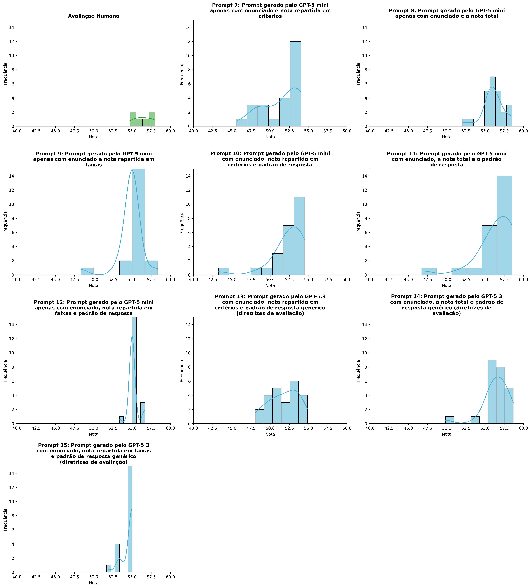
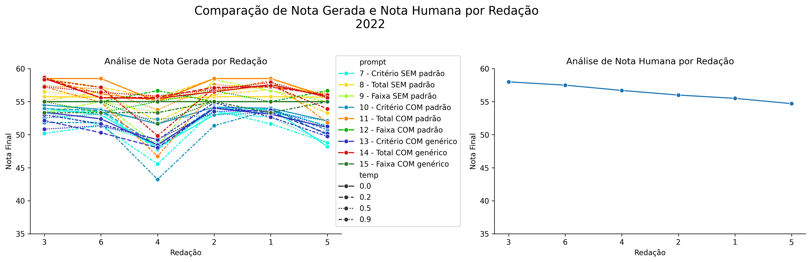
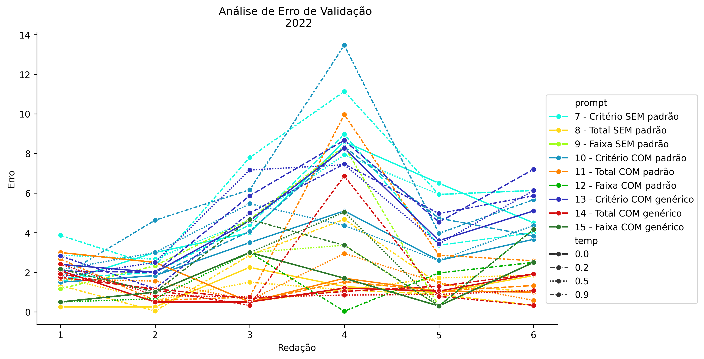
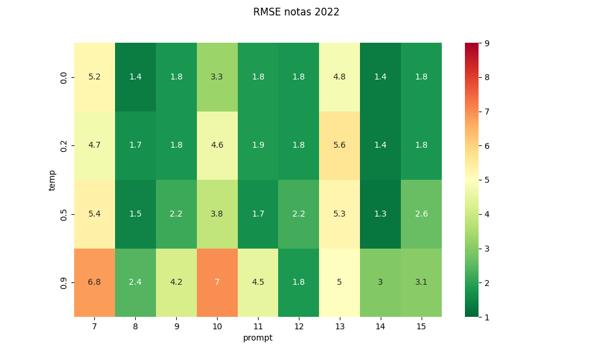
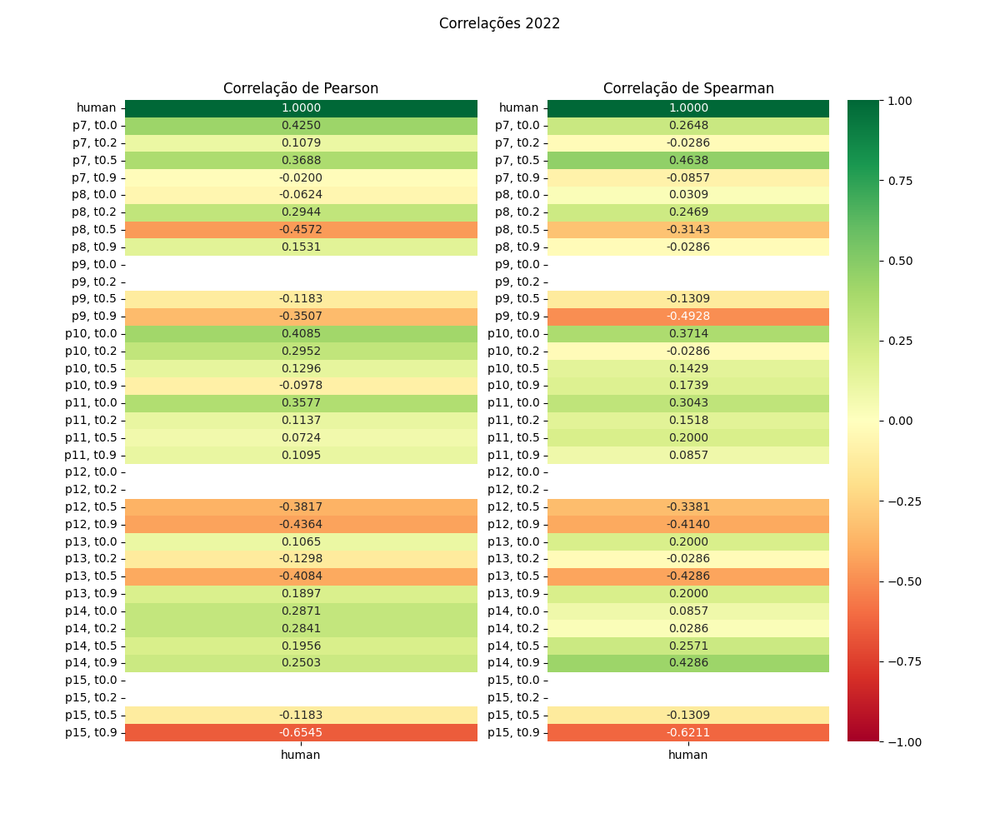

# Relatório de Avaliação: sabia-3.1 - 3 execuções
**Gerado em: 09/04/2026 17:39:52**

## 1. Distribuição de Notas
Nesta seção comparamos as notas atribuídas pelo modelo sabia em diferentes prompts/temperaturas versus a correção humana.

## 2. Comparação de Notas Geradas e Humanas
Nesta seção, apresentamos a comparação entre as notas finais geradas pelo modelo e as notas dadas por avaliadores humanos.

## 3. Análise de Erro Absoluto de Validação

<table>
  <tr>
    <td>
      
    </td>
    <td>
      <table border="1" class="dataframe">
  <thead>
    <tr style="text-align: center;">
      <th>prompt</th>
      <th>temp</th>
      <th>area_sob_curva</th>
      <th>mae</th>
      <th>rmse</th>
    </tr>
  </thead>
  <tbody>
    <tr>
      <td>7</td>
      <td>0.0</td>
      <td>25.1000</td>
      <td>4.6833</td>
      <td>5.2235</td>
    </tr>
    <tr>
      <td>7</td>
      <td>0.2</td>
      <td>21.5834</td>
      <td>4.0722</td>
      <td>4.7256</td>
    </tr>
    <tr>
      <td>7</td>
      <td>0.5</td>
      <td>25.6666</td>
      <td>5.0278</td>
      <td>5.3628</td>
    </tr>
    <tr>
      <td>7</td>
      <td>0.9</td>
      <td>32.1999</td>
      <td>6.2000</td>
      <td>6.8070</td>
    </tr>
    <tr>
      <td>8</td>
      <td>0.0</td>
      <td>5.7917</td>
      <td>1.1389</td>
      <td>1.3620</td>
    </tr>
    <tr>
      <td>8</td>
      <td>0.2</td>
      <td>6.6666</td>
      <td>1.3889</td>
      <td>1.7146</td>
    </tr>
    <tr>
      <td>8</td>
      <td>0.5</td>
      <td>6.7217</td>
      <td>1.4211</td>
      <td>1.4892</td>
    </tr>
    <tr>
      <td>8</td>
      <td>0.9</td>
      <td>10.1667</td>
      <td>1.8889</td>
      <td>2.4085</td>
    </tr>
    <tr>
      <td>9</td>
      <td>0.0</td>
      <td>7.5000</td>
      <td>1.5000</td>
      <td>1.8019</td>
    </tr>
    <tr>
      <td>9</td>
      <td>0.2</td>
      <td>7.5000</td>
      <td>1.5000</td>
      <td>1.8019</td>
    </tr>
    <tr>
      <td>9</td>
      <td>0.5</td>
      <td>9.1667</td>
      <td>1.7778</td>
      <td>2.1573</td>
    </tr>
    <tr>
      <td>9</td>
      <td>0.9</td>
      <td>17.5000</td>
      <td>3.2222</td>
      <td>4.1818</td>
    </tr>
    <tr>
      <td>10</td>
      <td>0.0</td>
      <td>15.6167</td>
      <td>3.0333</td>
      <td>3.2679</td>
    </tr>
    <tr>
      <td>10</td>
      <td>0.2</td>
      <td>21.6332</td>
      <td>4.0500</td>
      <td>4.6313</td>
    </tr>
    <tr>
      <td>10</td>
      <td>0.5</td>
      <td>18.6834</td>
      <td>3.6556</td>
      <td>3.8369</td>
    </tr>
    <tr>
      <td>10</td>
      <td>0.9</td>
      <td>31.9501</td>
      <td>5.9445</td>
      <td>6.9739</td>
    </tr>
    <tr>
      <td>11</td>
      <td>0.0</td>
      <td>7.7500</td>
      <td>1.6250</td>
      <td>1.8481</td>
    </tr>
    <tr>
      <td>11</td>
      <td>0.2</td>
      <td>7.7500</td>
      <td>1.6528</td>
      <td>1.8588</td>
    </tr>
    <tr>
      <td>11</td>
      <td>0.5</td>
      <td>7.6817</td>
      <td>1.4678</td>
      <td>1.6701</td>
    </tr>
    <tr>
      <td>11</td>
      <td>0.9</td>
      <td>16.7917</td>
      <td>3.2361</td>
      <td>4.5137</td>
    </tr>
    <tr>
      <td>12</td>
      <td>0.0</td>
      <td>7.5000</td>
      <td>1.5000</td>
      <td>1.8019</td>
    </tr>
    <tr>
      <td>12</td>
      <td>0.2</td>
      <td>7.5000</td>
      <td>1.5000</td>
      <td>1.8019</td>
    </tr>
    <tr>
      <td>12</td>
      <td>0.5</td>
      <td>8.0000</td>
      <td>1.7222</td>
      <td>2.2374</td>
    </tr>
    <tr>
      <td>12</td>
      <td>0.9</td>
      <td>7.5000</td>
      <td>1.5000</td>
      <td>1.8425</td>
    </tr>
    <tr>
      <td>13</td>
      <td>0.0</td>
      <td>22.2167</td>
      <td>4.3278</td>
      <td>4.7998</td>
    </tr>
    <tr>
      <td>13</td>
      <td>0.2</td>
      <td>25.7001</td>
      <td>5.0556</td>
      <td>5.6302</td>
    </tr>
    <tr>
      <td>13</td>
      <td>0.5</td>
      <td>24.4833</td>
      <td>4.7389</td>
      <td>5.2503</td>
    </tr>
    <tr>
      <td>13</td>
      <td>0.9</td>
      <td>22.9501</td>
      <td>4.5500</td>
      <td>4.9871</td>
    </tr>
    <tr>
      <td>14</td>
      <td>0.0</td>
      <td>5.2500</td>
      <td>1.2083</td>
      <td>1.3575</td>
    </tr>
    <tr>
      <td>14</td>
      <td>0.2</td>
      <td>6.0000</td>
      <td>1.3056</td>
      <td>1.3723</td>
    </tr>
    <tr>
      <td>14</td>
      <td>0.5</td>
      <td>5.0666</td>
      <td>1.1361</td>
      <td>1.2763</td>
    </tr>
    <tr>
      <td>14</td>
      <td>0.9</td>
      <td>10.2083</td>
      <td>1.8889</td>
      <td>2.9685</td>
    </tr>
    <tr>
      <td>15</td>
      <td>0.0</td>
      <td>7.5000</td>
      <td>1.5000</td>
      <td>1.8019</td>
    </tr>
    <tr>
      <td>15</td>
      <td>0.2</td>
      <td>7.5000</td>
      <td>1.5000</td>
      <td>1.8019</td>
    </tr>
    <tr>
      <td>15</td>
      <td>0.5</td>
      <td>10.8333</td>
      <td>2.0556</td>
      <td>2.6434</td>
    </tr>
    <tr>
      <td>15</td>
      <td>0.9</td>
      <td>12.5001</td>
      <td>2.6111</td>
      <td>3.0621</td>
    </tr>
  </tbody>
</table>
    </td>
  </tr>
</table>

## 4. Análise de RMSE por Prompt e Temperatura
Nesta seção, apresentamos o heatmap de RMSE calculado por combinação de prompt e temperatura.

## 5. Análise de Erros Gramaticais
Comparação da sensibilidade do modelo na detecção/geração de erros em relação ao padrão humano.

## 6. Correlações

## Estatísticas Descritivas
### Modelo sabia-3.1
|       |    prompt |       temp |   redacao |   nota_final |   nota_final_std |        1A |        1B |        1C |     CGPL |   num_errors |
|:------|----------:|-----------:|----------:|-------------:|-----------------:|----------:|----------:|----------:|---------:|-------------:|
| count | 216       | 216        | 216       |     216      |        216       | 72        | 72        | 72        | 72       |    216       |
| mean  |  11       |   0.4      |   3.5     |      54.2958 |          1.10782 |  8.71297  |  8.76158  | 17.4097   | 16.9042  |      1.02623 |
| std   |   2.58799 |   0.339904 |   1.71179 |       2.6524 |          1.50391 |  0.371338 |  0.362381 |  0.822203 |  1.09469 |      1.16753 |
| min   |   7       |   0        |   1       |      43.2333 |          0       |  8        |  7.6667   | 13.8333   | 12.7333  |      0       |
| 25%   |   9       |   0.15     |   2       |      53.3333 |          0       |  8.5      |  8.62503  | 17        | 16.375   |      0       |
| 50%   |  11       |   0.35     |   3.5     |      55      |          0.45435 |  8.75     |  9        | 17.75     | 17.0834  |      0.6667  |
| 75%   |  13       |   0.6      |   5       |      55.6875 |          1.7321  |  9        |  9        | 18        | 17.875   |      2       |
| max   |  15       |   0.9      |   6       |      58.6667 |          8.7237  |  9.3333   |  9.3333   | 18.3333   | 18.3333  |      3.6667  |

### Humano
|       |   redacao |   nota_final |        1A |        1B |        1C |      CGPL |   num_errors |
|:------|----------:|-------------:|----------:|----------:|----------:|----------:|-------------:|
| count |   6       |      6       |  6        |  6        |  6        |  6        |     6        |
| mean  |   3.5     |     56.4     |  9.75     |  9.75     | 18.5      | 18.4      |     0.333333 |
| std   |   1.87083 |      1.24258 |  0.273861 |  0.273861 |  0.447214 |  0.532917 |     0.516398 |
| min   |   1       |     54.7     |  9.5      |  9.5      | 18        | 17.7      |     0        |
| 25%   |   2.25    |     55.625   |  9.5      |  9.5      | 18.125    | 18.05     |     0        |
| 50%   |   3.5     |     56.35    |  9.75     |  9.75     | 18.5      | 18.35     |     0        |
| 75%   |   4.75    |     57.3     | 10        | 10        | 18.875    | 18.875    |     0.75     |
| max   |   6       |     58       | 10        | 10        | 19        | 19        |     1        |
