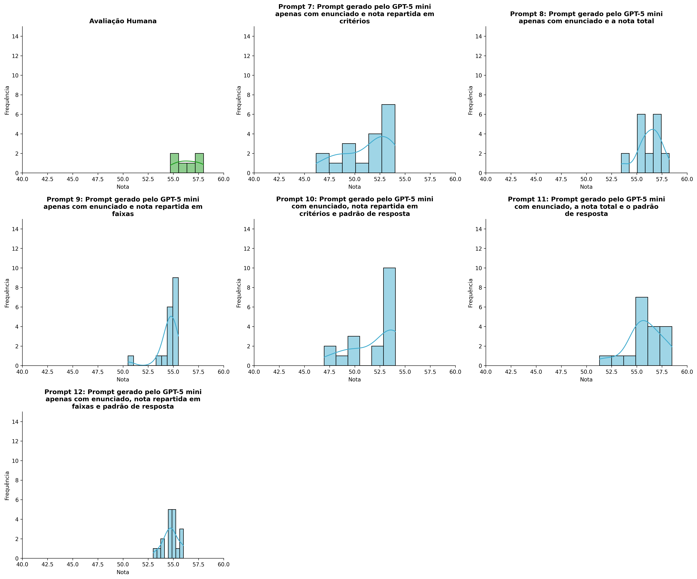
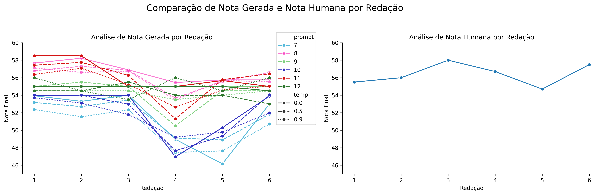
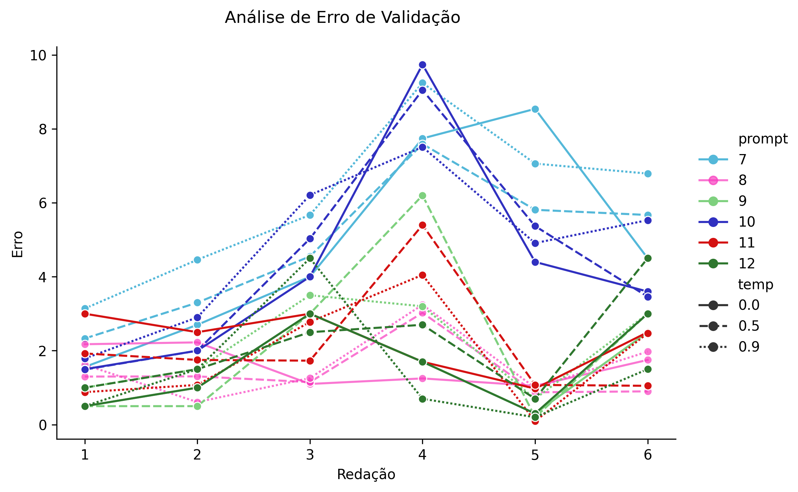
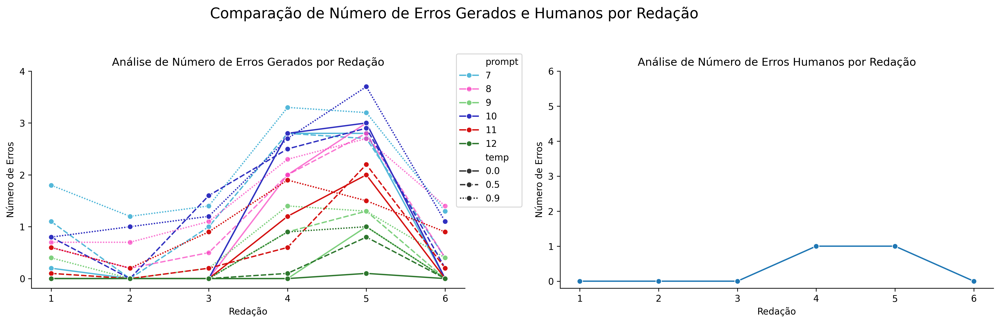

# Relatório de Avaliação: sabia-3.1 - 10 execuções
**Gerado em: 26/01/2026 17:28:37**

## 1. Distribuição de Notas
Nesta seção comparamos as notas atribuídas pelo modelo sabia em diferentes prompts/temperaturas versus a correção humana.

## 2. Comparação de Notas Geradas e Humanas
Nesta seção, apresentamos a comparação entre as notas finais geradas pelo modelo e as notas dadas por avaliadores humanos.

## 3. Análise de Erro Absoluto de Validação

<table>
  <tr>
    <td>
      
    </td>
    <td>
      <table border="1" class="dataframe">
  <thead>
    <tr style="text-align: center;">
      <th>prompt</th>
      <th>temp</th>
      <th>area_sob_curva</th>
      <th>mae</th>
      <th>rmse</th>
    </tr>
  </thead>
  <tbody>
    <tr>
      <td>7</td>
      <td>0.0</td>
      <td>26.0100</td>
      <td>4.8400</td>
      <td>5.4591</td>
    </tr>
    <tr>
      <td>7</td>
      <td>0.5</td>
      <td>25.2500</td>
      <td>4.8750</td>
      <td>5.1726</td>
    </tr>
    <tr>
      <td>7</td>
      <td>0.9</td>
      <td>31.3950</td>
      <td>6.0600</td>
      <td>6.3669</td>
    </tr>
    <tr>
      <td>8</td>
      <td>0.0</td>
      <td>7.5875</td>
      <td>1.5917</td>
      <td>1.6643</td>
    </tr>
    <tr>
      <td>8</td>
      <td>0.5</td>
      <td>7.4550</td>
      <td>1.4258</td>
      <td>1.6043</td>
    </tr>
    <tr>
      <td>8</td>
      <td>0.9</td>
      <td>7.9095</td>
      <td>1.6178</td>
      <td>1.8255</td>
    </tr>
    <tr>
      <td>9</td>
      <td>0.0</td>
      <td>7.5000</td>
      <td>1.5000</td>
      <td>1.8019</td>
    </tr>
    <tr>
      <td>9</td>
      <td>0.5</td>
      <td>11.6500</td>
      <td>2.2333</td>
      <td>3.0817</td>
    </tr>
    <tr>
      <td>9</td>
      <td>0.9</td>
      <td>10.9000</td>
      <td>2.1500</td>
      <td>2.4232</td>
    </tr>
    <tr>
      <td>10</td>
      <td>0.0</td>
      <td>22.6900</td>
      <td>4.2067</td>
      <td>4.9906</td>
    </tr>
    <tr>
      <td>10</td>
      <td>0.5</td>
      <td>23.9250</td>
      <td>4.4000</td>
      <td>5.0700</td>
    </tr>
    <tr>
      <td>10</td>
      <td>0.9</td>
      <td>25.1900</td>
      <td>4.8083</td>
      <td>5.1844</td>
    </tr>
    <tr>
      <td>11</td>
      <td>0.0</td>
      <td>10.9250</td>
      <td>2.2792</td>
      <td>2.3924</td>
    </tr>
    <tr>
      <td>11</td>
      <td>0.5</td>
      <td>11.4425</td>
      <td>2.1550</td>
      <td>2.6198</td>
    </tr>
    <tr>
      <td>11</td>
      <td>0.9</td>
      <td>9.6730</td>
      <td>1.8915</td>
      <td>2.3154</td>
    </tr>
    <tr>
      <td>12</td>
      <td>0.0</td>
      <td>7.7500</td>
      <td>1.5833</td>
      <td>1.9248</td>
    </tr>
    <tr>
      <td>12</td>
      <td>0.5</td>
      <td>10.1500</td>
      <td>2.1500</td>
      <td>2.5010</td>
    </tr>
    <tr>
      <td>12</td>
      <td>0.9</td>
      <td>7.9000</td>
      <td>1.4833</td>
      <td>2.0628</td>
    </tr>
  </tbody>
</table>
    </td>
  </tr>
</table>

## 4. Análise de Erros Gramaticais
Comparação da sensibilidade do modelo na detecção/geração de erros em relação ao padrão humano.

## 5. Correlação de Pearson
|           |       human |    p7, t0.0 |    p7, t0.5 |    p7, t0.9 |   p8, t0.0 |    p8, t0.5 |   p8, t0.9 |   p9, t0.0 |    p9, t0.5 |   p9, t0.9 |   p10, t0.0 |   p10, t0.5 |    p10, t0.9 |   p11, t0.0 |   p11, t0.5 |   p11, t0.9 |   p12, t0.0 |   p12, t0.5 |    p12, t0.9 |
|:----------|------------:|------------:|------------:|------------:|-----------:|------------:|-----------:|-----------:|------------:|-----------:|------------:|------------:|-------------:|------------:|------------:|------------:|------------:|------------:|-------------:|
| human     |   1         |   0.548149  |   0.413322  |   0.359826  |  -0.135728 |   0.0968545 |  -0.102104 |        nan |  -0.109652  |   0.211617 |    0.221536 |   0.254157  |   0.0509925  |  -0.527037  |   -0.143398 |  -0.180141  |  -0.433685  |    0.127341 |  -0.128043   |
| p7, t0.0  |   0.548149  |   1         |   0.958322  |   0.943152  |   0.666715 |   0.713777  |   0.60653  |        nan |   0.488791  |   0.780939 |    0.795423 |   0.865139  |   0.851102   |   0.381705  |    0.558339 |   0.631146  |  -0.217419  |    0.321109 |  -0.0351901  |
| p7, t0.5  |   0.413322  |   0.958322  |   1         |   0.996828  |   0.768928 |   0.840763  |   0.797155 |        nan |   0.676708  |   0.877855 |    0.889498 |   0.902659  |   0.897748   |   0.457525  |    0.715413 |   0.760134  |  -0.0735051 |    0.478118 |  -0.241484   |
| p7, t0.9  |   0.359826  |   0.943152  |   0.996828  |   1         |   0.773305 |   0.86377   |   0.832637 |        nan |   0.714915  |   0.900784 |    0.911105 |   0.91898   |   0.917738   |   0.483689  |    0.755399 |   0.787117  |  -0.0807377 |    0.458115 |  -0.227194   |
| p8, t0.0  |  -0.135728  |   0.666715  |   0.768928  |   0.773305  |   1        |   0.746022  |   0.785583 |        nan |   0.658066  |   0.668475 |    0.680467 |   0.696203  |   0.85029    |   0.865552  |    0.719199 |   0.893875  |   0.371696  |    0.551453 |  -0.288093   |
| p8, t0.5  |   0.0968545 |   0.713777  |   0.840763  |   0.86377   |   0.746022 |   1         |   0.923269 |        nan |   0.955547  |   0.981209 |    0.980452 |   0.937591  |   0.873148   |   0.521192  |    0.966958 |   0.929422  |  -0.171015  |    0.278421 |  -0.379717   |
| p8, t0.9  |  -0.102104  |   0.60653   |   0.797155  |   0.832637  |   0.785583 |   0.923269  |   1        |        nan |   0.937063  |   0.892203 |    0.892177 |   0.810451  |   0.834324   |   0.599852  |    0.934485 |   0.900867  |   0.123053  |    0.487532 |  -0.435387   |
| p9, t0.0  | nan         | nan         | nan         | nan         | nan        | nan         | nan        |        nan | nan         | nan        |  nan        | nan         | nan          | nan         |  nan        | nan         | nan         |  nan        | nan          |
| p9, t0.5  |  -0.109652  |   0.488791  |   0.676708  |   0.714915  |   0.658066 |   0.955547  |   0.937063 |        nan |   1         |   0.911967 |    0.905273 |   0.813287  |   0.748818   |   0.489146  |    0.981555 |   0.894353  |  -0.0889988 |    0.265343 |  -0.467565   |
| p9, t0.9  |   0.211617  |   0.780939  |   0.877855  |   0.900784  |   0.668475 |   0.981209  |   0.892203 |        nan |   0.911967  |   1        |    0.999669 |   0.970771  |   0.883767   |   0.434472  |    0.931421 |   0.86805   |  -0.29277   |    0.218218 |  -0.279654   |
| p10, t0.0 |   0.221536  |   0.795423  |   0.889498  |   0.911105  |   0.680467 |   0.980452  |   0.892177 |        nan |   0.905273  |   0.999669 |    1        |   0.973994  |   0.891466   |   0.442127  |    0.926578 |   0.869942  |  -0.282886  |    0.231442 |  -0.277813   |
| p10, t0.5 |   0.254157  |   0.865139  |   0.902659  |   0.91898   |   0.696203 |   0.937591  |   0.810451 |        nan |   0.813287  |   0.970771 |    0.973994 |   1         |   0.939486   |   0.502204  |    0.873503 |   0.859483  |  -0.356953  |    0.123464 |  -0.0949345  |
| p10, t0.9 |   0.0509925 |   0.851102  |   0.897748  |   0.917738  |   0.85029  |   0.873148  |   0.834324 |        nan |   0.748818  |   0.883767 |    0.891466 |   0.939486  |   1          |   0.738415  |    0.841513 |   0.908707  |  -0.103744  |    0.236067 |  -0.00584975 |
| p11, t0.0 |  -0.527037  |   0.381705  |   0.457525  |   0.483689  |   0.865552 |   0.521192  |   0.599852 |        nan |   0.489146  |   0.434472 |    0.442127 |   0.502204  |   0.738415   |   1         |    0.603616 |   0.793352  |   0.36015   |    0.221222 |   0.0831464  |
| p11, t0.5 |  -0.143398  |   0.558339  |   0.715413  |   0.755399  |   0.719199 |   0.966958  |   0.934485 |        nan |   0.981555  |   0.931421 |    0.926578 |   0.873503  |   0.841513   |   0.603616  |    1        |   0.945462  |  -0.13026   |    0.187412 |  -0.312762   |
| p11, t0.9 |  -0.180141  |   0.631146  |   0.760134  |   0.787117  |   0.893875 |   0.929422  |   0.900867 |        nan |   0.894353  |   0.86805  |    0.869942 |   0.859483  |   0.908707   |   0.793352  |    0.945462 |   1         |   0.0423907 |    0.284603 |  -0.268058   |
| p12, t0.0 |  -0.433685  |  -0.217419  |  -0.0735051 |  -0.0807377 |   0.371696 |  -0.171015  |   0.123053 |        nan |  -0.0889988 |  -0.29277  |   -0.282886 |  -0.356953  |  -0.103744   |   0.36015   |   -0.13026  |   0.0423907 |   1         |    0.745356 |  -0.420288   |
| p12, t0.5 |   0.127341  |   0.321109  |   0.478118  |   0.458115  |   0.551453 |   0.278421  |   0.487532 |        nan |   0.265343  |   0.218218 |    0.231442 |   0.123464  |   0.236067   |   0.221222  |    0.187412 |   0.284603  |   0.745356  |    1        |  -0.711965   |
| p12, t0.9 |  -0.128043  |  -0.0351901 |  -0.241484  |  -0.227194  |  -0.288093 |  -0.379717  |  -0.435387 |        nan |  -0.467565  |  -0.279654 |   -0.277813 |  -0.0949345 |  -0.00584975 |   0.0831464 |   -0.312762 |  -0.268058  |  -0.420288  |   -0.711965 |   1          |

## 6. Correlação de Spearman
|           |       human |   p7, t0.0 |   p7, t0.5 |    p7, t0.9 |   p8, t0.0 |   p8, t0.5 |   p8, t0.9 |   p9, t0.0 |    p9, t0.5 |   p9, t0.9 |   p10, t0.0 |   p10, t0.5 |   p10, t0.9 |   p11, t0.0 |   p11, t0.5 |   p11, t0.9 |   p12, t0.0 |   p12, t0.5 |   p12, t0.9 |
|:----------|------------:|-----------:|-----------:|------------:|-----------:|-----------:|-----------:|-----------:|------------:|-----------:|------------:|------------:|------------:|------------:|------------:|------------:|------------:|------------:|------------:|
| human     |   1         |   0.485714 |   0.485714 |   0.0857143 |  -0.144943 |   0.2      |  -0.142857 |        nan |  -0.0294245 |   0.304256 |    0.151794 |   0.142857  |   -0.142857 |  -0.740656  |  -0.0857143 |  -0.0285714 |   -0.392792 |   0.147122  |  -0.154303  |
| p7, t0.0  |   0.485714  |   1        |   1        |   0.885714  |   0.666737 |   0.771429 |   0.771429 |        nan |   0.706188  |   0.777542 |    0.880406 |   0.428571  |    0.6      |   0.123443  |   0.542857  |   0.714286  |    0.130931 |   0.794461  |  -0.308607  |
| p7, t0.5  |   0.485714  |   1        |   1        |   0.885714  |   0.666737 |   0.771429 |   0.771429 |        nan |   0.706188  |   0.777542 |    0.880406 |   0.428571  |    0.6      |   0.123443  |   0.542857  |   0.714286  |    0.130931 |   0.794461  |  -0.308607  |
| p7, t0.9  |   0.0857143 |   0.885714 |   0.885714 |   1         |   0.811679 |   0.771429 |   0.942857 |        nan |   0.794461  |   0.845154 |    0.941124 |   0.6       |    0.828571 |   0.46291   |   0.714286  |   0.828571  |    0.130931 |   0.706188  |  -0.216025  |
| p8, t0.0  |  -0.144943  |   0.666737 |   0.666737 |   0.811679  |   1        |   0.927634 |   0.811679 |        nan |   0.985184  |   0.771744 |    0.924062 |   0.492805  |    0.840668 |   0.751469  |   0.898645  |   0.985611  |    0.265684 |   0.671717  |  -0.360079  |
| p8, t0.5  |   0.2       |   0.771429 |   0.771429 |   0.771429  |   0.927634 |   1        |   0.714286 |        nan |   0.971008  |   0.845154 |    0.941124 |   0.485714  |    0.714286 |   0.46291   |   0.828571  |   0.942857  |    0.130931 |   0.706188  |  -0.524631  |
| p8, t0.9  |  -0.142857  |   0.771429 |   0.771429 |   0.942857  |   0.811679 |   0.714286 |   1        |        nan |   0.794461  |   0.676123 |    0.880406 |   0.371429  |    0.714286 |   0.586353  |   0.6       |   0.771429  |    0.392792 |   0.794461  |  -0.370328  |
| p9, t0.0  | nan         | nan        | nan        | nan         | nan        | nan        | nan        |        nan | nan         | nan        |  nan        | nan         |  nan        | nan         | nan         | nan         |  nan        | nan         | nan         |
| p9, t0.5  |  -0.0294245 |   0.706188 |   0.706188 |   0.794461  |   0.985184 |   0.971008 |   0.794461 |        nan |   1         |   0.783349 |    0.937958 |   0.441367  |    0.765037 |   0.651533  |   0.85331   |   0.971008  |    0.26968  |   0.727273  |  -0.492622  |
| p9, t0.9  |   0.304256  |   0.777542 |   0.777542 |   0.845154  |   0.771744 |   0.845154 |   0.676123 |        nan |   0.783349  |   1        |    0.898027 |   0.845154  |    0.845154 |   0.292119  |   0.845154  |   0.845154  |   -0.309839 |   0.417786  |  -0.200832  |
| p10, t0.0 |   0.151794  |   0.880406 |   0.880406 |   0.941124  |   0.924062 |   0.941124 |   0.880406 |        nan |   0.937958  |   0.898027 |    1        |   0.576818  |    0.819689 |   0.491869  |   0.819689  |   0.941124  |    0.139122 |   0.750366  |  -0.393496  |
| p10, t0.5 |   0.142857  |   0.428571 |   0.428571 |   0.6       |   0.492805 |   0.485714 |   0.371429 |        nan |   0.441367  |   0.845154 |    0.576818 |   1         |    0.828571 |   0.246885  |   0.771429  |   0.6       |   -0.654654 |  -0.0882735 |   0.277746  |
| p10, t0.9 |  -0.142857  |   0.6      |   0.6      |   0.828571  |   0.840668 |   0.714286 |   0.714286 |        nan |   0.765037  |   0.845154 |    0.819689 |   0.828571  |    1        |   0.678935  |   0.942857  |   0.885714  |   -0.130931 |   0.323669  |   0.123443  |
| p11, t0.0 |  -0.740656  |   0.123443 |   0.123443 |   0.46291   |   0.751469 |   0.46291  |   0.586353 |        nan |   0.651533  |   0.292119 |    0.491869 |   0.246885  |    0.678935 |   1         |   0.678935  |   0.678935  |    0.424264 |   0.317821  |  -0.0166667 |
| p11, t0.5 |  -0.0857143 |   0.542857 |   0.542857 |   0.714286  |   0.898645 |   0.828571 |   0.6      |        nan |   0.85331   |   0.845154 |    0.819689 |   0.771429  |    0.942857 |   0.678935  |   1         |   0.942857  |   -0.130931 |   0.323669  |  -0.0308607 |
| p11, t0.9 |  -0.0285714 |   0.714286 |   0.714286 |   0.828571  |   0.985611 |   0.942857 |   0.771429 |        nan |   0.971008  |   0.845154 |    0.941124 |   0.6       |    0.885714 |   0.678935  |   0.942857  |   1         |    0.130931 |   0.617914  |  -0.277746  |
| p12, t0.0 |  -0.392792  |   0.130931 |   0.130931 |   0.130931  |   0.265684 |   0.130931 |   0.392792 |        nan |   0.26968   |  -0.309839 |    0.139122 |  -0.654654  |   -0.130931 |   0.424264  |  -0.130931  |   0.130931  |    1        |   0.6742    |  -0.424264  |
| p12, t0.5 |   0.147122  |   0.794461 |   0.794461 |   0.706188  |   0.671717 |   0.706188 |   0.794461 |        nan |   0.727273  |   0.417786 |    0.750366 |  -0.0882735 |    0.323669 |   0.317821  |   0.323669  |   0.617914  |    0.6742   |   1         |  -0.635642  |
| p12, t0.9 |  -0.154303  |  -0.308607 |  -0.308607 |  -0.216025  |  -0.360079 |  -0.524631 |  -0.370328 |        nan |  -0.492622  |  -0.200832 |   -0.393496 |   0.277746  |    0.123443 |  -0.0166667 |  -0.0308607 |  -0.277746  |   -0.424264 |  -0.635642  |   1         |

## Estatísticas Descritivas
### Modelo sabia v3.1
|       |    prompt |       temp |   redacao |   nota_final |        1A |        1B |       1C |     CGPL |   num_errors |
|:------|----------:|-----------:|----------:|-------------:|----------:|----------:|---------:|---------:|-------------:|
| count | 108       | 108        | 108       |    108       | 36        | 36        | 36       | 36       |   108        |
| mean  |   9.5     |   0.466667 |   3.5     |     54.0423  |  8.69444  |  8.7375   | 17.2611  | 16.8419  |     0.862037 |
| std   |   1.71579 |   0.369895 |   1.71579 |      2.56087 |  0.338437 |  0.282937 |  0.88035 |  1.19975 |     1.02954  |
| min   |   7       |   0        |   1       |     46.16    |  8        |  8        | 15       | 14.16    |     0        |
| 25%   |   8       |   0        |   2       |     53.1525  |  8.5      |  8.5375   | 16.575   | 15.72    |     0        |
| 50%   |   9.5     |   0.5      |   3.5     |     54.5     |  8.8      |  8.8      | 17.675   | 17.23    |     0.4      |
| 75%   |  11       |   0.9      |   5       |     55.5375  |  9        |  9        | 18       | 17.9525  |     1.325    |
| max   |  12       |   0.9      |   6       |     58.5     |  9.15     |  9.1      | 18.1     | 18.1     |     3.7      |

### Humano
|       |   redacao |   nota_final |        1A |        1B |        1C |      CGPL |   num_errors |
|:------|----------:|-------------:|----------:|----------:|----------:|----------:|-------------:|
| count |   6       |      6       |  6        |  6        |  6        |  6        |     6        |
| mean  |   3.5     |     56.4     |  9.75     |  9.75     | 18.5      | 18.4      |     0.333333 |
| std   |   1.87083 |      1.24258 |  0.273861 |  0.273861 |  0.447214 |  0.532917 |     0.516398 |
| min   |   1       |     54.7     |  9.5      |  9.5      | 18        | 17.7      |     0        |
| 25%   |   2.25    |     55.625   |  9.5      |  9.5      | 18.125    | 18.05     |     0        |
| 50%   |   3.5     |     56.35    |  9.75     |  9.75     | 18.5      | 18.35     |     0        |
| 75%   |   4.75    |     57.3     | 10        | 10        | 18.875    | 18.875    |     0.75     |
| max   |   6       |     58       | 10        | 10        | 19        | 19        |     1        |
