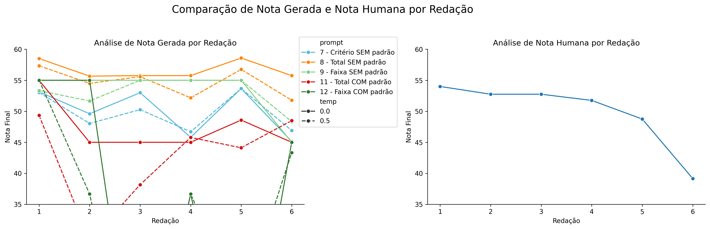
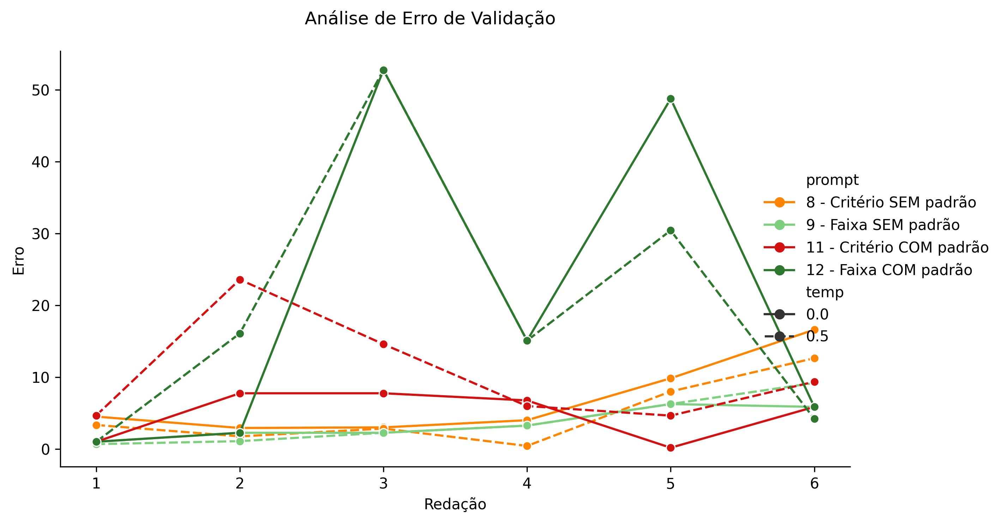
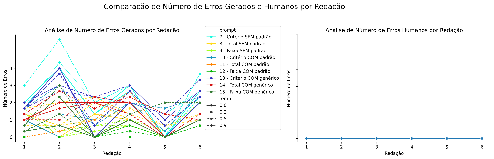

# Relatório de Avaliação: sabia-3.1 - 3 execuções
**Gerado em: 09/04/2026 02:54:22**

## 1. Distribuição de Notas
Nesta seção comparamos as notas atribuídas pelo modelo sabia em diferentes prompts/temperaturas versus a correção humana.

## 2. Comparação de Notas Geradas e Humanas
Nesta seção, apresentamos a comparação entre as notas finais geradas pelo modelo e as notas dadas por avaliadores humanos.

## 3. Análise de Erro Absoluto de Validação

<table>
  <tr>
    <td>
      
    </td>
    <td>
      <table border="1" class="dataframe">
  <thead>
    <tr style="text-align: center;">
      <th>prompt</th>
      <th>temp</th>
      <th>area_sob_curva</th>
      <th>mae</th>
      <th>rmse</th>
    </tr>
  </thead>
  <tbody>
    <tr>
      <td>7</td>
      <td>0.0</td>
      <td>14.8250</td>
      <td>3.5806</td>
      <td>5.7921</td>
    </tr>
    <tr>
      <td>7</td>
      <td>0.2</td>
      <td>15.1416</td>
      <td>3.6416</td>
      <td>5.8401</td>
    </tr>
    <tr>
      <td>7</td>
      <td>0.5</td>
      <td>12.8918</td>
      <td>3.2639</td>
      <td>5.5961</td>
    </tr>
    <tr>
      <td>7</td>
      <td>0.9</td>
      <td>12.5250</td>
      <td>3.1139</td>
      <td>5.0289</td>
    </tr>
    <tr>
      <td>8</td>
      <td>0.0</td>
      <td>35.8000</td>
      <td>7.7250</td>
      <td>8.9303</td>
    </tr>
    <tr>
      <td>8</td>
      <td>0.2</td>
      <td>34.9667</td>
      <td>7.5861</td>
      <td>8.8304</td>
    </tr>
    <tr>
      <td>8</td>
      <td>0.5</td>
      <td>35.3834</td>
      <td>7.6556</td>
      <td>8.8007</td>
    </tr>
    <tr>
      <td>8</td>
      <td>0.9</td>
      <td>36.7583</td>
      <td>7.8500</td>
      <td>9.0791</td>
    </tr>
    <tr>
      <td>9</td>
      <td>0.0</td>
      <td>22.4250</td>
      <td>5.1417</td>
      <td>7.2108</td>
    </tr>
    <tr>
      <td>9</td>
      <td>0.2</td>
      <td>20.7583</td>
      <td>4.8639</td>
      <td>7.1560</td>
    </tr>
    <tr>
      <td>9</td>
      <td>0.5</td>
      <td>18.2583</td>
      <td>4.3083</td>
      <td>6.4438</td>
    </tr>
    <tr>
      <td>9</td>
      <td>0.9</td>
      <td>11.2583</td>
      <td>2.9750</td>
      <td>5.2779</td>
    </tr>
    <tr>
      <td>10</td>
      <td>0.0</td>
      <td>17.8750</td>
      <td>4.0583</td>
      <td>5.8653</td>
    </tr>
    <tr>
      <td>10</td>
      <td>0.2</td>
      <td>17.0416</td>
      <td>3.8639</td>
      <td>5.5774</td>
    </tr>
    <tr>
      <td>10</td>
      <td>0.5</td>
      <td>12.8583</td>
      <td>3.0417</td>
      <td>4.8516</td>
    </tr>
    <tr>
      <td>10</td>
      <td>0.9</td>
      <td>15.1251</td>
      <td>3.6306</td>
      <td>5.5574</td>
    </tr>
    <tr>
      <td>11</td>
      <td>0.0</td>
      <td>38.5084</td>
      <td>8.1694</td>
      <td>9.1269</td>
    </tr>
    <tr>
      <td>11</td>
      <td>0.2</td>
      <td>38.0084</td>
      <td>8.0028</td>
      <td>8.8296</td>
    </tr>
    <tr>
      <td>11</td>
      <td>0.5</td>
      <td>33.2584</td>
      <td>6.7250</td>
      <td>7.0951</td>
    </tr>
    <tr>
      <td>11</td>
      <td>0.9</td>
      <td>33.7050</td>
      <td>7.2578</td>
      <td>8.1569</td>
    </tr>
    <tr>
      <td>12</td>
      <td>0.0</td>
      <td>22.4250</td>
      <td>5.1417</td>
      <td>7.2108</td>
    </tr>
    <tr>
      <td>12</td>
      <td>0.2</td>
      <td>22.4250</td>
      <td>5.1417</td>
      <td>7.2108</td>
    </tr>
    <tr>
      <td>12</td>
      <td>0.5</td>
      <td>29.0917</td>
      <td>6.2528</td>
      <td>7.9089</td>
    </tr>
    <tr>
      <td>12</td>
      <td>0.9</td>
      <td>33.2584</td>
      <td>7.0861</td>
      <td>8.2527</td>
    </tr>
    <tr>
      <td>13</td>
      <td>0.0</td>
      <td>15.9749</td>
      <td>3.8361</td>
      <td>6.0169</td>
    </tr>
    <tr>
      <td>13</td>
      <td>0.2</td>
      <td>14.2251</td>
      <td>3.4806</td>
      <td>5.6211</td>
    </tr>
    <tr>
      <td>13</td>
      <td>0.5</td>
      <td>14.6417</td>
      <td>3.6806</td>
      <td>5.4910</td>
    </tr>
    <tr>
      <td>13</td>
      <td>0.9</td>
      <td>20.0750</td>
      <td>4.4528</td>
      <td>5.5963</td>
    </tr>
    <tr>
      <td>14</td>
      <td>0.0</td>
      <td>34.8000</td>
      <td>7.5583</td>
      <td>8.8128</td>
    </tr>
    <tr>
      <td>14</td>
      <td>0.2</td>
      <td>34.3416</td>
      <td>7.4750</td>
      <td>8.9643</td>
    </tr>
    <tr>
      <td>14</td>
      <td>0.5</td>
      <td>33.5500</td>
      <td>7.3222</td>
      <td>8.5020</td>
    </tr>
    <tr>
      <td>14</td>
      <td>0.9</td>
      <td>33.3800</td>
      <td>7.2167</td>
      <td>8.4324</td>
    </tr>
    <tr>
      <td>15</td>
      <td>0.0</td>
      <td>22.4250</td>
      <td>5.1417</td>
      <td>7.2108</td>
    </tr>
    <tr>
      <td>15</td>
      <td>0.2</td>
      <td>22.4250</td>
      <td>5.1417</td>
      <td>7.2108</td>
    </tr>
    <tr>
      <td>15</td>
      <td>0.5</td>
      <td>20.7583</td>
      <td>4.8639</td>
      <td>7.1560</td>
    </tr>
    <tr>
      <td>15</td>
      <td>0.9</td>
      <td>15.2584</td>
      <td>3.5028</td>
      <td>4.9183</td>
    </tr>
  </tbody>
</table>
    </td>
  </tr>
</table>

## 4. Análise de Erros Gramaticais
Comparação da sensibilidade do modelo na detecção/geração de erros em relação ao padrão humano.

## 5. Correlação de Pearson
|           |       human |    p7, t0.0 |     p7, t0.2 |    p7, t0.5 |    p7, t0.9 |    p8, t0.0 |    p8, t0.2 |     p8, t0.5 |    p8, t0.9 |   p9, t0.0 |    p9, t0.2 |    p9, t0.5 |     p9, t0.9 |   p10, t0.0 |   p10, t0.2 |   p10, t0.5 |   p10, t0.9 |   p11, t0.0 |   p11, t0.2 |   p11, t0.5 |   p11, t0.9 |   p12, t0.0 |   p12, t0.2 |    p12, t0.5 |   p12, t0.9 |   p13, t0.0 |   p13, t0.2 |   p13, t0.5 |   p13, t0.9 |   p14, t0.0 |   p14, t0.2 |   p14, t0.5 |   p14, t0.9 |   p15, t0.0 |   p15, t0.2 |   p15, t0.5 |   p15, t0.9 |
|:----------|------------:|------------:|-------------:|------------:|------------:|------------:|------------:|-------------:|------------:|-----------:|------------:|------------:|-------------:|------------:|------------:|------------:|------------:|------------:|------------:|------------:|------------:|------------:|------------:|-------------:|------------:|------------:|------------:|------------:|------------:|------------:|------------:|------------:|------------:|------------:|------------:|------------:|------------:|
| human     |   1         |   0.570481  |   0.572831   |   0.542191  |   0.562235  |   0.546648  |   0.567182  |   0.831041   |   0.683773  |        nan |  -0.255796  |   0.390659  |   0.491866   |   0.904502  |   0.916366  |   0.76078   |   0.395666  |   0.947257  |   0.947257  |   0.923422  |   0.9714    |         nan |         nan |   0.290442   |   0.602132  |   0.204686  |   0.468719  |  -0.0424872 |  -0.0643466 |   0.525268  |   0.23004   |   0.811617  |   0.752187  |         nan |         nan |  -0.255796  |   0.55564   |
| p7, t0.0  |   0.570481  |   1         |   0.983978   |   0.962636  |   0.868955  |   0.442998  |   0.585705  |   0.822261   |   0.772218  |        nan |  -0.179171  |   0.648325  |   0.128783   |   0.827402  |   0.817866  |   0.914162  |   0.736212  |   0.739524  |   0.739524  |   0.731148  |   0.436528  |         nan |         nan |   0.201986   |  -0.0944076 |   0.535228  |   0.694624  |  -0.224244  |   0.161137  |   0.560481  |   0.746791  |   0.82299   |   0.426328  |         nan |         nan |  -0.179171  |   0.0351696 |
| p7, t0.2  |   0.572831  |   0.983978  |   1          |   0.965889  |   0.881614  |   0.394493  |   0.651991  |   0.854253   |   0.727459  |        nan |  -0.252944  |   0.5197    |  -0.00539868 |   0.817157  |   0.800526  |   0.86201   |   0.738274  |   0.751943  |   0.751943  |   0.737105  |   0.458284  |         nan |         nan |   0.11619    |  -0.148011  |   0.663614  |   0.774001  |  -0.307249  |   0.18375   |   0.47569   |   0.815526  |   0.798492  |   0.344914  |         nan |         nan |  -0.252944  |   0.0322538 |
| p7, t0.5  |   0.542191  |   0.962636  |   0.965889   |   1         |   0.953854  |   0.404751  |   0.679628  |   0.879158   |   0.622533  |        nan |  -0.169378  |   0.60765   |   0.118277   |   0.741238  |   0.7378    |   0.861772  |   0.865691  |   0.681352  |   0.681352  |   0.680452  |   0.447335  |         nan |         nan |  -0.027584   |  -0.246227  |   0.666629  |   0.807068  |  -0.306499  |   0.255798  |   0.518308  |   0.809475  |   0.868176  |   0.297642  |         nan |         nan |  -0.169378  |   0.0185567 |
| p7, t0.9  |   0.562235  |   0.868955  |   0.881614   |   0.953854  |   1         |   0.222158  |   0.591663  |   0.876843   |   0.429087  |        nan |  -0.340155  |   0.496071  |   0.163695   |   0.680576  |   0.696058  |   0.832606  |   0.962171  |   0.621165  |   0.621165  |   0.594468  |   0.476249  |         nan |         nan |  -0.258822   |  -0.284066  |   0.706532  |   0.906093  |  -0.497352  |   0.0889578 |   0.350541  |   0.68053   |   0.861617  |   0.344619  |         nan |         nan |  -0.340155  |  -0.0947271 |
| p8, t0.0  |   0.546648  |   0.442998  |   0.394493   |   0.404751  |   0.222158  |   1         |   0.708209  |   0.538162   |   0.761378  |        nan |   0.632456  |   0.707107  |   0.5        |   0.546012  |   0.52293   |   0.452483  |   0.0739054 |   0.632456  |   0.632456  |   0.739453  |   0.590249  |         nan |         nan |   0.632461   |   0.441723  |  -0.0980076 |  -0.0689119 |   0.699629  |   0.672245  |   0.957826  |   0.4166    |   0.630973  |   0.212478  |         nan |         nan |   0.632456  |   0.852805  |
| p8, t0.2  |   0.567182  |   0.585705  |   0.651991   |   0.679628  |   0.591663  |   0.708209  |   1         |   0.824497   |   0.535165  |        nan |   0.212748  |   0.350544  |   0.0354073  |   0.559362  |   0.526907  |   0.447863  |   0.459282  |   0.683073  |   0.683073  |   0.749235  |   0.64757   |         nan |         nan |   0.0447995  |  -0.0273756 |   0.60514   |   0.528325  |   0.117486  |   0.71251   |   0.61729   |   0.817954  |   0.72817   |  -0.0613304 |         nan |         nan |   0.212748  |   0.603968  |
| p8, t0.5  |   0.831041  |   0.822261  |   0.854253   |   0.879158  |   0.876843  |   0.538162  |   0.824497  |   1          |   0.643064  |        nan |  -0.201453  |   0.481514  |   0.252613   |   0.853238  |   0.852707  |   0.826088  |   0.747275  |   0.88218   |   0.88218   |   0.880436  |   0.804871  |         nan |         nan |   0.00695719 |   0.0849038 |   0.621568  |   0.784316  |  -0.221305  |   0.246889  |   0.5565    |   0.685329  |   0.945901  |   0.424476  |         nan |         nan |  -0.201453  |   0.36059   |
| p8, t0.9  |   0.683773  |   0.772218  |   0.727459   |   0.622533  |   0.429087  |   0.761378  |   0.535165  |   0.643064   |   1         |        nan |   0.120377  |   0.664003  |   0.304557   |   0.871093  |   0.844904  |   0.772557  |   0.203355  |   0.842698  |   0.842698  |   0.868822  |   0.586311  |         nan |         nan |   0.746403   |   0.462453  |   0.0671827 |   0.194814  |   0.305409  |   0.222514  |   0.780319  |   0.479298  |   0.674936  |   0.558345  |         nan |         nan |   0.120377  |   0.503212  |
| p9, t0.0  | nan         | nan         | nan          | nan         | nan         | nan         | nan         | nan          | nan         |        nan | nan         | nan         | nan          | nan         | nan         | nan         | nan         | nan         | nan         | nan         | nan         |         nan |         nan | nan          | nan         | nan         | nan         | nan         | nan         | nan         | nan         | nan         | nan         |         nan |         nan | nan         | nan         |
| p9, t0.2  |  -0.255796  |  -0.179171  |  -0.252944   |  -0.169378  |  -0.340155  |   0.632456  |   0.212748  |  -0.201453   |   0.120377  |        nan |   1         |   0.447214  |   0.316228   |  -0.281081  |  -0.300662  |  -0.24462   |  -0.315936  |  -0.2       |  -0.2       |  -0.0531442 |  -0.150638  |         nan |         nan |   0.400004   |   0.0698363 |  -0.454636  |  -0.603785  |   0.897605  |   0.765828  |   0.605783  |   0.0585539 |  -0.0327135 |  -0.381291  |         nan |         nan |   1         |   0.539361  |
| p9, t0.5  |   0.390659  |   0.648325  |   0.5197     |   0.60765   |   0.496071  |   0.707107  |   0.350544  |   0.481514   |   0.664003  |        nan |   0.447214  |   1         |   0.707107   |   0.520771  |   0.537832  |   0.719038  |   0.461346  |   0.447214  |   0.447214  |   0.51495   |   0.304009  |         nan |         nan |   0.447211   |   0.156177  |  -0.154014  |   0.0835099 |   0.395779  |   0.330673  |   0.880471  |   0.305487  |   0.716804  |   0.436105  |         nan |         nan |   0.447214  |   0.30151   |
| p9, t0.9  |   0.491866  |   0.128783  |  -0.00539868 |   0.118277  |   0.163695  |   0.5       |   0.0354073 |   0.252613   |   0.304557  |        nan |   0.316228  |   0.707107  |   1          |   0.330147  |   0.383707  |   0.452483  |   0.193686  |   0.316228  |   0.316228  |   0.352922  |   0.471847  |         nan |         nan |   0.316216   |   0.552164  |  -0.522778  |  -0.167319  |   0.409797  |  -0.0396643 |   0.622587  |  -0.324055  |   0.517209  |   0.638651  |         nan |         nan |   0.316228  |   0.426393  |
| p10, t0.0 |   0.904502  |   0.827402  |   0.817157   |   0.741238  |   0.680576  |   0.546012  |   0.559362  |   0.853238   |   0.871093  |        nan |  -0.281081  |   0.520771  |   0.330147   |   1         |   0.996706  |   0.910202  |   0.479868  |   0.971739  |   0.971739  |   0.943649  |   0.801381  |         nan |         nan |   0.417608   |   0.434704  |   0.307879  |   0.546113  |  -0.0984753 |  -0.0444348 |   0.577716  |   0.446704  |   0.831948  |   0.739876  |         nan |         nan |  -0.281081  |   0.368182  |
| p10, t0.2 |   0.916366  |   0.817866  |   0.800526   |   0.7378    |   0.696058  |   0.52293   |   0.526907  |   0.852707   |   0.844904  |        nan |  -0.300662  |   0.537832  |   0.383707   |   0.996706  |   1         |   0.926716  |   0.509237  |   0.962122  |   0.962122  |   0.929953  |   0.809378  |         nan |         nan |   0.388715   |   0.442498  |   0.28472   |   0.553073  |  -0.120399  |  -0.0876818 |   0.569173  |   0.402369  |   0.84691   |   0.779094  |         nan |         nan |  -0.300662  |   0.34606   |
| p10, t0.5 |   0.76078   |   0.914162  |   0.86201    |   0.861772  |   0.832606  |   0.452483  |   0.447863  |   0.826088   |   0.772557  |        nan |  -0.24462   |   0.719038  |   0.452483   |   0.910202  |   0.926716  |   1         |   0.714614  |   0.816971  |   0.816971  |   0.791082  |   0.617048  |         nan |         nan |   0.263091   |   0.195035  |   0.300001  |   0.612528  |  -0.189534  |  -0.0700226 |   0.595576  |   0.451328  |   0.893662  |   0.732796  |         nan |         nan |  -0.24462   |   0.121362  |
| p10, t0.9 |   0.395666  |   0.736212  |   0.738274   |   0.865691  |   0.962171  |   0.0739054 |   0.459282  |   0.747275   |   0.203355  |        nan |  -0.315936  |   0.461346  |   0.193686   |   0.479868  |   0.509237  |   0.714614  |   1         |   0.409419  |   0.409419  |   0.383425  |   0.320977  |         nan |         nan |  -0.446499   |  -0.430053  |   0.661216  |   0.870145  |  -0.551842  |   0.0551437 |   0.23703   |   0.571492  |   0.768325  |   0.244106  |         nan |         nan |  -0.315936  |  -0.240175  |
| p11, t0.0 |   0.947257  |   0.739524  |   0.751943   |   0.681352  |   0.621165  |   0.632456  |   0.683073  |   0.88218    |   0.842698  |        nan |  -0.2       |   0.447214  |   0.316228   |   0.971739  |   0.962122  |   0.816971  |   0.409419  |   1         |   1         |   0.988486  |   0.89725   |         nan |         nan |   0.400004   |   0.488904  |   0.330665  |   0.516618  |  -0.0126359 |   0.0845031 |   0.605783  |   0.468408  |   0.830839  |   0.650057  |         nan |         nan |  -0.2       |   0.539361  |
| p11, t0.2 |   0.947257  |   0.739524  |   0.751943   |   0.681352  |   0.621165  |   0.632456  |   0.683073  |   0.88218    |   0.842698  |        nan |  -0.2       |   0.447214  |   0.316228   |   0.971739  |   0.962122  |   0.816971  |   0.409419  |   1         |   1         |   0.988486  |   0.89725   |         nan |         nan |   0.400004   |   0.488904  |   0.330665  |   0.516618  |  -0.0126359 |   0.0845031 |   0.605783  |   0.468408  |   0.830839  |   0.650057  |         nan |         nan |  -0.2       |   0.539361  |
| p11, t0.5 |   0.923422  |   0.731148  |   0.737105   |   0.680452  |   0.594468  |   0.739453  |   0.749235  |   0.880436   |   0.868822  |        nan |  -0.0531442 |   0.51495   |   0.352922   |   0.943649  |   0.929953  |   0.791082  |   0.383425  |   0.988486  |   0.988486  |   1         |   0.892534  |         nan |         nan |   0.44642    |   0.486246  |   0.295811  |   0.454165  |   0.111761  |   0.220896  |   0.705048  |   0.509275  |   0.847277  |   0.58291   |         nan |         nan |  -0.0531442 |   0.630609  |
| p11, t0.9 |   0.9714    |   0.436528  |   0.458284   |   0.447335  |   0.476249  |   0.590249  |   0.64757   |   0.804871   |   0.586311  |        nan |  -0.150638  |   0.304009  |   0.471847   |   0.801381  |   0.809378  |   0.617048  |   0.320977  |   0.89725   |   0.89725   |   0.892534  |   1         |         nan |         nan |   0.225523   |   0.602834  |   0.208671  |   0.41262   |   0.0408782 |   0.0686861 |   0.51929   |   0.224235  |   0.765948  |   0.611791  |         nan |         nan |  -0.150638  |   0.681257  |
| p12, t0.0 | nan         | nan         | nan          | nan         | nan         | nan         | nan         | nan          | nan         |        nan | nan         | nan         | nan          | nan         | nan         | nan         | nan         | nan         | nan         | nan         | nan         |         nan |         nan | nan          | nan         | nan         | nan         | nan         | nan         | nan         | nan         | nan         | nan         |         nan |         nan | nan         | nan         |
| p12, t0.2 | nan         | nan         | nan          | nan         | nan         | nan         | nan         | nan          | nan         |        nan | nan         | nan         | nan          | nan         | nan         | nan         | nan         | nan         | nan         | nan         | nan         |         nan |         nan | nan          | nan         | nan         | nan         | nan         | nan         | nan         | nan         | nan         | nan         |         nan |         nan | nan         | nan         |
| p12, t0.5 |   0.290442  |   0.201986  |   0.11619    |  -0.027584  |  -0.258822  |   0.632461  |   0.0447995 |   0.00695719 |   0.746403  |        nan |   0.400004  |   0.447211  |   0.316216   |   0.417608  |   0.388715  |   0.263091  |  -0.446499  |   0.400004  |   0.400004  |   0.44642   |   0.225523  |         nan |         nan |   1          |   0.698419  |  -0.537265  |  -0.49174   |   0.701658  |   0.11224   |   0.605785  |  -0.058563  |   0.104666  |   0.413715  |         nan |         nan |   0.400004  |   0.539366  |
| p12, t0.9 |   0.602132  |  -0.0944076 |  -0.148011   |  -0.246227  |  -0.284066  |   0.441723  |  -0.0273756 |   0.0849038  |   0.462453  |        nan |   0.0698363 |   0.156177  |   0.552164   |   0.434704  |   0.442498  |   0.195035  |  -0.430053  |   0.488904  |   0.488904  |   0.486246  |   0.602834  |         nan |         nan |   0.698419   |   1         |  -0.577307  |  -0.389103  |   0.476813  |  -0.23701   |   0.359632  |  -0.449881  |   0.148503  |   0.671545  |         nan |         nan |   0.0698363 |   0.659225  |
| p13, t0.0 |   0.204686  |   0.535228  |   0.663614   |   0.666629  |   0.706532  |  -0.0980076 |   0.60514   |   0.621568   |   0.0671827 |        nan |  -0.454636  |  -0.154014  |  -0.522778   |   0.307879  |   0.28472   |   0.300001  |   0.661216  |   0.330665  |   0.330665  |   0.295811  |   0.208671  |         nan |         nan |  -0.537265   |  -0.577307  |   1         |   0.893344  |  -0.662506  |   0.209962  |  -0.128299  |   0.793588  |   0.399508  |  -0.226459  |         nan |         nan |  -0.454636  |  -0.208967  |
| p13, t0.2 |   0.468719  |   0.694624  |   0.774001   |   0.807068  |   0.906093  |  -0.0689119 |   0.528325  |   0.784316   |   0.194814  |        nan |  -0.603785  |   0.0835099 |  -0.167319   |   0.546113  |   0.553073  |   0.612528  |   0.870145  |   0.516618  |   0.516618  |   0.454165  |   0.41262   |         nan |         nan |  -0.49174    |  -0.389103  |   0.893344  |   1         |  -0.751724  |  -0.0450928 |  -0.0122679 |   0.650577  |   0.646441  |   0.184248  |         nan |         nan |  -0.603785  |  -0.235033  |
| p13, t0.5 |  -0.0424872 |  -0.224244  |  -0.307249   |  -0.306499  |  -0.497352  |   0.699629  |   0.117486  |  -0.221305   |   0.305409  |        nan |   0.897605  |   0.395779  |   0.409797   |  -0.0984753 |  -0.120399  |  -0.189534  |  -0.551842  |  -0.0126359 |  -0.0126359 |   0.111761  |   0.0408782 |         nan |         nan |   0.701658   |   0.476813  |  -0.662506  |  -0.751724  |   1         |   0.551106  |   0.629919  |  -0.145603  |  -0.0640959 |  -0.0925675 |         nan |         nan |   0.897605  |   0.711711  |
| p13, t0.9 |  -0.0643466 |   0.161137  |   0.18375    |   0.255798  |   0.0889578 |   0.672245  |   0.71251   |   0.246889   |   0.222514  |        nan |   0.765828  |   0.330673  |  -0.0396643  |  -0.0444348 |  -0.0876818 |  -0.0700226 |   0.0551437 |   0.0845031 |   0.0845031 |   0.220896  |   0.0686861 |         nan |         nan |   0.11224    |  -0.23701   |   0.209962  |  -0.0450928 |   0.551106  |   1         |   0.585102  |   0.623925  |   0.248594  |  -0.559009  |         nan |         nan |   0.765828  |   0.543928  |
| p14, t0.0 |   0.525268  |   0.560481  |   0.47569    |   0.518308  |   0.350541  |   0.957826  |   0.61729   |   0.5565     |   0.780319  |        nan |   0.605783  |   0.880471  |   0.622587   |   0.577716  |   0.569173  |   0.595576  |   0.23703   |   0.605783  |   0.605783  |   0.705048  |   0.51929   |         nan |         nan |   0.605785   |   0.359632  |  -0.128299  |  -0.0122679 |   0.629919  |   0.585102  |   1         |   0.403463  |   0.714342  |   0.319682  |         nan |         nan |   0.605783  |   0.694312  |
| p14, t0.2 |   0.23004   |   0.746791  |   0.815526   |   0.809475  |   0.68053   |   0.4166    |   0.817954  |   0.685329   |   0.479298  |        nan |   0.0585539 |   0.305487  |  -0.324055   |   0.446704  |   0.402369  |   0.451328  |   0.571492  |   0.468408  |   0.468408  |   0.509275  |   0.224235  |         nan |         nan |  -0.058563   |  -0.449881  |   0.793588  |   0.650577  |  -0.145603  |   0.623925  |   0.403463  |   1         |   0.563078  |  -0.235807  |         nan |         nan |   0.0585539 |   0.118424  |
| p14, t0.5 |   0.811617  |   0.82299   |   0.798492   |   0.868176  |   0.861617  |   0.630973  |   0.72817   |   0.945901   |   0.674936  |        nan |  -0.0327135 |   0.716804  |   0.517209   |   0.831948  |   0.84691   |   0.893662  |   0.768325  |   0.830839  |   0.830839  |   0.847277  |   0.765948  |         nan |         nan |   0.104666   |   0.148503  |   0.399508  |   0.646441  |  -0.0640959 |   0.248594  |   0.714342  |   0.563078  |   1         |   0.529665  |         nan |         nan |  -0.0327135 |   0.379309  |
| p14, t0.9 |   0.752187  |   0.426328  |   0.344914   |   0.297642  |   0.344619  |   0.212478  |  -0.0613304 |   0.424476   |   0.558345  |        nan |  -0.381291  |   0.436105  |   0.638651   |   0.739876  |   0.779094  |   0.732796  |   0.244106  |   0.650057  |   0.650057  |   0.58291   |   0.611791  |         nan |         nan |   0.413715   |   0.671545  |  -0.226459  |   0.184248  |  -0.0925675 |  -0.559009  |   0.319682  |  -0.235807  |   0.529665  |   1         |         nan |         nan |  -0.381291  |   0.149646  |
| p15, t0.0 | nan         | nan         | nan          | nan         | nan         | nan         | nan         | nan          | nan         |        nan | nan         | nan         | nan          | nan         | nan         | nan         | nan         | nan         | nan         | nan         | nan         |         nan |         nan | nan          | nan         | nan         | nan         | nan         | nan         | nan         | nan         | nan         | nan         |         nan |         nan | nan         | nan         |
| p15, t0.2 | nan         | nan         | nan          | nan         | nan         | nan         | nan         | nan          | nan         |        nan | nan         | nan         | nan          | nan         | nan         | nan         | nan         | nan         | nan         | nan         | nan         |         nan |         nan | nan          | nan         | nan         | nan         | nan         | nan         | nan         | nan         | nan         | nan         |         nan |         nan | nan         | nan         |
| p15, t0.5 |  -0.255796  |  -0.179171  |  -0.252944   |  -0.169378  |  -0.340155  |   0.632456  |   0.212748  |  -0.201453   |   0.120377  |        nan |   1         |   0.447214  |   0.316228   |  -0.281081  |  -0.300662  |  -0.24462   |  -0.315936  |  -0.2       |  -0.2       |  -0.0531442 |  -0.150638  |         nan |         nan |   0.400004   |   0.0698363 |  -0.454636  |  -0.603785  |   0.897605  |   0.765828  |   0.605783  |   0.0585539 |  -0.0327135 |  -0.381291  |         nan |         nan |   1         |   0.539361  |
| p15, t0.9 |   0.55564   |   0.0351696 |   0.0322538  |   0.0185567 |  -0.0947271 |   0.852805  |   0.603968  |   0.36059    |   0.503212  |        nan |   0.539361  |   0.30151   |   0.426393   |   0.368182  |   0.34606   |   0.121362  |  -0.240175  |   0.539361  |   0.539361  |   0.630609  |   0.681257  |         nan |         nan |   0.539366   |   0.659225  |  -0.208967  |  -0.235033  |   0.711711  |   0.543928  |   0.694312  |   0.118424  |   0.379309  |   0.149646  |         nan |         nan |   0.539361  |   1         |

## 6. Correlação de Spearman
|           |       human |    p7, t0.0 |    p7, t0.2 |    p7, t0.5 |    p7, t0.9 |   p8, t0.0 |    p8, t0.2 |   p8, t0.5 |    p8, t0.9 |   p9, t0.0 |   p9, t0.2 |   p9, t0.5 |   p9, t0.9 |   p10, t0.0 |   p10, t0.2 |   p10, t0.5 |   p10, t0.9 |   p11, t0.0 |   p11, t0.2 |   p11, t0.5 |   p11, t0.9 |   p12, t0.0 |   p12, t0.2 |   p12, t0.5 |   p12, t0.9 |   p13, t0.0 |   p13, t0.2 |   p13, t0.5 |   p13, t0.9 |   p14, t0.0 |   p14, t0.2 |   p14, t0.5 |   p14, t0.9 |   p15, t0.0 |   p15, t0.2 |   p15, t0.5 |   p15, t0.9 |
|:----------|------------:|------------:|------------:|------------:|------------:|-----------:|------------:|-----------:|------------:|-----------:|-----------:|-----------:|-----------:|------------:|------------:|------------:|------------:|------------:|------------:|------------:|------------:|------------:|------------:|------------:|------------:|------------:|------------:|------------:|------------:|------------:|------------:|------------:|------------:|------------:|------------:|------------:|------------:|
| human     |   1         |   0.318874  |   0.318874  |   0.40584   |   0.637748  |   0.315063 |   0.308021  |   0.550782 |   0.0579771 |        nan |  -0.265684 |   0.396059 |   0.735147 |   0.400427  |   0.529412  |    0.40584  |   0.521794  |    0.664211 |    0.664211 |   0.308021  |   0.823529  |         nan |         nan |  -0.0626224 |   0.582154  |   0.102941  |   0.40584   |  -0.264706  |  -0.347863  |   0.39139   |  -0.0588235 |    0.647059 |   0.753702  |         nan |         nan |   -0.265684 |   0.358249  |
| p7, t0.0  |   0.318874  |   1         |   1         |   0.942857  |   0.828571  |   0.20702  |   0.5161    |   0.771429 |   0.485714  |        nan |  -0.392792 |   0.48795  |   0        |   0.819689  |   0.666737  |    0.828571 |   0.771429  |    0.654654 |    0.654654 |   0.394665  |   0.0869657 |         nan |         nan |   0.0308607 |  -0.205971  |   0.811679  |   0.657143  |  -0.463817  |   0.142857  |   0.401189  |   0.550782  |    0.782691 |   0.485714  |         nan |         nan |   -0.392792 |  -0.176547  |
| p7, t0.2  |   0.318874  |   1         |   1         |   0.942857  |   0.828571  |   0.20702  |   0.5161    |   0.771429 |   0.485714  |        nan |  -0.392792 |   0.48795  |   0        |   0.819689  |   0.666737  |    0.828571 |   0.771429  |    0.654654 |    0.654654 |   0.394665  |   0.0869657 |         nan |         nan |   0.0308607 |  -0.205971  |   0.811679  |   0.657143  |  -0.463817  |   0.142857  |   0.401189  |   0.550782  |    0.782691 |   0.485714  |         nan |         nan |   -0.392792 |  -0.176547  |
| p7, t0.5  |   0.40584   |   0.942857  |   0.942857  |   1         |   0.942857  |   0.414039 |   0.637536  |   0.885714 |   0.542857  |        nan |  -0.130931 |   0.68313  |   0.20702  |   0.698253  |   0.521794  |    0.942857 |   0.885714  |    0.654654 |    0.654654 |   0.576818  |   0.231908  |         nan |         nan |   0.0308607 |  -0.205971  |   0.724714  |   0.6       |  -0.40584   |   0.314286  |   0.617213  |   0.637748  |    0.927634 |   0.428571  |         nan |         nan |   -0.130931 |   0         |
| p7, t0.9  |   0.637748  |   0.828571  |   0.828571  |   0.942857  |   1         |   0.414039 |   0.637536  |   0.942857 |   0.371429  |        nan |  -0.130931 |   0.68313  |   0.414039 |   0.576818  |   0.463817  |    0.885714 |   0.942857  |    0.654654 |    0.654654 |   0.576818  |   0.463817  |         nan |         nan |  -0.123443  |  -0.0882735 |   0.637748  |   0.657143  |  -0.492805  |   0.2       |   0.617213  |   0.550782  |    0.985611 |   0.485714  |         nan |         nan |   -0.130931 |   0.0882735 |
| p8, t0.0  |   0.315063  |   0.20702   |   0.20702   |   0.414039  |   0.414039  |   1        |   0.659912  |   0.414039 |   0.828079  |        nan |   0.632456 |   0.707107 |   0.5      |   0.219971  |   0.105021  |    0.621059 |   0.20702   |    0.632456 |    0.632456 |   0.879883  |   0.525105  |         nan |         nan |   0.67082   |   0.426401  |  -0.105021  |  -0.20702   |   0.525105  |   0.621059  |   0.894427  |   0.420084  |    0.525105 |   0.20702   |         nan |         nan |    0.632456 |   0.852803  |
| p8, t0.2  |   0.308021  |   0.5161    |   0.5161    |   0.637536  |   0.637536  |   0.659912 |   1         |   0.819689 |   0.5161    |        nan |   0.139122 |   0.311086 |   0        |   0.16129   |   0         |    0.576818 |   0.394665  |    0.695608 |    0.695608 |   0.935484  |   0.616041  |         nan |         nan |   0.0983739 |   0.0312653 |   0.585239  |   0.5161    |  -0.15401   |   0.698253  |   0.491869  |   0.89326   |    0.616041 |  -0.0303588 |         nan |         nan |    0.139122 |   0.562775  |
| p8, t0.5  |   0.550782  |   0.771429  |   0.771429  |   0.885714  |   0.942857  |   0.414039 |   0.819689  |   1        |   0.314286  |        nan |  -0.130931 |   0.48795  |   0.20702  |   0.394665  |   0.260897  |    0.771429 |   0.828571  |    0.654654 |    0.654654 |   0.698253  |   0.550782  |         nan |         nan |  -0.216025  |  -0.147122  |   0.753702  |   0.771429  |  -0.550782  |   0.371429  |   0.493771  |   0.753702  |    0.898645 |   0.257143  |         nan |         nan |   -0.130931 |   0.176547  |
| p8, t0.9  |   0.0579771 |   0.485714  |   0.485714  |   0.542857  |   0.371429  |   0.828079 |   0.5161    |   0.314286 |   1         |        nan |   0.392792 |   0.68313  |   0.20702  |   0.576818  |   0.40584   |    0.714286 |   0.2       |    0.654654 |    0.654654 |   0.698253  |   0.115954  |         nan |         nan |   0.833238  |   0.26482   |   0.0869657 |  -0.2       |   0.521794  |   0.542857  |   0.802377  |   0.40584   |    0.463817 |   0.314286  |         nan |         nan |    0.392792 |   0.529641  |
| p9, t0.0  | nan         | nan         | nan         | nan         | nan         | nan        | nan         | nan        | nan         |        nan | nan        | nan        | nan        | nan         | nan         |  nan        | nan         |  nan        |  nan        | nan         | nan         |         nan |         nan | nan         | nan         | nan         | nan         | nan         | nan         | nan         | nan         |  nan        | nan         |         nan |         nan |  nan        | nan         |
| p9, t0.2  |  -0.265684  |  -0.392792  |  -0.392792  |  -0.130931  |  -0.130931  |   0.632456 |   0.139122  |  -0.130931 |   0.392792  |        nan |   1        |   0.447214 |   0.316228 |  -0.417365  |  -0.531369  |    0.130931 |  -0.130931  |   -0.2      |   -0.2      |   0.417365  |   0         |         nan |         nan |   0.424264  |   0         |  -0.531369  |  -0.654654  |   0.664211  |   0.654654  |   0.565685  |   0.132842  |    0        |  -0.392792  |         nan |         nan |    1        |   0.53936   |
| p9, t0.5  |   0.396059  |   0.48795   |   0.48795   |   0.68313   |   0.68313   |   0.707107 |   0.311086  |   0.48795  |   0.68313   |        nan |   0.447214 |   1        |   0.707107 |   0.518476  |   0.396059  |    0.87831  |   0.68313   |    0.447214 |    0.447214 |   0.518476  |   0.19803   |         nan |         nan |   0.421637  |   0.100504  |   0         |  -0.09759   |   0.19803   |   0.29277   |   0.948683  |   0.19803   |    0.792118 |   0.48795   |         nan |         nan |    0.447214 |   0.301511  |
| p9, t0.9  |   0.735147  |   0         |   0         |   0.20702   |   0.414039  |   0.5      |   0         |   0.20702  |   0.20702   |        nan |   0.316228 |   0.707107 |   1        |   0.219971  |   0.315063  |    0.414039 |   0.414039  |    0.316228 |    0.316228 |   0.219971  |   0.525105  |         nan |         nan |   0.223607  |   0.533002  |  -0.420084  |  -0.20702   |   0.210042  |  -0.20702   |   0.67082   |  -0.315063  |    0.525105 |   0.621059  |         nan |         nan |    0.316228 |   0.426401  |
| p10, t0.0 |   0.400427  |   0.819689  |   0.819689  |   0.698253  |   0.576818  |   0.219971 |   0.16129   |   0.394665 |   0.576818  |        nan |  -0.417365 |   0.518476 |   0.219971 |   1         |   0.954864  |    0.698253 |   0.5161    |    0.695608 |    0.695608 |   0.16129   |   0.0308021 |         nan |         nan |   0.393496  |   0.218857  |   0.400427  |   0.27323   |  -0.0924062 |  -0.212512  |   0.426287  |   0.0616041 |    0.585239 |   0.819689  |         nan |         nan |   -0.417365 |  -0.0937958 |
| p10, t0.2 |   0.529412  |   0.666737  |   0.666737  |   0.521794  |   0.463817  |   0.105021 |   0         |   0.260897 |   0.40584   |        nan |  -0.531369 |   0.396059 |   0.315063 |   0.954864  |   1         |    0.521794 |   0.40584   |    0.664211 |    0.664211 |   0         |   0.117647  |         nan |         nan |   0.344423  |   0.40303   |   0.25      |   0.231908  |  -0.0882353 |  -0.463817  |   0.297457  |  -0.176471  |    0.470588 |   0.927634  |         nan |         nan |   -0.531369 |  -0.0895622 |
| p10, t0.5 |   0.40584   |   0.828571  |   0.828571  |   0.942857  |   0.885714  |   0.621059 |   0.576818  |   0.771429 |   0.714286  |        nan |   0.130931 |   0.87831  |   0.414039 |   0.698253  |   0.521794  |    1        |   0.828571  |    0.654654 |    0.654654 |   0.637536  |   0.231908  |         nan |         nan |   0.277746  |  -0.058849  |   0.463817  |   0.314286  |  -0.115954  |   0.371429  |   0.833238  |   0.521794  |    0.927634 |   0.485714  |         nan |         nan |    0.130931 |   0.176547  |
| p10, t0.9 |   0.521794  |   0.771429  |   0.771429  |   0.885714  |   0.942857  |   0.20702  |   0.394665  |   0.828571 |   0.2       |        nan |  -0.130931 |   0.68313  |   0.414039 |   0.5161    |   0.40584   |    0.828571 |   1         |    0.392792 |    0.392792 |   0.333947  |   0.231908  |         nan |         nan |  -0.277746  |  -0.294245  |   0.579771  |   0.6       |  -0.579771  |   0.0857143 |   0.524631  |   0.40584   |    0.927634 |   0.428571  |         nan |         nan |   -0.130931 |  -0.176547  |
| p11, t0.0 |   0.664211  |   0.654654  |   0.654654  |   0.654654  |   0.654654  |   0.632456 |   0.695608  |   0.654654 |   0.654654  |        nan |  -0.2      |   0.447214 |   0.316228 |   0.695608  |   0.664211  |    0.654654 |   0.392792  |    1        |    1        |   0.695608  |   0.664211  |         nan |         nan |   0.424264  |   0.53936   |   0.398527  |   0.392792  |   0         |   0.130931  |   0.565685  |   0.398527  |    0.664211 |   0.654654  |         nan |         nan |   -0.2      |   0.53936   |
| p11, t0.2 |   0.664211  |   0.654654  |   0.654654  |   0.654654  |   0.654654  |   0.632456 |   0.695608  |   0.654654 |   0.654654  |        nan |  -0.2      |   0.447214 |   0.316228 |   0.695608  |   0.664211  |    0.654654 |   0.392792  |    1        |    1        |   0.695608  |   0.664211  |         nan |         nan |   0.424264  |   0.53936   |   0.398527  |   0.392792  |   0         |   0.130931  |   0.565685  |   0.398527  |    0.664211 |   0.654654  |         nan |         nan |   -0.2      |   0.53936   |
| p11, t0.5 |   0.308021  |   0.394665  |   0.394665  |   0.576818  |   0.576818  |   0.879883 |   0.935484  |   0.698253 |   0.698253  |        nan |   0.417365 |   0.518476 |   0.219971 |   0.16129   |   0         |    0.637536 |   0.333947  |    0.695608 |    0.695608 |   1         |   0.616041  |         nan |         nan |   0.360704  |   0.187592  |   0.308021  |   0.212512  |   0.15401   |   0.758971  |   0.721408  |   0.770051  |    0.616041 |   0.0303588 |         nan |         nan |    0.417365 |   0.750366  |
| p11, t0.9 |   0.823529  |   0.0869657 |   0.0869657 |   0.231908  |   0.463817  |   0.525105 |   0.616041  |   0.550782 |   0.115954  |        nan |   0        |   0.19803  |   0.525105 |   0.0308021 |   0.117647  |    0.231908 |   0.231908  |    0.664211 |    0.664211 |   0.616041  |   1         |         nan |         nan |   0         |   0.612008  |   0.0735294 |   0.347863  |  -0.0882353 |   0.0579771 |   0.360079  |   0.235294  |    0.470588 |   0.347863  |         nan |         nan |    0        |   0.716498  |
| p12, t0.0 | nan         | nan         | nan         | nan         | nan         | nan        | nan         | nan        | nan         |        nan | nan        | nan        | nan        | nan         | nan         |  nan        | nan         |  nan        |  nan        | nan         | nan         |         nan |         nan | nan         | nan         | nan         | nan         | nan         | nan         | nan         | nan         |  nan        | nan         |         nan |         nan |  nan        | nan         |
| p12, t0.2 | nan         | nan         | nan         | nan         | nan         | nan        | nan         | nan        | nan         |        nan | nan        | nan        | nan        | nan         | nan         |  nan        | nan         |  nan        |  nan        | nan         | nan         |         nan |         nan | nan         | nan         | nan         | nan         | nan         | nan         | nan         | nan         |  nan        | nan         |         nan |         nan |  nan        | nan         |
| p12, t0.5 |  -0.0626224 |   0.0308607 |   0.0308607 |   0.0308607 |  -0.123443  |   0.67082  |   0.0983739 |  -0.216025 |   0.833238  |        nan |   0.424264 |   0.421637 |   0.223607 |   0.393496  |   0.344423  |    0.277746 |  -0.277746  |    0.424264 |    0.424264 |   0.360704  |   0         |         nan |         nan |   1         |   0.556187  |  -0.39139   |  -0.617213  |   0.861058  |   0.246885  |   0.566667  |  -0.078278  |    0        |   0.308607  |         nan |         nan |    0.424264 |   0.572078  |
| p12, t0.9 |   0.582154  |  -0.205971  |  -0.205971  |  -0.205971  |  -0.0882735 |   0.426401 |   0.0312653 |  -0.147122 |   0.26482   |        nan |   0        |   0.100504 |   0.533002 |   0.218857  |   0.40303   |   -0.058849 |  -0.294245  |    0.53936  |    0.53936  |   0.187592  |   0.612008  |         nan |         nan |   0.556187  |   1         |  -0.477665  |  -0.294245  |   0.507519  |  -0.323669  |   0.254257  |  -0.40303   |   -0.014927 |   0.58849   |         nan |         nan |    0        |   0.681818  |
| p13, t0.0 |   0.102941  |   0.811679  |   0.811679  |   0.724714  |   0.637748  |  -0.105021 |   0.585239  |   0.753702 |   0.0869657 |        nan |  -0.531369 |   0        |  -0.420084 |   0.400427  |   0.25      |    0.463817 |   0.579771  |    0.398527 |    0.398527 |   0.308021  |   0.0735294 |         nan |         nan |  -0.39139   |  -0.477665  |   1         |   0.898645  |  -0.75      |   0.231908  |  -0.0469668 |   0.735294  |    0.514706 |   0.0289886 |         nan |         nan |   -0.531369 |  -0.313468  |
| p13, t0.2 |   0.40584   |   0.657143  |   0.657143  |   0.6       |   0.657143  |  -0.20702  |   0.5161    |   0.771429 |  -0.2       |        nan |  -0.654654 |  -0.09759  |  -0.20702  |   0.27323   |   0.231908  |    0.314286 |   0.6       |    0.392792 |    0.392792 |   0.212512  |   0.347863  |         nan |         nan |  -0.617213  |  -0.294245  |   0.898645  |   1         |  -0.898645  |  -0.0285714 |  -0.154303  |   0.550782  |    0.521794 |   0.142857  |         nan |         nan |   -0.654654 |  -0.26482   |
| p13, t0.5 |  -0.264706  |  -0.463817  |  -0.463817  |  -0.40584   |  -0.492805  |   0.525105 |  -0.15401   |  -0.550782 |   0.521794  |        nan |   0.664211 |   0.19803  |   0.210042 |  -0.0924062 |  -0.0882353 |   -0.115954 |  -0.579771  |    0        |    0        |   0.15401   |  -0.0882353 |         nan |         nan |   0.861058  |   0.507519  |  -0.75      |  -0.898645  |   1         |   0.231908  |   0.360079  |  -0.294118  |   -0.352941 |  -0.0289886 |         nan |         nan |    0.664211 |   0.582154  |
| p13, t0.9 |  -0.347863  |   0.142857  |   0.142857  |   0.314286  |   0.2       |   0.621059 |   0.698253  |   0.371429 |   0.542857  |        nan |   0.654654 |   0.29277  |  -0.20702  |  -0.212512  |  -0.463817  |    0.371429 |   0.0857143 |    0.130931 |    0.130931 |   0.758971  |   0.0579771 |         nan |         nan |   0.246885  |  -0.323669  |   0.231908  |  -0.0285714 |   0.231908  |   1         |   0.46291   |   0.811679  |    0.231908 |  -0.542857  |         nan |         nan |    0.654654 |   0.441367  |
| p14, t0.0 |   0.39139   |   0.401189  |   0.401189  |   0.617213  |   0.617213  |   0.894427 |   0.491869  |   0.493771 |   0.802377  |        nan |   0.565685 |   0.948683 |   0.67082  |   0.426287  |   0.297457  |    0.833238 |   0.524631  |    0.565685 |    0.565685 |   0.721408  |   0.360079  |         nan |         nan |   0.566667  |   0.254257  |  -0.0469668 |  -0.154303  |   0.360079  |   0.46291   |   1         |   0.313112  |    0.735814 |   0.401189  |         nan |         nan |    0.565685 |   0.572078  |
| p14, t0.2 |  -0.0588235 |   0.550782  |   0.550782  |   0.637748  |   0.550782  |   0.420084 |   0.89326   |   0.753702 |   0.40584   |        nan |   0.132842 |   0.19803  |  -0.315063 |   0.0616041 |  -0.176471  |    0.521794 |   0.40584   |    0.398527 |    0.398527 |   0.770051  |   0.235294  |         nan |         nan |  -0.078278  |  -0.40303   |   0.735294  |   0.550782  |  -0.294118  |   0.811679  |   0.313112  |   1         |    0.5      |  -0.318874  |         nan |         nan |    0.132842 |   0.223906  |
| p14, t0.5 |   0.647059  |   0.782691  |   0.782691  |   0.927634  |   0.985611  |   0.525105 |   0.616041  |   0.898645 |   0.463817  |        nan |   0        |   0.792118 |   0.525105 |   0.585239  |   0.470588  |    0.927634 |   0.927634  |    0.664211 |    0.664211 |   0.616041  |   0.470588  |         nan |         nan |   0         |  -0.014927  |   0.514706  |   0.521794  |  -0.352941  |   0.231908  |   0.735814  |   0.5       |    1        |   0.521794  |         nan |         nan |    0        |   0.179124  |
| p14, t0.9 |   0.753702  |   0.485714  |   0.485714  |   0.428571  |   0.485714  |   0.20702  |  -0.0303588 |   0.257143 |   0.314286  |        nan |  -0.392792 |   0.48795  |   0.621059 |   0.819689  |   0.927634  |    0.485714 |   0.428571  |    0.654654 |    0.654654 |   0.0303588 |   0.347863  |         nan |         nan |   0.308607  |   0.58849   |   0.0289886 |   0.142857  |  -0.0289886 |  -0.542857  |   0.401189  |  -0.318874  |    0.521794 |   1         |         nan |         nan |   -0.392792 |   0.0882735 |
| p15, t0.0 | nan         | nan         | nan         | nan         | nan         | nan        | nan         | nan        | nan         |        nan | nan        | nan        | nan        | nan         | nan         |  nan        | nan         |  nan        |  nan        | nan         | nan         |         nan |         nan | nan         | nan         | nan         | nan         | nan         | nan         | nan         | nan         |  nan        | nan         |         nan |         nan |  nan        | nan         |
| p15, t0.2 | nan         | nan         | nan         | nan         | nan         | nan        | nan         | nan        | nan         |        nan | nan        | nan        | nan        | nan         | nan         |  nan        | nan         |  nan        |  nan        | nan         | nan         |         nan |         nan | nan         | nan         | nan         | nan         | nan         | nan         | nan         | nan         |  nan        | nan         |         nan |         nan |  nan        | nan         |
| p15, t0.5 |  -0.265684  |  -0.392792  |  -0.392792  |  -0.130931  |  -0.130931  |   0.632456 |   0.139122  |  -0.130931 |   0.392792  |        nan |   1        |   0.447214 |   0.316228 |  -0.417365  |  -0.531369  |    0.130931 |  -0.130931  |   -0.2      |   -0.2      |   0.417365  |   0         |         nan |         nan |   0.424264  |   0         |  -0.531369  |  -0.654654  |   0.664211  |   0.654654  |   0.565685  |   0.132842  |    0        |  -0.392792  |         nan |         nan |    1        |   0.53936   |
| p15, t0.9 |   0.358249  |  -0.176547  |  -0.176547  |   0         |   0.0882735 |   0.852803 |   0.562775  |   0.176547 |   0.529641  |        nan |   0.53936  |   0.301511 |   0.426401 |  -0.0937958 |  -0.0895622 |    0.176547 |  -0.176547  |    0.53936  |    0.53936  |   0.750366  |   0.716498  |         nan |         nan |   0.572078  |   0.681818  |  -0.313468  |  -0.26482   |   0.582154  |   0.441367  |   0.572078  |   0.223906  |    0.179124 |   0.0882735 |         nan |         nan |    0.53936  |   1         |

## Estatísticas Descritivas
### Modelo sabia-3.1
|       |    prompt |       temp |   redacao |   nota_final |   nota_final_std |        1A |        1B |        1C |      CGPL |   num_errors |
|:------|----------:|-----------:|----------:|-------------:|-----------------:|----------:|----------:|----------:|----------:|-------------:|
| count | 216       | 216        | 216       |    216       |       216        | 72        | 72        | 72        | 72        |    216       |
| mean  |  11       |   0.4      |   3.5     |     54.9466  |         0.967213 |  8.9051   |  8.9051   | 17.7569   | 17.1931   |      1.12963 |
| std   |   2.58799 |   0.339904 |   1.71179 |      2.43746 |         1.35386  |  0.322391 |  0.323601 |  0.459587 |  0.656066 |      1.0724  |
| min   |   7       |   0        |   1       |     47.6333  |         0        |  8.3333   |  8        | 16        | 15.3      |      0       |
| 25%   |   9       |   0.15     |   2       |     53.3333  |         0        |  8.6667   |  8.6667   | 17.6667   | 16.825    |      0       |
| 50%   |  11       |   0.35     |   3.5     |     55       |         0.2887   |  9        |  9        | 18        | 17.4      |      1       |
| 75%   |  13       |   0.6      |   5       |     56.9375  |         1.54255  |  9.1667   |  9        | 18        | 17.7      |      2       |
| max   |  15       |   0.9      |   6       |     60       |         5.7735   |  9.5      |  9.6667   | 18.3333   | 18        |      5.6667  |

### Humano
|       |   redacao |   nota_final |
|:------|----------:|-------------:|
| count |   6       |      6       |
| mean  |   3.5     |     49.8583  |
| std   |   1.87083 |      5.53809 |
| min   |   1       |     39.15    |
| 25%   |   2.25    |     49.5     |
| 50%   |   3.5     |     52.25    |
| 75%   |   4.75    |     52.75    |
| max   |   6       |     54       |
