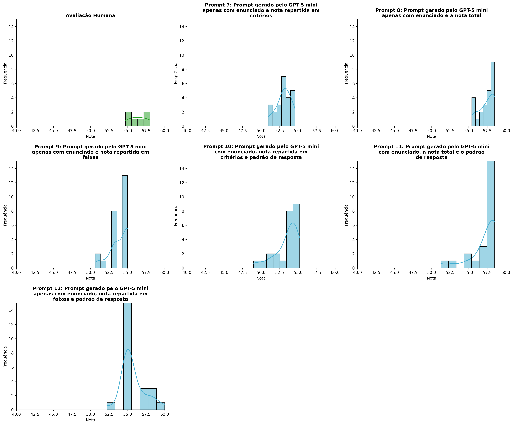
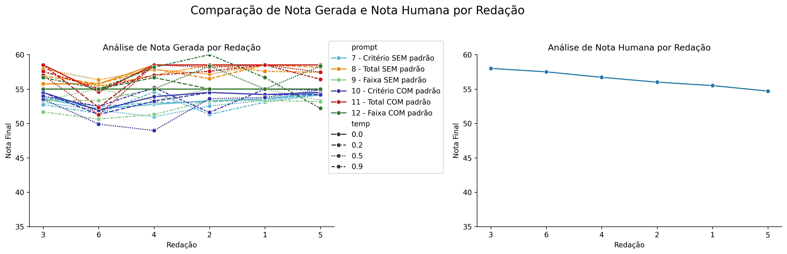
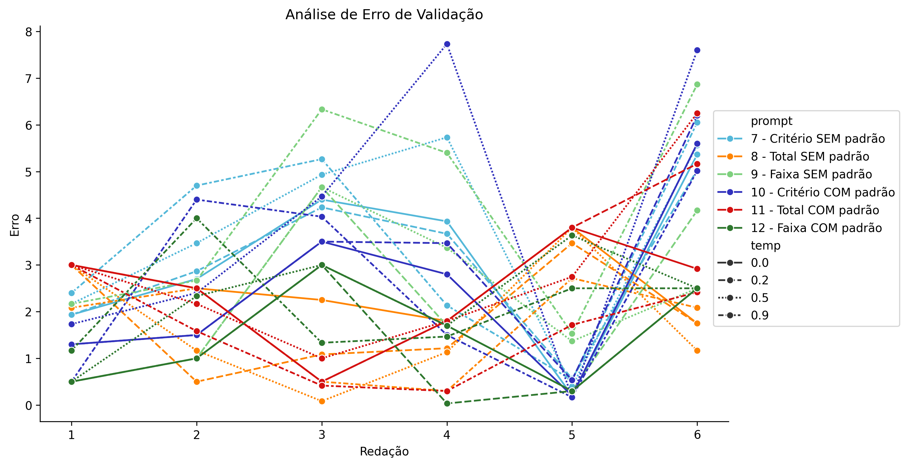
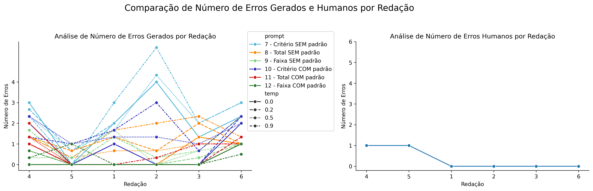

# Relatório de Avaliação: sabia-3.1_2018_FIX - 3 execuções
**Gerado em: 03/04/2026 15:37:03**

## 1. Distribuição de Notas
Nesta seção comparamos as notas atribuídas pelo modelo sabia em diferentes prompts/temperaturas versus a correção humana.

## 2. Comparação de Notas Geradas e Humanas
Nesta seção, apresentamos a comparação entre as notas finais geradas pelo modelo e as notas dadas por avaliadores humanos.

## 3. Análise de Erro Absoluto de Validação

<table>
  <tr>
    <td>
      
    </td>
    <td>
      <table border="1" class="dataframe">
  <thead>
    <tr style="text-align: center;">
      <th>prompt</th>
      <th>temp</th>
      <th>area_sob_curva</th>
      <th>mae</th>
      <th>rmse</th>
    </tr>
  </thead>
  <tbody>
    <tr>
      <td>7</td>
      <td>0.0</td>
      <td>14.8833</td>
      <td>3.0889</td>
      <td>3.5285</td>
    </tr>
    <tr>
      <td>7</td>
      <td>0.2</td>
      <td>14.8167</td>
      <td>3.0500</td>
      <td>3.3906</td>
    </tr>
    <tr>
      <td>7</td>
      <td>0.5</td>
      <td>18.4000</td>
      <td>3.7111</td>
      <td>4.1847</td>
    </tr>
    <tr>
      <td>7</td>
      <td>0.9</td>
      <td>16.8583</td>
      <td>3.5139</td>
      <td>4.0213</td>
    </tr>
    <tr>
      <td>8</td>
      <td>0.0</td>
      <td>12.7250</td>
      <td>2.5167</td>
      <td>2.6158</td>
    </tr>
    <tr>
      <td>8</td>
      <td>0.2</td>
      <td>8.6417</td>
      <td>1.8361</td>
      <td>2.1207</td>
    </tr>
    <tr>
      <td>8</td>
      <td>0.5</td>
      <td>8.2666</td>
      <td>1.7250</td>
      <td>2.1391</td>
    </tr>
    <tr>
      <td>8</td>
      <td>0.9</td>
      <td>8.1000</td>
      <td>1.6972</td>
      <td>1.9430</td>
    </tr>
    <tr>
      <td>9</td>
      <td>0.0</td>
      <td>7.5000</td>
      <td>1.5000</td>
      <td>1.8019</td>
    </tr>
    <tr>
      <td>9</td>
      <td>0.2</td>
      <td>10.0000</td>
      <td>2.0556</td>
      <td>2.6885</td>
    </tr>
    <tr>
      <td>9</td>
      <td>0.5</td>
      <td>11.9001</td>
      <td>2.2334</td>
      <td>2.6608</td>
    </tr>
    <tr>
      <td>9</td>
      <td>0.9</td>
      <td>20.4500</td>
      <td>4.1611</td>
      <td>4.6651</td>
    </tr>
    <tr>
      <td>10</td>
      <td>0.0</td>
      <td>11.4500</td>
      <td>2.4833</td>
      <td>3.0395</td>
    </tr>
    <tr>
      <td>10</td>
      <td>0.2</td>
      <td>12.7500</td>
      <td>2.7500</td>
      <td>3.3400</td>
    </tr>
    <tr>
      <td>10</td>
      <td>0.5</td>
      <td>19.4334</td>
      <td>4.0167</td>
      <td>4.9381</td>
    </tr>
    <tr>
      <td>10</td>
      <td>0.9</td>
      <td>12.8583</td>
      <td>2.6028</td>
      <td>3.2487</td>
    </tr>
    <tr>
      <td>11</td>
      <td>0.0</td>
      <td>11.5583</td>
      <td>2.4194</td>
      <td>2.6359</td>
    </tr>
    <tr>
      <td>11</td>
      <td>0.2</td>
      <td>12.6833</td>
      <td>2.7944</td>
      <td>3.1590</td>
    </tr>
    <tr>
      <td>11</td>
      <td>0.5</td>
      <td>12.3384</td>
      <td>2.8272</td>
      <td>3.2798</td>
    </tr>
    <tr>
      <td>11</td>
      <td>0.9</td>
      <td>6.7250</td>
      <td>1.5722</td>
      <td>1.8510</td>
    </tr>
    <tr>
      <td>12</td>
      <td>0.0</td>
      <td>7.5000</td>
      <td>1.5000</td>
      <td>1.8019</td>
    </tr>
    <tr>
      <td>12</td>
      <td>0.2</td>
      <td>5.8333</td>
      <td>1.2222</td>
      <td>1.6629</td>
    </tr>
    <tr>
      <td>12</td>
      <td>0.5</td>
      <td>12.1666</td>
      <td>2.2778</td>
      <td>2.4845</td>
    </tr>
    <tr>
      <td>12</td>
      <td>0.9</td>
      <td>11.1333</td>
      <td>2.1611</td>
      <td>2.3731</td>
    </tr>
  </tbody>
</table>
    </td>
  </tr>
</table>

## 4. Análise de Erros Gramaticais
Comparação da sensibilidade do modelo na detecção/geração de erros em relação ao padrão humano.

## 5. Correlação de Pearson
|           |       human |   p7, t0.0 |   p7, t0.2 |    p7, t0.5 |    p7, t0.9 |      p8, t0.0 |   p8, t0.2 |    p8, t0.5 |     p8, t0.9 |   p9, t0.0 |   p9, t0.2 |      p9, t0.5 |    p9, t0.9 |   p10, t0.0 |   p10, t0.2 |    p10, t0.5 |    p10, t0.9 |   p11, t0.0 |   p11, t0.2 |   p11, t0.5 |   p11, t0.9 |   p12, t0.0 |   p12, t0.2 |     p12, t0.5 |   p12, t0.9 |
|:----------|------------:|-----------:|-----------:|------------:|------------:|--------------:|-----------:|------------:|-------------:|-----------:|-----------:|--------------:|------------:|------------:|------------:|-------------:|-------------:|------------:|------------:|------------:|------------:|------------:|------------:|--------------:|------------:|
| human     |   1         |  -0.647914 |  -0.498911 |  -0.555558  |  -0.364268  |  -0.841561    |  -0.654803 |  -0.574211  |  -0.438559   |        nan |  -0.841561 |  -0.0587727   |  -0.808718  |  -0.438527  |   -0.397055 |  -0.528679   |  -0.299473   |   -0.433685 |   -0.433685 |   -0.487623 |  -0.241382  |         nan |   0.118278  |  -0.654548    |   0.293308  |
| p7, t0.0  |  -0.647914  |   1        |   0.971113 |   0.860754  |   0.427914  |   0.427294    |   0.630212 |   0.819617  |   0.642728   |        nan |   0.427294 |  -0.422986    |   0.754494  |   0.808688  |    0.796684 |   0.871213   |   0.405439   |    0.716135 |    0.716135 |    0.610184 |   0.444447  |         nan |  -0.331016  |   0.566131    |  -0.38966   |
| p7, t0.2  |  -0.498911  |   0.971113 |   1        |   0.815745  |   0.515611  |   0.304451    |   0.6675   |   0.874683  |   0.573884   |        nan |   0.304451 |  -0.543381    |   0.625674  |   0.802542  |    0.787302 |   0.806638   |   0.533479   |    0.729023 |    0.729023 |    0.607086 |   0.479862  |         nan |  -0.261385  |   0.3697      |  -0.405917  |
| p7, t0.5  |  -0.555558  |   0.860754 |   0.815745 |   1         |   0.0742621 |   0.126252    |   0.363123 |   0.572154  |   0.372652   |        nan |   0.126252 |  -0.0840512   |   0.675254  |   0.476064  |    0.537706 |   0.929029   |   0.171367   |    0.319417 |    0.319417 |    0.202068 |   0.235076  |         nan |  -0.72804   |   0.48645     |  -0.58292   |
| p7, t0.9  |  -0.364268  |   0.427914 |   0.515611 |   0.0742621 |   1         |   0.455869    |   0.822164 |   0.74323   |   0.0693315  |        nan |   0.455869 |  -0.759643    |   0.0626305 |   0.387826  |    0.235723 |  -0.0497791  |   0.92683    |    0.521176 |    0.521176 |    0.521597 |   0.16501   |         nan |   0.609894  |  -0.0876583   |  -0.337294  |
| p8, t0.0  |  -0.841561  |   0.427294 |   0.304451 |   0.126252  |   0.455869  |   1           |   0.691588 |   0.540325  |   0.591541   |        nan |   1        |   3.92523e-17 |   0.710655  |   0.546012  |    0.467818 |   0.233489   |   0.326037   |    0.632456 |    0.632456 |    0.745723 |   0.456602  |         nan |   0.316228  |   0.5         |   0.178492  |
| p8, t0.2  |  -0.654803  |   0.630212 |   0.6675   |   0.363123  |   0.822164  |   0.691588    |   1        |   0.935373  |   0.390676   |        nan |   0.691588 |  -0.382733    |   0.529211  |   0.599458  |    0.523293 |   0.322196   |   0.870451   |    0.703649 |    0.703649 |    0.740227 |   0.565659  |         nan |   0.285268  |   0.030069    |  -0.211687  |
| p8, t0.5  |  -0.574211  |   0.819617 |   0.874683 |   0.572154  |   0.74323   |   0.540325    |   0.935373 |   1         |   0.53083    |        nan |   0.540325 |  -0.49123     |   0.600364  |   0.76748   |    0.720372 |   0.561909   |   0.802763   |    0.80553  |    0.80553  |    0.771882 |   0.642882  |         nan |   0.0732087 |   0.115799    |  -0.255804  |
| p8, t0.9  |  -0.438559  |   0.642728 |   0.573884 |   0.372652  |   0.0693315 |   0.591541    |   0.390676 |   0.53083   |   1          |        nan |   0.591541 |  -0.0747004   |   0.814499  |   0.920949  |    0.941996 |   0.663442   |  -0.00819526 |    0.875181 |    0.875181 |    0.857684 |   0.799072  |         nan |  -0.113577  |   0.549304    |   0.446488  |
| p9, t0.0  | nan         | nan        | nan        | nan         | nan         | nan           | nan        | nan         | nan          |        nan | nan        | nan           | nan         | nan         |  nan        | nan          | nan          |  nan        |  nan        |  nan        | nan         |         nan | nan         | nan           | nan         |
| p9, t0.2  |  -0.841561  |   0.427294 |   0.304451 |   0.126252  |   0.455869  |   1           |   0.691588 |   0.540325  |   0.591541   |        nan |   1        |   0           |   0.710655  |   0.546012  |    0.467818 |   0.233489   |   0.326037   |    0.632456 |    0.632456 |    0.745723 |   0.456602  |         nan |   0.316228  |   0.5         |   0.178492  |
| p9, t0.5  |  -0.0587727 |  -0.422986 |  -0.543381 |  -0.0840512 |  -0.759643  |   3.92523e-17 |  -0.382733 |  -0.49123   |  -0.0747004  |        nan |   0        |   1           |   0.179443  |  -0.413026  |   -0.27934  |  -0.00761979 |  -0.605947   |   -0.447214 |   -0.447214 |   -0.32921  |   0.0258181 |         nan |  -0.447214  |   1.96262e-17 |   0.316098  |
| p9, t0.9  |  -0.808718  |   0.754494 |   0.625674 |   0.675254  |   0.0626305 |   0.710655    |   0.529211 |   0.600364  |   0.814499   |        nan |   0.710655 |   0.179443    |   1         |   0.730858  |    0.772063 |   0.821914   |   0.0677376  |    0.662736 |    0.662736 |    0.67396  |   0.641151  |         nan |  -0.387542  |   0.659901    |   0.0485766 |
| p10, t0.0 |  -0.438527  |   0.808688 |   0.802542 |   0.476064  |   0.387826  |   0.546012    |   0.599458 |   0.76748   |   0.920949   |        nan |   0.546012 |  -0.413026    |   0.730858  |   1         |    0.981348 |   0.680291   |   0.317619   |    0.971739 |    0.971739 |    0.912302 |   0.773193  |         nan |  -0.0080309 |   0.444429    |   0.196635  |
| p10, t0.2 |  -0.397055  |   0.796684 |   0.787302 |   0.537706  |   0.235723  |   0.467818    |   0.523293 |   0.720372  |   0.941996   |        nan |   0.467818 |  -0.27934     |   0.772063  |   0.981348  |    1        |   0.760565   |   0.215287   |    0.927073 |    0.927073 |    0.862264 |   0.822884  |         nan |  -0.164388  |   0.426245    |   0.229716  |
| p10, t0.5 |  -0.528679  |   0.871213 |   0.806638 |   0.929029  |  -0.0497791 |   0.233489    |   0.322196 |   0.561909  |   0.663442   |        nan |   0.233489 |  -0.00761979  |   0.821914  |   0.680291  |    0.760565 |   1          |   0.0163977  |    0.519105 |    0.519105 |    0.413568 |   0.478774  |         nan |  -0.709928  |   0.580111    |  -0.247988  |
| p10, t0.9 |  -0.299473  |   0.405439 |   0.533479 |   0.171367  |   0.92683   |   0.326037    |   0.870451 |   0.802763  |  -0.00819526 |        nan |   0.326037 |  -0.605947    |   0.0677376 |   0.317619  |    0.215287 |   0.0163977  |   1          |    0.449825 |    0.449825 |    0.453821 |   0.285314  |         nan |   0.442511  |  -0.3217      |  -0.387568  |
| p11, t0.0 |  -0.433685  |   0.716135 |   0.729023 |   0.319417  |   0.521176  |   0.632456    |   0.703649 |   0.80553   |   0.875181   |        nan |   0.632456 |  -0.447214    |   0.662736  |   0.971739  |    0.927073 |   0.519105   |   0.449825   |    1        |    1        |    0.976541 |   0.808568  |         nan |   0.2       |   0.316228    |   0.265443  |
| p11, t0.2 |  -0.433685  |   0.716135 |   0.729023 |   0.319417  |   0.521176  |   0.632456    |   0.703649 |   0.80553   |   0.875181   |        nan |   0.632456 |  -0.447214    |   0.662736  |   0.971739  |    0.927073 |   0.519105   |   0.449825   |    1        |    1        |    0.976541 |   0.808568  |         nan |   0.2       |   0.316228    |   0.265443  |
| p11, t0.5 |  -0.487623  |   0.610184 |   0.607086 |   0.202068  |   0.521597  |   0.745723    |   0.740227 |   0.771882  |   0.857684   |        nan |   0.745723 |  -0.32921     |   0.67396   |   0.912302  |    0.862264 |   0.413568   |   0.453821   |    0.976541 |    0.976541 |    1        |   0.835106  |         nan |   0.296697  |   0.276604    |   0.361167  |
| p11, t0.9 |  -0.241382  |   0.444447 |   0.479862 |   0.235076  |   0.16501   |   0.456602    |   0.565659 |   0.642882  |   0.799072   |        nan |   0.456602 |   0.0258181   |   0.641151  |   0.773193  |    0.822884 |   0.478774   |   0.285314   |    0.808568 |    0.808568 |    0.835106 |   1         |         nan |  -0.0115462 |  -0.0182562   |   0.493554  |
| p12, t0.0 | nan         | nan        | nan        | nan         | nan         | nan           | nan        | nan         | nan          |        nan | nan        | nan           | nan         | nan         |  nan        | nan          | nan          |  nan        |  nan        |  nan        | nan         |         nan | nan         | nan           | nan         |
| p12, t0.2 |   0.118278  |  -0.331016 |  -0.261385 |  -0.72804   |   0.609894  |   0.316228    |   0.285268 |   0.0732087 |  -0.113577   |        nan |   0.316228 |  -0.447214    |  -0.387542  |  -0.0080309 |   -0.164388 |  -0.709928   |   0.442511   |    0.2      |    0.2      |    0.296697 |  -0.0115462 |         nan |   1         |  -0.316228    |   0.314259  |
| p12, t0.5 |  -0.654548  |   0.566131 |   0.3697   |   0.48645   |  -0.0876583 |   0.5         |   0.030069 |   0.115799  |   0.549304   |        nan |   0.5      |   1.96262e-17 |   0.659901  |   0.444429  |    0.426245 |   0.580111   |  -0.3217     |    0.316228 |    0.316228 |    0.276604 |  -0.0182562 |         nan |  -0.316228  |   1           |  -0.101311  |
| p12, t0.9 |   0.293308  |  -0.38966  |  -0.405917 |  -0.58292   |  -0.337294  |   0.178492    |  -0.211687 |  -0.255804  |   0.446488   |        nan |   0.178492 |   0.316098    |   0.0485766 |   0.196635  |    0.229716 |  -0.247988   |  -0.387568   |    0.265443 |    0.265443 |    0.361167 |   0.493554  |         nan |   0.314259  |  -0.101311    |   1         |

## 6. Correlação de Spearman
|           |      human |    p7, t0.0 |    p7, t0.2 |    p7, t0.5 |    p7, t0.9 |   p8, t0.0 |   p8, t0.2 |   p8, t0.5 |   p8, t0.9 |   p9, t0.0 |   p9, t0.2 |   p9, t0.5 |    p9, t0.9 |   p10, t0.0 |   p10, t0.2 |   p10, t0.5 |   p10, t0.9 |   p11, t0.0 |   p11, t0.2 |   p11, t0.5 |   p11, t0.9 |   p12, t0.0 |   p12, t0.2 |   p12, t0.5 |   p12, t0.9 |
|:----------|-----------:|------------:|------------:|------------:|------------:|-----------:|-----------:|-----------:|-----------:|-----------:|-----------:|-----------:|------------:|------------:|------------:|------------:|------------:|------------:|------------:|------------:|------------:|------------:|------------:|------------:|------------:|
| human     |   1        |  -0.428571  |  -0.428571  |  -0.6       |  -0.314286  |  -0.828079 |  -0.657143 |  -0.579771 |  -0.314286 |        nan |  -0.828079 |  -0.09759  |  -0.637748  |  -0.27323   |    0        |  -0.771429  |  -0.257143  |   -0.392792 |   -0.392792 |  -0.492805  |  -0.115954  |         nan |    0.130931 |   -0.621059 |   0.20292   |
| p7, t0.0  |  -0.428571 |   1         |   1         |   0.885714  |   0.257143  |   0.20702  |   0.6      |   0.840668 |   0.428571 |        nan |   0.20702  |  -0.48795  |   0.521794  |   0.819689  |    0.550782 |   0.771429  |   0.142857  |    0.654654 |    0.654654 |   0.0289886 |   0.318874  |         nan |   -0.392792 |    0.414039 |  -0.347863  |
| p7, t0.2  |  -0.428571 |   1         |   1         |   0.885714  |   0.257143  |   0.20702  |   0.6      |   0.840668 |   0.428571 |        nan |   0.20702  |  -0.48795  |   0.521794  |   0.819689  |    0.550782 |   0.771429  |   0.142857  |    0.654654 |    0.654654 |   0.0289886 |   0.318874  |         nan |   -0.392792 |    0.414039 |  -0.347863  |
| p7, t0.5  |  -0.6      |   0.885714  |   0.885714  |   1         |   0.0857143 |   0.20702  |   0.6      |   0.811679 |   0.428571 |        nan |   0.20702  |  -0.09759  |   0.60876   |   0.637536  |    0.40584  |   0.942857  |   0.0285714 |    0.392792 |    0.392792 |  -0.0289886 |   0.289886  |         nan |   -0.654654 |    0.414039 |  -0.521794  |
| p7, t0.9  |  -0.314286 |   0.257143  |   0.257143  |   0.0857143 |   1         |   0.414039 |   0.714286 |   0.579771 |  -0.371429 |        nan |   0.414039 |  -0.68313  |  -0.173931  |  -0.151794  |   -0.376851 |  -0.0285714 |   0.942857  |    0.392792 |    0.392792 |   0.492805  |  -0.0869657 |         nan |    0.654654 |   -0.20702  |  -0.231908  |
| p8, t0.0  |  -0.828079 |   0.20702   |   0.20702   |   0.20702   |   0.414039  |   1        |   0.621059 |   0.420084 |   0.414039 |        nan |   1        |   0        |   0.630126  |   0.219971  |    0.105021 |   0.414039  |   0.414039  |    0.632456 |    0.632456 |   0.840168  |   0.315063  |         nan |    0.316228 |    0.5      |   0.315063  |
| p8, t0.2  |  -0.657143 |   0.6       |   0.6       |   0.6       |   0.714286  |   0.621059 |   1        |   0.927634 |   0.257143 |        nan |   0.621059 |  -0.29277  |   0.492805  |   0.212512  |    0.115954 |   0.542857  |   0.771429  |    0.654654 |    0.654654 |   0.666737  |   0.463817  |         nan |    0.130931 |    0        |  -0.173931  |
| p8, t0.5  |  -0.579771 |   0.840668  |   0.840668  |   0.811679  |   0.579771  |   0.420084 |   0.927634 |   1        |   0.318874 |        nan |   0.420084 |  -0.396059 |   0.514706  |   0.462031  |    0.294118 |   0.695725  |   0.579771  |    0.664211 |    0.664211 |   0.397059  |   0.441176  |         nan |   -0.132842 |    0.105021 |  -0.338235  |
| p8, t0.9  |  -0.314286 |   0.428571  |   0.428571  |   0.428571  |  -0.371429  |   0.414039 |   0.257143 |   0.318874 |   1        |        nan |   0.414039 |   0.29277  |   0.927634  |   0.698253  |    0.898645 |   0.542857  |  -0.257143  |    0.654654 |    0.654654 |   0.40584   |   0.840668  |         nan |   -0.392792 |    0.414039 |   0.521794  |
| p9, t0.0  | nan        | nan         | nan         | nan         | nan         | nan        | nan        | nan        | nan        |        nan | nan        | nan        | nan         | nan         |  nan        | nan         | nan         |  nan        |  nan        | nan         | nan         |         nan |  nan        |  nan        | nan         |
| p9, t0.2  |  -0.828079 |   0.20702   |   0.20702   |   0.20702   |   0.414039  |   1        |   0.621059 |   0.420084 |   0.414039 |        nan |   1        |   0        |   0.630126  |   0.219971  |    0.105021 |   0.414039  |   0.414039  |    0.632456 |    0.632456 |   0.840168  |   0.315063  |         nan |    0.316228 |    0.5      |   0.315063  |
| p9, t0.5  |  -0.09759  |  -0.48795   |  -0.48795   |  -0.09759   |  -0.68313   |   0        |  -0.29277  |  -0.396059 |   0.29277  |        nan |   0        |   1        |   0.297044  |  -0.311086  |    0        |   0.09759   |  -0.48795   |   -0.447214 |   -0.447214 |   0         |   0.19803   |         nan |   -0.447214 |    0        |   0.19803   |
| p9, t0.9  |  -0.637748 |   0.521794  |   0.521794  |   0.60876   |  -0.173931  |   0.630126 |   0.492805 |   0.514706 |   0.927634 |        nan |   0.630126 |   0.297044 |   1         |   0.646843  |    0.720588 |   0.753702  |  -0.0869657 |    0.664211 |    0.664211 |   0.514706  |   0.75      |         nan |   -0.398527 |    0.525105 |   0.308824  |
| p10, t0.0 |  -0.27323  |   0.819689  |   0.819689  |   0.637536  |  -0.151794  |   0.219971 |   0.212512 |   0.462031 |   0.698253 |        nan |   0.219971 |  -0.311086 |   0.646843  |   1         |    0.831655 |   0.637536  |  -0.27323   |    0.695608 |    0.695608 |   0         |   0.400427  |         nan |   -0.417365 |    0.659912 |   0.0924062 |
| p10, t0.2 |   0        |   0.550782  |   0.550782  |   0.40584   |  -0.376851  |   0.105021 |   0.115954 |   0.294118 |   0.898645 |        nan |   0.105021 |   0        |   0.720588  |   0.831655  |    1        |   0.40584   |  -0.318874  |    0.664211 |    0.664211 |   0.147059  |   0.764706  |         nan |   -0.398527 |    0.315063 |   0.455882  |
| p10, t0.5 |  -0.771429 |   0.771429  |   0.771429  |   0.942857  |  -0.0285714 |   0.414039 |   0.542857 |   0.695725 |   0.542857 |        nan |   0.414039 |   0.09759  |   0.753702  |   0.637536  |    0.40584  |   1         |  -0.0857143 |    0.392792 |    0.392792 |   0.0869657 |   0.289886  |         nan |   -0.654654 |    0.621059 |  -0.376851  |
| p10, t0.9 |  -0.257143 |   0.142857  |   0.142857  |   0.0285714 |   0.942857  |   0.414039 |   0.771429 |   0.579771 |  -0.257143 |        nan |   0.414039 |  -0.48795  |  -0.0869657 |  -0.27323   |   -0.318874 |  -0.0857143 |   1         |    0.392792 |    0.392792 |   0.637748  |   0.144943  |         nan |    0.654654 |   -0.414039 |  -0.0869657 |
| p11, t0.0 |  -0.392792 |   0.654654  |   0.654654  |   0.392792  |   0.392792  |   0.632456 |   0.654654 |   0.664211 |   0.654654 |        nan |   0.632456 |  -0.447214 |   0.664211  |   0.695608  |    0.664211 |   0.392792  |   0.392792  |    1        |    1        |   0.664211  |   0.664211  |         nan |    0.2      |    0.316228 |   0.398527  |
| p11, t0.2 |  -0.392792 |   0.654654  |   0.654654  |   0.392792  |   0.392792  |   0.632456 |   0.654654 |   0.664211 |   0.654654 |        nan |   0.632456 |  -0.447214 |   0.664211  |   0.695608  |    0.664211 |   0.392792  |   0.392792  |    1        |    1        |   0.664211  |   0.664211  |         nan |    0.2      |    0.316228 |   0.398527  |
| p11, t0.5 |  -0.492805 |   0.0289886 |   0.0289886 |  -0.0289886 |   0.492805  |   0.840168 |   0.666737 |   0.397059 |   0.40584  |        nan |   0.840168 |   0        |   0.514706  |   0         |    0.147059 |   0.0869657 |   0.637748  |    0.664211 |    0.664211 |   1         |   0.588235  |         nan |    0.531369 |    0        |   0.544118  |
| p11, t0.9 |  -0.115954 |   0.318874  |   0.318874  |   0.289886  |  -0.0869657 |   0.315063 |   0.463817 |   0.441176 |   0.840668 |        nan |   0.315063 |   0.19803  |   0.75      |   0.400427  |    0.764706 |   0.289886  |   0.144943  |    0.664211 |    0.664211 |   0.588235  |   1         |         nan |   -0.132842 |   -0.105021 |   0.544118  |
| p12, t0.0 | nan        | nan         | nan         | nan         | nan         | nan        | nan        | nan        | nan        |        nan | nan        | nan        | nan         | nan         |  nan        | nan         | nan         |  nan        |  nan        | nan         | nan         |         nan |  nan        |  nan        | nan         |
| p12, t0.2 |   0.130931 |  -0.392792  |  -0.392792  |  -0.654654  |   0.654654  |   0.316228 |   0.130931 |  -0.132842 |  -0.392792 |        nan |   0.316228 |  -0.447214 |  -0.398527  |  -0.417365  |   -0.398527 |  -0.654654  |   0.654654  |    0.2      |    0.2      |   0.531369  |  -0.132842  |         nan |    1        |   -0.316228 |   0.398527  |
| p12, t0.5 |  -0.621059 |   0.414039  |   0.414039  |   0.414039  |  -0.20702   |   0.5      |   0        |   0.105021 |   0.414039 |        nan |   0.5      |   0        |   0.525105  |   0.659912  |    0.315063 |   0.621059  |  -0.414039  |    0.316228 |    0.316228 |   0         |  -0.105021  |         nan |   -0.316228 |    1        |   0         |
| p12, t0.9 |   0.20292  |  -0.347863  |  -0.347863  |  -0.521794  |  -0.231908  |   0.315063 |  -0.173931 |  -0.338235 |   0.521794 |        nan |   0.315063 |   0.19803  |   0.308824  |   0.0924062 |    0.455882 |  -0.376851  |  -0.0869657 |    0.398527 |    0.398527 |   0.544118  |   0.544118  |         nan |    0.398527 |    0        |   1         |

## Estatísticas Descritivas
### Modelo sabia-3.1_2018_FIX
|       |    prompt |     temp |   redacao |   nota_final |   nota_final_std |        1A |        1B |        1C |      CGPL |   num_errors |
|:------|----------:|---------:|----------:|-------------:|-----------------:|----------:|----------:|----------:|----------:|-------------:|
| count | 144       | 144      | 144       |    144       |        144       | 53        | 53        | 53        | 53        |   144        |
| mean  |   9.5     |   0.4    |   3.5     |     55.1567  |          1.03085 |  8.96699  |  9.01573  | 17.8019   | 17.2641   |     0.980321 |
| std   |   1.71379 |   0.3403 |   1.71379 |      2.30187 |          1.3578  |  0.343729 |  0.277379 |  0.426245 |  0.654591 |     1.05584  |
| min   |   7       |   0      |   1       |     48.9667  |          0       |  8.3333   |  8.3333   | 16.3333   | 15.3      |     0        |
| 25%   |   8       |   0.15   |   2       |     53.4833  |          0       |  8.6667   |  8.8333   | 17.6667   | 16.9      |     0        |
| 50%   |   9.5     |   0.35   |   3.5     |     55       |          0.45865 |  9        |  9        | 18        | 17.4      |     1        |
| 75%   |  11       |   0.6    |   5       |     57.2292  |          1.74978 |  9.1667   |  9.1667   | 18        | 17.8      |     1.3333   |
| max   |  12       |   0.9    |   6       |     60       |          5.9178  |  9.5      |  9.6667   | 18.3333   | 18.0333   |     5.6667   |

### Humano
|       |   redacao |   nota_final |        1A |        1B |        1C |      CGPL |   num_errors |
|:------|----------:|-------------:|----------:|----------:|----------:|----------:|-------------:|
| count |   6       |      6       |  6        |  6        |  6        |  6        |     6        |
| mean  |   3.5     |     56.4     |  9.75     |  9.75     | 18.5      | 18.4      |     0.333333 |
| std   |   1.87083 |      1.24258 |  0.273861 |  0.273861 |  0.447214 |  0.532917 |     0.516398 |
| min   |   1       |     54.7     |  9.5      |  9.5      | 18        | 17.7      |     0        |
| 25%   |   2.25    |     55.625   |  9.5      |  9.5      | 18.125    | 18.05     |     0        |
| 50%   |   3.5     |     56.35    |  9.75     |  9.75     | 18.5      | 18.35     |     0        |
| 75%   |   4.75    |     57.3     | 10        | 10        | 18.875    | 18.875    |     0.75     |
| max   |   6       |     58       | 10        | 10        | 19        | 19        |     1        |
