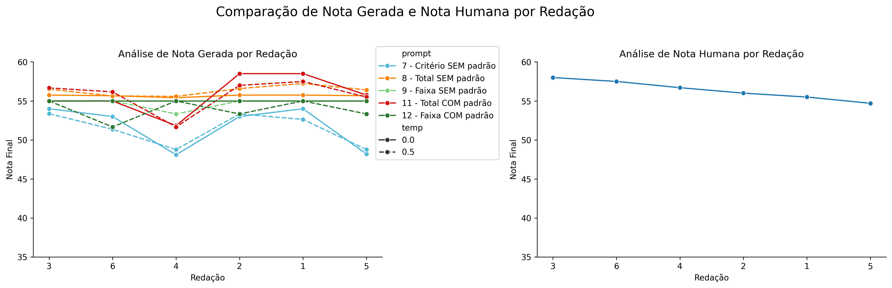
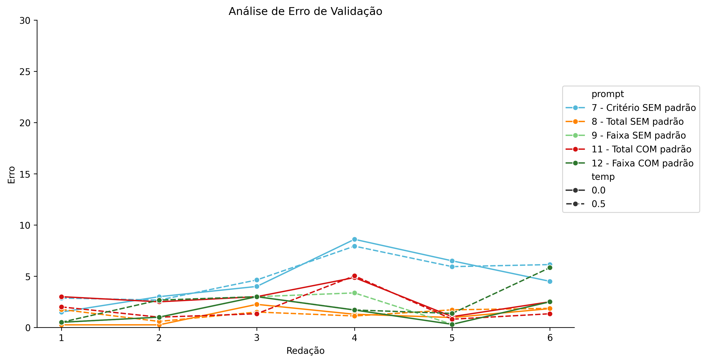
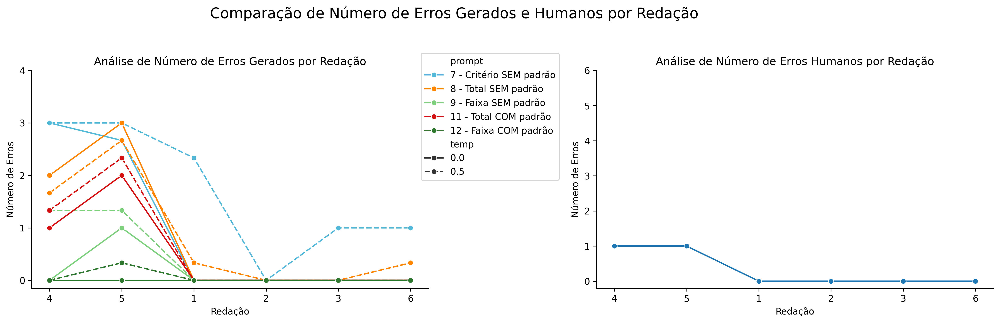

# Relatório de Avaliação: sabia-3.1_2022 - 3 execuções
**Gerado em: 25/03/2026 22:32:14**

## 1. Distribuição de Notas
Nesta seção comparamos as notas atribuídas pelo modelo sabia em diferentes prompts/temperaturas versus a correção humana.

## 2. Comparação de Notas Geradas e Humanas
Nesta seção, apresentamos a comparação entre as notas finais geradas pelo modelo e as notas dadas por avaliadores humanos.

## 3. Análise de Erro Absoluto de Validação

<table>
  <tr>
    <td>
      
    </td>
    <td>
      <table border="1" class="dataframe">
  <thead>
    <tr style="text-align: center;">
      <th>prompt</th>
      <th>temp</th>
      <th>area_sob_curva</th>
      <th>mae</th>
      <th>rmse</th>
    </tr>
  </thead>
  <tbody>
    <tr>
      <td>7</td>
      <td>0.0</td>
      <td>25.1000</td>
      <td>4.6833</td>
      <td>5.2235</td>
    </tr>
    <tr>
      <td>7</td>
      <td>0.5</td>
      <td>25.6666</td>
      <td>5.0278</td>
      <td>5.3628</td>
    </tr>
    <tr>
      <td>8</td>
      <td>0.0</td>
      <td>5.7917</td>
      <td>1.1389</td>
      <td>1.3620</td>
    </tr>
    <tr>
      <td>8</td>
      <td>0.5</td>
      <td>6.7217</td>
      <td>1.4211</td>
      <td>1.4892</td>
    </tr>
    <tr>
      <td>9</td>
      <td>0.0</td>
      <td>7.5000</td>
      <td>1.5000</td>
      <td>1.8019</td>
    </tr>
    <tr>
      <td>9</td>
      <td>0.5</td>
      <td>9.1667</td>
      <td>1.7778</td>
      <td>2.1573</td>
    </tr>
    <tr>
      <td>11</td>
      <td>0.0</td>
      <td>14.1667</td>
      <td>2.8194</td>
      <td>3.0355</td>
    </tr>
    <tr>
      <td>11</td>
      <td>0.5</td>
      <td>9.8333</td>
      <td>1.9167</td>
      <td>2.3989</td>
    </tr>
    <tr>
      <td>12</td>
      <td>0.0</td>
      <td>7.5000</td>
      <td>1.5000</td>
      <td>1.8019</td>
    </tr>
    <tr>
      <td>12</td>
      <td>0.5</td>
      <td>11.9001</td>
      <td>2.5111</td>
      <td>3.0317</td>
    </tr>
  </tbody>
</table>
    </td>
  </tr>
</table>

## 4. Análise de Erros Gramaticais
Comparação da sensibilidade do modelo na detecção/geração de erros em relação ao padrão humano.

## 5. Correlação de Pearson
|           |       human |    p7, t0.0 |    p7, t0.5 |    p8, t0.0 |   p8, t0.5 |   p9, t0.0 |   p9, t0.5 |   p11, t0.0 |   p11, t0.5 |   p12, t0.0 |   p12, t0.5 |
|:----------|------------:|------------:|------------:|------------:|-----------:|-----------:|-----------:|------------:|------------:|------------:|------------:|
| human     |   1         |   0.42498   |   0.3688    |  -0.0623566 |  -0.457182 |        nan |  -0.118278 |   -0.433841 |  -0.0722752 |         nan |  -0.0197004 |
| p7, t0.0  |   0.42498   |   1         |   0.950687  |   0.770266  |   0.490934 |        nan |   0.633041 |    0.605502 |   0.806485  |         nan |  -0.0291663 |
| p7, t0.5  |   0.3688    |   0.950687  |   1         |   0.784602  |   0.551178 |        nan |   0.595254 |    0.652111 |   0.783682  |         nan |   0.0748826 |
| p8, t0.0  |  -0.0623566 |   0.770266  |   0.784602  |   1         |   0.734989 |        nan |   0.948715 |    0.84746  |   0.986619  |         nan |  -0.158197  |
| p8, t0.5  |  -0.457182  |   0.490934  |   0.551178  |   0.734989  |   1        |        nan |   0.580343 |    0.82697  |   0.724385  |         nan |   0.40301   |
| p9, t0.0  | nan         | nan         | nan         | nan         | nan        |        nan | nan        |  nan        | nan         |         nan | nan         |
| p9, t0.5  |  -0.118278  |   0.633041  |   0.595254  |   0.948715  |   0.580343 |        nan |   1        |    0.766085 |   0.945636  |         nan |  -0.400004  |
| p11, t0.0 |  -0.433841  |   0.605502  |   0.652111  |   0.84746   |   0.82697  |        nan |   0.766085 |    1        |   0.874263  |         nan |  -0.11641   |
| p11, t0.5 |  -0.0722752 |   0.806485  |   0.783682  |   0.986619  |   0.724385 |        nan |   0.945636 |    0.874263 |   1         |         nan |  -0.212289  |
| p12, t0.0 | nan         | nan         | nan         | nan         | nan        |        nan | nan        |  nan        | nan         |         nan | nan         |
| p12, t0.5 |  -0.0197004 |  -0.0291663 |   0.0748826 |  -0.158197  |   0.40301  |        nan |  -0.400004 |   -0.11641  |  -0.212289  |         nan |   1         |

## 6. Correlação de Spearman
|           |       human |   p7, t0.0 |   p7, t0.5 |    p8, t0.0 |   p8, t0.5 |   p9, t0.0 |   p9, t0.5 |   p11, t0.0 |   p11, t0.5 |   p12, t0.0 |   p12, t0.5 |
|:----------|------------:|-----------:|-----------:|------------:|-----------:|-----------:|-----------:|------------:|------------:|------------:|------------:|
| human     |   1         |   0.26482  |   0.463817 |   0.0308607 |  -0.314286 |        nan |  -0.130931 |   -0.617914 |  -0.0857143 |         nan |    0.092582 |
| p7, t0.0  |   0.26482   |   1        |   0.835914 |   0.874007  |   0.765037 |        nan |   0.6742   |    0.454545 |   0.85331   |         nan |    0.238366 |
| p7, t0.5  |   0.463817  |   0.835914 |   1        |   0.89237   |   0.666737 |        nan |   0.531369 |    0.358249 |   0.753702  |         nan |    0.203523 |
| p8, t0.0  |   0.0308607 |   0.874007 |   0.89237  |   1         |   0.92582  |        nan |   0.707107 |    0.715097 |   0.92582   |         nan |    0.183333 |
| p8, t0.5  |  -0.314286  |   0.765037 |   0.666737 |   0.92582   |   1        |        nan |   0.654654 |    0.882735 |   0.942857  |         nan |    0.216025 |
| p9, t0.0  | nan         | nan        | nan        | nan         | nan        |        nan | nan        |  nan        | nan         |         nan |  nan        |
| p9, t0.5  |  -0.130931  |   0.6742   |   0.531369 |   0.707107  |   0.654654 |        nan |   1        |    0.6742   |   0.654654  |         nan |   -0.424264 |
| p11, t0.0 |  -0.617914  |   0.454545 |   0.358249 |   0.715097  |   0.882735 |        nan |   0.6742   |    1        |   0.794461  |         nan |   -0.143019 |
| p11, t0.5 |  -0.0857143 |   0.85331  |   0.753702 |   0.92582   |   0.942857 |        nan |   0.654654 |    0.794461 |   1         |         nan |    0.123443 |
| p12, t0.0 | nan         | nan        | nan        | nan         | nan        |        nan | nan        |  nan        | nan         |         nan |  nan        |
| p12, t0.5 |   0.092582  |   0.238366 |   0.203523 |   0.183333  |   0.216025 |        nan |  -0.424264 |   -0.143019 |   0.123443  |         nan |    1        |

## Estatísticas Descritivas
### Modelo sabia-3.1_2022
|       |   prompt |     temp |   redacao |   nota_final |   nota_final_std |        1A |        1B |        1C |     CGPL |   num_errors |
|:------|---------:|---------:|----------:|-------------:|-----------------:|----------:|----------:|----------:|---------:|-------------:|
| count | 60       | 60       |  60       |     60       |        60        | 12        | 12        | 12        | 12       |    60        |
| mean  |  9.4     |  0.25    |   3.5     |     54.5209  |         0.871422 |  8.66667  |  8.61111  | 17.3333   | 16.9333  |     0.611108 |
| std   |  1.87038 |  0.25211 |   1.72224 |      2.20803 |         1.382    |  0.426401 |  0.397813 |  0.887632 |  1.25361 |     1.00125  |
| min   |  7       |  0       |   1       |     48.1     |         0        |  8        |  8        | 16        | 15.1     |     0        |
| 25%   |  8       |  0       |   2       |     53.3584  |         0        |  8.50003  |  8.3333   | 16.3333   | 15.4333  |     0        |
| 50%   |  9       |  0.25    |   3.5     |     55       |         0        |  8.83335  |  8.6667   | 18        | 17.5     |     0        |
| 75%   | 11       |  0.5     |   5       |     55.6667  |         1.4987   |  9        |  9        | 18        | 18       |     1        |
| max   | 12       |  0.5     |   6       |     58.5     |         5.4848   |  9        |  9        | 18        | 18       |     3        |

### Humano
|       |   redacao |   nota_final |        1A |        1B |        1C |      CGPL |   num_errors |
|:------|----------:|-------------:|----------:|----------:|----------:|----------:|-------------:|
| count |   6       |      6       |  6        |  6        |  6        |  6        |     6        |
| mean  |   3.5     |     56.4     |  9.75     |  9.75     | 18.5      | 18.4      |     0.333333 |
| std   |   1.87083 |      1.24258 |  0.273861 |  0.273861 |  0.447214 |  0.532917 |     0.516398 |
| min   |   1       |     54.7     |  9.5      |  9.5      | 18        | 17.7      |     0        |
| 25%   |   2.25    |     55.625   |  9.5      |  9.5      | 18.125    | 18.05     |     0        |
| 50%   |   3.5     |     56.35    |  9.75     |  9.75     | 18.5      | 18.35     |     0        |
| 75%   |   4.75    |     57.3     | 10        | 10        | 18.875    | 18.875    |     0.75     |
| max   |   6       |     58       | 10        | 10        | 19        | 19        |     1        |
